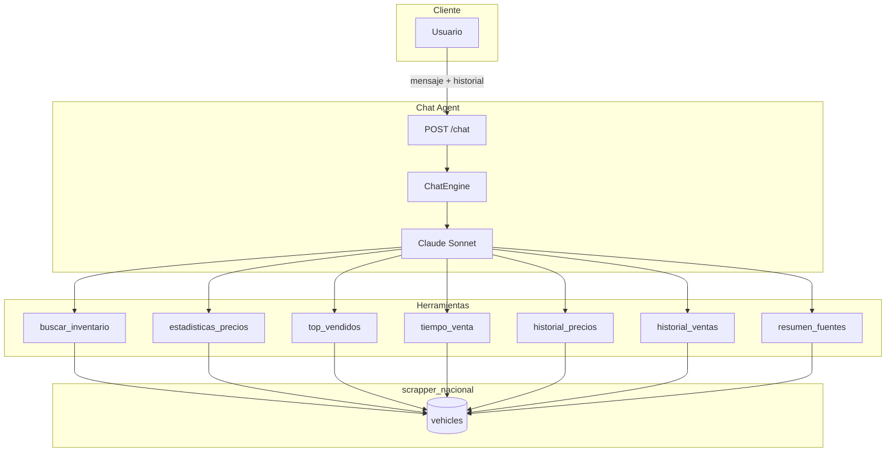
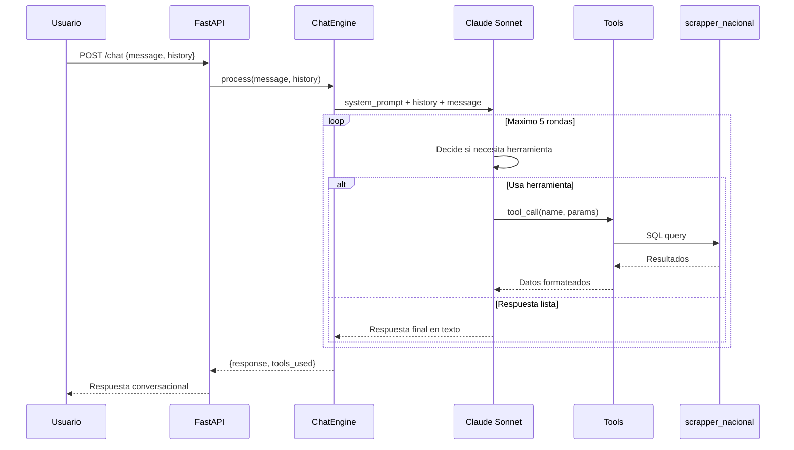

# Chat Agent

Agente conversacional que permite a los usuarios consultar datos del marketplace automotriz en lenguaje natural. Utiliza `claude-sonnet-4` con 7 herramientas especializadas y un maximo de 5 rondas agenticas.

## Arquitectura



## Flujo Conversacional



## Herramientas Disponibles

### 1. buscar_inventario

Busca vehiculos en el inventario actual del marketplace.

| Parametro | Tipo | Requerido | Descripcion |
|-----------|------|-----------|-------------|
| `brand` | string | No | Marca del vehiculo |
| `model` | string | No | Modelo |
| `year_from` | int | No | Ano minimo |
| `year_to` | int | No | Ano maximo |
| `price_from` | float | No | Precio minimo MXN |
| `price_to` | float | No | Precio maximo MXN |
| `kms_max` | int | No | Kilometraje maximo |
| `location` | string | No | Ubicacion |
| `source` | string | No | Fuente de origen |
| `limit` | int | No | Limite de resultados (default: 10) |

**Retorna:** Lista de vehiculos con precio, km, ubicacion y URL.

### 2. estadisticas_precios

Obtiene estadisticas de precios para un segmento especifico.

| Parametro | Tipo | Requerido | Descripcion |
|-----------|------|-----------|-------------|
| `brand` | string | Si | Marca |
| `model` | string | No | Modelo |
| `year` | int | No | Ano especifico |

**Retorna:** Min, max, promedio, mediana, percentiles 25 y 75.

### 3. top_vendidos

Lista los vehiculos mas vendidos en un periodo.

| Parametro | Tipo | Requerido | Descripcion |
|-----------|------|-----------|-------------|
| `period_days` | int | No | Periodo en dias (default: 30) |
| `limit` | int | No | Cantidad de resultados (default: 10) |
| `source` | string | No | Filtrar por fuente |

**Retorna:** Ranking de marca/modelo con conteo de ventas y precio promedio.

### 4. tiempo_venta

Calcula el tiempo promedio de venta por segmento.

| Parametro | Tipo | Requerido | Descripcion |
|-----------|------|-----------|-------------|
| `brand` | string | No | Marca |
| `model` | string | No | Modelo |
| `price_range` | string | No | Rango: "0-100k", "100k-200k", etc. |

**Retorna:** Promedio de dias en mercado, mediana y distribucion.

### 5. historial_precios

Obtiene la evolucion historica de precios.

| Parametro | Tipo | Requerido | Descripcion |
|-----------|------|-----------|-------------|
| `brand` | string | Si | Marca |
| `model` | string | No | Modelo |
| `months` | int | No | Cantidad de meses (default: 6) |

**Retorna:** Serie temporal con precio promedio por mes.

### 6. historial_ventas

Obtiene el volumen historico de ventas.

| Parametro | Tipo | Requerido | Descripcion |
|-----------|------|-----------|-------------|
| `months` | int | No | Cantidad de meses (default: 6) |
| `brand` | string | No | Filtrar por marca |

**Retorna:** Serie temporal con conteo de ventas por mes.

### 7. resumen_fuentes

Resume el estado de todas las fuentes de datos.

| Parametro | Tipo | Requerido | Descripcion |
|-----------|------|-----------|-------------|
| — | — | — | Sin parametros |

**Retorna:** Lista de fuentes con conteo de vehiculos, ultimo scraping y estado.

## Endpoint API

### POST /api/v1/chat

**Request:**
```json
{
  "message": "Cuales son los Nissan Versa mas baratos en Guadalajara?",
  "history": [
    {
      "role": "user",
      "content": "Hola, quiero buscar autos"
    },
    {
      "role": "assistant",
      "content": "Hola! Con gusto te ayudo a buscar vehiculos. Que marca, modelo o rango de precio te interesa?"
    }
  ]
}
```

**Response:**
```json
{
  "response": "Encontre 23 Nissan Versa disponibles en Guadalajara. Los mas accesibles son:\n\n1. **Nissan Versa 2019** - $165,000 MXN (45,000 km) en seminuevos.com\n2. **Nissan Versa 2018** - $172,000 MXN (62,000 km) en kavak.com\n3. **Nissan Versa 2020** - $189,000 MXN (31,000 km) en seminuevos.com\n\nEl precio promedio del Versa en Guadalajara es de $195,000 MXN. Quieres mas detalles sobre alguno?",
  "tools_used": ["buscar_inventario", "estadisticas_precios"],
  "rounds": 2
}
```

## Manejo del Historial

El historial de conversacion se envia en cada request para mantener contexto. El sistema:

1. **Recibe** el historial completo del cliente
2. **Limita** a las ultimas 20 interacciones para controlar tokens
3. **Inyecta** como mensajes previos en la llamada a Claude
4. **No persiste** el historial en servidor (stateless)

## Configuracion Claude

```python
CHAT_AGENT_CONFIG = {
    "model": "claude-sonnet-4",
    "max_tokens": 2048,
    "temperature": 0.5,
    "max_rounds": 5,
    "tools": [
        "buscar_inventario",
        "estadisticas_precios",
        "top_vendidos",
        "tiempo_venta",
        "historial_precios",
        "historial_ventas",
        "resumen_fuentes"
    ],
    "system_prompt": """Eres un asistente experto en el mercado automotriz
    mexicano. Responde de forma conversacional y amigable. Usa las
    herramientas disponibles para consultar datos reales del marketplace.
    Siempre responde en espanol."""
}
```

## Ejemplos de Consultas Soportadas

| Consulta del Usuario | Herramientas Utilizadas |
|---------------------|------------------------|
| "Cuanto cuesta un Honda Civic 2020?" | `estadisticas_precios` |
| "Que autos se venden mas rapido?" | `top_vendidos`, `tiempo_venta` |
| "Busca SUVs menores a 300 mil en CDMX" | `buscar_inventario` |
| "Como han cambiado los precios del Jetta?" | `historial_precios` |
| "Cuantos autos se vendieron este mes?" | `historial_ventas` |
| "De donde vienen los datos?" | `resumen_fuentes` |
| "Comparame Versa vs Vento en precio" | `estadisticas_precios` x2 |
