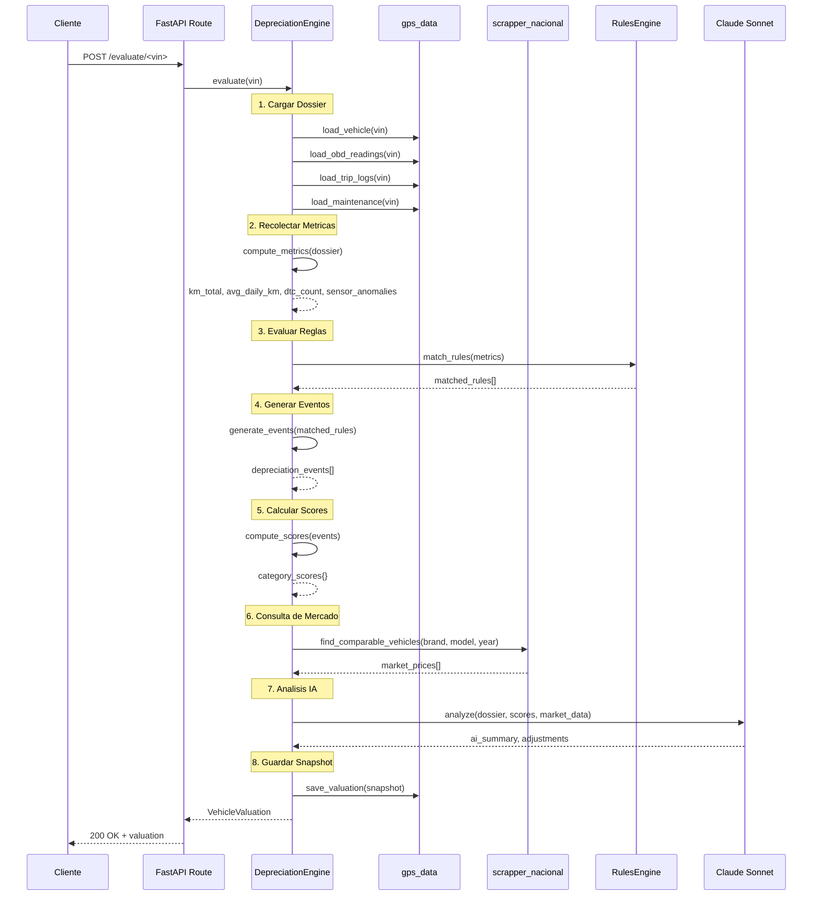

# Agente de Depreciacion

Agente especializado en la valuacion de vehiculos combinando datos GPS, diagnosticos OBD-II y condiciones del mercado mexicano. Utiliza `claude-sonnet-4` para el analisis final.

## Proposito

Calcular el valor estimado de un vehiculo en pesos mexicanos (`estimated_value_mxn`) considerando:

- **Datos GPS**: kilometraje real, patrones de uso, zonas de operacion
- **Diagnosticos OBD-II**: codigos DTC activos, lecturas de sensores, salud del motor
- **Mercado**: precios de vehiculos similares en `scrapper_nacional`
- **Historial**: mantenimientos, eventos previos, edad del vehiculo

## Flujo del Motor de Evaluacion



## Pasos del Motor

| Paso | Nombre | Descripcion |
|------|--------|-------------|
| 1 | **Cargar Dossier** | Recopila toda la informacion del vehiculo desde `gps_data` |
| 2 | **Recolectar Metricas** | Calcula metricas derivadas (km/dia, anomalias, promedios) |
| 3 | **Evaluar Reglas** | Compara metricas contra el sistema de reglas configurado |
| 4 | **Generar Eventos** | Cada regla activada produce uno o mas eventos de depreciacion |
| 5 | **Calcular Scores** | Agrega eventos por categoria para generar puntajes 0-100 |
| 6 | **Consulta de Mercado** | Busca vehiculos comparables en `scrapper_nacional` |
| 7 | **Analisis IA** | Claude genera resumen narrativo y ajustes finos al valor |
| 8 | **Guardar Snapshot** | Persiste la valuacion completa como snapshot historico |

## Sistema de Reglas

### 9 Categorias

| Categoria | Descripcion | Peso Base |
|-----------|-------------|-----------|
| `mechanical` | Estado mecanico del motor y transmision | 25% |
| `mileage` | Kilometraje total y patron de acumulacion | 15% |
| `fuel` | Eficiencia de combustible y consumo | 10% |
| `body` | Estado de carroceria y pintura | 10% |
| `electrical` | Sistema electrico, bateria, alternador | 10% |
| `maintenance` | Cumplimiento del plan de mantenimiento | 10% |
| `market` | Posicion relativa en el mercado actual | 8% |
| `age` | Edad del vehiculo y generacion del modelo | 7% |
| `usage_pattern` | Patrones de conduccion (urbano, carretera, mixto) | 5% |

### 12 Tipos de Trigger

Los triggers definen las condiciones que activan una regla:

| Trigger | Descripcion | Ejemplo |
|---------|-------------|---------|
| `dtc_code` | Codigo DTC especifico detectado | P0300 (fallo de encendido aleatorio) |
| `sensor_threshold` | Lectura de sensor fuera de rango | Temperatura motor > 110C |
| `km_milestone` | Kilometraje alcanza un umbral | Vehiculo supera 100,000 km |
| `age_threshold` | Edad del vehiculo supera limite | Vehiculo con mas de 5 anos |
| `maintenance_overdue` | Mantenimiento vencido | Cambio de aceite atrasado 3,000 km |
| `fuel_efficiency_drop` | Caida en eficiencia de combustible | Rendimiento cae 20% vs baseline |
| `market_price_change` | Cambio significativo en precio de mercado | Precio promedio baja 10% en 30 dias |
| `accident_indicator` | Indicador de colision o impacto | Sensor de airbag activado |
| `battery_degradation` | Degradacion de bateria detectada | Voltaje de arranque < 11.5V |
| `usage_intensity` | Intensidad de uso anormal | Mas de 200 km/dia promedio |
| `seasonal_adjustment` | Ajuste estacional del mercado | Temporada baja de ventas |
| `recall_notice` | Aviso de recall del fabricante | Recall activo no atendido |

### Tipos de Impacto

Cada regla activada genera un impacto que puede ser de tres tipos:

| Tipo | Descripcion | Ejemplo |
|------|-------------|---------|
| `percentage` | Porcentaje de reduccion sobre el valor | -5% por DTC P0300 activo |
| `fixed_amount` | Cantidad fija en MXN | -$15,000 por transmision danada |
| `score_adjustment` | Ajuste directo al puntaje de categoria | -10 puntos en `mechanical` |

### Fuentes de Reglas

| Fuente | Descripcion |
|--------|-------------|
| `seed` | Reglas iniciales del sistema, incluidas en migraciones |
| `manual` | Reglas creadas manualmente por el equipo tecnico |
| `ai_suggested` | Reglas sugeridas por Claude basadas en patrones detectados |
| `learned` | Reglas aprendidas automaticamente del analisis historico |

## Modelo de Salida

```python
class VehicleValuation:
    vin: str
    evaluated_at: datetime
    estimated_value_mxn: float        # Valor estimado final
    confidence_score: float           # 0.0 - 1.0
    base_market_value_mxn: float      # Valor base de mercado
    total_depreciation_mxn: float     # Depreciacion total aplicada

    scores: dict[str, float]          # Puntaje por categoria (0-100)
    # {
    #   "mechanical": 72.5,
    #   "mileage": 85.0,
    #   "fuel": 90.0,
    #   ...
    # }

    events: list[DepreciationEvent]   # Eventos que afectaron el valor
    ai_summary: str                   # Resumen narrativo de Claude
    comparable_vehicles: list[dict]   # Vehiculos similares del mercado
    snapshot_id: str                  # ID unico del snapshot
```

## Endpoints API

Todos bajo el prefijo `/api/v1/depreciation`.

| Metodo | Ruta | Descripcion |
|--------|------|-------------|
| `POST` | `/evaluate/<vin>` | Ejecuta evaluacion completa de un vehiculo |
| `POST` | `/evaluate-change` | Evalua impacto de un cambio especifico (nuevo DTC, mantenimiento) |
| `GET` | `/valuations/<vin>` | Obtiene historial de valuaciones de un vehiculo |
| `GET` | `/fuel-cost/<vin>` | Calcula costo de combustible estimado mensual |
| `GET` | `/rules` | Lista todas las reglas activas del sistema |
| `GET` | `/events/<vin>` | Lista eventos de depreciacion de un vehiculo |
| `GET` | `/fleet-summary` | Resumen de valuacion de toda la flota |

### Ejemplo: POST /evaluate/\<vin\>

**Request:**
```
POST /api/v1/depreciation/evaluate/3VWCB21C98M123456
```

**Response:**
```json
{
  "vin": "3VWCB21C98M123456",
  "estimated_value_mxn": 185000.00,
  "confidence_score": 0.87,
  "base_market_value_mxn": 220000.00,
  "total_depreciation_mxn": 35000.00,
  "scores": {
    "mechanical": 72.5,
    "mileage": 85.0,
    "fuel": 90.0,
    "body": 95.0,
    "electrical": 88.0,
    "maintenance": 65.0,
    "market": 78.0,
    "age": 70.0,
    "usage_pattern": 82.0
  },
  "ai_summary": "Vehiculo en condicion aceptable. La depreciacion principal proviene de mantenimiento atrasado y kilometraje superior al promedio para su ano...",
  "events_count": 7,
  "snapshot_id": "snap_2026_03_27_001"
}
```

### Ejemplo: POST /evaluate-change

**Request:**
```json
{
  "vin": "3VWCB21C98M123456",
  "change_type": "new_dtc",
  "data": {
    "dtc_code": "P0420",
    "description": "Catalyst System Efficiency Below Threshold"
  }
}
```

**Response:**
```json
{
  "impact": {
    "type": "percentage",
    "value": -3.5,
    "category": "mechanical",
    "estimated_cost_mxn": 7700.00
  },
  "new_estimated_value_mxn": 177300.00,
  "previous_value_mxn": 185000.00
}
```

## Configuracion Claude

```python
DEPRECIATION_CLAUDE_CONFIG = {
    "model": "claude-sonnet-4",
    "max_tokens": 2048,
    "temperature": 0.2,
    "system_prompt": """Eres un experto en valuacion de vehiculos en Mexico.
    Analiza los datos proporcionados y genera un resumen ejecutivo
    del estado y valor del vehiculo."""
}
```
