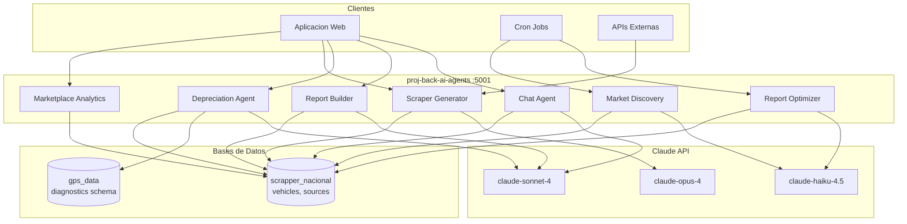
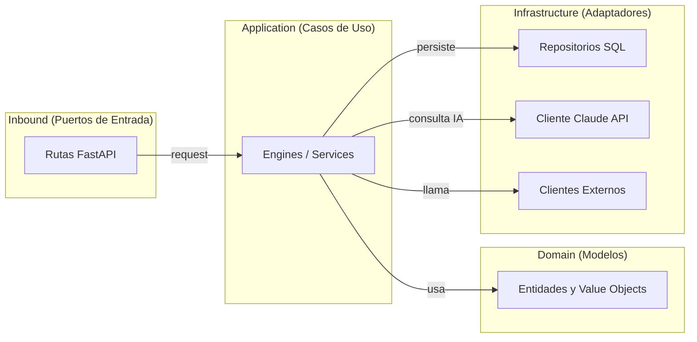

# Agentes de Inteligencia Artificial

Servicio centralizado de agentes IA para la plataforma GPS. Proyecto `proj-back-ai-agents` ejecutandose en el puerto **5001**.

## Arquitectura General

El servicio agrupa 7 agentes especializados que operan sobre dos bases de datos principales, cada uno con un proposito definido dentro del ecosistema de gestion vehicular.



## Arquitectura Hexagonal

Todos los agentes siguen una arquitectura hexagonal (puertos y adaptadores) que separa las responsabilidades en capas bien definidas.



### Capas

| Capa | Directorio | Responsabilidad |
|------|-----------|----------------|
| **Inbound** | `routes/` | Endpoints FastAPI, validacion de request, serializacion de response |
| **Application** | `engines/` | Logica de orquestacion, loops agenticos, coordinacion de tools |
| **Domain** | `models/` | Entidades puras (Pydantic), reglas de negocio, value objects |
| **Infrastructure** | `repos/`, `clients/` | Acceso a BD, llamadas a Claude API, clientes HTTP externos |

## Asignacion de Modelos Claude

Cada agente utiliza el modelo de Claude mas adecuado segun su carga de trabajo, complejidad y frecuencia de ejecucion.

| Agente | Modelo | Razon |
|--------|--------|-------|
| Chat | `claude-sonnet-4` | Balance conversacional optimo entre velocidad y calidad |
| Report Builder | `claude-sonnet-4` | Generacion de reportes con herramientas estructuradas |
| Depreciation | `claude-sonnet-4` | Analisis vehicular con razonamiento complejo |
| Scraper Generator | `claude-opus-4` | Maxima capacidad para generacion de codigo Scrapy |
| Report Optimizer | `claude-haiku-4.5` | Batch semanal, prioriza economia de tokens |
| Market Discovery | `claude-haiku-4.5` | Batch de descubrimiento, alto volumen bajo costo |
| Marketplace Analytics | N/A (SQL puro) | Sin IA necesaria, consultas directas a BD |

## Bases de Datos

### gps_data (schema: diagnostics)

Base de datos principal del sistema GPS. El schema `diagnostics` contiene:

- **vehicles** - Inventario de vehiculos con VIN, marca, modelo, ano
- **obd_readings** - Lecturas OBD-II en tiempo real (DTCs, sensores)
- **gps_positions** - Historico de posiciones GPS
- **trip_logs** - Registros de viajes con kilometraje acumulado
- **maintenance_records** - Historial de mantenimiento

### scrapper_nacional

Base de datos del marketplace y scraping de fuentes mexicanas:

- **vehicles** - Vehiculos recolectados de multiples fuentes (precio, kms, ubicacion)
- **sources** - Fuentes de datos descubiertas y activas
- **spiders** - Spiders Scrapy registrados y su configuracion
- **reports** - Reportes generados por el Report Builder
- **report_widgets** - Widgets individuales de cada reporte

## Endpoints Base

Todos los agentes exponen sus rutas bajo el prefijo `/api/v1/`:

| Prefijo | Agente |
|---------|--------|
| `/api/v1/chat` | Chat Agent |
| `/api/v1/reports` | Report Builder |
| `/api/v1/depreciation` | Depreciation Agent |
| `/api/v1/scrapers` | Scraper Generator |
| `/api/v1/optimizer` | Report Optimizer |
| `/api/v1/discovery` | Market Discovery |
| `/api/v1/marketplace` | Marketplace Analytics |

## Configuracion del Servicio

```python
# Configuracion base
HOST = "0.0.0.0"
PORT = 5001
WORKERS = 4

# Claude API
ANTHROPIC_API_KEY = env("ANTHROPIC_API_KEY")
MAX_TOKENS_DEFAULT = 4096
TEMPERATURE_DEFAULT = 0.3

# Bases de datos
GPS_DATABASE_URL = env("GPS_DATABASE_URL")       # PostgreSQL
SCRAPPER_DATABASE_URL = env("SCRAPPER_DATABASE_URL")  # PostgreSQL
```

## Estado de los Agentes

| Agente | Estado | Tipo |
|--------|--------|------|
| Chat | Produccion | Interactivo |
| Report Builder | Produccion | Interactivo |
| Depreciation | Produccion | Interactivo |
| Scraper Generator | Produccion | Interactivo |
| Report Optimizer | Beta | Batch semanal |
| Market Discovery | Beta | Batch programado |
| Marketplace Analytics | Produccion | Consulta directa |
