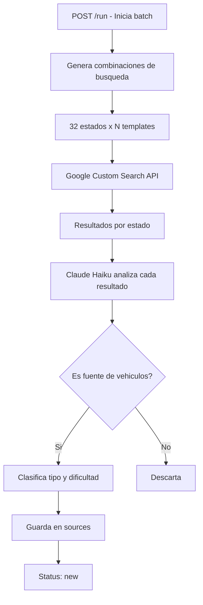
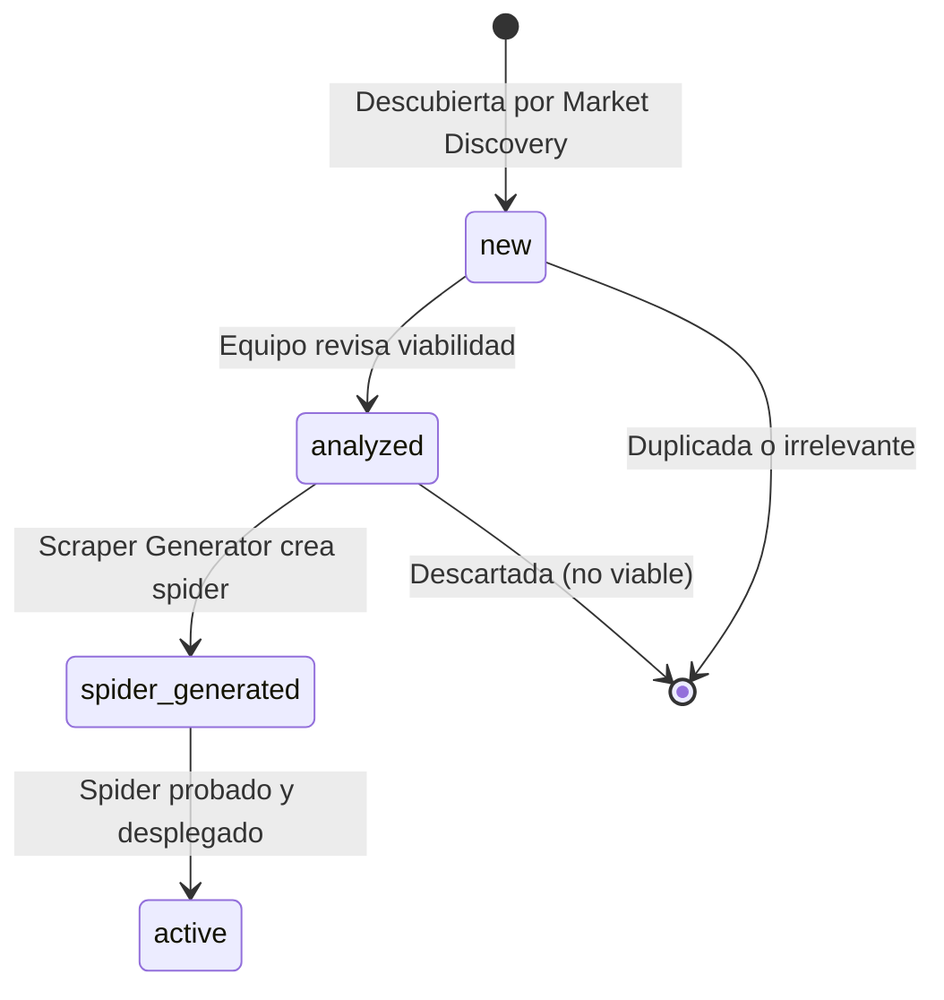

# Market Discovery

Agente batch de descubrimiento de nuevas fuentes de vehiculos en el mercado mexicano. Utiliza `claude-haiku-4.5` junto con la API de Google Custom Search para identificar y clasificar sitios web de venta de autos en los 32 estados de Mexico.

## Proposito

Descubrir automaticamente nuevas fuentes de datos (concesionarios, lotes, marketplaces, vendedores particulares) que puedan ser integradas al sistema de scraping. Cubre todo el territorio nacional para maximizar la cobertura del marketplace.

## Flujo de Descubrimiento



## Cobertura: 32 Estados Mexicanos

El agente busca en todos los estados de Mexico:

| # | Estado | # | Estado |
|---|--------|---|--------|
| 1 | Aguascalientes | 17 | Morelos |
| 2 | Baja California | 18 | Nayarit |
| 3 | Baja California Sur | 19 | Nuevo Leon |
| 4 | Campeche | 20 | Oaxaca |
| 5 | Chiapas | 21 | Puebla |
| 6 | Chihuahua | 22 | Queretaro |
| 7 | Ciudad de Mexico | 23 | Quintana Roo |
| 8 | Coahuila | 24 | San Luis Potosi |
| 9 | Colima | 25 | Sinaloa |
| 10 | Durango | 26 | Sonora |
| 11 | Estado de Mexico | 27 | Tabasco |
| 12 | Guanajuato | 28 | Tamaulipas |
| 13 | Guerrero | 29 | Tlaxcala |
| 14 | Hidalgo | 30 | Veracruz |
| 15 | Jalisco | 31 | Yucatan |
| 16 | Michoacan | 32 | Zacatecas |

## Templates de Busqueda

Las busquedas se generan combinando templates con ubicaciones:

| Template | Proposito |
|----------|-----------|
| `"venta de autos usados {location}"` | Busqueda general de fuentes |
| `"lote de autos {location}"` | Lotes y distribuidores locales |
| `"concesionario autos seminuevos {location}"` | Concesionarios formales |
| `"compra venta vehiculos {location}"` | Negocios de compra-venta |
| `"autos seminuevos baratos {location}"` | Ofertas y mercado popular |

Cada template se ejecuta para cada estado, generando `5 templates x 32 estados = 160 busquedas` por ejecucion.

## Atributos de Fuente

Cada fuente descubierta se clasifica con los siguientes atributos:

### Tipo de Fuente

| Tipo | Descripcion | Ejemplo |
|------|-------------|---------|
| `concesionario` | Agencia o concesionario formal | "Honda Metropolitana GDL" |
| `lotero` | Lote de autos independiente | "Autos Don Pepe" |
| `marketplace` | Plataforma digital de venta | "autosmexico.com" |
| `particular` | Venta entre particulares | "Facebook Marketplace regional" |

### Dificultad de Scraping

| Nivel | Descripcion | Implicacion |
|-------|-------------|-------------|
| `easy` | HTML estatico, estructura clara | Spider simple, rapido de generar |
| `medium` | JavaScript ligero, paginacion estandar | Spider con Splash o Playwright |
| `hard` | SPA completa, proteccion anti-bot | Requiere headless browser y rotacion de IPs |
| `impossible` | Captcha agresivo, login requerido | No viable para scraping automatico |

## Workflow de Estados



| Estado | Descripcion |
|--------|-------------|
| `new` | Recien descubierta, pendiente de revision |
| `analyzed` | Revisada por el equipo, viable para scraping |
| `spider_generated` | Spider creado por el Scraper Generator |
| `active` | Spider en produccion, recolectando datos |

## Modelo de Datos

### Source

```python
class DiscoveredSource:
    id: str
    name: str                    # Nombre del sitio/negocio
    url: str                     # URL principal
    source_type: str             # "concesionario", "lotero", "marketplace", "particular"
    scraper_difficulty: str      # "easy", "medium", "hard", "impossible"
    location: str                # Estado donde fue descubierta
    status: str                  # "new", "analyzed", "spider_generated", "active"
    vehicles_estimated: int      # Cantidad estimada de vehiculos
    description: str             # Descripcion generada por Claude
    discovered_at: datetime
    updated_at: datetime
    spider_id: str | None        # Referencia al spider generado
```

## Endpoints API

Todos bajo el prefijo `/api/v1/discovery`.

| Metodo | Ruta | Descripcion |
|--------|------|-------------|
| `POST` | `/run` | Ejecuta el ciclo de descubrimiento |
| `GET` | `/sources` | Lista todas las fuentes descubiertas |
| `PUT` | `/sources/{id}/status` | Actualiza el estado de una fuente |
| `GET` | `/stats` | Estadisticas del descubrimiento |

### POST /run

Ejecuta un ciclo completo de descubrimiento.

**Request:** Sin body (o con parametros opcionales).

```json
{
  "states": ["Jalisco", "Nuevo Leon"],
  "templates": ["venta de autos usados {location}"]
}
```

Si no se envian parametros, se ejecutan todos los estados y templates.

**Response:**
```json
{
  "run_id": "disc_20260327_001",
  "searches_executed": 160,
  "results_analyzed": 1420,
  "new_sources_found": 18,
  "duplicates_skipped": 42,
  "by_type": {
    "concesionario": 7,
    "lotero": 5,
    "marketplace": 3,
    "particular": 3
  },
  "by_difficulty": {
    "easy": 8,
    "medium": 6,
    "hard": 3,
    "impossible": 1
  },
  "duration_seconds": 312,
  "google_api_calls": 160,
  "tokens_used": 28000
}
```

### GET /sources

**Parametros query:**
| Parametro | Tipo | Default | Descripcion |
|-----------|------|---------|-------------|
| `status` | string | null | Filtrar por estado |
| `type` | string | null | Filtrar por tipo de fuente |
| `difficulty` | string | null | Filtrar por dificultad |
| `location` | string | null | Filtrar por estado/ubicacion |
| `limit` | int | 50 | Limite de resultados |
| `offset` | int | 0 | Offset para paginacion |

**Response:**
```json
{
  "sources": [
    {
      "id": "src_001",
      "name": "Autos Monterrey Premium",
      "url": "https://autosmonterreypremium.com",
      "source_type": "concesionario",
      "scraper_difficulty": "easy",
      "location": "Nuevo Leon",
      "status": "new",
      "vehicles_estimated": 120,
      "description": "Concesionario de autos seminuevos en Monterrey con catalogo web estructurado",
      "discovered_at": "2026-03-27T03:45:00Z"
    }
  ],
  "total": 234,
  "limit": 50,
  "offset": 0
}
```

### PUT /sources/{id}/status

**Request:**
```json
{
  "status": "analyzed",
  "notes": "Sitio viable, estructura HTML limpia, estimado 120 vehiculos"
}
```

**Response:**
```json
{
  "id": "src_001",
  "status": "analyzed",
  "updated_at": "2026-03-27T14:30:00Z"
}
```

### GET /stats

**Response:**
```json
{
  "total_sources": 234,
  "by_status": {
    "new": 156,
    "analyzed": 42,
    "spider_generated": 18,
    "active": 18
  },
  "by_type": {
    "concesionario": 89,
    "lotero": 67,
    "marketplace": 45,
    "particular": 33
  },
  "by_state_top10": [
    {"state": "Ciudad de Mexico", "count": 34},
    {"state": "Jalisco", "count": 28},
    {"state": "Nuevo Leon", "count": 25},
    {"state": "Estado de Mexico", "count": 22},
    {"state": "Puebla", "count": 15}
  ],
  "last_run": "2026-03-27T03:00:00Z",
  "total_runs": 12
}
```

## Configuracion Claude

```python
MARKET_DISCOVERY_CONFIG = {
    "model": "claude-haiku-4.5",
    "max_tokens": 512,
    "temperature": 0.2,
    "system_prompt": """Analiza el siguiente resultado de busqueda y determina
    si es una fuente viable de vehiculos usados en Mexico. Clasifica el tipo
    de fuente y la dificultad de scraping. Responde en formato JSON."""
}
```

## Configuracion Google Custom Search

```python
GOOGLE_SEARCH_CONFIG = {
    "api_key": env("GOOGLE_CSE_API_KEY"),
    "cx": env("GOOGLE_CSE_CX"),              # Custom Search Engine ID
    "results_per_query": 10,
    "language": "es",
    "country": "MX",
    "rate_limit_per_second": 1,
    "daily_quota": 10000
}
```

## Razon de Uso de Haiku

Se utiliza `claude-haiku-4.5` porque:

1. **Alto volumen** - Analiza cientos de resultados de busqueda por ejecucion
2. **Tarea de clasificacion** - Categorizar fuentes es una tarea sencilla para IA
3. **Economia** - Minimiza costo en ejecuciones batch frecuentes
4. **Velocidad** - Procesa resultados rapidamente para no exceder limites de API de Google
5. **Salida estructurada** - Solo necesita generar JSON de clasificacion, no texto largo
