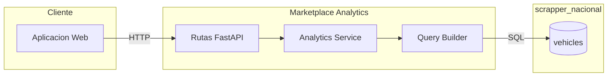

# Marketplace Analytics

Agente de analitica pura basado en consultas SQL directas contra la base de datos `scrapper_nacional`. No utiliza inteligencia artificial; toda la logica reside en queries optimizados.

## Arquitectura



## Logica Clave

### Determinacion de Venta

Un vehiculo se considera **vendido** cuando el campo `out_stock_at` no es nulo:

```sql
-- Vehiculo vendido
WHERE out_stock_at IS NOT NULL

-- Vehiculo en inventario
WHERE out_stock_at IS NULL
```

### Dias en el Mercado

El tiempo que un vehiculo permanece en el mercado se calcula como la diferencia en segundos entre la fecha de salida y la fecha de creacion, dividida entre 86,400 (segundos por dia):

```sql
(EXTRACT(EPOCH FROM out_stock_at) - EXTRACT(EPOCH FROM created_at)) / 86400
    AS days_on_market
```

### Tabla vehicles

Campos principales utilizados por las consultas:

| Campo | Tipo | Descripcion |
|-------|------|-------------|
| `id` | `SERIAL` | Identificador unico |
| `source` | `VARCHAR` | Fuente de origen (seminuevos.com, etc.) |
| `brand` | `VARCHAR` | Marca del vehiculo |
| `model` | `VARCHAR` | Modelo del vehiculo |
| `year` | `INTEGER` | Ano del vehiculo |
| `price` | `DECIMAL` | Precio en MXN |
| `kms` | `INTEGER` | Kilometraje registrado |
| `location` | `VARCHAR` | Ciudad/estado de ubicacion |
| `url` | `TEXT` | URL original del anuncio |
| `created_at` | `TIMESTAMP` | Fecha de primera deteccion |
| `out_stock_at` | `TIMESTAMP` | Fecha de salida (venta) o NULL |
| `updated_at` | `TIMESTAMP` | Ultima actualizacion del registro |

## Endpoints API

Todos bajo el prefijo `/api/v1/marketplace`.

### Endpoints de Analitica

| Metodo | Ruta | Descripcion |
|--------|------|-------------|
| `GET` | `/analytics/summary` | Resumen general del marketplace |
| `GET` | `/analytics/top-selling` | Vehiculos mas vendidos por marca/modelo |
| `GET` | `/analytics/prices` | Distribucion y estadisticas de precios |
| `GET` | `/analytics/time-to-sell` | Tiempo promedio de venta por segmento |
| `GET` | `/analytics/price-history` | Historico de precios para marca/modelo |
| `GET` | `/analytics/sales-history` | Historico de ventas por periodo |
| `GET` | `/analytics/inventory` | Estado actual del inventario por fuente |

### Endpoints de Filtros

| Metodo | Ruta | Descripcion |
|--------|------|-------------|
| `GET` | `/filters/sources` | Lista todas las fuentes disponibles |
| `GET` | `/filters/locations` | Lista todas las ubicaciones disponibles |
| `GET` | `/filters/brands` | Lista todas las marcas con conteo de vehiculos |

## Detalle de Endpoints

### GET /analytics/summary

Retorna un resumen general del estado del marketplace.

**Parametros query:**
| Parametro | Tipo | Requerido | Descripcion |
|-----------|------|-----------|-------------|
| `source` | string | No | Filtrar por fuente |
| `brand` | string | No | Filtrar por marca |
| `location` | string | No | Filtrar por ubicacion |
| `year_from` | int | No | Ano minimo |
| `year_to` | int | No | Ano maximo |

**Response:**
```json
{
  "total_vehicles": 11247,
  "in_stock": 8934,
  "sold": 2313,
  "avg_price_mxn": 285000.00,
  "median_price_mxn": 245000.00,
  "avg_days_on_market": 34.5,
  "sources_count": 12,
  "brands_count": 45,
  "last_updated": "2026-03-27T10:30:00Z"
}
```

### GET /analytics/top-selling

**Parametros query:**
| Parametro | Tipo | Default | Descripcion |
|-----------|------|---------|-------------|
| `limit` | int | 20 | Cantidad de resultados |
| `period_days` | int | 30 | Periodo de analisis en dias |
| `source` | string | null | Filtrar por fuente |

**Response:**
```json
{
  "period_days": 30,
  "results": [
    {
      "brand": "Nissan",
      "model": "Versa",
      "sold_count": 45,
      "avg_price_mxn": 215000.00,
      "avg_days_on_market": 21.3
    }
  ]
}
```

### GET /analytics/prices

Distribucion de precios con estadisticas por segmento.

**Parametros query:**
| Parametro | Tipo | Descripcion |
|-----------|------|-------------|
| `brand` | string | Marca a analizar |
| `model` | string | Modelo especifico |
| `year` | int | Ano del modelo |
| `group_by` | string | Agrupar por: `brand`, `model`, `year`, `source` |

**Response:**
```json
{
  "group_by": "brand",
  "results": [
    {
      "group": "Nissan",
      "count": 1523,
      "min_price": 85000.00,
      "max_price": 650000.00,
      "avg_price": 275000.00,
      "median_price": 245000.00,
      "p25_price": 180000.00,
      "p75_price": 350000.00
    }
  ]
}
```

### GET /analytics/time-to-sell

Analisis del tiempo promedio de venta.

**Response:**
```json
{
  "overall_avg_days": 34.5,
  "by_price_range": [
    {"range": "0-100k", "avg_days": 18.2, "count": 312},
    {"range": "100k-200k", "avg_days": 25.7, "count": 856},
    {"range": "200k-300k", "avg_days": 32.4, "count": 634},
    {"range": "300k-500k", "avg_days": 41.8, "count": 389},
    {"range": "500k+", "avg_days": 58.3, "count": 122}
  ]
}
```

### GET /analytics/price-history

Historico de precios promedio por periodo.

**Parametros query:**
| Parametro | Tipo | Default | Descripcion |
|-----------|------|---------|-------------|
| `brand` | string | requerido | Marca |
| `model` | string | null | Modelo |
| `granularity` | string | `month` | `week`, `month`, `quarter` |

**Response:**
```json
{
  "brand": "Nissan",
  "model": "Versa",
  "granularity": "month",
  "data_points": [
    {"period": "2026-01", "avg_price": 218000.00, "count": 234},
    {"period": "2026-02", "avg_price": 215000.00, "count": 256},
    {"period": "2026-03", "avg_price": 212000.00, "count": 198}
  ]
}
```

### GET /analytics/sales-history

Historico de volumen de ventas por periodo.

**Response:**
```json
{
  "granularity": "month",
  "data_points": [
    {"period": "2026-01", "sold_count": 756, "avg_days_on_market": 33.1},
    {"period": "2026-02", "sold_count": 812, "avg_days_on_market": 31.8},
    {"period": "2026-03", "sold_count": 745, "avg_days_on_market": 35.2}
  ]
}
```

### GET /analytics/inventory

Estado actual del inventario agrupado por fuente.

**Response:**
```json
{
  "total_in_stock": 8934,
  "by_source": [
    {
      "source": "seminuevos.com",
      "in_stock": 3421,
      "avg_price": 310000.00,
      "newest": "2026-03-27",
      "oldest": "2025-11-15"
    }
  ]
}
```

## Indices de Base de Datos Recomendados

Para el rendimiento optimo de las consultas analiticas:

```sql
CREATE INDEX idx_vehicles_source ON vehicles(source);
CREATE INDEX idx_vehicles_brand ON vehicles(brand);
CREATE INDEX idx_vehicles_brand_model ON vehicles(brand, model);
CREATE INDEX idx_vehicles_location ON vehicles(location);
CREATE INDEX idx_vehicles_out_stock ON vehicles(out_stock_at);
CREATE INDEX idx_vehicles_created ON vehicles(created_at);
CREATE INDEX idx_vehicles_price ON vehicles(price);
```
