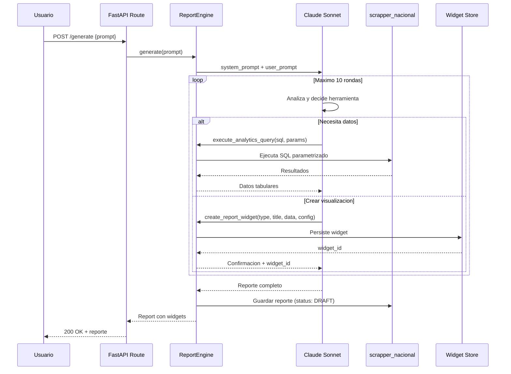
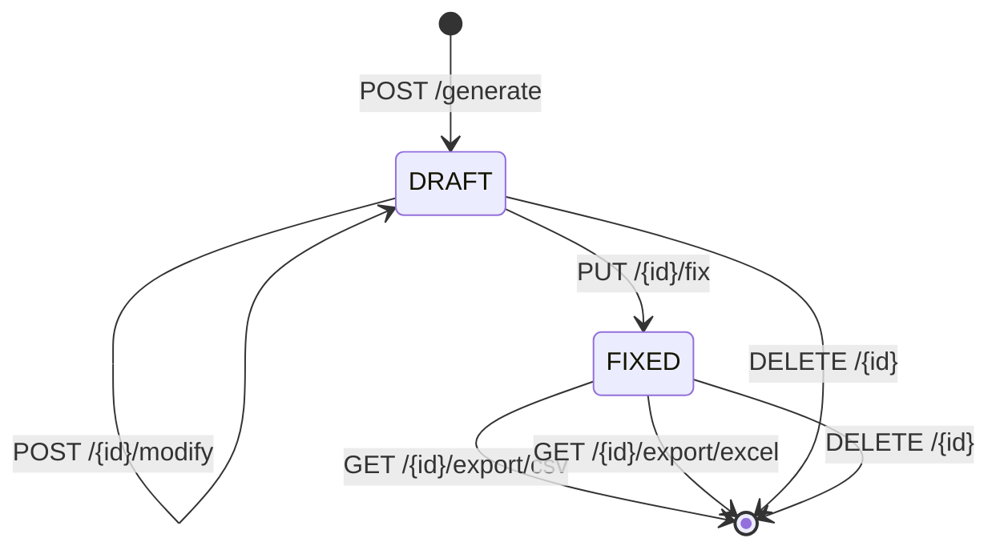

# Report Builder

Agente generador de reportes interactivos que utiliza `claude-sonnet-4` en un loop agentico con 2 herramientas especializadas. Maximo 10 rondas de ejecucion por generacion.

## Arquitectura del Loop Agentico



## Herramientas (Tools)

El agente tiene acceso a exactamente 2 herramientas que utiliza de forma iterativa:

### execute_analytics_query

Ejecuta consultas SQL contra `scrapper_nacional` para obtener datos.

```python
{
    "name": "execute_analytics_query",
    "parameters": {
        "sql": "SELECT brand, COUNT(*) as total FROM vehicles GROUP BY brand ORDER BY total DESC LIMIT 10",
        "params": {}
    }
}
```

**Restricciones de seguridad:**
- Solo consultas `SELECT` permitidas
- Queries parametrizados para evitar inyeccion SQL
- Timeout de 30 segundos por consulta
- Limite de 10,000 filas por resultado

### create_report_widget

Crea un widget visual para el reporte.

```python
{
    "name": "create_report_widget",
    "parameters": {
        "widget_type": "chart",
        "title": "Top 10 Marcas por Volumen",
        "data": [...],
        "config": {
            "chart_type": "horizontal_bar",
            "x_axis": "brand",
            "y_axis": "total"
        }
    }
}
```

## Tipos de Widget

| Tipo | Subtipos | Descripcion |
|------|----------|-------------|
| `chart` | `bar` | Grafico de barras verticales |
| `chart` | `line` | Grafico de lineas (series temporales) |
| `chart` | `pie` | Grafico circular (composicion) |
| `chart` | `scatter` | Grafico de dispersion (correlacion) |
| `chart` | `area` | Grafico de area (acumulados) |
| `chart` | `horizontal_bar` | Barras horizontales (rankings) |
| `table` | - | Tabla de datos con ordenamiento |
| `kpi` | - | Indicador clave numerico con tendencia |

### Estructura de un Widget

```python
class ReportWidget:
    id: str
    report_id: str
    widget_type: str          # "chart", "table", "kpi"
    title: str
    data: list[dict]          # Datos del widget
    config: dict              # Configuracion visual
    position: int             # Orden en el reporte
    created_at: datetime
```

### Configuracion de Chart

```json
{
  "chart_type": "bar",
  "x_axis": "campo_x",
  "y_axis": "campo_y",
  "color": "#3B82F6",
  "show_legend": true,
  "show_values": true,
  "stacked": false
}
```

### Configuracion de KPI

```json
{
  "value_field": "total",
  "format": "currency_mxn",
  "trend_field": "change_pct",
  "trend_direction": "up_is_good",
  "icon": "dollar-sign"
}
```

## Ciclo de Vida del Reporte



| Estado | Descripcion |
|--------|-------------|
| `DRAFT` | Reporte recien generado o modificado, editable |
| `FIXED` | Reporte fijado, listo para exportacion, no editable |

## Endpoints API

Todos bajo el prefijo `/api/v1/reports`.

| Metodo | Ruta | Descripcion |
|--------|------|-------------|
| `POST` | `/generate` | Genera un nuevo reporte a partir de un prompt |
| `POST` | `/{id}/modify` | Modifica un reporte existente con instrucciones adicionales |
| `GET` | `/` | Lista todos los reportes del usuario |
| `GET` | `/{id}` | Obtiene un reporte con todos sus widgets |
| `PUT` | `/{id}/fix` | Fija el reporte (DRAFT -> FIXED) |
| `DELETE` | `/{id}` | Elimina un reporte y sus widgets |
| `GET` | `/{id}/export/csv` | Exporta datos del reporte en CSV |
| `GET` | `/{id}/export/excel` | Exporta datos del reporte en Excel |

### POST /generate

**Request:**
```json
{
  "prompt": "Genera un reporte de las 10 marcas mas vendidas en los ultimos 30 dias con grafico de barras y tabla de detalle"
}
```

**Response:**
```json
{
  "id": "rpt_20260327_001",
  "status": "DRAFT",
  "title": "Top 10 Marcas Mas Vendidas - Ultimos 30 Dias",
  "prompt": "Genera un reporte de las 10 marcas...",
  "widgets": [
    {
      "id": "wgt_001",
      "widget_type": "chart",
      "title": "Marcas Mas Vendidas",
      "config": {"chart_type": "horizontal_bar"},
      "data": [...]
    },
    {
      "id": "wgt_002",
      "widget_type": "table",
      "title": "Detalle por Marca",
      "data": [...]
    }
  ],
  "created_at": "2026-03-27T10:30:00Z",
  "rounds_used": 4
}
```

### POST /{id}/modify

**Request:**
```json
{
  "instructions": "Agrega un KPI con el precio promedio general y cambia el grafico de barras a un pie chart"
}
```

## Configuracion Claude

```python
REPORT_BUILDER_CONFIG = {
    "model": "claude-sonnet-4",
    "max_tokens": 4096,
    "temperature": 0.3,
    "max_rounds": 10,
    "tools": ["execute_analytics_query", "create_report_widget"],
    "system_prompt": """Eres un analista de datos experto en el mercado
    automotriz mexicano. Genera reportes visuales usando las herramientas
    disponibles. Cada reporte debe tener al menos un grafico y datos
    relevantes."""
}
```

## Flujo Tipico de Generacion

1. Usuario envia un prompt descriptivo
2. Claude analiza el prompt y planifica los widgets necesarios
3. Claude ejecuta queries SQL para obtener datos relevantes
4. Claude crea widgets con los datos obtenidos
5. Si necesita mas datos, ejecuta queries adicionales
6. Proceso se repite hasta completar el reporte o alcanzar 10 rondas
7. Reporte se guarda como DRAFT
8. Usuario puede modificar, fijar o exportar
