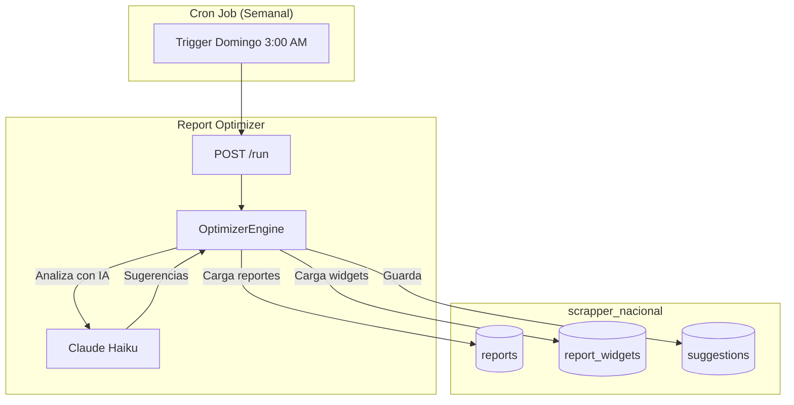
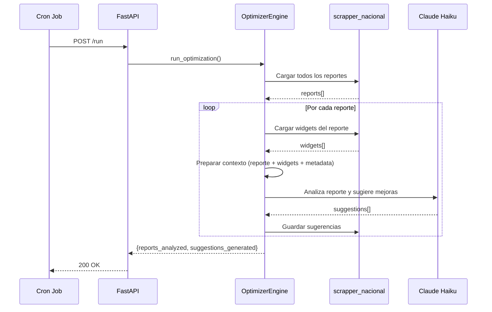

# Report Optimizer

Agente batch semanal que analiza reportes existentes y genera sugerencias de mejora utilizando `claude-haiku-4.5`. Disenado para ejecutarse de forma economica sobre grandes volumenes de reportes.

## Proposito

Revisar todos los reportes generados por el Report Builder y sugerir mejoras automaticas: nuevas visualizaciones, filtros mas utiles, KPIs adicionales y cambios de layout que incrementen el valor analitico de cada reporte.

## Arquitectura



## Flujo de Ejecucion



## Tipos de Sugerencia

| Tipo | Descripcion | Ejemplo |
|------|-------------|---------|
| `new_chart` | Sugiere agregar un nuevo grafico | "Agregar grafico de lineas con tendencia de precios de los ultimos 6 meses" |
| `better_filter` | Recomienda mejorar o agregar filtros | "Agregar filtro por ubicacion para segmentar el analisis regionalmente" |
| `new_kpi` | Propone un nuevo indicador clave | "Incluir KPI de tasa de rotacion: vehiculos vendidos / inventario total" |
| `layout_change` | Sugiere reorganizar el layout | "Mover el KPI de precio promedio al inicio del reporte para contexto inmediato" |

## Prioridades

Cada sugerencia se clasifica por prioridad segun su impacto potencial:

| Prioridad | Criterio | Accion Esperada |
|-----------|----------|----------------|
| `high` | Mejora significativa en valor analitico | Implementar en el proximo ciclo |
| `medium` | Mejora moderada en legibilidad o utilidad | Revisar y decidir |
| `low` | Ajuste menor estetico o de conveniencia | Aplicar cuando sea oportuno |

## Modelo de Datos

### Suggestion

```python
class OptimizationSuggestion:
    id: str
    report_id: str
    suggestion_type: str      # "new_chart", "better_filter", "new_kpi", "layout_change"
    priority: str             # "high", "medium", "low"
    title: str                # Titulo breve de la sugerencia
    description: str          # Descripcion detallada
    implementation: dict      # Datos para implementacion automatica
    status: str               # "pending", "applied", "dismissed"
    created_at: datetime
    applied_at: datetime | None
```

### Estructura de implementation

Segun el tipo de sugerencia, el campo `implementation` contiene los datos necesarios para aplicar la mejora automaticamente:

**new_chart:**
```json
{
  "widget_type": "chart",
  "chart_type": "line",
  "title": "Tendencia de Precios - 6 Meses",
  "sql": "SELECT DATE_TRUNC('month', created_at) as mes, AVG(price) as precio_promedio FROM vehicles WHERE brand = 'Nissan' GROUP BY mes ORDER BY mes",
  "config": {
    "x_axis": "mes",
    "y_axis": "precio_promedio"
  }
}
```

**better_filter:**
```json
{
  "filter_field": "location",
  "filter_type": "dropdown",
  "label": "Ubicacion",
  "sql_values": "SELECT DISTINCT location FROM vehicles ORDER BY location"
}
```

**new_kpi:**
```json
{
  "title": "Tasa de Rotacion",
  "sql": "SELECT ROUND(COUNT(CASE WHEN out_stock_at IS NOT NULL THEN 1 END)::decimal / COUNT(*) * 100, 1) as rotation_rate FROM vehicles",
  "format": "percentage",
  "icon": "refresh"
}
```

**layout_change:**
```json
{
  "widget_id": "wgt_003",
  "action": "move",
  "from_position": 4,
  "to_position": 1,
  "reason": "KPI de contexto debe estar visible primero"
}
```

## Endpoints API

Todos bajo el prefijo `/api/v1/optimizer`.

| Metodo | Ruta | Descripcion |
|--------|------|-------------|
| `POST` | `/run` | Ejecuta el ciclo de optimizacion sobre todos los reportes |
| `GET` | `/suggestions` | Lista todas las sugerencias pendientes |
| `POST` | `/apply/{id}` | Aplica una sugerencia especifica al reporte |
| `GET` | `/history` | Historial de ejecuciones del optimizador |

### POST /run

Dispara la ejecucion del optimizador. Normalmente llamado por el cron job semanal.

**Request:** Sin body.

**Response:**
```json
{
  "run_id": "opt_20260327_001",
  "reports_analyzed": 45,
  "suggestions_generated": 23,
  "by_type": {
    "new_chart": 8,
    "better_filter": 6,
    "new_kpi": 5,
    "layout_change": 4
  },
  "by_priority": {
    "high": 5,
    "medium": 12,
    "low": 6
  },
  "duration_seconds": 134,
  "tokens_used": 42000
}
```

### GET /suggestions

**Parametros query:**
| Parametro | Tipo | Default | Descripcion |
|-----------|------|---------|-------------|
| `status` | string | "pending" | Filtrar por estado |
| `priority` | string | null | Filtrar por prioridad |
| `report_id` | string | null | Filtrar por reporte |
| `type` | string | null | Filtrar por tipo de sugerencia |

**Response:**
```json
{
  "suggestions": [
    {
      "id": "sug_001",
      "report_id": "rpt_20260320_003",
      "suggestion_type": "new_kpi",
      "priority": "high",
      "title": "Agregar KPI de tiempo promedio de venta",
      "description": "El reporte muestra vehiculos vendidos pero no indica cuanto tardan en venderse. Un KPI de dias promedio en mercado daria contexto temporal valioso.",
      "status": "pending",
      "created_at": "2026-03-23T03:15:00Z"
    }
  ],
  "total": 23,
  "pending": 18,
  "applied": 3,
  "dismissed": 2
}
```

### POST /apply/{id}

Aplica una sugerencia al reporte correspondiente, creando el widget o modificacion sugerida.

**Response:**
```json
{
  "suggestion_id": "sug_001",
  "status": "applied",
  "applied_at": "2026-03-27T14:30:00Z",
  "report_id": "rpt_20260320_003",
  "widget_created": "wgt_078"
}
```

### GET /history

**Response:**
```json
{
  "runs": [
    {
      "run_id": "opt_20260323_001",
      "executed_at": "2026-03-23T03:00:00Z",
      "reports_analyzed": 42,
      "suggestions_generated": 19,
      "duration_seconds": 128,
      "tokens_used": 38500
    }
  ]
}
```

## Configuracion Claude

```python
REPORT_OPTIMIZER_CONFIG = {
    "model": "claude-haiku-4.5",
    "max_tokens": 1024,
    "temperature": 0.3,
    "system_prompt": """Eres un analista de datos que revisa reportes
    automotrices y sugiere mejoras. Para cada reporte, analiza los
    widgets existentes y sugiere mejoras concretas e implementables.
    Responde en formato JSON estructurado."""
}
```

## Razon de Uso de Haiku

Se utiliza `claude-haiku-4.5` porque:

1. **Batch semanal** - Procesa decenas de reportes en cada ejecucion
2. **Tarea estructurada** - Las sugerencias siguen un formato predefinido
3. **Economia** - El costo por token de Haiku es significativamente menor
4. **Velocidad** - Haiku es el modelo mas rapido, reduciendo el tiempo total del batch
5. **Suficiente capacidad** - Analizar reportes existentes no requiere razonamiento avanzado

## Programacion del Cron

```bash
# Ejecutar cada domingo a las 3:00 AM (hora de Mexico)
0 3 * * 0 curl -X POST http://localhost:5001/api/v1/optimizer/run
```
