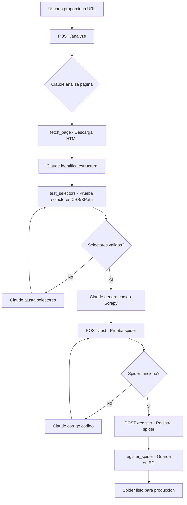

# Scraper Generator

Agente generador de spiders Scrapy que utiliza `claude-opus-4` para crear codigo de scraping de alta calidad. Opera con 3 herramientas en un loop agentico de hasta 8 rondas.

## Proposito

Automatizar la creacion de spiders Scrapy para nuevas fuentes de vehiculos descubiertas en el mercado mexicano. Cada spider generado sigue los patrones del modulo `mod_scrapper_nacional` y extrae los 14 campos estandar del item vehicular.

## Flujo de Generacion



## Herramientas (Tools)

### 1. fetch_page

Descarga el contenido HTML de una URL para analisis.

```python
{
    "name": "fetch_page",
    "parameters": {
        "url": "https://ejemplo.com/autos-usados"
    }
}
```

| Parametro | Tipo | Descripcion |
|-----------|------|-------------|
| `url` | string | URL de la pagina a descargar |

**Retorna:** HTML completo de la pagina (limitado a 50KB).

**Configuracion del cliente HTTP:**
- User-Agent rotativo
- Timeout de 30 segundos
- Soporte de redireccionamientos
- Manejo de encoding automatico

### 2. test_selectors

Prueba selectores CSS o XPath contra HTML descargado.

```python
{
    "name": "test_selectors",
    "parameters": {
        "html": "<html>...</html>",
        "selectors": {
            "title": "h1.vehicle-title::text",
            "price": "span.price::text",
            "brand": "div.brand-name::text",
            "items_list": "div.vehicle-card"
        }
    }
}
```

| Parametro | Tipo | Descripcion |
|-----------|------|-------------|
| `html` | string | HTML contra el cual probar |
| `selectors` | dict | Diccionario nombre -> selector CSS/XPath |

**Retorna:** Diccionario con los valores extraidos por cada selector.

### 3. register_spider

Registra un spider generado en la base de datos y sistema de archivos.

```python
{
    "name": "register_spider",
    "parameters": {
        "name": "ejemplo_com_spider",
        "code": "import scrapy\n\nclass EjemploSpider(scrapy.Spider):..."
    }
}
```

| Parametro | Tipo | Descripcion |
|-----------|------|-------------|
| `name` | string | Nombre unico del spider (snake_case) |
| `code` | string | Codigo Python completo del spider |

**Retorna:** ID del spider registrado y ruta del archivo.

## Item Vehicular: 14 Campos

Cada spider debe extraer los siguientes campos estandar:

| # | Campo | Tipo | Descripcion | Ejemplo |
|---|-------|------|-------------|---------|
| 1 | `source` | string | Nombre de la fuente | "seminuevos.com" |
| 2 | `brand` | string | Marca del vehiculo | "Nissan" |
| 3 | `model` | string | Modelo | "Versa" |
| 4 | `year` | int | Ano del modelo | 2022 |
| 5 | `price` | float | Precio en MXN | 215000.00 |
| 6 | `kms` | int | Kilometraje | 45000 |
| 7 | `location` | string | Ciudad o estado | "Guadalajara, Jalisco" |
| 8 | `url` | string | URL del anuncio original | "https://..." |
| 9 | `image_url` | string | URL de imagen principal | "https://..." |
| 10 | `transmission` | string | Tipo de transmision | "Automatica" |
| 11 | `fuel_type` | string | Tipo de combustible | "Gasolina" |
| 12 | `color` | string | Color del vehiculo | "Blanco" |
| 13 | `description` | text | Descripcion del anuncio | "Versa en excelente..." |
| 14 | `seller_type` | string | Tipo de vendedor | "concesionario" |

## Patron de Spider Generado

Todos los spiders siguen la estructura del modulo `mod_scrapper_nacional`:

```python
import scrapy
from mod_scrapper_nacional.items import VehicleItem
from mod_scrapper_nacional.pipelines import CleaningPipeline

class NuevoSitioSpider(scrapy.Spider):
    name = "nuevo_sitio"
    allowed_domains = ["nuevositio.com"]
    start_urls = ["https://nuevositio.com/autos-usados"]

    custom_settings = {
        "DOWNLOAD_DELAY": 2,
        "CONCURRENT_REQUESTS_PER_DOMAIN": 1,
        "ITEM_PIPELINES": {
            "mod_scrapper_nacional.pipelines.CleaningPipeline": 300,
            "mod_scrapper_nacional.pipelines.DatabasePipeline": 400,
        }
    }

    def parse(self, response):
        """Parsea la pagina de listado."""
        for card in response.css("div.vehicle-card"):
            url = card.css("a::attr(href)").get()
            yield response.follow(url, self.parse_vehicle)

        # Paginacion
        next_page = response.css("a.next-page::attr(href)").get()
        if next_page:
            yield response.follow(next_page, self.parse)

    def parse_vehicle(self, response):
        """Parsea la pagina de detalle del vehiculo."""
        item = VehicleItem()
        item["source"] = "nuevositio.com"
        item["brand"] = response.css("span.brand::text").get("").strip()
        item["model"] = response.css("span.model::text").get("").strip()
        # ... resto de campos
        yield item
```

## Endpoints API

Todos bajo el prefijo `/api/v1/scrapers`.

| Metodo | Ruta | Descripcion |
|--------|------|-------------|
| `POST` | `/analyze` | Analiza una URL y retorna estructura detectada |
| `POST` | `/generate` | Genera un spider completo para una URL |
| `POST` | `/test` | Prueba un spider generado contra la fuente |
| `POST` | `/register` | Registra un spider validado en el sistema |
| `GET` | `/spiders` | Lista todos los spiders registrados |

### POST /analyze

**Request:**
```json
{
  "url": "https://autosmexico.com/usados"
}
```

**Response:**
```json
{
  "url": "https://autosmexico.com/usados",
  "structure": {
    "listing_selector": "div.auto-card",
    "detail_link_selector": "a.auto-link::attr(href)",
    "pagination_selector": "a.next::attr(href)",
    "vehicles_found": 24,
    "fields_detected": ["brand", "model", "year", "price", "kms", "location"]
  },
  "difficulty": "medium",
  "notes": "Sitio con paginacion estandar, sin proteccion anti-bot detectada"
}
```

### POST /generate

**Request:**
```json
{
  "url": "https://autosmexico.com/usados",
  "source_name": "autosmexico"
}
```

**Response:**
```json
{
  "spider_name": "autosmexico_spider",
  "code": "import scrapy\n...",
  "fields_mapped": 12,
  "fields_missing": ["color", "fuel_type"],
  "rounds_used": 5
}
```

### POST /test

**Request:**
```json
{
  "code": "import scrapy\n...",
  "url": "https://autosmexico.com/usados",
  "max_items": 5
}
```

**Response:**
```json
{
  "success": true,
  "items_scraped": 5,
  "sample_items": [...],
  "errors": [],
  "warnings": ["Campo 'color' vacio en 3 de 5 items"]
}
```

### GET /spiders

**Response:**
```json
{
  "spiders": [
    {
      "id": "spd_001",
      "name": "seminuevos_spider",
      "source": "seminuevos.com",
      "status": "active",
      "last_run": "2026-03-26T22:00:00Z",
      "items_total": 3421
    }
  ]
}
```

## Configuracion Claude

```python
SCRAPER_GENERATOR_CONFIG = {
    "model": "claude-opus-4",
    "max_tokens": 8192,
    "temperature": 0.1,
    "max_rounds": 8,
    "tools": ["fetch_page", "test_selectors", "register_spider"],
    "system_prompt": """Eres un experto en web scraping con Scrapy.
    Genera spiders que sigan el patron de mod_scrapper_nacional.
    Cada spider debe extraer los 14 campos del VehicleItem.
    Prioriza selectores CSS sobre XPath cuando sea posible.
    Incluye manejo de errores y delay entre requests."""
}
```

## Razon de Uso de Opus

El Scraper Generator utiliza `claude-opus-4` (el modelo mas potente) porque:

1. **Generacion de codigo complejo** - Los spiders requieren logica de parsing no trivial
2. **Analisis de HTML** - Necesita interpretar estructuras DOM variadas
3. **Iteracion precisa** - Cada ajuste de selectores debe ser correcto para evitar datos vacios
4. **Bajo volumen** - Se ejecuta pocas veces (al descubrir nuevas fuentes), por lo que el costo adicional es justificable
