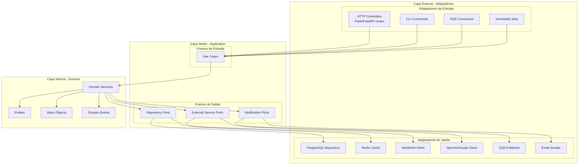
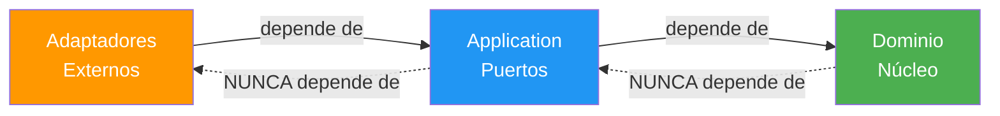
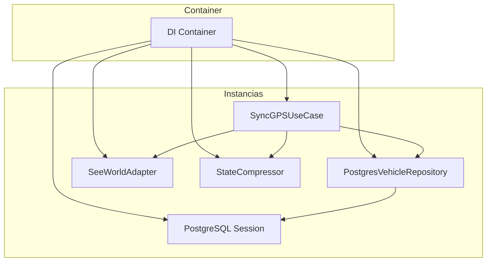

# Arquitectura Hexagonal

Guía detallada de implementación de la arquitectura hexagonal (Ports & Adapters) en los servicios del ecosistema AgentsMX.

## Diagrama de Capas



## Regla de Dependencia



**Regla fundamental**: Las dependencias siempre apuntan hacia adentro. El dominio no conoce nada del exterior.

## Capa 1: Dominio (Core)

El corazón de la aplicación. Sin dependencias externas.

### Entities

```python
# domain/entities/vehicle.py
from dataclasses import dataclass, field
from datetime import datetime
from domain.value_objects.coordinate import Coordinate

@dataclass
class Vehicle:
    id: str
    imei: str
    plate: str
    make: str
    model: str
    year: int
    current_position: Coordinate | None = None
    ignition: bool = False
    last_update: datetime | None = None

    def update_position(self, coord: Coordinate, ignition: bool) -> bool:
        """Actualiza posición. Retorna True si hubo cambio significativo."""
        if self.current_position is None:
            self.current_position = coord
            self.ignition = ignition
            self.last_update = datetime.utcnow()
            return True

        distance = self.current_position.distance_to(coord)
        ignition_changed = self.ignition != ignition

        if distance > 50 or ignition_changed:
            self.current_position = coord
            self.ignition = ignition
            self.last_update = datetime.utcnow()
            return True

        return False
```

### Value Objects

```python
# domain/value_objects/coordinate.py
from dataclasses import dataclass
import math

@dataclass(frozen=True)
class Coordinate:
    latitude: float
    longitude: float

    def __post_init__(self):
        if not (-90 <= self.latitude <= 90):
            raise ValueError(f"Latitud inválida: {self.latitude}")
        if not (-180 <= self.longitude <= 180):
            raise ValueError(f"Longitud inválida: {self.longitude}")

    def distance_to(self, other: "Coordinate") -> float:
        """Distancia en metros usando Haversine."""
        R = 6371000
        phi1, phi2 = math.radians(self.latitude), math.radians(other.latitude)
        dphi = math.radians(other.latitude - self.latitude)
        dlambda = math.radians(other.longitude - self.longitude)

        a = math.sin(dphi/2)**2 + \
            math.cos(phi1) * math.cos(phi2) * math.sin(dlambda/2)**2
        return R * 2 * math.atan2(math.sqrt(a), math.sqrt(1-a))
```

### Domain Services

```python
# domain/services/state_compressor.py
from domain.entities.vehicle import Vehicle
from domain.value_objects.coordinate import Coordinate

class StateCompressor:
    """Servicio de dominio para compresión diferencial."""

    DISTANCE_THRESHOLD = 50      # metros
    SPEED_THRESHOLD = 10         # km/h
    TIME_THRESHOLD = 300         # segundos

    def should_store(
        self,
        vehicle: Vehicle,
        new_position: Coordinate,
        new_ignition: bool
    ) -> bool:
        return vehicle.update_position(new_position, new_ignition)
```

## Capa 2: Application (Puertos)

### Puerto de Entrada (Use Case)

```python
# application/use_cases/sync_gps.py
from domain.services.state_compressor import StateCompressor
from application.ports.output.gps_provider_port import GPSProviderPort
from application.ports.output.vehicle_repository_port import VehicleRepositoryPort

class SyncGPSUseCase:
    def __init__(
        self,
        gps_provider: GPSProviderPort,
        vehicle_repo: VehicleRepositoryPort,
        compressor: StateCompressor
    ):
        self._gps = gps_provider
        self._repo = vehicle_repo
        self._compressor = compressor

    def execute(self) -> SyncResult:
        positions = self._gps.get_positions()
        stored = 0
        skipped = 0

        for pos in positions:
            vehicle = self._repo.find_by_imei(pos.imei)
            if vehicle and self._compressor.should_store(
                vehicle, pos.coordinate, pos.ignition
            ):
                self._repo.save_position(vehicle, pos)
                stored += 1
            else:
                skipped += 1

        return SyncResult(stored=stored, skipped=skipped)
```

### Puerto de Salida (Interface)

```python
# application/ports/output/vehicle_repository_port.py
from abc import ABC, abstractmethod
from domain.entities.vehicle import Vehicle

class VehicleRepositoryPort(ABC):
    @abstractmethod
    def find_by_imei(self, imei: str) -> Vehicle | None:
        ...

    @abstractmethod
    def find_active(self) -> list[Vehicle]:
        ...

    @abstractmethod
    def save_position(self, vehicle: Vehicle, position) -> None:
        ...
```

## Capa 3: Infraestructura (Adaptadores)

### Adaptador de Salida

```python
# infrastructure/adapters/postgres_vehicle_repository.py
from sqlalchemy.orm import Session
from application.ports.output.vehicle_repository_port import VehicleRepositoryPort
from domain.entities.vehicle import Vehicle

class PostgresVehicleRepository(VehicleRepositoryPort):
    def __init__(self, session: Session):
        self._session = session

    def find_by_imei(self, imei: str) -> Vehicle | None:
        row = self._session.execute(
            text("SELECT * FROM vehicles WHERE imei = :imei"),
            {"imei": imei}
        ).fetchone()
        return self._to_entity(row) if row else None

    def save_position(self, vehicle: Vehicle, position) -> None:
        self._session.execute(
            text("""INSERT INTO vehicle_status_history
                    (timestamp, vehicle_id, latitude, longitude, speed, ignition)
                    VALUES (:ts, :vid, :lat, :lng, :spd, :ign)"""),
            {
                "ts": position.timestamp,
                "vid": vehicle.id,
                "lat": position.coordinate.latitude,
                "lng": position.coordinate.longitude,
                "spd": position.speed,
                "ign": position.ignition
            }
        )
```

### Adaptador de Entrada

```python
# interfaces/http/vehicle_routes.py
from flask import Blueprint, jsonify
from application.use_cases.sync_gps import SyncGPSUseCase

vehicle_bp = Blueprint('vehicles', __name__)

@vehicle_bp.get('/api/v1/vehicles/realtime')
def get_realtime():
    use_case = get_container().realtime_use_case
    vehicles = use_case.execute()
    return jsonify([v.to_dict() for v in vehicles])
```

## Inyección de Dependencias



```python
# infrastructure/container.py
class Container:
    def __init__(self, config):
        self._session = create_session(config.database_url)
        self._vehicle_repo = PostgresVehicleRepository(self._session)
        self._gps_provider = SeeWorldAdapter(config.seeworld_url)
        self._compressor = StateCompressor()

    @property
    def sync_gps_use_case(self) -> SyncGPSUseCase:
        return SyncGPSUseCase(
            gps_provider=self._gps_provider,
            vehicle_repo=self._vehicle_repo,
            compressor=self._compressor
        )
```

## Beneficios

| Beneficio | Descripción |
|-----------|-------------|
| Testabilidad | Cada capa se testea independientemente con mocks |
| Flexibilidad | Cambiar PostgreSQL por DynamoDB solo requiere nuevo adaptador |
| Claridad | Responsabilidades claras por capa |
| Independencia | El dominio no depende de frameworks |
| Mantenibilidad | Cambios aislados, bajo acoplamiento |
