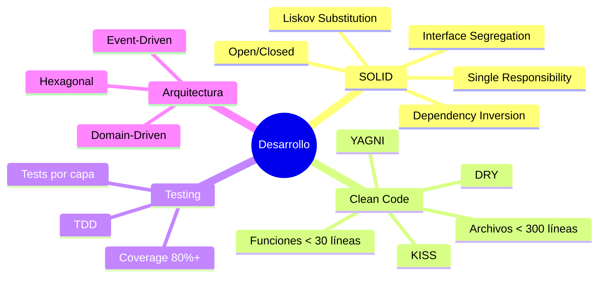
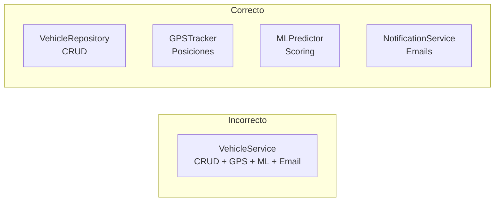

# Guía de Desarrollo

Estándares de código, convenciones y mejores prácticas para el desarrollo en el ecosistema AgentsMX.

## Principios Fundamentales



## Límites de Archivos

| Tipo de archivo | Máximo líneas | Razón |
|----------------|---------------|-------|
| Módulo Python | 300 | Mantener foco |
| Función | 30 | Legibilidad |
| Clase | 200 | Single Responsibility |
| Test file | 400 | Tests pueden ser más largos |
| Config file | 100 | Simplicidad |

## Convenciones de Nombrado

### Python

```python
# Módulos: snake_case
vehicle_repository.py

# Clases: PascalCase
class VehicleRepository:
    pass

# Funciones y métodos: snake_case
def find_active_vehicles():
    pass

# Constantes: UPPER_SNAKE_CASE
MAX_RETRY_ATTEMPTS = 3

# Variables privadas: _prefijo
_internal_cache = {}

# Variables tipo: usar type hints siempre
def get_vehicle(vehicle_id: str) -> Vehicle | None:
    pass
```

### Archivos y Directorios

```
proyecto/
├── src/
│   ├── domain/           # snake_case
│   │   ├── entities/
│   │   ├── value_objects/
│   │   └── services/
│   ├── application/
│   │   ├── ports/
│   │   └── use_cases/
│   ├── infrastructure/
│   │   ├── adapters/
│   │   └── config/
│   └── interfaces/
│       └── http/
├── tests/
│   ├── unit/
│   ├── integration/
│   └── e2e/
├── requirements.txt
└── Dockerfile
```

## Type Safety

Todo el código debe usar type hints de Python 3.11+.

```python
# Correcto
from typing import Optional

def process_vehicles(
    vehicles: list[Vehicle],
    filter_fn: Callable[[Vehicle], bool] | None = None,
    limit: int = 100
) -> list[ProcessedVehicle]:
    ...

# Incorrecto - sin types
def process_vehicles(vehicles, filter_fn=None, limit=100):
    ...
```

## Orden de Imports

```python
# 1. Standard library
import os
import json
from datetime import datetime
from typing import Optional

# 2. Third party
import flask
from sqlalchemy import Column, String
from pydantic import BaseModel

# 3. Local application
from domain.entities.vehicle import Vehicle
from application.ports.vehicle_repository import VehicleRepositoryPort
from infrastructure.config import settings
```

## SOLID en la Práctica

### Single Responsibility



### Dependency Inversion

```python
# Puerto (abstracción)
class GPSProviderPort(ABC):
    @abstractmethod
    def get_positions(self) -> list[Position]:
        ...

# Caso de uso depende de la abstracción
class SyncGPSUseCase:
    def __init__(self, gps_provider: GPSProviderPort):
        self._gps = gps_provider

    def execute(self):
        positions = self._gps.get_positions()
        # ...

# Adaptador implementa la abstracción
class SeeWorldAdapter(GPSProviderPort):
    def get_positions(self) -> list[Position]:
        # Implementación concreta
        ...
```

## DRY (Don't Repeat Yourself)

```python
# Incorrecto - lógica duplicada
class ClientService:
    def get_active_clients(self):
        return db.query("SELECT * FROM clients WHERE status = 'active'")

    def get_active_clients_count(self):
        return db.query("SELECT COUNT(*) FROM clients WHERE status = 'active'")

# Correcto - reutilizar
class ClientRepository:
    def _active_query(self):
        return self.session.query(Client).filter(Client.status == 'active')

    def find_active(self) -> list[Client]:
        return self._active_query().all()

    def count_active(self) -> int:
        return self._active_query().count()
```

## Manejo de Errores

```python
# Excepciones de dominio
class DomainError(Exception):
    """Base para errores de dominio."""
    pass

class VehicleNotFoundError(DomainError):
    def __init__(self, vehicle_id: str):
        super().__init__(f"Vehículo no encontrado: {vehicle_id}")
        self.vehicle_id = vehicle_id

class InvalidPositionError(DomainError):
    def __init__(self, lat: float, lng: float):
        super().__init__(f"Posición inválida: ({lat}, {lng})")

# Handler centralizado (FastAPI)
@app.exception_handler(DomainError)
async def domain_error_handler(request, exc: DomainError):
    return JSONResponse(
        status_code=400,
        content={"error": str(exc), "type": type(exc).__name__}
    )
```

## Logging

```python
import structlog

logger = structlog.get_logger()

# Logging estructurado
logger.info(
    "vehicle_position_updated",
    vehicle_id=vehicle_id,
    latitude=position.lat,
    longitude=position.lng,
    provider="seeworld"
)

# Niveles
# DEBUG: Detalle de desarrollo
# INFO: Operaciones normales
# WARNING: Situaciones anómalas pero manejables
# ERROR: Fallos que requieren atención
# CRITICAL: Fallos del sistema
```

## Configuración de Linting

```toml
# pyproject.toml
[tool.ruff]
target-version = "py311"
line-length = 100
select = ["E", "F", "W", "I", "N", "UP", "B", "A", "SIM"]

[tool.mypy]
python_version = "3.11"
strict = true
warn_return_any = true
warn_unused_configs = true

[tool.pytest.ini_options]
testpaths = ["tests"]
addopts = "--cov=src --cov-report=html --cov-fail-under=80"
```

## Siguiente Lectura

- [Arquitectura Hexagonal](/desarrollo/hexagonal) - Guía detallada de capas
- [Testing](/desarrollo/testing) - TDD y estrategia de testing
- [Setup Local](/desarrollo/setup) - Configuración del entorno
