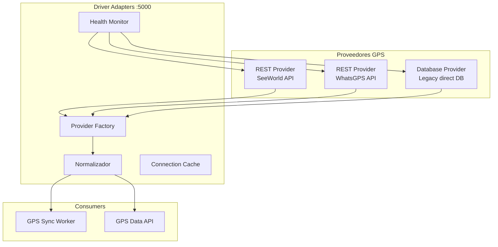
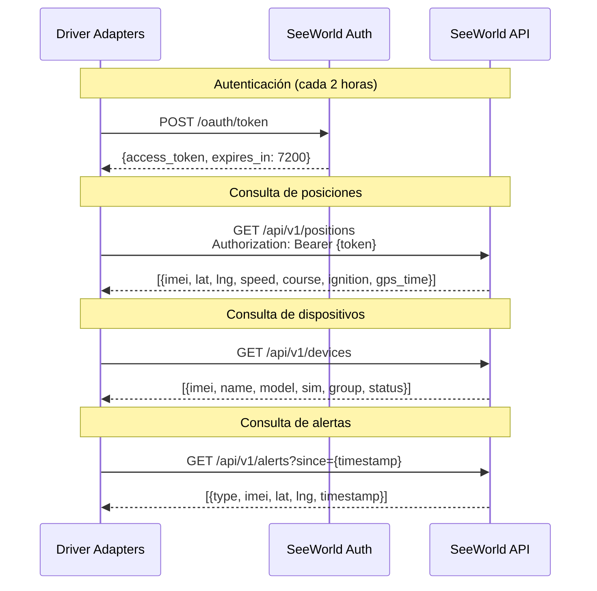
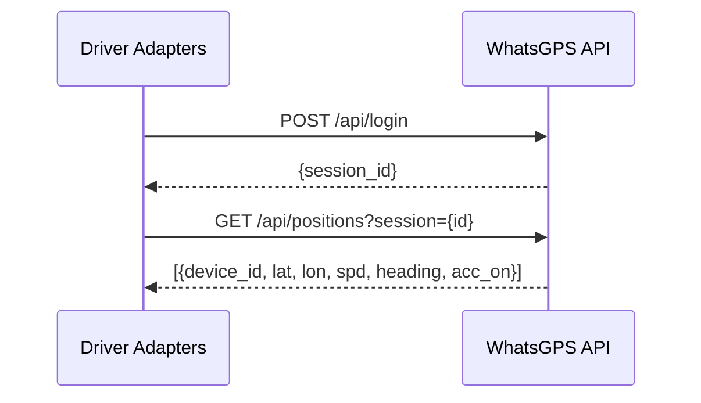
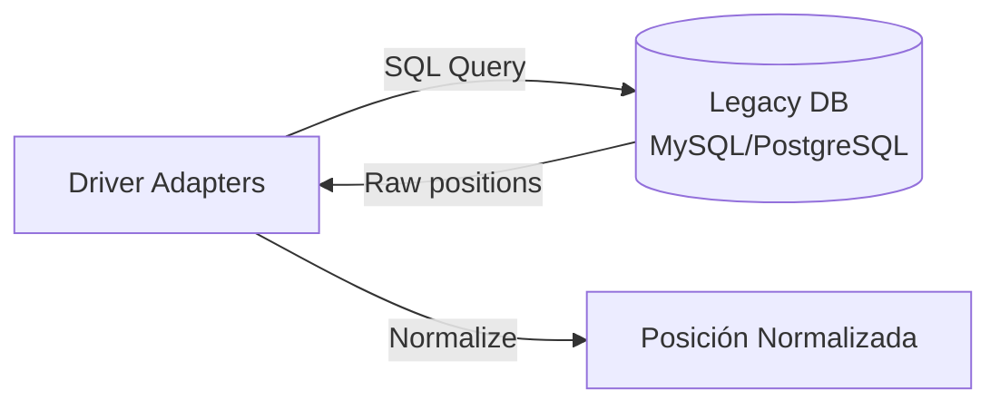
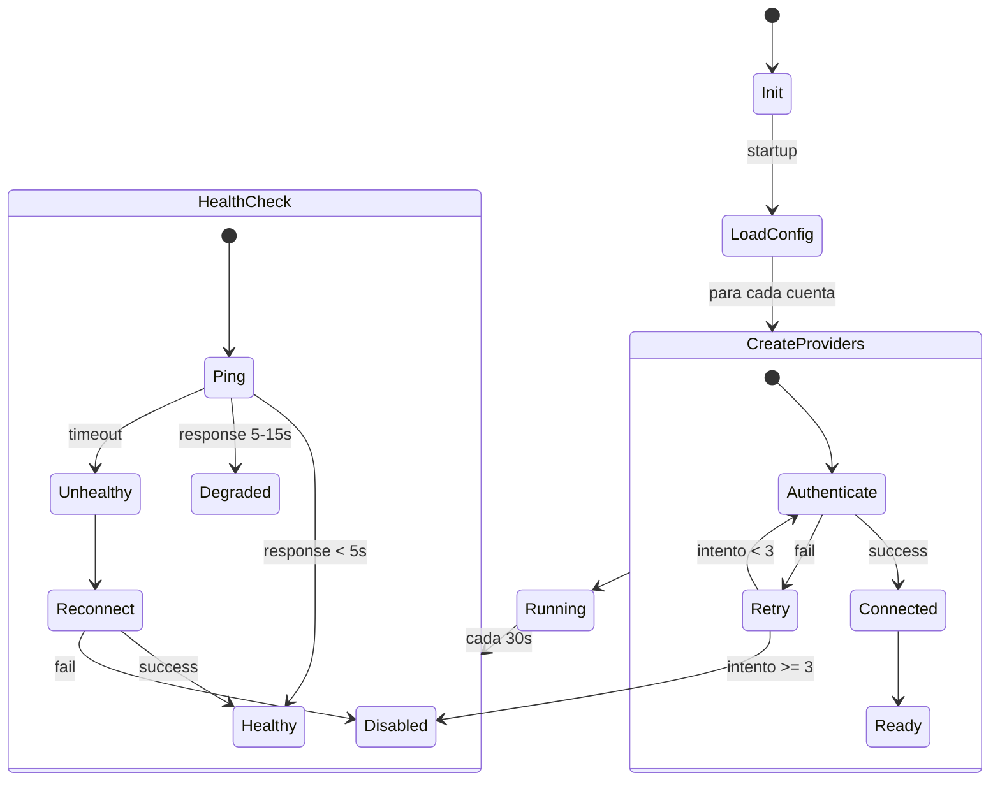
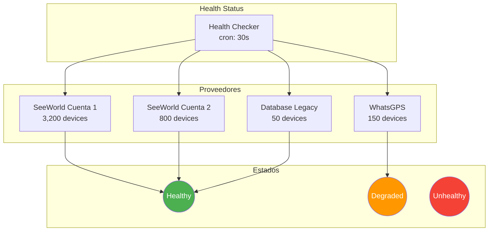

# Driver Adapters

Servicio de adaptadores multi-fuente para integración con proveedores GPS. Abstrae las diferencias entre APIs de distintos proveedores de hardware GPS.

## Tipos de Proveedor



## SeeWorld Provider (Principal)

SeeWorld es el proveedor GPS principal que cubre ~80% de los dispositivos rastreados.



### Datos de SeeWorld

| Campo | Tipo | Descripción |
|-------|------|-------------|
| `imei` | string | IMEI del dispositivo |
| `latitude` | float | Latitud WGS84 |
| `longitude` | float | Longitud WGS84 |
| `speed` | float | Velocidad km/h |
| `course` | int | Dirección 0-360 grados |
| `ignition` | bool | Estado del motor |
| `gps_time` | datetime | Timestamp del GPS |
| `battery` | float | Voltaje de batería |
| `satellites` | int | Satélites GPS conectados |
| `gsm_signal` | int | Nivel señal GSM |

## WhatsGPS Provider (Secundario)

Proveedor alternativo para dispositivos de otras marcas.



## Database Provider (Legacy)

Acceso directo a bases de datos para dispositivos sin API REST disponible.



## Flujo de Conexión



## Health Checks

Cada proveedor se monitorea independientemente con un estado de salud.



## Modelo de Datos Normalizado

Independiente del proveedor, todos los datos se normalizan al siguiente formato:

```python
@dataclass
class NormalizedPosition:
    imei: str
    latitude: float
    longitude: float
    speed: float           # km/h
    course: int            # 0-360 grados
    ignition: bool
    timestamp: datetime    # UTC
    battery_voltage: float # Volts
    satellites: int
    provider: str          # 'seeworld' | 'whatsgps' | 'database'
    account: str           # Identificador de cuenta
    raw_data: dict         # Datos sin normalizar

@dataclass
class ProviderStatus:
    provider: str
    account: str
    status: str            # 'healthy' | 'degraded' | 'unhealthy'
    latency_ms: int
    device_count: int
    last_check: datetime
    error: str | None
```

## Configuración Multi-Tenant

```python
# Ejemplo de configuración de proveedores
PROVIDERS = {
    "seeworld": {
        "type": "rest",
        "accounts": [
            {
                "name": "fleet_main",
                "base_url": "https://api.seeworld.com/v1",
                "credentials": {"user": "...", "pass": "..."},
                "device_count": 3200,
                "poll_interval": 60
            },
            {
                "name": "fleet_secondary",
                "base_url": "https://api.seeworld.com/v1",
                "credentials": {"user": "...", "pass": "..."},
                "device_count": 800,
                "poll_interval": 60
            }
        ]
    },
    "whatsgps": {
        "type": "rest",
        "accounts": [...]
    },
    "database": {
        "type": "database",
        "accounts": [...]
    }
}
```

## Métricas

| Métrica | Valor |
|---------|-------|
| Total dispositivos | ~4,200 |
| Cuentas SeeWorld | 2 |
| Cuentas WhatsGPS | 1 |
| Conexiones Legacy DB | 1 |
| Latencia promedio SeeWorld | ~120ms |
| Latencia promedio WhatsGPS | ~350ms |
| Health check interval | 30 segundos |
