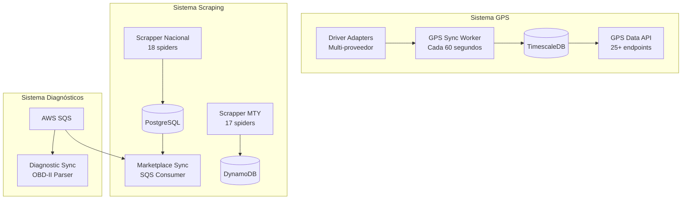
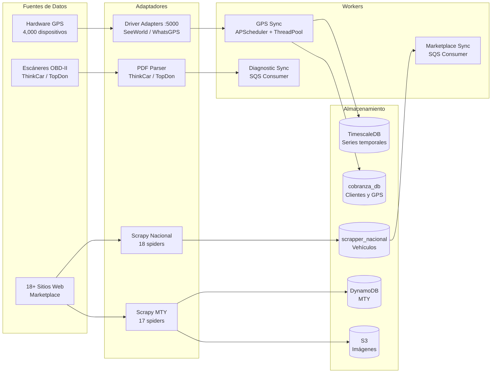

# GPS y Scrapers

Sistemas de rastreo GPS (4,000+ vehículos) y scraping de marketplace (11,000+ vehículos) del ecosistema AgentsMX.

## Panorama General

## Métricas Clave

| Sistema | Métrica | Valor |
|---------|---------|-------|
| GPS | Vehículos rastreados | 4,000+ |
| GPS | Frecuencia de sync | 60 segundos |
| GPS | Registros/día (comprimidos) | ~2M |
| GPS | Proveedores GPS | 3 (SeeWorld, WhatsGPS, DB) |
| Scraping | Vehículos en marketplace | 11,000+ |
| Scraping | Spiders nacionales | 18 |
| Scraping | Spiders MTY | 17 |
| Scraping | Fuentes de datos | 18+ sitios web |
| Diagnósticos | Sensores por escaneo | 40+ |
| Diagnósticos | Scanners soportados | ThinkCar, TopDon |

## Arquitectura de Componentes

## Tecnologías por Componente

| Componente | Tecnología | Versión | Propósito |
|-----------|-----------|---------|-----------|
| Driver Adapters | Flask | 3.0 | API multi-proveedor GPS |
| GPS Sync | APScheduler | 3.10 | Scheduling periódico |
| GPS Sync | ThreadPoolExecutor | stdlib | Paralelismo |
| Scrapy Nacional | Scrapy | 2.11 | Framework de scraping |
| Scrapy Nacional | Playwright | 1.40 | JavaScript rendering |
| Scrapy MTY | Scrapy + boto3 | 2.11 | Scraping + AWS |
| Diagnostic Sync | pdfplumber | 0.10 | Extracción de PDFs |
| Marketplace Sync | boto3 | 1.34 | SQS consumer |

## Flujo de Operación Diaria

```mermaid
gantt
    title Operación Diaria de Sistemas
    dateFormat HH:mm
    axisFormat %H:%M

    section GPS Sync
    Sincronización continua (24/7)    :active, gps, 00:00, 24h

    section Scrapers
    Scrapper Nacional - Ejecución     :scrape1, 02:00, 3h
    Scrapper MTY - Ejecución          :scrape2, 03:00, 2h

    section Workers
    Marketplace Sync                   :msync, 05:00, 2h
    Diagnostic Sync (por demanda)      :dsync, 08:00, 10h

    section Mantenimiento
    Compresión TimescaleDB             :maint, 04:00, 1h
    Backup bases de datos              :backup, 03:00, 1h
```

## Siguiente Lectura

- [Driver Adapters](/gps-scrapers/driver-adapters) - Adaptadores GPS multi-fuente
- [GPS Sync Worker](/gps-scrapers/gps-sync) - Sincronización y compresión
- [Scrapper Nacional](/gps-scrapers/scrapper-nacional) - 18 spiders nacionales
- [Scrapper MTY](/gps-scrapers/scrapper-mty) - Variante AWS
- [Diagnostic Sync](/gps-scrapers/diagnostic-sync) - Procesamiento OBD-II
- [Marketplace Sync](/gps-scrapers/marketplace-sync) - Sincronización de listings
