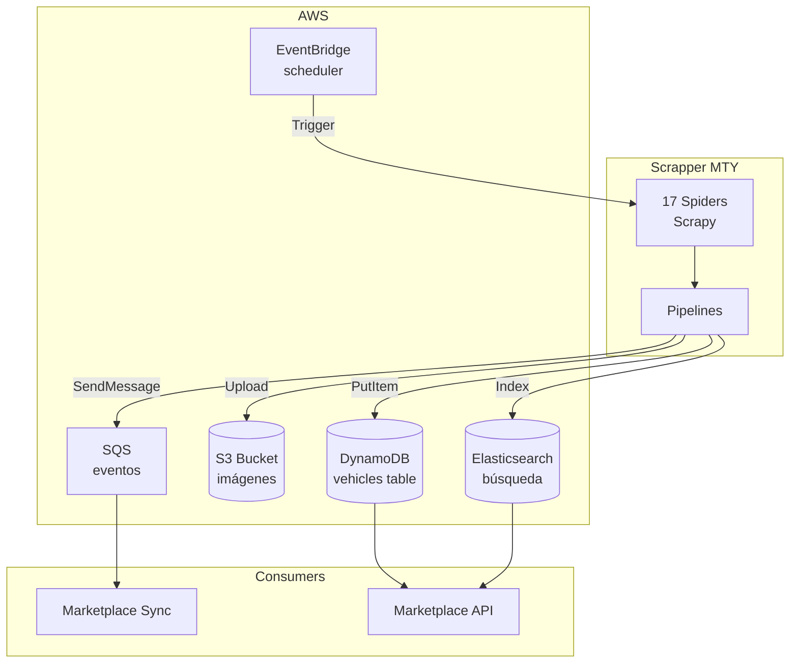
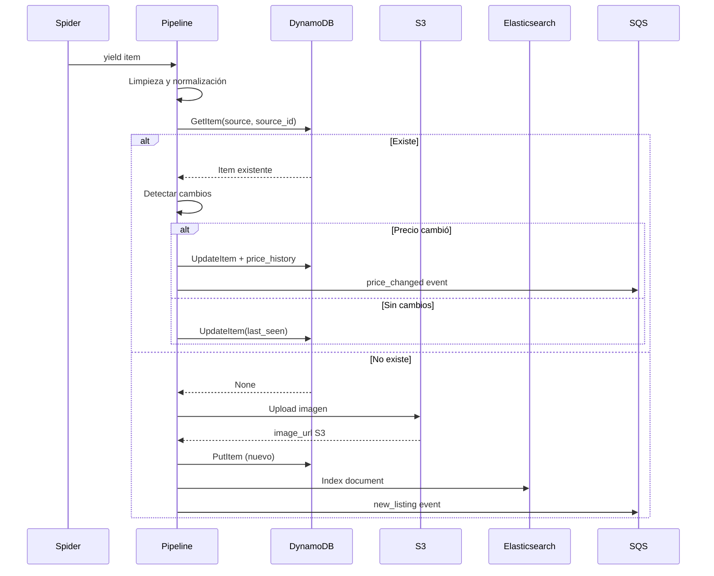
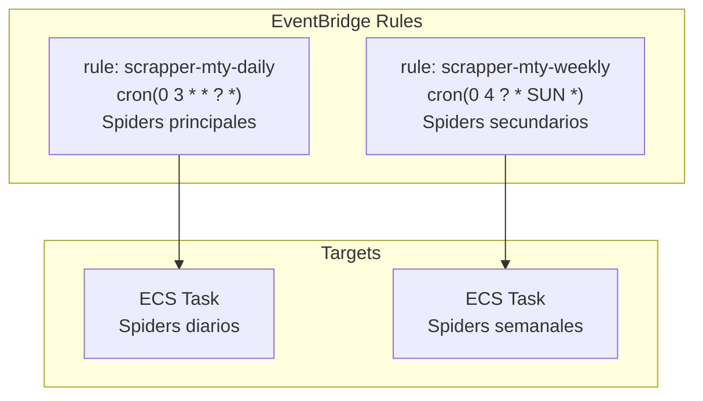

# Scrapper MTY

`proj-scrapper-mty` - Variante del scrapper con backend AWS: DynamoDB, Elasticsearch y S3. Orientado al mercado de Monterrey y Nuevo León.

## Información General

| Propiedad | Valor |
|-----------|-------|
| Repositorio | `proj-scrapper-mty` |
| Framework | Scrapy 2.11 |
| Spiders | 17 |
| Backend | AWS (DynamoDB, S3, Elasticsearch) |
| Región | us-east-1 |
| Mercado | Monterrey / Nuevo León |

## Arquitectura AWS



## Diferencias con Scrapper Nacional

| Aspecto | Nacional | MTY |
|---------|----------|-----|
| Base de datos | PostgreSQL local | DynamoDB cloud |
| Imágenes | URL referencia | S3 (copia local) |
| Búsqueda | SQL LIKE/ILIKE | Elasticsearch |
| Scheduling | Cron local | EventBridge |
| Eventos | SQS directo | SQS + EventBridge |
| Región geográfica | Nacional | NL / Monterrey |
| Spiders | 18 | 17 |

## Los 17 Spiders MTY

| # | Spider | Tipo | Vehículos | Especialidad |
|---|--------|------|-----------|-------------|
| 1 | kavak_mty | API JSON | ~800 | Kavak filtrado NL |
| 2 | seminuevos_mty | HTML | ~500 | Seminuevos NL |
| 3 | autocosmos_mty | HTML | ~400 | Autocosmos NL |
| 4 | soloautos_mty | HTML | ~300 | SoloAutos NL |
| 5 | vivanuncios_mty | HTML | ~250 | Vivanuncios NL |
| 6 | autosur | HTML | ~200 | Agencia local |
| 7 | agencias_nl | HTML | ~180 | Agencias agrupadas |
| 8 | superautos_mty | HTML | ~150 | Super Autos MTY |
| 9 | mundocar | HTML | ~120 | MundoCar |
| 10 | autofinanciera | HTML | ~100 | AutoFinanciera |
| 11 | motorzone | Playwright | ~100 | MotorZone |
| 12 | carhouse_mty | Playwright | ~80 | CarHouse MTY |
| 13 | premiummotors | Playwright | ~70 | Premium Motors |
| 14 | nlautos | Playwright | ~60 | NL Autos |
| 15 | totalcar | HTML | ~50 | TotalCar |
| 16 | megaautos | HTML | ~40 | MegaAutos |
| 17 | autos_elite | Playwright | ~30 | Autos Elite |

## Pipeline DynamoDB



## Esquema DynamoDB

```python
# Tabla: vehicles_mty
{
    "TableName": "vehicles_mty",
    "KeySchema": [
        {"AttributeName": "source", "KeyType": "HASH"},
        {"AttributeName": "source_id", "KeyType": "RANGE"}
    ],
    "AttributeDefinitions": [
        {"AttributeName": "source", "AttributeType": "S"},
        {"AttributeName": "source_id", "AttributeType": "S"},
        {"AttributeName": "make_model", "AttributeType": "S"},
        {"AttributeName": "price", "AttributeType": "N"}
    ],
    "GlobalSecondaryIndexes": [
        {
            "IndexName": "make_model-price-index",
            "KeySchema": [
                {"AttributeName": "make_model", "KeyType": "HASH"},
                {"AttributeName": "price", "KeyType": "RANGE"}
            ]
        }
    ],
    "BillingMode": "PAY_PER_REQUEST"
}
```

## Almacenamiento S3

```mermaid
graph LR
    subgraph S3 Bucket: agentsmx-scrapper-mty
        F1[/images/kavak/{source_id}.jpg]
        F2[/images/seminuevos/{source_id}.jpg]
        F3[/exports/daily/{date}.json]
        F4[/logs/{spider}/{date}.log]
    end

    SP[Spider] -->|Upload imágenes| F1
    SP -->|Upload imágenes| F2
    EXPORT[Export Job] -->|Dump diario| F3
    CW[CloudWatch] -->|Logs| F4
```

## Elasticsearch Mapping

```json
{
  "mappings": {
    "properties": {
      "make": { "type": "keyword" },
      "model": { "type": "keyword" },
      "version": { "type": "text", "analyzer": "spanish" },
      "year": { "type": "integer" },
      "price": { "type": "float" },
      "mileage": { "type": "integer" },
      "description": { "type": "text", "analyzer": "spanish" },
      "location": { "type": "geo_point" },
      "source": { "type": "keyword" },
      "last_seen": { "type": "date" }
    }
  }
}
```

## EventBridge Schedule



## Variables de Entorno

```bash
AWS_REGION=us-east-1
DYNAMODB_TABLE=vehicles_mty
S3_BUCKET=agentsmx-scrapper-mty
ELASTICSEARCH_URL=https://search-agentsmx.us-east-1.es.amazonaws.com
SQS_QUEUE_URL=https://sqs.us-east-1.amazonaws.com/xxx/marketplace-events
CONCURRENT_REQUESTS=8
DOWNLOAD_DELAY=1.5
```

## Costos AWS Estimados

| Servicio | Uso | Costo/mes |
|----------|-----|-----------|
| DynamoDB | ~3,500 items, PAY_PER_REQUEST | ~$2 |
| S3 | ~5 GB imágenes | ~$0.12 |
| Elasticsearch | t3.small.elasticsearch | ~$25 |
| SQS | ~10,000 mensajes/mes | ~$0.01 |
| EventBridge | 30 reglas/mes | ~$0.30 |
| **Total** | | **~$27/mes** |
