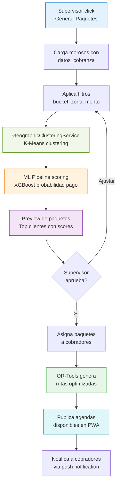
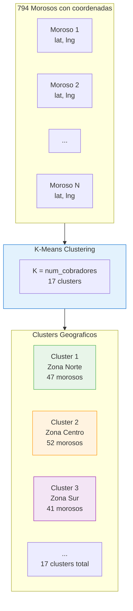
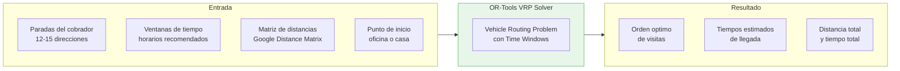

# Generacion de Agendas

La generacion de agendas es el **proceso central** del sistema de cobranza. Combina machine learning, clustering geografico y optimizacion de rutas para crear paquetes de trabajo diarios para cada cobrador.

## Proceso Completo

## Paso 1 — Generar Paquetes

El supervisor accede al dashboard y hace click en el boton **"Generar Paquetes"**. Esto inicia el pipeline completo.

### Parametros de entrada

| Parametro | Descripcion | Valor por defecto |
|-----------|------------|-------------------|
| Fecha de agenda | Dia para el que se generan las agendas | Siguiente dia habil |
| Buckets incluidos | Que buckets incluir (B1-B10) | Todos |
| Cobradores disponibles | Cobradores activos para asignacion | Todos activos |
| Max visitas por cobrador | Limite de paradas por ruta | 15 |
| Zona geografica | Area a cubrir | Todas |

## Paso 2 — Carga de Morosos

El sistema carga los morosos activos desde la base de datos con su informacion de cobranza:

- **Datos personales**: Nombre, telefono, direccion
- **Datos financieros**: Monto adeudado, dias de atraso, bucket
- **Datos geograficos**: Latitud, longitud (geocodificados)
- **Historial**: Visitas previas, promesas, pagos parciales
- **datos_cobranza**: Campo JSON con metadata adicional del moroso

## Paso 3 — Clustering Geografico

El `GeographicClusteringService` agrupa morosos cercanos geograficamente usando **K-Means**:

El numero de clusters `K` se calcula en base al numero de cobradores disponibles. Cada cluster corresponde a una zona geografica coherente.

## Paso 4 — ML Scoring

El **ML Pipeline v5.1** ejecuta en background para asignar un score de prioridad a cada moroso:

```mermaid
graph LR
    subgraph Features["Features del Modelo"]
        F1["Dias de atraso"]
        F2["Monto adeudado"]
        F3["Historial de pagos"]
        F4["Num visitas previas"]
        F5["Promesas cumplidas %"]
        F6["Hora ideal de visita"]
    end

    subgraph Model["XGBoost"]
        XG["Modelo entrenado<br/>probabilidad de pago"]
    end

    subgraph Score["Output"]
        S1["Score 0.0 - 1.0<br/>probabilidad de cobro"]
        S2["Prioridad Alta/Media/Baja"]
        S3["Ventana horaria recomendada"]
    end

    Features --> Model --> Score

    style Model fill:#fff3e0,stroke:#f57c00
```

El score determina el **orden de prioridad** dentro de cada cluster. Clientes con mayor probabilidad de pago se visitan primero para maximizar la recuperacion.

## Paso 5 — Preview de Paquetes

Antes de confirmar, el supervisor ve un preview con:

- **Lista de clusters** con cantidad de morosos y monto total por cluster
- **Top clientes** por score dentro de cada cluster
- **Mapa visual** mostrando la distribucion geografica
- **Estimacion de tiempo** por ruta

### Tabla de Preview

| Cluster | Morosos | Monto Total | Score Promedio | Cobrador Sugerido |
|---------|---------|-------------|----------------|-------------------|
| Zona Norte | 12 | $485,000 | 0.72 | Juan Perez |
| Zona Centro | 15 | $612,000 | 0.68 | Maria Lopez |
| Zona Sur | 10 | $328,000 | 0.81 | Carlos Ruiz |

El supervisor puede **ajustar**: mover morosos entre clusters, cambiar asignaciones, excluir cuentas.

## Paso 6 — Asignacion a Cobradores

El supervisor confirma la asignacion de cada paquete (cluster) a un cobrador especifico. Factores considerados:

- **Zona habitual** del cobrador (familiaridad con el area)
- **Carga de trabajo** equitativa entre cobradores
- **Especializacion** (algunos cobradores manejan mejor montos altos)
- **Disponibilidad** del cobrador en la fecha

## Paso 7 — Optimizacion de Rutas con OR-Tools

Una vez asignados los paquetes, **OR-Tools** genera la ruta optima para cada cobrador:

### Restricciones del Optimizador

| Restriccion | Descripcion |
|-------------|------------|
| Ventanas de tiempo | Cada moroso tiene horarios preferidos de visita |
| Distancia maxima | Limite de km totales por ruta |
| Tiempo maximo | Jornada laboral de 8 horas |
| Punto inicio/fin | Ruta inicia y termina en punto base |
| Tiempo por visita | 15-30 minutos estimados por parada |

## Resultado Final

Al completar el proceso, cada cobrador recibe en su PWA:

1. **Lista ordenada de visitas** con direccion y horario sugerido
2. **Navegacion paso a paso** integrada con Google Maps
3. **Informacion del cliente** en cada parada (monto, historial, score)
4. **Formulario de registro** para capturar resultado de la visita

::: tip Frecuencia
Las agendas se generan tipicamente un dia antes. El supervisor puede regenerar o ajustar en cualquier momento.
:::

::: warning ML en Background
El scoring del ML Pipeline se ejecuta como proceso en background. En caso de alta carga, el preview puede tardar 30-60 segundos en mostrar los scores actualizados.
:::
