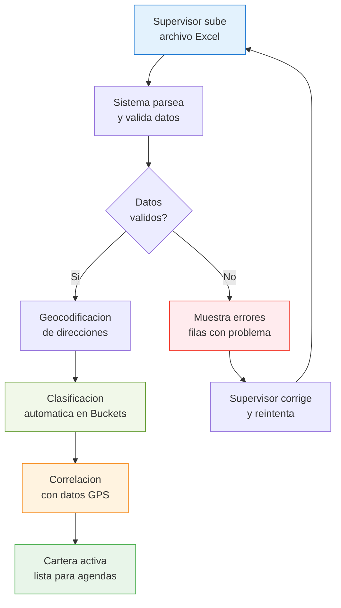
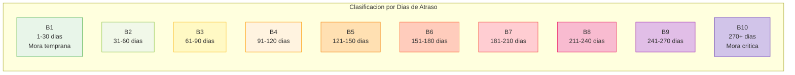
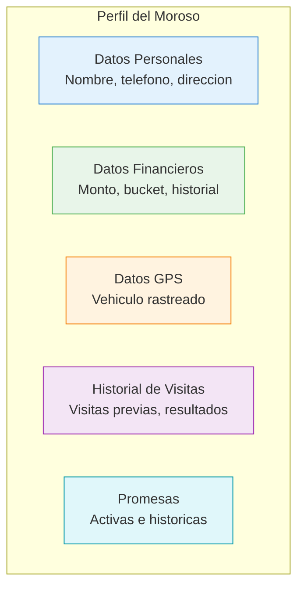
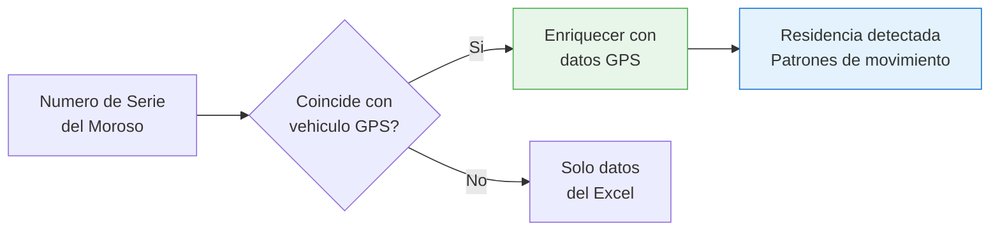

# Cartera Morosa

El modulo de cartera morosa permite gestionar las **794 cuentas morosas** activas: carga desde Excel, clasificacion automatica en buckets, detalle de clientes y correlacion con datos GPS.

## Flujo de Gestion de Cartera

## Carga de Excel

El supervisor sube un archivo Excel (.xlsx) con la cartera actualizada. El sistema espera las siguientes columnas:

### Columnas Requeridas

| Columna | Tipo | Descripcion |
|---------|------|------------|
| numero_cuenta | String | Identificador unico de la cuenta |
| nombre_cliente | String | Nombre completo del moroso |
| telefono | String | Numero de telefono principal |
| direccion | String | Direccion completa |
| colonia | String | Colonia |
| municipio | String | Municipio o delegacion |
| estado | String | Estado de la republica |
| codigo_postal | String | Codigo postal |
| monto_adeudado | Number | Saldo vencido en MXN |
| dias_atraso | Number | Dias desde el ultimo pago |
| fecha_ultimo_pago | Date | Fecha del ultimo pago registrado |
| numero_serie | String | Numero de serie del vehiculo (VIN) |

### Columnas Opcionales

| Columna | Tipo | Descripcion |
|---------|------|------------|
| telefono_2 | String | Telefono alternativo |
| email | String | Correo electronico |
| referencia_domicilio | String | Referencias para llegar |
| monto_mensualidad | Number | Monto de la mensualidad |
| notas | String | Observaciones adicionales |

### Validaciones

El sistema verifica automaticamente:

- Columnas requeridas presentes
- Formatos de datos correctos
- Numeros de cuenta sin duplicados
- Montos positivos
- Direcciones con datos minimos para geocodificacion

## Clasificacion por Buckets

Los morosos se clasifican automaticamente segun los **dias de atraso**:

### Detalle de Buckets

| Bucket | Dias | Prioridad | Estrategia |
|--------|------|-----------|-----------|
| B1 | 1-30 | Baja | Recordatorio amigable |
| B2 | 31-60 | Baja-Media | Contacto telefonico + visita |
| B3 | 61-90 | Media | Visita presencial prioritaria |
| B4 | 91-120 | Media-Alta | Visita con negociacion |
| B5 | 121-150 | Alta | Cobro firme + plan de pagos |
| B6 | 151-180 | Alta | Escalamiento a legal |
| B7 | 181-210 | Muy Alta | Proceso pre-juridico |
| B8 | 211-240 | Muy Alta | Aviso legal formal |
| B9 | 241-270 | Critica | Proceso juridico |
| B10 | 270+ | Critica | Recuperacion de vehiculo |

## Detalle de Cliente

Al seleccionar un moroso de la tabla se muestra su perfil completo:

### Informacion Disponible

## Correlacion GPS

Cuando el numero de serie (VIN) del vehiculo coincide con un vehiculo rastreado por GPS, el sistema enriquece los datos:

| Dato GPS | Descripcion |
|----------|------------|
| Ultima posicion | Donde se ubica el vehiculo ahora |
| Residencia detectada | Direccion donde pernocta regularmente |
| Patron de movimiento | Horarios y rutas habituales |
| Coincidencia de domicilio | Si la residencia GPS coincide con la direccion registrada |
| Estado del GPS | Online / Offline / Sin dispositivo |

::: tip Direccion Real vs Registrada
La correlacion GPS permite detectar cuando el moroso ya no vive en la direccion registrada. Si el vehiculo pernocta consistentemente en otra ubicacion, el sistema sugiere actualizar la direccion de visita.
:::

## Acciones sobre la Cartera

| Accion | Descripcion |
|--------|------------|
| Actualizar cartera | Subir nuevo Excel para reemplazar o agregar cuentas |
| Exportar cartera | Descargar la cartera actual con todos los datos enriquecidos |
| Asignar cobrador | Asignar manualmente un moroso a un cobrador |
| Cambiar bucket | Reclasificar manualmente una cuenta |
| Agregar nota | Escribir observaciones sobre una cuenta |
| Desactivar cuenta | Marcar como pagada, reestructurada o incobrable |
