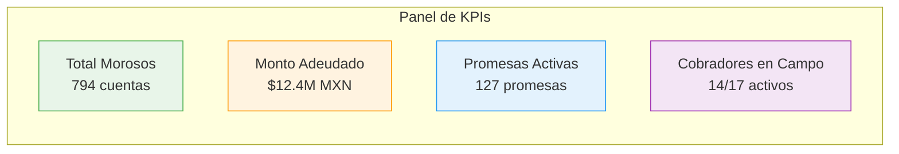
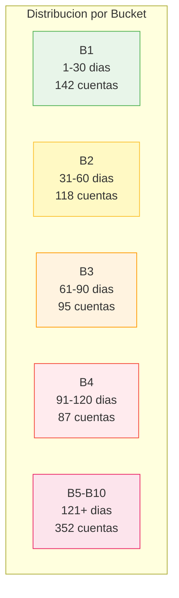
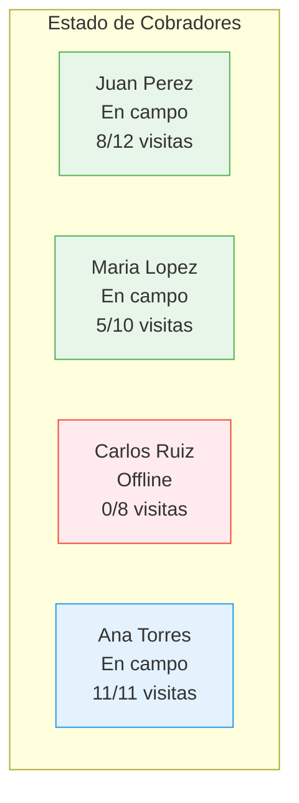
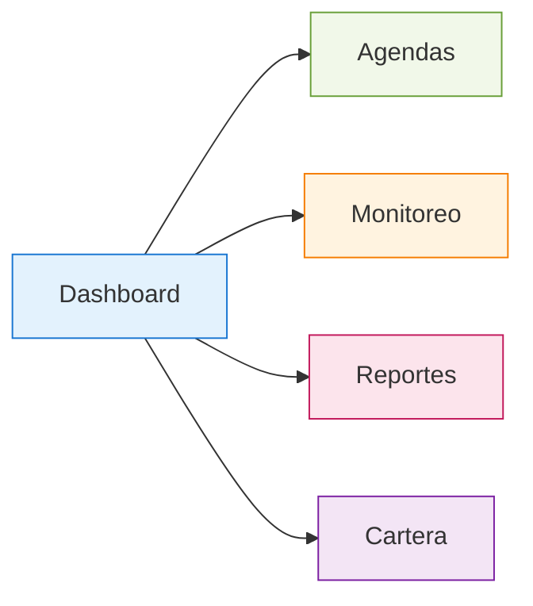

# Dashboard Supervisor

El Dashboard Supervisor es el panel central desde donde se gestiona toda la operacion de cobranza. Presenta KPIs en tiempo real, estado de la cartera y actividad de los cobradores.

## KPIs Principales

El encabezado del dashboard muestra cuatro indicadores clave actualizados en tiempo real:

| KPI | Descripcion | Actualizacion |
|-----|------------|---------------|
| **Total Morosos** | Numero total de cuentas en cartera morosa activa | Al cargar cartera |
| **Monto Total Adeudado** | Suma de saldos vencidos de todas las cuentas | Al cargar cartera |
| **Promesas Activas** | Promesas de pago registradas pendientes de cumplimiento | Tiempo real |
| **Cobradores en Campo** | Cobradores con sesion activa y GPS reportando | Tiempo real |

## Cartera Morosa — Vista General

La seccion principal muestra un resumen visual de la cartera distribuida por buckets:

### Filtros Disponibles

- **Bucket**: Seleccion individual o multiple (B1 a B10)
- **Cobrador asignado**: Filtrar por cobrador especifico
- **Rango de monto**: Filtrar por monto adeudado minimo/maximo
- **Zona geografica**: Filtrar por area o cluster
- **Estado de promesa**: Con promesa activa / Sin promesa / Promesa vencida

## Vista de Cobradores

Panel lateral o seccion dedicada que muestra el estado de cada cobrador:

Cada tarjeta de cobrador muestra:

| Campo | Descripcion |
|-------|------------|
| Nombre | Nombre del cobrador |
| Estado | En campo (GPS activo) / Offline / Sin agenda |
| Progreso | Visitas completadas vs asignadas |
| Ultima posicion | Hora de ultimo reporte GPS |
| Cobro del dia | Monto total cobrado hoy |

## Mapa de Rutas

Vista de mapa interactivo (Leaflet/Google Maps) que muestra:

- **Puntos azules**: Ubicacion de morosos asignados
- **Puntos verdes**: Visitas completadas
- **Puntos rojos**: Visitas pendientes
- **Linea de ruta**: Ruta optimizada generada por OR-Tools
- **Marcador cobrador**: Posicion GPS en tiempo real del cobrador

### Interacciones del Mapa

1. **Click en punto moroso** — Muestra detalle: nombre, monto, dias de atraso, historial
2. **Click en cobrador** — Muestra progreso, siguiente parada, tiempo estimado
3. **Toggle de capas** — Mostrar/ocultar rutas, clusters, zonas

## Navegacion del Dashboard

## Acciones Rapidas

Desde el dashboard el supervisor puede:

- **Generar Paquetes** — Iniciar el proceso de generacion de agendas con ML
- **Ver Monitoreo** — Ir a la vista de tracking en tiempo real
- **Exportar Reporte** — Descargar resumen del dia en CSV/Excel
- **Asignar Cobrador** — Reasignar cuentas entre cobradores
- **Cargar Cartera** — Subir nuevo archivo Excel de morosos
