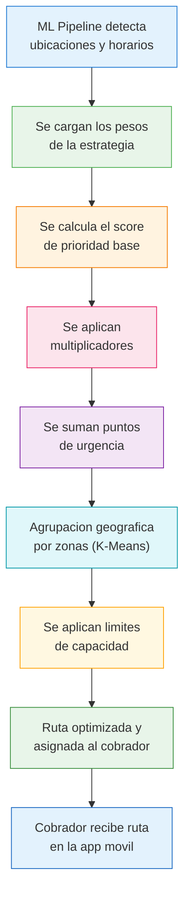
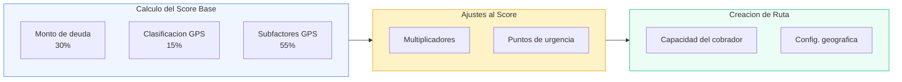
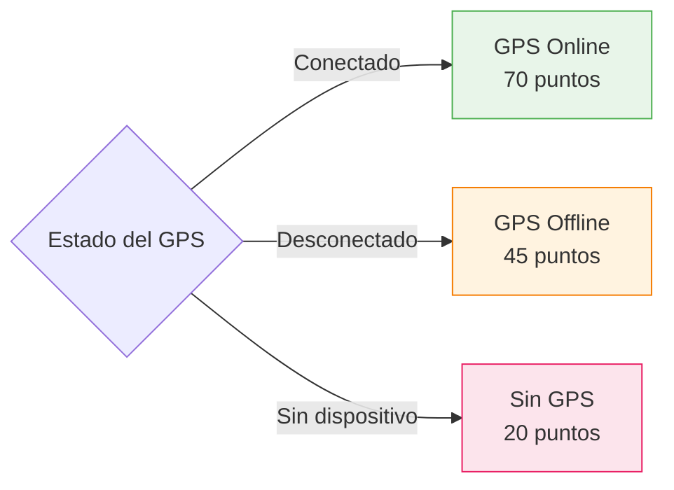
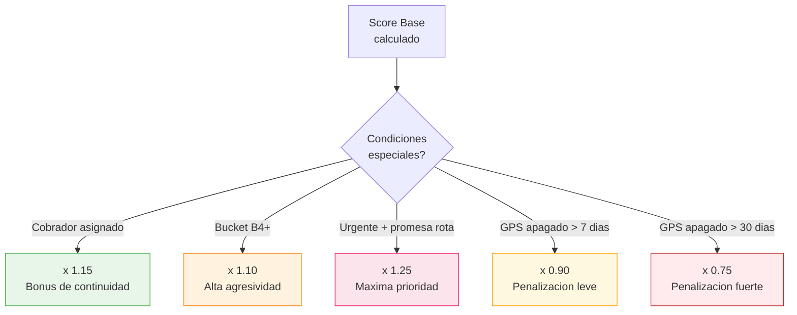
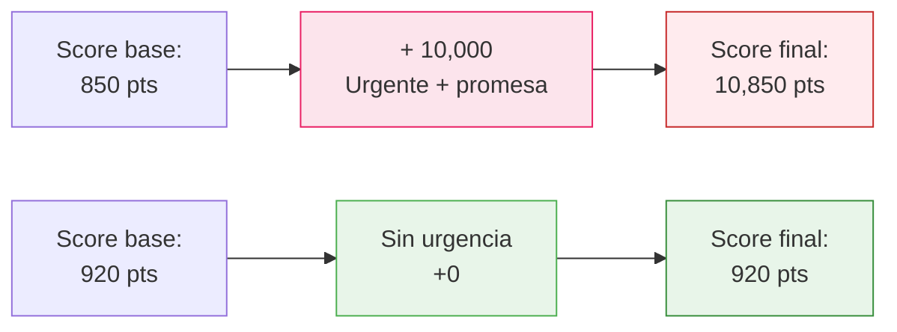
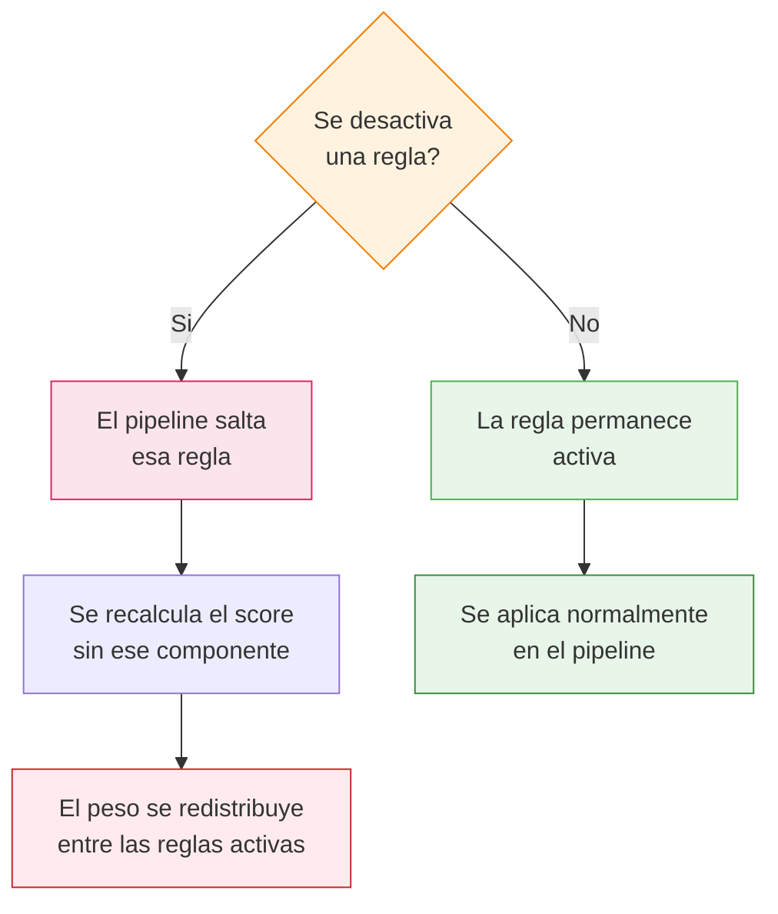

# Estrategia y Reglas de Asignacion

Esta guia explica **como el sistema decide a que clientes visitar cada dia**, en que orden y con que cobrador. El proceso se llama **Pipeline de Asignacion de Ruta Diaria** y utiliza 8 categorias de reglas que trabajan en secuencia.

::: tip Para quien es esta guia
Supervisores, gerentes y directivos que necesitan entender y configurar las reglas de cobranza. No se requieren conocimientos tecnicos.
:::

## Vision General del Pipeline

El siguiente diagrama muestra el flujo completo desde que el sistema recibe los datos hasta que el cobrador recibe su ruta optimizada en el celular:

---

## Las 8 Categorias de Reglas

### 1. Priorizacion por Monto de Deuda

::: info Peso en el score: 30%
:::

El sistema clasifica a cada cliente segun el monto total que debe y le asigna una prioridad. A mayor deuda, mayor prioridad en la ruta.

| Rango de deuda | Nivel de prioridad |
|---|---|
| Menos de $5,000 | Baja |
| $5,000 — $10,000 | Media-baja |
| $10,000 — $20,000 | Media |
| $20,000 — $40,000 | Media-alta |
| $40,000 — $100,000 | Alta |
| Mas de $100,000 | Muy alta |

**Impacto:** Determina cuales clientes se visitan primero en el dia.

| Ventajas | Desventajas |
|---|---|
| Maximiza la recuperacion economica por cada ruta generada | Las cuentas con montos pequenos pueden acumular dias de atraso sin ser visitadas |
| Enfoca el esfuerzo del cobrador en las cuentas de mayor valor | Puede generar concentracion excesiva en pocos clientes grandes |

---

### 2. Clasificacion GPS

::: info Peso en el score: 15%
:::

El sistema evalua el estado del dispositivo GPS instalado en el vehiculo del cliente para determinar que tan confiable es la informacion de ubicacion.

**Impacto:** Los clientes con GPS activo reciben prioridad porque el sistema puede ubicarlos con mayor precision.

| Ventajas | Desventajas |
|---|---|
| Mejor precision en la ubicacion de los clientes | Penaliza a clientes cuyo GPS se descompuso sin que ellos lo causaran |
| Reduce visitas fallidas por no encontrar al cliente | Clientes sin GPS tienden a quedar al final de la ruta |

---

### 3. Subfactores GPS Online

::: info Peso en el score: 55% (cuando el GPS esta activo)
:::

Cuando el GPS del vehiculo esta conectado, el sistema utiliza **6 factores en tiempo real** para optimizar el momento exacto de la visita:

| Factor | Peso | Que hace |
|---|---|---|
| Ventana de tiempo | 20% | Identifica las horas en que el cliente suele estar en casa |
| Posicion del vehiculo | 20% | Verifica donde esta el vehiculo en este momento |
| Afinidad con cobrador | 5% | Prefiere asignar al cobrador que ya conoce al cliente |
| Prediccion futura | 15% | Predice donde estara el vehiculo en las proximas horas |
| Confianza en domicilio | 10% | Que tan seguro esta el sistema de la ubicacion del hogar |
| Confianza en trabajo | 5% | Que tan seguro esta el sistema de la ubicacion del trabajo |

**Impacto:** Maximiza la probabilidad de encontrar al cliente en su domicilio.

| Ventajas | Desventajas |
|---|---|
| Mejora la tasa de contacto entre un 15% y 20% | Depende de la calidad de la senal GPS |
| Optimiza el horario de visita para cada cliente | Si el GPS reporta datos erroneos, las decisiones se afectan |

---

### 4. Subfactores GPS Offline

::: info Peso en el score: 55% (cuando el GPS esta inactivo)
:::

Cuando el GPS esta desconectado, el sistema **no se rinde**. Utiliza **5 factores basados en datos historicos** y modelos de machine learning para tomar decisiones inteligentes:

| Factor | Peso | Que hace |
|---|---|---|
| Ventana de tiempo | 25% | Usa patrones historicos de cuando el cliente suele estar en casa |
| Afinidad con cobrador | 10% | Prefiere al cobrador que tiene mejor relacion con el cliente |
| Prediccion futura | 20% | Predice comportamiento basado en meses de datos acumulados |
| Confianza en domicilio | 15% | Nivel de certeza del domicilio basado en historial |
| Confianza en trabajo | 10% | Nivel de certeza del lugar de trabajo basado en historial |

**Impacto:** El sistema sigue tomando decisiones inteligentes aunque no tenga datos en tiempo real.

| Ventajas | Desventajas |
|---|---|
| Aprovecha meses de datos historicos para compensar la falta de GPS | Menos preciso que cuando se tiene informacion en tiempo real |
| El cobrador no pierde visitas por fallas de GPS | Los patrones historicos pueden no reflejar cambios recientes del cliente |

---

### 5. Multiplicadores de Score

::: info Se aplican despues del calculo base
:::

Los multiplicadores ajustan el score final hacia arriba o hacia abajo segun condiciones especiales. Funcionan como un **bonus o penalizacion**:

| Multiplicador | Valor | Que significa |
|---|---|---|
| Cobrador asignado previamente | x 1.15 | El cliente se asigna de preferencia al mismo cobrador para mantener continuidad |
| Bucket B4 o superior | x 1.10 | Cuentas con mas dias de atraso reciben un impulso extra |
| Urgente + promesa incumplida | x 1.25 | El cliente prometio pagar y no cumplio, ademas tiene marca urgente |
| GPS apagado mas de 7 dias | x 0.90 | Penalizacion leve: baja un 10% el score |
| GPS apagado mas de 30 dias | x 0.75 | Penalizacion fuerte: baja un 25% el score |

**Impacto:** Ajusta el score final para manejar situaciones especiales sin modificar la configuracion base.

| Ventajas | Desventajas |
|---|---|
| Permite manejar casos especiales de forma flexible | Si los valores son muy agresivos, pueden distorsionar todo el scoring |
| No requiere cambiar la configuracion principal | Multiples multiplicadores acumulados pueden generar scores impredecibles |

---

### 6. Reglas de Urgencia

::: warning Estas reglas tienen la maxima prioridad
:::

Las reglas de urgencia suman puntos directamente al puntaje de prioridad. Sus valores son tan altos que **garantizan** que los casos criticos se visiten primero.

| Regla | Puntos extra | Descripcion |
|---|---|---|
| Urgente + promesa vencida | +10,000 | El cliente tiene marca urgente Y su promesa de pago ya vencio |
| Promesa de pago vencida | +5,000 | El cliente prometio pagar en una fecha que ya paso |
| Marca urgente | +3,000 | El supervisor marco al cliente como urgente |
| GPS conectado | +500 | Bonus por tener GPS activo en este momento |
| Reintento de visita fallida | +200 | El cobrador intento visitar y no encontro al cliente |

**Impacto:** Garantiza que las cuentas criticas sean visitadas sin importar su score base.

| Ventajas | Desventajas |
|---|---|
| Nunca se pierden situaciones criticas | Los valores tan altos pueden monopolizar la ruta si hay muchos casos urgentes |
| El supervisor tiene control directo marcando como urgente | Si se abusa de la marca urgente, pierde su efectividad |

---

### 7. Capacidad del Cobrador

::: info Limites operativos por cobrador
:::

Esta regla define cuantos clientes puede visitar un cobrador en un dia, basandose en tiempos reales de operacion:

| Parametro | Valor | Significado |
|---|---|---|
| Minutos de trabajo | 600 min (10 horas) | Jornada laboral total del cobrador |
| Duracion de visita | 25 minutos | Tiempo promedio que toma cada visita |
| Tiempo de traslado | 12 minutos | Tiempo promedio entre un cliente y otro |
| Minimo de paradas | 8 | El cobrador debe visitar al menos 8 clientes |
| Maximo de paradas | 20 | El cobrador no puede tener mas de 20 clientes en un dia |

**Calculo simplificado:**
> Con 25 min por visita + 12 min de traslado = 37 min por cliente.
> En 600 minutos de jornada: 600 / 37 = **~16 visitas posibles por dia**.

**Impacto:** Determina cuantos clientes entran en la ruta de cada cobrador.

| Ventajas | Desventajas |
|---|---|
| Evita sobrecargar al cobrador con demasiados clientes | Si los valores no reflejan la realidad, se generan rutas con visitas apresuradas |
| Asegura que cada visita tenga el tiempo suficiente | Un maximo muy bajo puede dejar clientes sin visitar |

---

### 8. Configuracion Geografica

::: info Parametros de distancia y limites
:::

Estos parametros controlan como el sistema calcula distancias y normaliza los scores segun la geografia de la ciudad:

| Parametro | Valor | Significado |
|---|---|---|
| Radio del domicilio | 300 metros | El cliente se considera "en casa" si el GPS esta dentro de este radio |
| Tope de monto | $100,000 | Monto maximo considerado para la normalizacion del score |
| Tope de dias de atraso | 180 dias | Dias maximo considerados para la normalizacion |
| Velocidad promedio en ciudad | 30 km/h | Se usa para calcular los tiempos de traslado entre clientes |

**Impacto:** Controla la precision de los calculos de distancia y la normalizacion de scores.

| Ventajas | Desventajas |
|---|---|
| Se adapta a la geografia local de cada ciudad | Si los valores son incorrectos, las rutas seran ineficientes |
| Permite ajustar para ciudades con diferente trafico | Un radio muy grande marca al cliente como "en casa" cuando no lo esta |

---

## Que pasa cuando activo o desactivo una regla

Cada regla del pipeline funciona como un **interruptor**. Al activarla o desactivarla, el comportamiento del sistema cambia de manera predecible:

| Accion | Resultado |
|---|---|
| Desactivar **Priorizacion por Monto** | Todos los clientes tienen igual prioridad sin importar cuanto deben. Se pierde la optimizacion economica |
| Desactivar **Clasificacion GPS** | El sistema no distingue entre GPS activo, apagado o sin dispositivo. Todos pesan igual |
| Desactivar **Multiplicadores** | No hay bonus ni penalizaciones. El cobrador asignado no tiene ventaja, y GPS apagado no se penaliza |
| Desactivar **Reglas de Urgencia** | Los casos criticos (promesas rotas, marcas urgentes) se tratan igual que cualquier otro cliente |
| Desactivar **Capacidad del Cobrador** | El sistema no limita cuantos clientes se asignan. Puede generar rutas imposibles de completar |

::: danger Precaucion
Desactivar multiples reglas al mismo tiempo puede generar rutas de baja calidad. Se recomienda hacer cambios de una regla a la vez y evaluar el resultado.
:::

---

## Como afecta cada cambio

Veamos ejemplos concretos de como un cambio en la configuracion impacta la ruta diaria:

### Ejemplo 1: Aumentar el peso del monto de deuda

> **Antes:** Monto de deuda = 30% del score
> **Despues:** Monto de deuda = 50% del score

**Resultado:** Los clientes con deudas grandes dominan la ruta. Un cliente con $80,000 de deuda aparecera antes que uno con $5,000 aunque el de $5,000 tenga GPS activo y el de $80,000 no.

### Ejemplo 2: Aumentar el multiplicador de cobrador asignado

> **Antes:** Cobrador asignado = x1.15
> **Despues:** Cobrador asignado = x1.40

**Resultado:** El sistema prioriza fuertemente la continuidad. Un cobrador casi siempre visitara a los mismos clientes, lo cual mejora la relacion pero reduce la flexibilidad cuando un cobrador falta.

### Ejemplo 3: Reducir el maximo de paradas

> **Antes:** Max paradas = 20
> **Despues:** Max paradas = 12

**Resultado:** Cada cobrador visita menos clientes por dia. Las visitas son mas largas y con mejor atencion, pero se necesitan mas cobradores para cubrir la misma cartera.

### Ejemplo 4: Reducir el radio del domicilio

> **Antes:** Radio = 300 metros
> **Despues:** Radio = 100 metros

**Resultado:** El sistema es mucho mas estricto para considerar que el cliente esta "en casa". Menos falsos positivos, pero tambien menos detecciones correctas en zonas con GPS impreciso.

### Ejemplo 5: Abusar de la marca de urgencia

> **Situacion:** El supervisor marca 15 de 20 clientes como urgentes

**Resultado:** Todos compiten con +3,000 puntos, asi que la marca pierde su efecto. Los 5 clientes no marcados son ignorados incluso si tienen deudas grandes.

---

## Recomendaciones

### Para el dia a dia

- **No cambiar multiples reglas al mismo tiempo.** Haz un cambio, observa los resultados por 2-3 dias, y luego ajusta.
- **Usar la marca de urgencia con moderacion.** Si todos los clientes son urgentes, ninguno lo es realmente.
- **Revisar las rutas generadas** antes de publicarlas a los cobradores para validar que la distribucion es razonable.

### Para los multiplicadores

- **No subir los multiplicadores arriba de x1.50** a menos que haya una razon muy especifica. Valores muy altos distorsionan todo el pipeline.
- **Los multiplicadores de penalizacion** (GPS apagado) deben ser graduales. Una penalizacion muy severa hace que esos clientes nunca sean visitados.

### Para la capacidad

- **Medir tiempos reales** de visita y traslado antes de ajustar estos valores. Usar datos de las rutas completadas para calibrar.
- **El minimo de paradas** protege contra rutas demasiado cortas. No lo bajes de 6.
- **El maximo de paradas** protege al cobrador. No lo subas de 22 sin consultar al equipo de campo.

### Para la configuracion geografica

- **El radio del domicilio** debe ser mayor en zonas rurales (400-500m) y puede ser menor en zonas urbanas densas (200m).
- **La velocidad promedio** debe reflejar las condiciones reales de trafico de la ciudad. En ciudades con mucho trafico, usar 20-25 km/h.

::: tip Regla de oro
El mejor ajuste es el que se basa en datos reales. Revisa los reportes de visitas completadas, tasa de contacto y tiempo promedio por visita antes de hacer cambios en la configuracion.
:::
