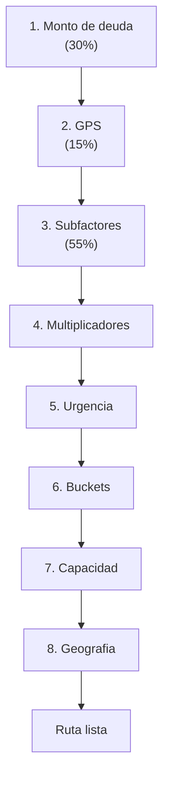
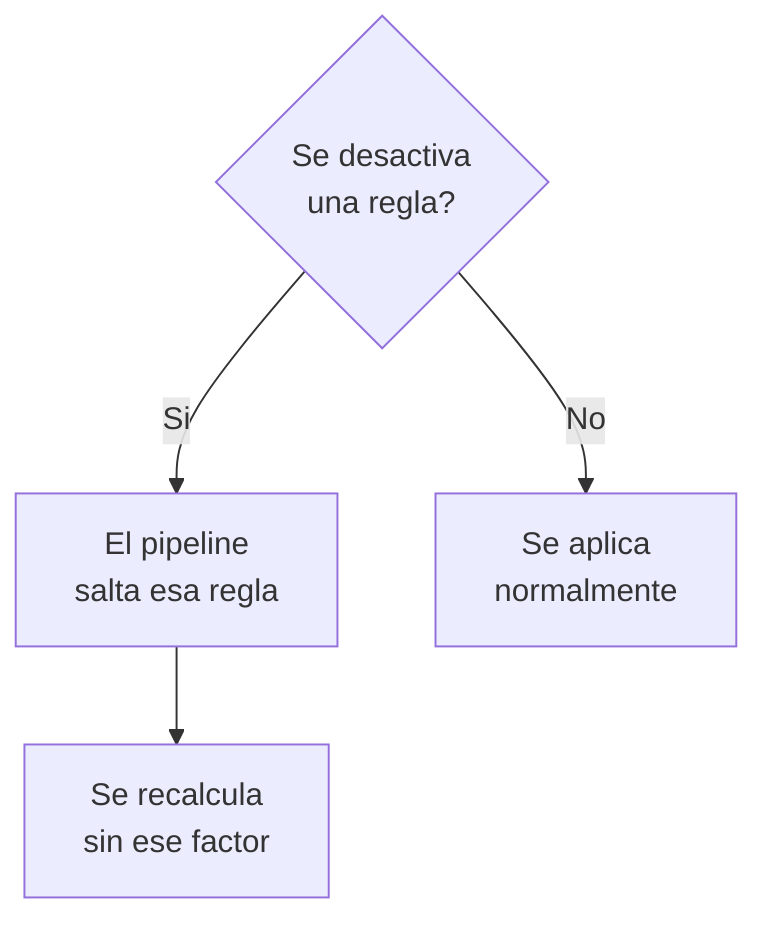

# Estrategia y Reglas de Asignacion

Esta guia explica **como el sistema decide a que clientes visitar cada dia**, en que orden y con que cobrador. El proceso se llama **Pipeline de Asignacion de Ruta Diaria** y utiliza 8 categorias de reglas que trabajan en secuencia.

::: tip Para quien es esta guia
Supervisores, gerentes y directivos que necesitan entender y configurar las reglas de cobranza. No se requieren conocimientos tecnicos.
:::

## Vision General del Pipeline

El sistema ejecuta **8 pasos en orden**, como un embudo que filtra y prioriza hasta generar la ruta final del cobrador:

  

    1
    <h4>Priorizacion por Deuda</h4>
    
Clasifica clientes por monto adeudado. A mayor deuda, mayor prioridad.

  

  

    2
    <h4>Clasificacion GPS</h4>
    
Evalua si el GPS esta activo, apagado o sin dispositivo.

  

  

    3
    <h4>Subfactores GPS</h4>
    
Analiza horarios, posicion del vehiculo, predicciones y confianza de la IA.

  

  

    4
    <h4>Multiplicadores</h4>
    
Aplica bonus o penalizaciones segun condiciones especiales.

  

  

    5
    <h4>Reglas de Urgencia</h4>
    
Suma puntos extra a cuentas criticas (promesas rotas, marcas urgentes).

  

  

    6
    <h4>Peso por Antiguedad</h4>
    
Ajusta la agresividad de cobranza segun los dias de atraso (B1-B10).

  

  

    7
    <h4>Capacidad del Cobrador</h4>
    
Limita cuantos clientes puede visitar cada cobrador por dia.

  

  

    8
    <h4>Configuracion Geografica</h4>
    
Ajusta distancias, radios y velocidades para la zona de trabajo.

  

### Flujo del calculo

---

## Las 8 Categorias de Reglas

### 1. Priorizacion por Monto de Deuda

::: info Peso en el score: 30%
:::

El sistema clasifica a cada cliente segun el monto total que debe y le asigna una prioridad. A mayor deuda, mayor prioridad en la ruta.

| Rango de deuda | Prioridad |
|---|---|
| Menos de $5,000 | Baja |
| $5,000 — $10,000 | Media-baja |
| $10,000 — $20,000 | Media |
| $20,000 — $40,000 | Media-alta |
| $40,000 — $100,000 | Alta |
| Mas de $100,000 | Muy alta |

  

    <strong>Impacto</strong>
    Determina cuales clientes se visitan primero en el dia. Deudas grandes suben al inicio de la ruta.
  

  

    <strong>Ventajas</strong>
    Maximiza la recuperacion economica por cada ruta. El cobrador atiende primero las cuentas de mayor valor.
  

  

    <strong>Desventajas</strong>
    Las cuentas con montos pequenos pueden acumular dias de atraso sin ser visitadas.
  

  

    <strong>Ejemplo</strong>
    Un cliente con $80,000 de deuda se visitara antes que uno con $3,000, aunque ambos tengan el mismo atraso.
  

---

### 2. Clasificacion GPS

::: info Peso en el score: 15%
:::

El sistema evalua el estado del dispositivo GPS instalado en el vehiculo del cliente:

| Estado | Puntos | Significado |
|---|---|---|
| GPS Online | 70 pts | Transmitiendo en tiempo real |
| GPS Offline | 45 pts | Dejo de transmitir |
| Sin GPS | 20 pts | No tiene dispositivo |

  

    <strong>Impacto</strong>
    Los clientes con GPS activo reciben prioridad porque el sistema puede ubicarlos con mayor precision.
  

  

    <strong>Ventajas</strong>
    Mejor precision en la ubicacion. Reduce visitas fallidas por no encontrar al cliente.
  

  

    <strong>Desventajas</strong>
    Penaliza a clientes cuyo GPS se descompuso sin que ellos lo causaran.
  

  

    <strong>Ejemplo</strong>
    Dos clientes con $50,000 de deuda: el que tiene GPS activo se visitara antes que el que tiene GPS apagado.
  

---

### 3. Subfactores GPS Online

::: info Peso en el score: 55% (cuando el GPS esta activo)
:::

Cuando el GPS del vehiculo esta conectado, el sistema utiliza **6 factores en tiempo real**:

| Factor | Peso | Que hace |
|---|---|---|
| Ventana de tiempo | 20% | Horas en que el cliente suele estar en casa |
| Posicion del vehiculo | 20% | Donde esta el vehiculo ahora |
| Afinidad con cobrador | 5% | Prefiere al mismo cobrador |
| Prediccion futura | 15% | Donde estara el vehiculo cuando el cobrador llegue |
| Confianza en domicilio | 10% | Seguridad de la direccion de casa |
| Confianza en trabajo | 5% | Seguridad de la direccion de trabajo |

  

    <strong>Impacto</strong>
    Maximiza la probabilidad de encontrar al cliente en su domicilio. El cobrador no pierde tiempo visitando casas vacias.
  

  

    <strong>Ventajas</strong>
    Mejora la tasa de contacto entre un 15% y 20%. Optimiza el horario de visita para cada cliente.
  

  

    <strong>Desventajas</strong>
    Depende de la calidad de la senal GPS. Si el GPS falla, las decisiones se afectan.
  

  

    <strong>Ejemplo</strong>
    Si el vehiculo esta a 200m de la casa del deudor a las 7am, el sistema prioriza visitarlo en la manana.
  

---

### 4. Subfactores GPS Offline

::: info Peso en el score: 55% (cuando el GPS esta inactivo)
:::

Cuando el GPS esta desconectado, el sistema usa **datos historicos y modelos de IA**:

| Factor | Peso | Que hace |
|---|---|---|
| Ventana de tiempo | 25% | Patrones historicos de presencia en casa |
| Afinidad con cobrador | 10% | Continuidad compensa la falta de GPS |
| Prediccion futura | 20% | Comportamiento basado en meses de datos |
| Confianza en domicilio | 15% | Certeza del domicilio por historial |
| Confianza en trabajo | 10% | Certeza del lugar de trabajo |

  

    <strong>Impacto</strong>
    El sistema sigue tomando decisiones inteligentes aunque no tenga datos en tiempo real.
  

  

    <strong>Ventajas</strong>
    Aprovecha meses de datos historicos. El cobrador no pierde visitas por fallas de GPS.
  

  

    <strong>Desventajas</strong>
    Menos preciso que GPS online. Los patrones historicos pueden no reflejar cambios recientes del cliente.
  

  

    <strong>Ejemplo</strong>
    Un cliente cuyo GPS se apago hace 15 dias: la IA sabe que solia llegar a casa a las 7pm y sugiere visitarlo despues de esa hora.
  

---

### 5. Multiplicadores de Score

::: info Se aplican despues del calculo base
:::

Ajustan el score final hacia arriba o hacia abajo segun condiciones especiales:

| Multiplicador | Valor | Significado |
|---|---|---|
| Cobrador asignado previamente | x 1.15 | Continuidad con el mismo cobrador |
| Bucket B4 o superior | x 1.10 | Cuentas con mucho atraso |
| Urgente + promesa rota | x 1.25 | Maxima urgencia |
| GPS apagado > 7 dias | x 0.90 | Penalizacion leve (-10%) |
| GPS apagado > 30 dias | x 0.75 | Penalizacion fuerte (-25%) |

  

    <strong>Impacto</strong>
    Ajustan el score final para manejar situaciones especiales sin modificar la configuracion base.
  

  

    <strong>Ventajas</strong>
    Permiten dar prioridad extra a situaciones criticas de forma flexible.
  

  

    <strong>Desventajas</strong>
    Si se abusa de valores altos, pueden distorsionar el scoring y hacer impredecible el orden de la ruta.
  

  

    <strong>Ejemplo</strong>
    Un cliente con promesa incumplida (x1.25) sube automaticamente en la lista, sin importar su monto de deuda.
  

---

### 6. Reglas de Urgencia

::: warning Estas reglas tienen la maxima prioridad
:::

Suman puntos directamente al puntaje. Sus valores son tan altos que **garantizan** que los casos criticos se visiten primero:

| Regla | Puntos extra | Descripcion |
|---|---|---|
| Urgente + promesa vencida | +10,000 | Marca urgente Y promesa incumplida |
| Promesa de pago vencida | +5,000 | Prometio pagar y no cumplio |
| Marca urgente | +3,000 | Supervisor la marco como urgente |
| GPS conectado | +500 | GPS activo en este momento |
| Reintento visita fallida | +200 | No se encontro al cliente antes |

  

    <strong>Impacto</strong>
    Garantiza que las cuentas criticas sean visitadas sin importar su score base.
  

  

    <strong>Ventajas</strong>
    Nunca se pierden situaciones criticas. El supervisor tiene control directo.
  

  

    <strong>Desventajas</strong>
    Valores tan altos pueden monopolizar la ruta si hay muchos casos urgentes a la vez.
  

  

    <strong>Ejemplo</strong>
    Una cuenta con score base de 850 + urgencia de 10,000 = 10,850 puntos. Sera la primera visita del dia.
  

---

### 7. Capacidad del Cobrador

::: info Limites operativos por cobrador
:::

Define cuantos clientes puede visitar un cobrador en un dia:

| Parametro | Valor | Significado |
|---|---|---|
| Minutos de trabajo | 600 (10 hrs) | Jornada total |
| Duracion de visita | 25 min | Tiempo por parada |
| Tiempo de traslado | 12 min | Entre un cliente y otro |
| Minimo de paradas | 8 | Piso por cobrador |
| Maximo de paradas | 20 | Techo por cobrador |

**Calculo:** 25 min visita + 12 min traslado = 37 min por cliente. En 600 minutos: **~16 visitas por dia**.

  

    <strong>Impacto</strong>
    Determina cuantos clientes entran en la ruta de cada cobrador.
  

  

    <strong>Ventajas</strong>
    Evita sobrecargar al cobrador. Cada visita tiene el tiempo suficiente.
  

  

    <strong>Desventajas</strong>
    Valores incorrectos causan visitas apresuradas o tiempo muerto.
  

  

    <strong>Ejemplo</strong>
    Si reduces el maximo a 12 paradas, cada cobrador da mejor atencion pero necesitas mas cobradores para cubrir la cartera.
  

---

### 8. Configuracion Geografica

::: info Parametros de distancia y limites
:::

Controlan como el sistema calcula distancias y normaliza scores:

| Parametro | Valor | Significado |
|---|---|---|
| Radio del domicilio | 300 m | GPS dentro = "en casa" |
| Tope de monto | $100,000 | Maximo para normalizacion |
| Tope de dias | 180 dias | Maximo de antiguedad |
| Velocidad en ciudad | 30 km/h | Para calcular traslados |

  

    <strong>Impacto</strong>
    Controla la precision de los calculos de distancia y la normalizacion de scores.
  

  

    <strong>Ventajas</strong>
    Se adapta a la geografia local. Permite ajustar para ciudades con diferente trafico.
  

  

    <strong>Desventajas</strong>
    Valores incorrectos causan rutas ineficientes. Un radio muy grande da falsos positivos.
  

  

    <strong>Ejemplo</strong>
    Con radio de 300m, si el vehiculo esta a 250m de la casa del deudor, el sistema lo considera "en casa".
  

---

## Que pasa cuando activo o desactivo una regla

Cada regla funciona como un **interruptor**. Al desactivarla, el sistema la salta:

| Accion | Resultado |
|---|---|
| Desactivar **Monto de Deuda** | Todos los clientes tienen igual prioridad sin importar cuanto deben |
| Desactivar **GPS** | No se distingue entre GPS activo, apagado o sin dispositivo |
| Desactivar **Multiplicadores** | No hay bonus ni penalizaciones. GPS apagado no se penaliza |
| Desactivar **Urgencia** | Casos criticos se tratan igual que cualquier otro cliente |
| Desactivar **Capacidad** | Sin limites de paradas. Puede generar rutas imposibles |

::: danger Precaucion
Desactivar multiples reglas al mismo tiempo puede generar rutas de baja calidad. Haz cambios de una regla a la vez y evalua el resultado.
:::

---

## Como afecta cada cambio — Ejemplos

### Ejemplo 1: Aumentar el peso del monto

> **Antes:** Monto = 30% → **Despues:** Monto = 50%

**Resultado:** Clientes con deudas grandes dominan la ruta. Uno con $80,000 siempre va antes que uno con $5,000 aunque tenga GPS activo.

### Ejemplo 2: Aumentar multiplicador de cobrador

> **Antes:** x1.15 → **Despues:** x1.40

**Resultado:** Fuerte continuidad. El cobrador casi siempre visita a los mismos clientes. Mejora relacion pero reduce flexibilidad.

### Ejemplo 3: Reducir maximo de paradas

> **Antes:** 20 paradas → **Despues:** 12 paradas

**Resultado:** Menos clientes por dia pero mejor atencion. Se necesitan mas cobradores.

### Ejemplo 4: Reducir radio del domicilio

> **Antes:** 300m → **Despues:** 100m

**Resultado:** Mas estricto para "en casa". Menos falsos positivos pero mas detecciones perdidas.

### Ejemplo 5: Abusar de la marca urgente

> **Situacion:** El supervisor marca 15 de 20 clientes como urgentes

**Resultado:** Todos compiten con +3,000 puntos — la marca pierde su efecto. Los 5 no marcados son ignorados.

---

## Recomendaciones

### Para el dia a dia

- **Un cambio a la vez.** Haz un cambio, observa 2-3 dias, luego ajusta.
- **Marca de urgencia con moderacion.** Si todos son urgentes, ninguno lo es.
- **Revisa las rutas** antes de publicarlas para validar la distribucion.

### Para multiplicadores

- **No subir arriba de x1.50** salvo razon muy especifica.
- **Penalizaciones graduales** — muy severas hacen que esos clientes nunca sean visitados.

### Para capacidad

- **Mide tiempos reales** de visita y traslado antes de ajustar.
- **Minimo de paradas:** no bajar de 6.
- **Maximo de paradas:** no subir de 22 sin consultar al equipo de campo.

### Para geografia

- **Radio domicilio:** mayor en zonas rurales (400-500m), menor en zonas urbanas (200m).
- **Velocidad promedio:** en ciudades con mucho trafico, usar 20-25 km/h.

::: tip Regla de oro
El mejor ajuste se basa en datos reales. Revisa los reportes de visitas completadas, tasa de contacto y tiempo promedio antes de cambiar la configuracion.
:::
