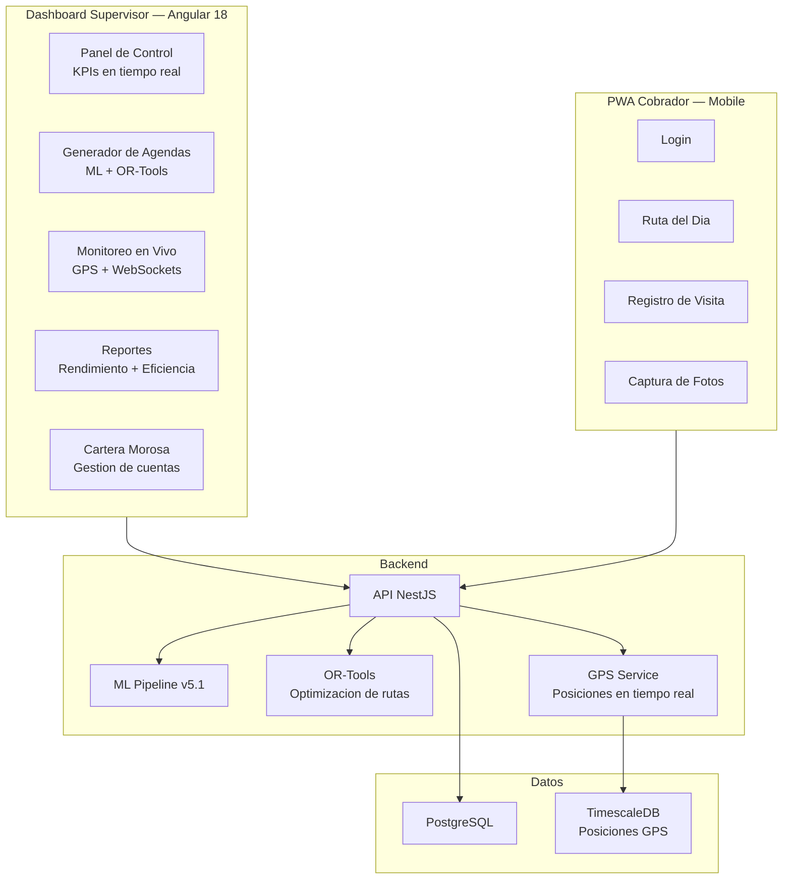
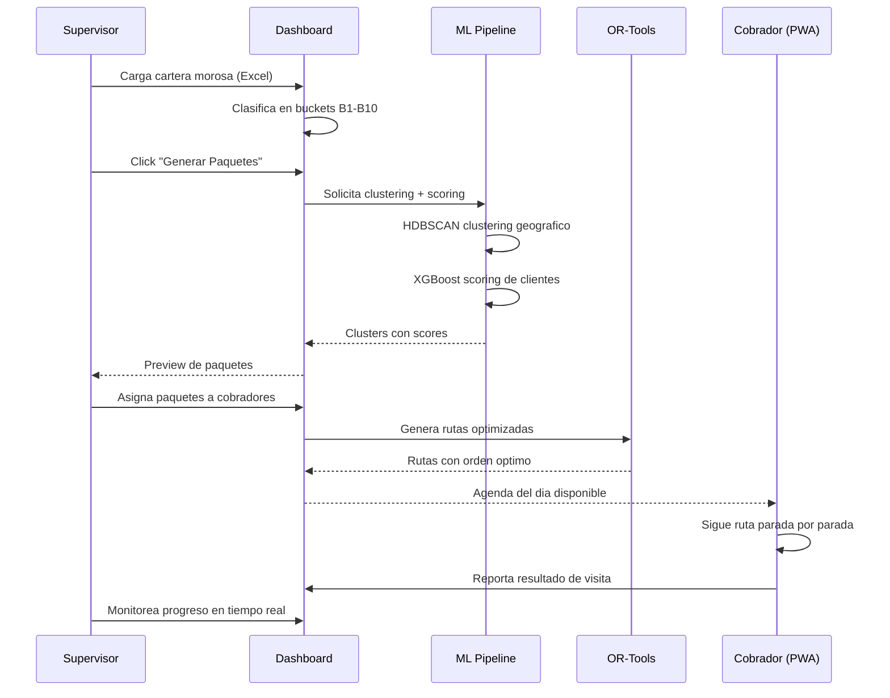

# Cobranza Inteligente

El sistema de **Cobranza Inteligente** de AgentsMX gestiona **794 cuentas morosas** distribuidas entre **17 cobradores** en campo, utilizando machine learning para optimizar rutas y priorizar visitas.

## Que es Cobranza Inteligente

Es un sistema dual compuesto por un **Dashboard de Supervisor** y una **PWA para Cobradores** que trabajan en conjunto para maximizar la recuperacion de cartera vencida.

### Arquitectura Dual

## Flujo General del Sistema

## Componentes Principales

| Componente | Funcion | Seccion |
|-----------|---------|---------|
| Dashboard Supervisor | Panel central de control y gestion | [Dashboard](./dashboard) |
| Generador de Agendas | Creacion de paquetes con ML | [Agendas](./agendas) |
| Monitoreo en Vivo | Tracking GPS de cobradores | [Monitoreo](./monitoreo) |
| Reportes | Analisis de rendimiento | [Reportes](./reportes) |
| PWA Cobrador | App movil para campo | [PWA Cobrador](./pwa-cobrador) |
| Cartera Morosa | Gestion de cuentas morosas | [Cartera Morosa](./cartera-morosa) |

## Datos Clave

- **794** cuentas morosas activas
- **17** cobradores en campo
- **10** buckets de clasificacion (B1 = 1-30 dias, B10 = 270+ dias)
- **5** etapas del ML Pipeline (clustering, KDE, scoring, asignacion, ruteo)
- Rutas optimizadas con **ventanas de tiempo** y **restricciones de distancia**
- Monitoreo GPS **en tiempo real** via WebSockets

## Tecnologias Utilizadas

| Tecnologia | Uso |
|-----------|-----|
| Angular 18 | Dashboard supervisor |
| PWA + Service Workers | App cobrador (offline-first) |
| NestJS | API backend |
| PostgreSQL | Datos de cartera y cobradores |
| TimescaleDB | Posiciones GPS historicas |
| HDBSCAN / K-Means | Clustering geografico |
| XGBoost | Scoring de probabilidad de pago |
| OR-Tools | Optimizacion de rutas TSP/VRP |
| WebSockets | Actualizaciones en tiempo real |
