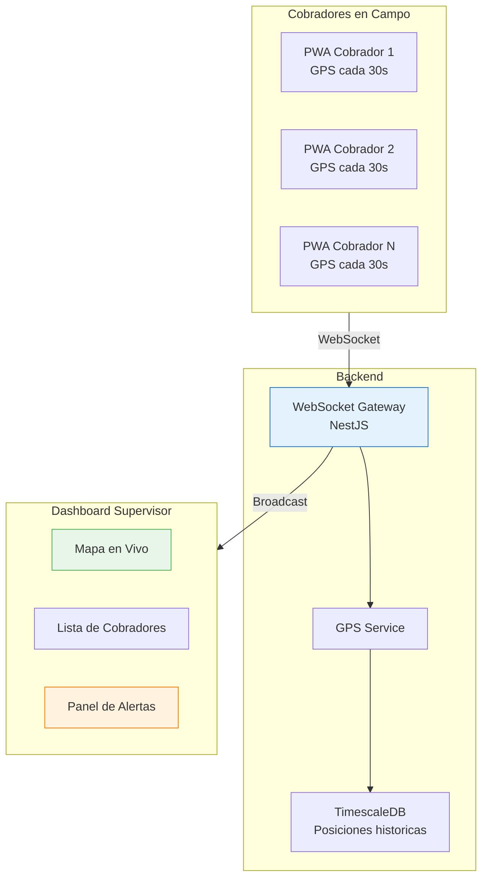
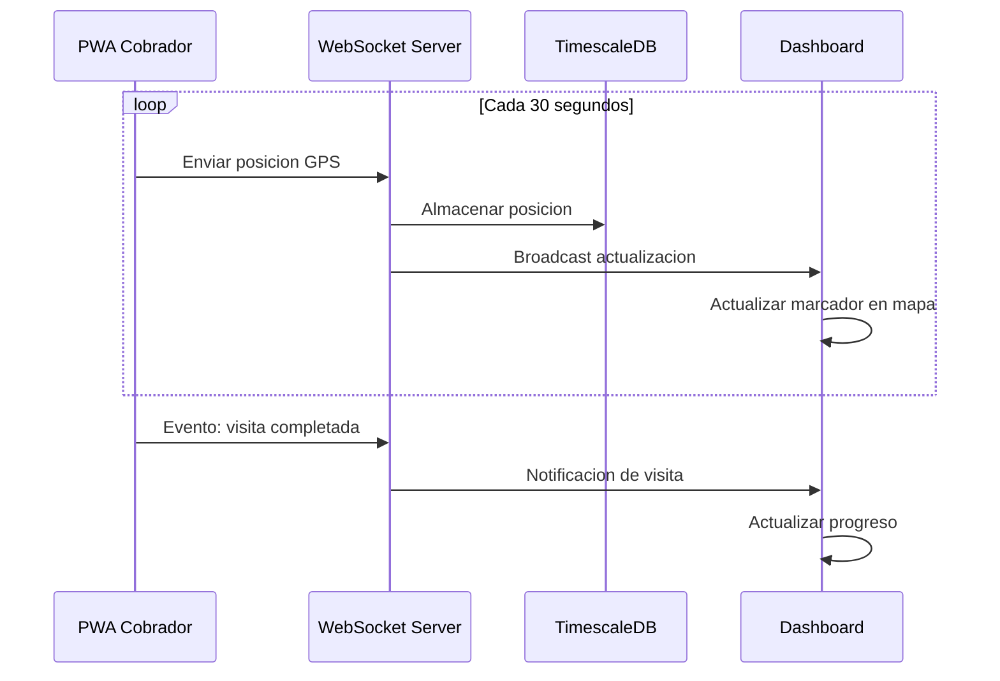
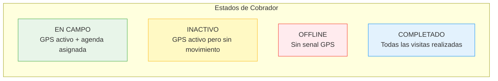
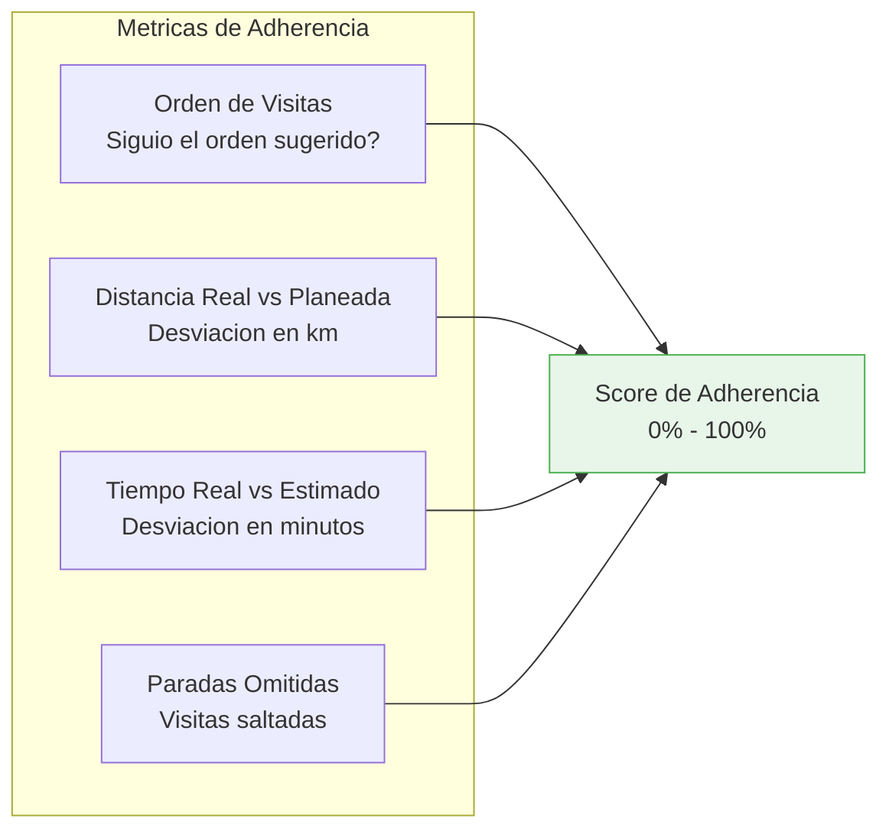

# Monitoreo en Vivo

El modulo de monitoreo permite al supervisor rastrear en tiempo real la posicion y actividad de los 17 cobradores en campo mediante GPS y WebSockets.

## Arquitectura del Monitoreo

## Vista de Mapa en Tiempo Real

El mapa central muestra:

### Elementos Visuales

| Elemento | Icono/Color | Significado |
|----------|------------|-------------|
| Cobrador activo | Marcador verde con pulso | GPS reportando, en movimiento |
| Cobrador detenido | Marcador amarillo | GPS activo pero sin movimiento >10 min |
| Cobrador offline | Marcador rojo | Sin reporte GPS >5 minutos |
| Visita completada | Circulo verde | Parada visitada exitosamente |
| Visita pendiente | Circulo azul | Siguiente parada en la ruta |
| Visita no realizada | Circulo gris | Parada aun no visitada |
| Linea de ruta | Linea azul punteada | Ruta optimizada original |
| Ruta recorrida | Linea verde solida | Trayecto real del cobrador |

### Flujo de Actualizacion

## Estado de Cobradores

Panel lateral con tarjetas por cobrador, ordenadas por estado:

### Detalle por Cobrador

Al hacer click en un cobrador se despliega:

- **Progreso de visitas**: 8 de 12 completadas (barra de progreso)
- **Cobro acumulado hoy**: $45,200 MXN
- **Tiempo en campo**: 4h 23min
- **Siguiente parada**: Nombre del moroso + ETA
- **Ultima actividad**: Hace 2 minutos — visita completada
- **Adherencia a ruta**: 87% (que tanto siguio la ruta sugerida)

## Adherencia a Ruta

El sistema calcula que tan fielmente el cobrador sigue la ruta optimizada:

| Rango | Clasificacion | Accion |
|-------|--------------|--------|
| 90-100% | Excelente | Sin accion |
| 70-89% | Buena | Revision opcional |
| 50-69% | Regular | Revisar con cobrador |
| <50% | Baja | Atencion inmediata |

## Alertas en Tiempo Real

El sistema genera alertas automaticas:

| Alerta | Condicion | Prioridad |
|--------|-----------|-----------|
| Cobrador offline | Sin GPS >5 min | Alta |
| Detenido prolongado | Sin movimiento >30 min | Media |
| Fuera de ruta | >2 km de la ruta planeada | Media |
| Visita no registrada | En ubicacion de moroso pero sin registro | Baja |
| Jornada excedida | Mas de 9 horas en campo | Alta |

## Historial de Posiciones

El supervisor puede consultar el recorrido historico de cualquier cobrador:

- **Seleccionar cobrador** y **rango de fechas**
- Ver trayecto completo sobre el mapa
- Identificar paradas, tiempos muertos y desvios
- Exportar datos de recorrido en CSV

::: tip Frecuencia GPS
La PWA envia posicion GPS cada 30 segundos cuando esta en primer plano. En background, la frecuencia baja a cada 60 segundos para ahorrar bateria.
:::
