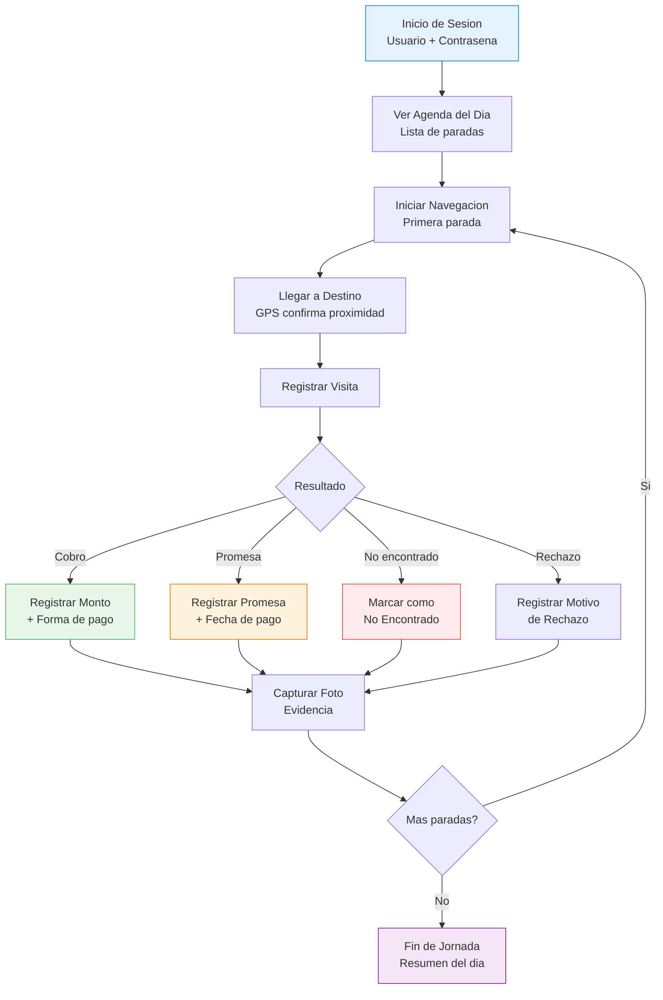
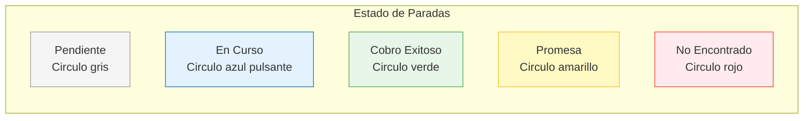
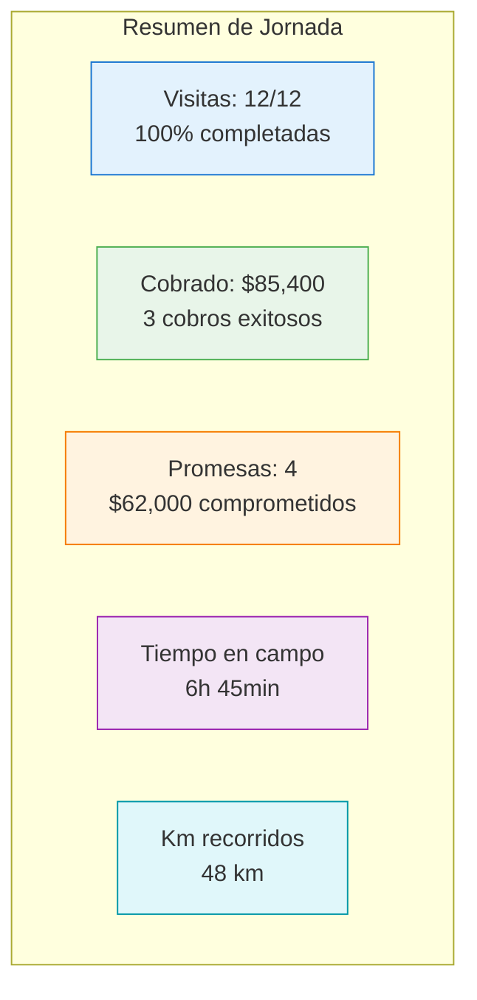

# PWA Cobrador

La PWA (Progressive Web App) del cobrador es la aplicacion movil que utilizan los **17 cobradores** en campo para recibir sus agendas, navegar por la ruta optimizada y reportar el resultado de cada visita.

## Flujo del Cobrador

## Inicio de Sesion

Al abrir la app, el cobrador ingresa:

- **Usuario**: Asignado por el supervisor
- **Contrasena**: Personal e intransferible
- La sesion persiste hasta cierre de jornada
- El GPS se activa automaticamente al iniciar sesion

::: warning Permisos Requeridos
La PWA requiere permiso de **ubicacion GPS** y **camara** para funcionar correctamente. Sin GPS no se registran visitas.
:::

## Agenda del Dia

La pantalla principal muestra la lista de visitas del dia en el orden optimizado:

### Informacion por Parada

| Campo | Descripcion |
|-------|------------|
| Numero de parada | Orden en la ruta (1, 2, 3...) |
| Nombre del cliente | Nombre completo del moroso |
| Direccion | Direccion completa con referencia |
| Monto adeudado | Total que debe el moroso |
| Dias de atraso | Dias desde el ultimo pago |
| Bucket | Clasificacion B1-B10 |
| Hora sugerida | Ventana horaria optima de visita |
| Estado | Pendiente / Visitado / En progreso |

### Indicadores Visuales

## Navegacion Paso a Paso

Al tocar una parada, se abre la navegacion:

1. **Boton "Navegar"** abre Google Maps con la direccion como destino
2. Google Maps calcula la ruta desde la ubicacion actual
3. Al llegar (radio de 100m del destino), la PWA muestra notificacion
4. Se habilita el boton **"Registrar Visita"**

## Registro de Visita

El formulario de registro de visita tiene cuatro resultados posibles:

### Cobro Realizado

- **Monto cobrado**: Cantidad recibida
- **Forma de pago**: Efectivo / Transferencia / Cheque
- **Referencia**: Numero de referencia o folio
- **Notas**: Observaciones opcionales

### Promesa de Pago

- **Monto prometido**: Cantidad comprometida por el moroso
- **Fecha de pago**: Cuando se comprometio a pagar
- **Medio de pago**: Como va a pagar
- **Notas**: Detalle de la conversacion

### No Encontrado

- **Motivo**: Domicilio cerrado / No vive ahi / Direccion incorrecta
- **Observaciones**: Detalle de la situacion
- **Vecinos contactados**: Si se pregunto a vecinos

### Rechazo

- **Motivo del rechazo**: No quiere pagar / Disputa el monto / Otro
- **Detalle**: Razon especifica
- **Actitud**: Cooperativo / Hostil / Indiferente

## Captura de Fotos

Despues de cada visita, el cobrador puede capturar fotos como evidencia:

- **Foto de fachada**: Confirma que se visito la direccion correcta
- **Foto de comprobante**: Recibo de pago o nota de promesa
- **Foto adicional**: Cualquier evidencia relevante

Las fotos se suben automaticamente al servidor cuando hay conexion. En modo offline, se almacenan localmente y se sincronizan despues.

## Resumen del Dia

Al completar todas las visitas o al cerrar jornada:

## Modo Offline

La PWA funciona sin conexion a internet:

| Funcionalidad | Offline | Observacion |
|--------------|---------|-------------|
| Ver agenda del dia | Si | Se precarga al inicio |
| Registrar visitas | Si | Se sincroniza al reconectar |
| Capturar fotos | Si | Se suben al reconectar |
| GPS tracking | Si | Se almacena localmente |
| Navegacion Google Maps | Parcial | Requiere conexion para nuevas rutas |
| Notificaciones push | No | Requiere conexion |

::: tip Sincronizacion
Los datos se sincronizan automaticamente cuando la PWA detecta conexion a internet. El cobrador no necesita hacer nada manual.
:::
