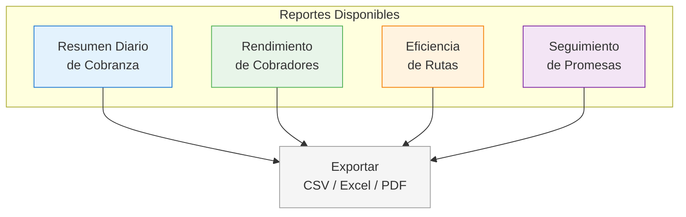
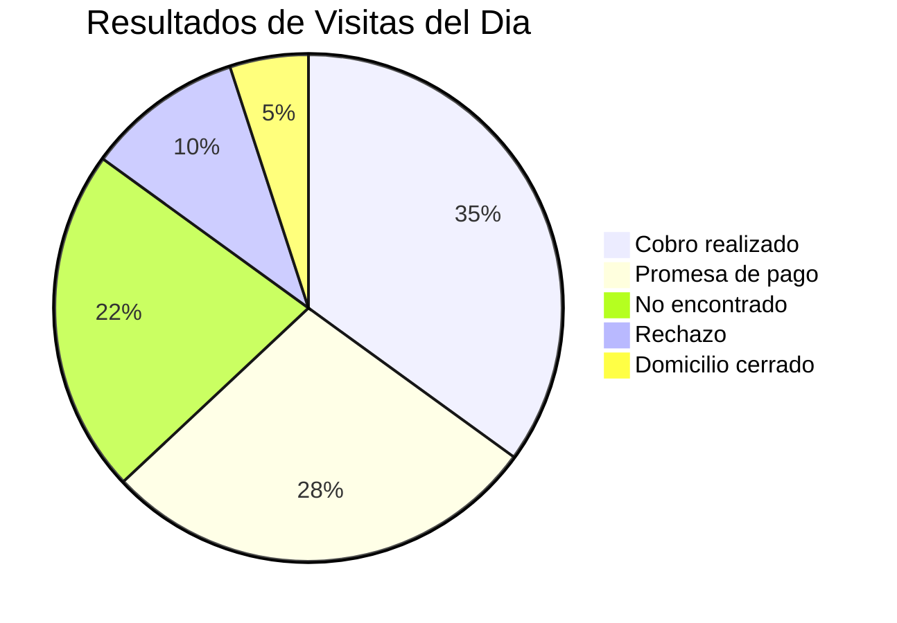
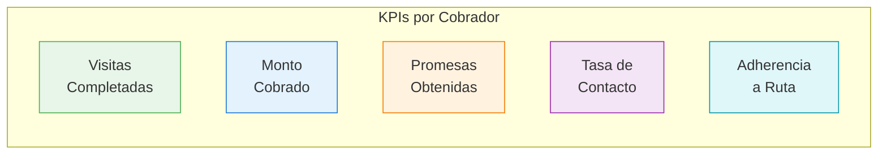
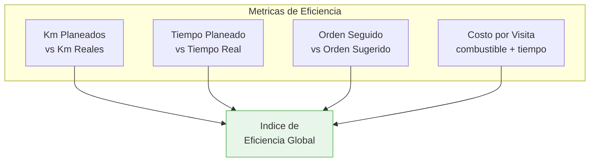
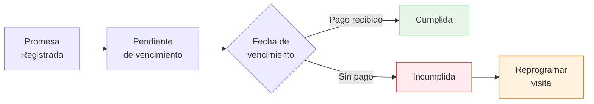

# Reportes de Cobranza

El modulo de reportes proporciona analisis detallados del rendimiento de la operacion de cobranza, permitiendo tomar decisiones basadas en datos.

## Tipos de Reportes

## Resumen Diario de Cobranza

Panorama completo de la actividad del dia:

### Metricas del Resumen

| Metrica | Descripcion |
|---------|------------|
| Total visitas programadas | Visitas asignadas en todas las agendas |
| Visitas completadas | Visitas con resultado registrado |
| Tasa de contacto | % de visitas donde se encontro al moroso |
| Monto cobrado | Total recuperado en el dia |
| Promesas obtenidas | Nuevas promesas de pago registradas |
| Monto en promesas | Valor total de las promesas |

### Distribucion de Resultados

### Filtros del Reporte

- **Rango de fechas**: Dia, semana, mes, rango personalizado
- **Cobrador**: Individual o todos
- **Bucket**: B1 a B10
- **Zona**: Por cluster geografico

## Rendimiento de Cobradores

Evaluacion comparativa del desempeño de cada cobrador:

### Tabla Comparativa

| Cobrador | Visitas | Cobrado | Promesas | Tasa Contacto | Adherencia |
|----------|---------|---------|----------|---------------|------------|
| Juan Perez | 12/12 | $85,400 | 4 | 92% | 95% |
| Maria Lopez | 10/11 | $62,100 | 3 | 82% | 88% |
| Carlos Ruiz | 8/10 | $45,000 | 5 | 75% | 72% |

### Graficas Disponibles

- **Barras**: Monto cobrado por cobrador (diario, semanal, mensual)
- **Linea**: Tendencia de visitas completadas en el tiempo
- **Ranking**: Top cobradores por monto recuperado
- **Historico**: Evolucion del rendimiento por cobrador

## Eficiencia de Rutas

Analisis de que tan eficientes son las rutas generadas y ejecutadas:

| Metrica | Descripcion | Meta |
|---------|------------|------|
| Km reales / Km planeados | Ratio de distancia real vs optimizada | < 1.2 |
| Tiempo por visita | Tiempo promedio en cada parada | 15-25 min |
| Visitas por hora | Productividad de visitas | > 2 |
| Costo por cobro | Costo operativo por cobro exitoso | Minimizar |

## Seguimiento de Promesas

Control de promesas de pago obtenidas en campo:

### Metricas de Promesas

| Metrica | Descripcion |
|---------|------------|
| Promesas activas | Promesas pendientes de vencimiento |
| Tasa de cumplimiento | % de promesas que se pagaron |
| Monto comprometido | Total en promesas activas |
| Promesas vencidas hoy | Que vencen hoy sin pago |
| Promedio dias a pago | Dias entre promesa y pago real |

### Vista de Promesas

La tabla de promesas muestra:

- **Moroso**: Nombre y numero de cuenta
- **Monto prometido**: Cantidad comprometida
- **Fecha de promesa**: Cuando se registro
- **Fecha de pago**: Cuando se comprometio a pagar
- **Estado**: Pendiente / Cumplida / Incumplida / Parcial
- **Cobrador**: Quien obtuvo la promesa

## Exportacion

Todos los reportes se pueden exportar en:

| Formato | Uso recomendado |
|---------|----------------|
| CSV | Analisis en Excel o Google Sheets |
| Excel (.xlsx) | Reporte formal con formato |
| PDF | Compartir con gerencia |

::: tip Automatizacion
Los reportes diarios se pueden programar para enviarse automaticamente por correo a las 8:00 PM cada dia.
:::
