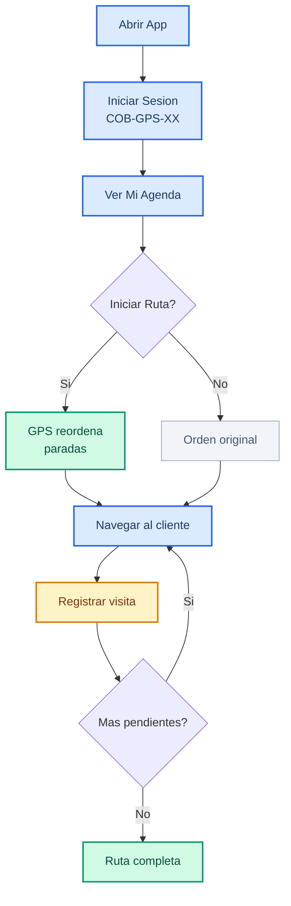
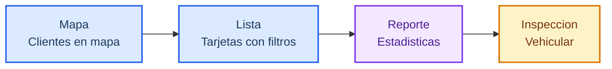
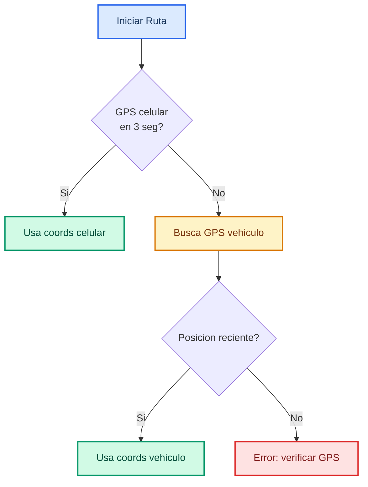
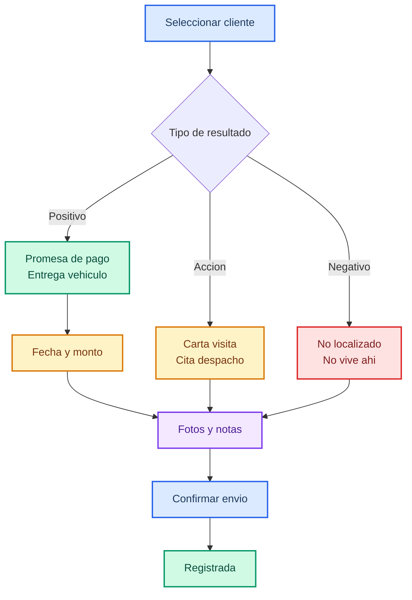
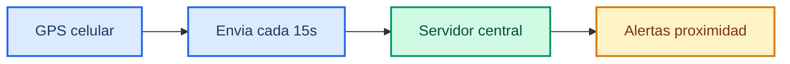
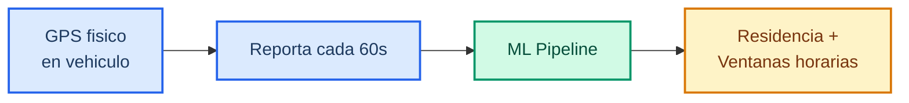
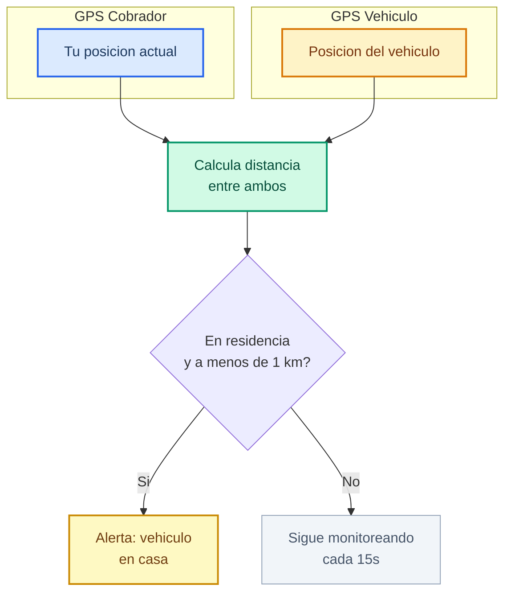

# Manual PWA — Cobrador de Campo

> Guia completa para la aplicacion movil de cobranza en **time.agentsmx.com/mi-agenda/**

---

## Contenido

1. [Flujo General del Dia](#_1-flujo-general-del-dia)
2. [Acceso al Sistema](#_2-acceso-al-sistema)
3. [Pantalla Principal](#_3-pantalla-principal-mi-agenda)
4. [Iniciar Ruta](#_4-iniciar-ruta)
5. [Navegar a un Cliente](#_5-navegar-a-un-cliente)
6. [Registrar Visitas](#_6-registrar-una-visita)
7. [Alertas de Proximidad](#_7-alertas-de-proximidad)
8. [Vista 360 del Cliente](#_8-vista-360-del-cliente)
9. [Sistema GPS](#_9-sistema-gps)
10. [Solucion de Problemas](#_10-solucion-de-problemas)

---

## 1. Flujo General del Dia

### Ventajas del Sistema

| Ventaja | Descripcion |
|---------|-------------|
| Rutas inteligentes | Paradas reordenadas desde tu ubicacion |
| Ventanas horarias | Sabe cuando el cliente esta en casa |
| Alertas en tiempo real | Avisa cuando pasas cerca de un cliente activo |
| GPS vehicular como respaldo | Si tu celular falla, usa el GPS del vehiculo |
| Vista 360 del cliente | Toda la info del cliente en un solo lugar |
| Registro inmediato | Tus visitas llegan al supervisor al instante |

### Limitaciones a Considerar

| Limitacion | Impacto |
|------------|---------|
| Requiere internet | Sin conexion no puedes cargar ruta ni enviar visitas |
| Consumo de bateria | El GPS activo consume bateria — carga tu celular antes de salir |
| Precision GPS | En interiores o zonas con senal debil puede ser impreciso |
| Sin modo offline completo | Las fotos y visitas necesitan internet para enviarse |

---

## 2. Acceso al Sistema

### Pantalla de Login

### Ingresar a la aplicacion

1. Abre el navegador de tu celular (Chrome o Safari).
2. Escribe la direccion: **time.agentsmx.com**
3. Ingresa tus credenciales:

| Campo | Que escribir | Ejemplo |
|-------|-------------|---------|
| Codigo de cobrador | Tu codigo asignado | COB-GPS-01 |
| Contrasena | La contrasena que te dieron | ******** |

4. Presiona **Iniciar sesion**.

### Instalar como aplicacion en tu celular

Para acceder mas rapido sin abrir el navegador cada vez:

**En Android (Chrome):**
1. Abre **time.agentsmx.com** en Chrome.
2. Toca el menu de tres puntos (arriba a la derecha).
3. Selecciona **"Agregar a pantalla de inicio"** o **"Instalar aplicacion"**.
4. Confirma. Aparecera un icono en tu pantalla como cualquier otra app.

**En iPhone (Safari):**
1. Abre **time.agentsmx.com** en Safari.
2. Toca el boton de compartir (cuadro con flecha hacia arriba).
3. Selecciona **"Agregar a pantalla de inicio"**.
4. Confirma. Aparecera el icono en tu pantalla.

::: tip Recomendacion
Instalar la app en tu celular te permite abrirla mas rapido y funciona mejor con las alertas de proximidad.
:::

---

## 3. Pantalla Principal — Mi Agenda

Al entrar veras la pantalla **Mi Agenda**, tu centro de trabajo diario. En la parte inferior tienes una barra de navegacion con cuatro secciones.

### Barra de navegacion inferior

| Boton | Para que sirve |
|-------|---------------|
| Mapa | Ver tus clientes en un mapa con marcadores de colores |
| Lista | Ver tus clientes en tarjetas con filtros |
| Reporte | Ver tus estadisticas del dia, semana o mes |
| Inspeccion | Acceder a funciones de inspeccion vehicular |

### Vista de Mapa (pantalla por defecto)

El mapa muestra la ubicacion de cada cliente. Cada marcador tiene un color que indica el estado:

| Color del marcador | Que significa |
|-------------------|--------------|
| **Verde** | Ventana horaria activa — mejor momento para visitar |
| **Ambar** | Conflicto de horario con otro cliente cercano |
| **Azul** | Tiene ventana optima definida pero no activa ahora |
| **Gris** | Sin datos de ventana horaria |

::: tip Prioridad
Siempre intenta visitar primero los marcadores **verdes** — son los clientes con mayor probabilidad de estar en casa en ese momento.
:::

### Vista de Lista

Muestra los clientes como tarjetas individuales. Cada tarjeta incluye:
- Nombre del cliente
- Monto adeudado
- Numero de dias de mora
- Direccion
- Estado de la visita (pendiente, completada, etc.)

Puedes usar los filtros en la parte superior para mostrar solo ciertos clientes:
- Por estado de visita
- Por bucket (nivel de morosidad)
- Por proximidad

### Vista de Reporte

Te muestra un resumen de tu trabajo:
- **Dia:** visitas realizadas hoy, promesas obtenidas, resultados negativos
- **Semana:** acumulado semanal con comparacion contra la semana anterior
- **Mes:** totales del mes y porcentaje de cumplimiento

---

## 4. Iniciar Ruta

Al comenzar tu jornada de trabajo:

1. Abre la aplicacion en **time.agentsmx.com/mi-agenda/**.
2. En la pantalla principal veras el boton **"Iniciar ruta"**.
3. Presiona el boton. El sistema hara lo siguiente:
   - Obtendra tu ubicacion GPS (del celular o del vehiculo asignado).
   - Reordenara automaticamente las paradas desde tu posicion actual.
4. El mapa se actualizara mostrando el orden optimizado.

### Fallback de GPS al Iniciar Ruta

::: info Opcion alternativa
Si no quieres que se reordene tu ruta (por ejemplo, ya tienes un plan especifico), puedes presionar **"Continuar sin iniciar"**. Tus clientes apareceran en el orden original asignado por tu supervisor.
:::

---

## 5. Navegar a un Cliente

Para llegar a la ubicacion de un cliente:

1. Selecciona al cliente en el mapa o en la lista.
2. Presiona el boton **"Navegar"**.
3. Se abrira **Google Maps** automaticamente con la direccion del cliente.
4. Sigue las indicaciones de Google Maps para llegar.

### Dos direcciones disponibles

El sistema te muestra dos direcciones para cada cliente:

| Tipo | Descripcion |
|------|-------------|
| **Direccion GPS** | Detectada automaticamente por el GPS del vehiculo. Generalmente mas precisa. |
| **Direccion del credito** | La que aparece en el contrato original. Puede estar desactualizada. |

Si la direccion GPS esta disponible, el boton "Navegar" usara esa por defecto, ya que es la ubicacion donde realmente se ha detectado el vehiculo.

---

## 6. Registrar una Visita

### Flujo de Registro

### Paso 1: Seleccionar resultado

Toca al cliente y presiona **"Registrar visita"**. Selecciona el resultado que corresponda:

**Resultados positivos (verde):**

| Resultado | Cuando usarlo |
|-----------|--------------|
| Promesa de pago | El cliente se compromete a pagar en una fecha especifica |
| Entrega auto garantia | El cliente entrega el vehiculo como garantia |
| Entrega auto definitiva | El cliente entrega el vehiculo de forma definitiva |

**Accion realizada (ambar):**

| Resultado | Cuando usarlo |
|-----------|--------------|
| Carta visita | Dejaste una carta de aviso en la direccion |
| Carta juridico | Dejaste una carta de accion legal |
| Cita despacho | Acordaste una cita en el despacho |

**Resultados negativos (rojo):**

| Resultado | Cuando usarlo |
|-----------|--------------|
| No dan acceso | Alguien abrio pero no te permitieron hablar con el titular |
| No vive ahi | El cliente ya no vive en esa direccion |
| Casa abandonada | La propiedad esta desocupada |
| No se localizo | Nadie abrio la puerta |
| Domicilio no encontrado | No existe la direccion o no pudiste localizarla |

### Paso 2: Detalles de promesa (si aplica)

Si seleccionaste **"Promesa de pago"**, el sistema te pedira:

1. **Fecha de pago** — Cuando se compromete a pagar el cliente.
2. **Monto prometido** — Cuanto va a pagar.
3. **Notas** — Cualquier detalle adicional (por ejemplo: "Paga el viernes despues de cobrar").

### Paso 3: Fotos y observaciones

1. Toma fotos si es necesario (fachada, carta dejada, vehiculo encontrado).
2. Escribe observaciones relevantes sobre la visita.

### Paso 4: Confirmar y enviar

1. Revisa que toda la informacion este correcta.
2. Presiona **"Confirmar y enviar"**.
3. La visita quedara registrada y tu supervisor podra verla en tiempo real.

::: warning Importante
Asegurate de tener senal de internet al momento de enviar. Si no tienes senal, la visita se guardara localmente y se enviara cuando recuperes conexion.
:::

---

## 7. Alertas de Proximidad

Tu celular puede avisarte automaticamente cuando estes cerca de un cliente importante. Recibiras una vibracion y una notificacion.

### Tipos de alerta

| Alerta | Que significa |
|--------|--------------|
| **Vehiculo en casa** | El GPS del vehiculo indica que esta en su domicilio ahora |
| **Promesa por vencer** | Un cliente cercano tiene una promesa que vence pronto |
| **En ventana ahora** | Un cliente cercano esta en su ventana horaria optima |

### Que hacer cuando recibes una alerta

La notificacion te ofrece dos botones:
- **Navegar** — Abre Google Maps para ir directamente a ese cliente.
- **Registrar visita** — Si ya estas ahi, registra el resultado directamente.

::: tip
Para que las alertas funcionen correctamente, mantiene activado el GPS de tu celular y los permisos de ubicacion de la aplicacion.
:::

---

## 8. Vista 360 del Cliente

Cuando tocas un cliente en el mapa o en la lista y seleccionas **"Ver detalle"**, accedes a su vista completa.

### Informacion personal y del credito

- Nombre completo
- Numero de credito
- Monto adeudado y dias de mora
- Bucket asignado (nivel de morosidad)

### Historial de visitas y promesas

- Lista de todas las visitas anteriores con fecha, resultado y observaciones
- Promesas registradas: fecha prometida, monto, si se cumplio o no

### Ventanas horarias optimas

El sistema analiza los datos del GPS del vehiculo para determinar en que horarios es mas probable encontrar al cliente en su domicilio:

| Dia | Ventana optima | Confianza |
|-----|---------------|-----------|
| Lunes a Viernes | 7:00 - 9:00 AM | Alta |
| Sabado | 10:00 AM - 1:00 PM | Media |
| Domingo | Todo el dia | Baja |

### Estado del GPS vehicular

- Si el vehiculo tiene GPS activo o no
- Ultima ubicacion conocida
- Si esta en movimiento o estacionado

### Direccion detectada vs direccion del credito

- **Direccion detectada:** Donde el GPS ha registrado que el vehiculo pernocta con mayor frecuencia.
- **Direccion del credito:** La direccion que aparece en el contrato.
- Si son diferentes, puede significar que el cliente cambio de domicilio.

---

## 9. Sistema GPS

El sistema utiliza **dos fuentes de GPS independientes** que trabajan juntas para maximizar la eficiencia de la cobranza.

### Fuente 1: GPS del Celular (Cobrador)

| Caracteristica | Detalle |
|---------------|---------|
| Frecuencia de envio | Cada 15 segundos (solo si te moviste mas de 10 metros) |
| Precision | 5-15 metros (exterior), 20-50 metros (interior) |
| Consumo de bateria | Moderado — se recomienda cargar el celular antes de salir |
| Requiere | GPS activado + permisos de ubicacion en el navegador |
| Se usa para | Iniciar ruta, reordenar paradas, alertas de proximidad, tracking |

**Cuando se activa:**
1. Al presionar **"Iniciar ruta"** — toma tu posicion para reordenar paradas
2. **Durante toda la ruta** — envia tu posicion cada 15 segundos al servidor
3. **Al registrar una visita** — adjunta tu ubicacion GPS como evidencia

**Cuando NO funciona bien:**
- Dentro de edificios con techo de concreto
- En sotanos o estacionamientos subterraneos
- Con el GPS del celular apagado
- Sin permisos de ubicacion en el navegador

### Fuente 2: GPS del Vehiculo (Cliente)

Cada vehiculo financiado tiene un dispositivo GPS fisico instalado (SeeWorld/WhatsGPS). Este GPS reporta la ubicacion del vehiculo de forma independiente.

| Caracteristica | Detalle |
|---------------|---------|
| Dispositivo | SeeWorld / WhatsGPS (fisico, instalado en el vehiculo) |
| Frecuencia | Cada 60 segundos (cuando el vehiculo esta encendido) |
| Cobertura | 4,000+ vehiculos en 3 estados (NL, Coahuila, Tamaulipas) |
| Precision | 3-10 metros (GPS satelital puro) |
| Estado | Online (vehiculo encendido) / Offline (vehiculo apagado) |
| Se usa para | Detectar residencia, ventanas horarias, verificar si esta en casa |

**Que informacion te da como cobrador:**
- **Marcador verde** en el mapa = el GPS dice que el vehiculo esta en casa ahora
- **Ventana horaria** = el sistema analizo meses de datos GPS y sabe a que hora llega a casa
- **Direccion detectada** = donde el vehiculo pernocta con mayor frecuencia
- **Alerta "Vehiculo en casa"** = el vehiculo acaba de llegar a la residencia detectada

### Como trabajan juntos los dos GPS

### Resumen comparativo

| Aspecto | GPS Celular (Cobrador) | GPS Vehiculo (Cliente) |
|---------|:---:|:---:|
| Dispositivo | Tu telefono celular | Aparato fisico en el vehiculo |
| Quien lo porta | Tu (cobrador) | El cliente (moroso) |
| Para que se usa | Saber DONDE ESTAS TU | Saber DONDE ESTA EL CLIENTE |
| Frecuencia | Cada 15 seg (app abierta) | Cada 60 seg (siempre) |
| Depende de | Bateria del celular + internet | Bateria del vehiculo |
| Funciona sin internet | No | Si (almacena y envia despues) |
| Precision | 5-50 metros | 3-10 metros |
| Se activa cuando | Inicias ruta en la app | Siempre (24/7) |

---

## 10. Solucion de Problemas

### Problemas frecuentes

| Problema | Solucion |
|----------|---------|
| "No me carga la ruta" | Verifica tu conexion a internet. Intenta en un lugar con mejor cobertura. |
| "No se inicia la ruta" | Activa el GPS del celular. Si no funciona, el sistema usara el GPS del vehiculo como respaldo. |
| "No aparecen notificaciones" | Desliza hacia abajo para refrescar. Verifica permisos de notificacion. |
| "La app se ve rara" | Cierra la app y vuelvela a abrir. Si sigue igual, borra cache del navegador. |
| "No puedo tomar fotos" | Verifica que la app tenga permiso para usar la camara. |

### Recomendaciones generales

1. **Mantiene el GPS activado** durante toda tu jornada para una mejor experiencia.
2. **Carga tu celular** antes de salir. El GPS consume bateria.
3. **Instala la app** en tu pantalla de inicio para acceder mas rapido.
4. **Revisa tu agenda** cada manana antes de iniciar ruta.
5. **Registra cada visita** inmediatamente al terminarla.
6. **Prioriza los marcadores verdes** en el mapa.

---

## Credenciales de acceso rapido

| Dato | Valor |
|------|-------|
| URL | **time.agentsmx.com** |
| Pantalla principal | **time.agentsmx.com/mi-agenda/** |
| Formato de usuario | COB-GPS-XX (ejemplo: COB-GPS-01) |
| Contrasena | Proporcionada por tu supervisor |
| Soporte | Contacta a tu supervisor directo |
