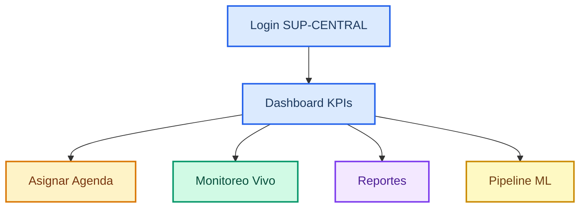
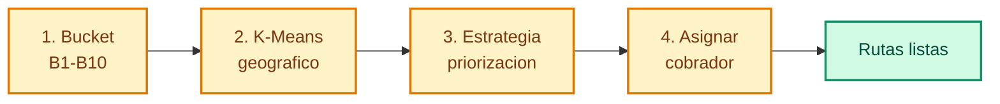
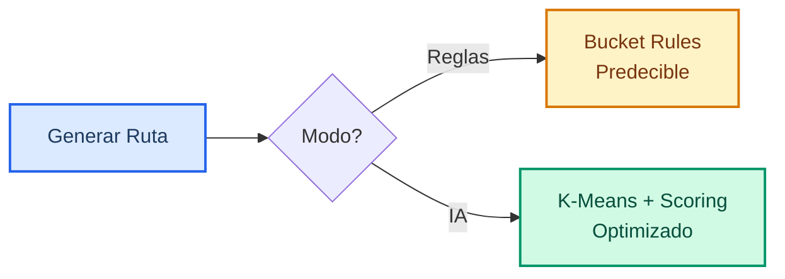
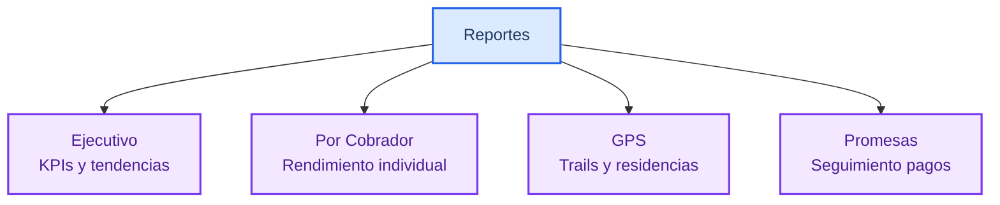
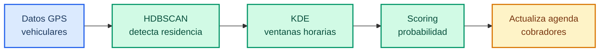
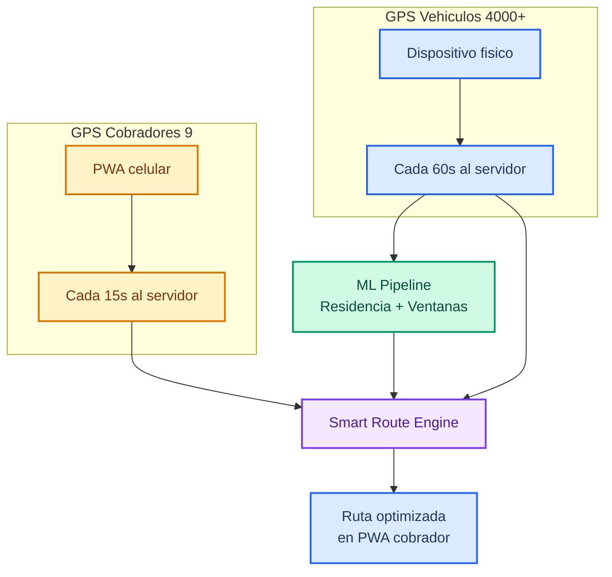

# Manual Supervisor — Dashboard

> Guia completa del dashboard de supervision para la plataforma de Cobranza Inteligente en **time.agentsmx.com/dashboard/**

---

## Contenido

1. [Flujo de Operacion](#_1-flujo-de-operacion)
2. [Acceso al Sistema](#_2-acceso-al-sistema)
3. [Dashboard Principal](#_3-dashboard-principal)
4. [Asignacion de Agenda](#_4-asignacion-de-agenda)
5. [Generacion de Rutas](#_5-generacion-de-rutas)
6. [Monitoreo en Vivo](#_6-monitoreo-en-vivo)
7. [Gestion de Cobradores](#_7-gestion-de-cobradores)
8. [Reportes](#_8-reportes)
9. [Pipeline ML](#_9-pipeline-ml)
10. [Sistema GPS](#_10-sistema-gps)
11. [Reglas por Bucket](#_11-reglas-por-bucket)

---

## 1. Flujo de Operacion

### Flujo General del Supervisor

### Ventajas del Sistema

| Ventaja | Descripcion |
|---------|-------------|
| Asignacion inteligente | K-Means agrupa morosos por zona geografica |
| Rutas optimizadas | Dos modos: por reglas de bucket o por IA |
| Monitoreo en tiempo real | Ubicacion de cobradores y visitas en vivo |
| ML Pipeline | Deteccion automatica de residencias y ventanas horarias |
| Scoring multi-nivel | 3 niveles de puntuacion con multiplicadores |
| Re-optimizacion automatica | Cada 5 min reordena paradas segun condiciones actuales |

### Diferencias Supervisor vs Cobrador

| Funcion | Supervisor | Cobrador |
|---------|:---:|:---:|
| Dashboard con KPIs | Si | No |
| Wizard de asignacion | Si | No |
| Mapa en vivo de cobradores | Si | No |
| Generar/modificar rutas | Si | No |
| Ver todas las visitas | Si | Solo las suyas |
| Ejecutar ML Pipeline | Si | No |
| Registrar visitas | No | Si |
| Navegar a clientes | No | Si |
| Alertas de proximidad | No | Si |
| Iniciar ruta desde ubicacion | No | Si |

---

## 2. Acceso al Sistema

### Pantalla de Login

### Ingresar al dashboard

1. Abre tu navegador y ve a **time.agentsmx.com/dashboard/login**.
2. Ingresa tus credenciales:

| Campo | Valor |
|-------|-------|
| Usuario | SUP-CENTRAL |
| Contrasena | Proporcionada por administracion |

3. Presiona **Iniciar sesion**.

### URLs por rol

| Rol | URL de acceso |
|-----|---------------|
| Supervisor | time.agentsmx.com/dashboard/ |
| Cobrador | time.agentsmx.com/mi-agenda/ |

---

## 3. Dashboard Principal

Al ingresar veras el panel con los indicadores clave de operacion.

### KPIs generales

| Indicador | Descripcion |
|-----------|-------------|
| Morosos totales | Numero total de cuentas morosas en cartera |
| Asignados | Cuentas que ya tienen cobrador asignado |
| Completados | Visitas realizadas en el periodo actual |
| Monto recuperado | Suma de pagos recibidos y promesas cumplidas |

### Graficas de rendimiento

- **Efectividad diaria:** Porcentaje de visitas con resultado positivo vs negativo.
- **Tendencia semanal:** Comparacion de rendimiento semana a semana.
- **Distribucion por bucket:** Cuantas cuentas hay en cada nivel de morosidad.
- **Mapa de calor:** Zonas con mayor concentracion de morosos.

---

## 4. Asignacion de Agenda

El wizard te guia paso a paso para asignar cuentas a los cobradores de campo.

### Wizard de 4 pasos

### Paso 1: Seleccionar bucket

Selecciona el bucket de morosidad que deseas trabajar. El sistema muestra las estadisticas de cada uno:

| Bucket | Dias de mora | Tipo |
|--------|-------------|------|
| B1 | 1-15 | Preventiva |
| B2 | 16-30 | Preventiva |
| B3 | 31-60 | Gestion |
| B4 | 61-90 | Gestion |
| B5 | 91-120 | Intensiva |
| B6 | 121-150 | Intensiva |
| B7 | 151-180 | Juridica |
| B8 | 181-270 | Juridica |
| B9 | 271-360 | Juridica |
| B10 | 360+ | Recuperacion |

### Paso 2: Generar paquetes K-Means

1. Presiona **"Generar paquetes"**.
2. El sistema agrupa geograficamente las cuentas usando K-Means.
3. Cada paquete contiene cuentas cercanas entre si para minimizar tiempos de traslado.
4. Veras los paquetes como clusters en el mapa.

### Paso 3: Seleccionar estrategia

Elige como ordenar las cuentas dentro de cada paquete:

| Estrategia | Descripcion | Cuando usarla |
|-----------|-------------|--------------|
| `debt_focused` | Prioriza mayor monto adeudado | Maximizar monto recuperado |
| `gps_online` | Prioriza GPS vehicular activo | Aprovechar ubicacion en tiempo real |
| `time_window` | Prioriza ventana horaria activa | Maximizar probabilidad de contacto |
| `balanced` | Combina todos los factores | Operacion general dia a dia |
| `early_bucket` | Prioriza buckets bajos (B1-B3) | Prevencion de escalamiento |

### Paso 4: Asignar paquete a cobrador

1. Selecciona un paquete del mapa.
2. Selecciona un cobrador de la lista disponible.
3. El sistema muestra la **capacidad del cobrador**: cuentas asignadas vs limite diario.
4. Confirma la asignacion.

::: warning Verificar capacidad
Antes de asignar, revisa que el cobrador no exceda su capacidad diaria recomendada. Un cobrador sobrecargado reduce la calidad de las visitas.
:::

---

## 5. Generacion de Rutas

### Modos de generacion

| Modo | Descripcion | Ventaja |
|------|-------------|---------|
| **Bucket (reglas)** | Rutas segun reglas de negocio por bucket | Predecible, basado en politicas |
| **AI Optimizado** | Agrupacion geografica con K-Means | Reduce traslados, mayor cobertura |

### Generacion automatica

- El sistema genera rutas automaticamente a las **6:00 AM** cada dia.
- Usa el modo configurado como predeterminado (bucket o AI).
- Las rutas se asignan a los cobradores que ya tienen cuentas asignadas.

### Generacion manual

1. Ve a la seccion **"Rutas"** en el menu lateral.
2. Presiona **"Generar ruta manual"**.
3. Selecciona el cobrador.
4. Selecciona el modo (Bucket o AI Optimizado).
5. Presiona **"Generar"**.
6. Revisa la ruta en el mapa y confirma.

### Activar modo AI por defecto

1. Ve a **Configuracion > Generacion de rutas**.
2. Activa el toggle **"Modo AI por defecto"**.
3. A partir de ahora, la generacion automatica de las 6 AM usara K-Means.

---

## 6. Monitoreo en Vivo

### Mapa en vivo

La seccion de monitoreo muestra un mapa con la ubicacion actual de todos los cobradores. Cada cobrador aparece como un marcador con su codigo (COB-GPS-XX).

### Estado de cada ruta

| Estado | Significado |
|--------|------------|
| Pendiente | Ruta generada, cobrador no la ha iniciado |
| En progreso | Cobrador esta visitando clientes |
| Completada | Todas las visitas terminadas |
| Parcial | Jornada finalizada sin completar todas las visitas |

### Alertas de re-optimizacion

El sistema puede sugerir cambios en las rutas durante el dia:
- Si un cobrador esta atrasado, puede redistribuir visitas a otro cobrador cercano.
- Si se detecta un vehiculo en casa (via GPS), alerta al cobrador mas cercano.
- Las alertas aparecen como notificaciones en la parte superior del dashboard.

---

## 7. Gestion de Cobradores

### Ver lista de cobradores

En la seccion **"Cobradores"** del menu lateral puedes ver:

| Columna | Descripcion |
|---------|-------------|
| Codigo | Identificador (COB-GPS-XX) |
| Nombre | Nombre completo |
| Estado | Activo / Inactivo |
| Cuentas asignadas | Numero actual de cuentas en su agenda |
| Capacidad diaria | Limite de visitas por dia |
| GPS vehicular | Dispositivo GPS asignado a su vehiculo |

### Asignar y desasignar buckets

1. Selecciona un cobrador de la lista.
2. En la seccion **"Buckets asignados"**, agrega o quita los buckets que debe trabajar.
3. Guarda los cambios.

### Ver capacidad y carga

Cada cobrador tiene una vista de capacidad que muestra:
- Visitas pendientes para hoy
- Visitas completadas hoy
- Porcentaje de avance
- Carga acumulada de la semana

### Dispositivos GPS asignados

Lista de dispositivos GPS instalados en los vehiculos de los cobradores, con:
- Modelo del dispositivo
- Ultima conexion
- Estado (en linea / fuera de linea)

---

## 8. Reportes

### Tipos de reportes

### Reporte ejecutivo

Resumen de alto nivel con:
- Efectividad general (porcentaje de visitas positivas)
- Montos recuperados vs meta
- Tendencias de los ultimos 30 dias
- Comparacion entre cobradores

### Reporte por cobrador

| Metrica | Descripcion |
|---------|-------------|
| Visitas realizadas | Total de visitas en el periodo |
| Promesas obtenidas | Numero de promesas de pago |
| Tasa de contacto | Porcentaje donde se contacto al titular |
| Rutas completadas | Porcentaje de rutas terminadas al 100% |
| Tiempo promedio por visita | Minutos promedio en cada parada |

### Reporte de GPS

Informacion derivada de los dispositivos GPS vehiculares:
- **Trails:** Rutas de movimiento de los vehiculos de los morosos.
- **Residencias detectadas:** Direcciones donde el vehiculo pernocta frecuentemente.
- **Patrones de movimiento:** Horarios en que el vehiculo se mueve o permanece estacionado.

### Reporte de promesas

| Columna | Descripcion |
|---------|-------------|
| Cliente | Nombre y numero de credito |
| Fecha prometida | Cuando se comprometio a pagar |
| Monto prometido | Cuanto va a pagar |
| Estado | Cumplida / Pendiente / Vencida / Incumplida |
| Cobrador | Quien registro la promesa |

---

## 9. Pipeline ML

El pipeline de Machine Learning analiza los datos GPS para generar inteligencia sobre los morosos.

### Flujo del Pipeline

### Ejecutar pipeline

1. Ve a la seccion **"ML Pipeline"** en el menu lateral.
2. Presiona **"Ejecutar pipeline"**.
3. El proceso tarda entre 5 y 30 minutos dependiendo del volumen de datos.
4. Al terminar, los resultados se actualizan automaticamente en las agendas de los cobradores.

### Resultados del pipeline

| Resultado | Descripcion |
|-----------|-------------|
| Residencias detectadas | Direcciones donde el vehiculo pernocta, diferentes a la del credito |
| Ventanas horarias | Franjas de tiempo en que el vehiculo esta en la residencia |
| Predicciones de presencia | Probabilidad de encontrar el vehiculo por dia y hora |

### Niveles de confianza

| Nivel | Significado | Criterio |
|-------|------------|---------|
| **Alta** | Certeza razonable | Mas de 20 noches en la misma ubicacion |
| **Media** | Patron con variaciones | Entre 10 y 20 noches detectadas |
| **Baja** | Datos insuficientes | Menos de 10 noches detectadas |

Los niveles de confianza se muestran en la vista 360 de cada cliente y afectan la priorizacion en las agendas.

---

## 10. Sistema GPS

Como supervisor, tienes acceso a toda la infraestructura GPS del sistema.

### Arquitectura GPS

### GPS de Vehiculos — Lo que ve el supervisor

| Dato | Donde verlo | Para que sirve |
|------|-------------|---------------|
| Online/offline | Mapa en vivo + detalle cliente | Saber si el GPS esta activo |
| Ultima posicion | Mapa en vivo | Localizar vehiculo en tiempo real |
| Residencia (ML) | Detalle cliente, seccion ML | Donde vive realmente el moroso |
| Ventanas horarias | Detalle cliente, seccion ventanas | A que hora visitar |
| Confianza | Pipeline ML, resultados | Alta, Media o Baja |
| Trail vehicular | Reportes GPS | Historial de movimientos |

### GPS de Cobradores — Lo que ve el supervisor

| Dato | Donde verlo | Para que sirve |
|------|-------------|---------------|
| Posicion actual | Mapa en vivo | Donde esta cada cobrador |
| Ruta recorrida | Reportes cobrador, trail | Verificar que fue a las direcciones |
| Hora de inicio | Estado de rutas | Verificar puntualidad |
| Distancia recorrida | Reporte diario | Medir eficiencia |
| Visitas con GPS | Historial de visitas | Evidencia de presencia |

### Flujo de datos GPS

```mermaid
flowchart LR
    A["GPS fisico\nvehiculo"]:::blue -->|"60s"| B["Backend\npositions DB"]:::blue
    B -->|"Semanal"| C["ML Pipeline\nresidencia"]:::green
    C --> D["Ventanas en BD"]:::green
    D -->|"Diario 6AM"| E["Generador\nde rutas"]:::amber
    E --> F["PWA cobrador"]:::amber
    F -->|"5 min"| G["Smart Optimizer\nre-ordena"]:::purple

    classDef blue fill:#dbeafe,stroke:#2563eb,stroke-width:2px,color:#1e3a5f
    classDef green fill:#d1fae5,stroke:#059669,stroke-width:2px,color:#064e3b
    classDef amber fill:#fef3c7,stroke:#d97706,stroke-width:2px,color:#78350f
    classDef purple fill:#f3e8ff,stroke:#7c3aed,stroke-width:2px,color:#4c1d95
```

### Estadisticas del GPS

| Metrica | Valor actual |
|---------|:---:|
| Vehiculos con GPS | 4,000+ |
| Cuentas GPS (Datamovil) | 4 cuentas (1000+499+1000+1000) |
| Morosos con GPS activo | 172 de 794 (21.7%) |
| Residencias detectadas | 165 de 172 (96%) |
| Cobradores con tracking | 9 activos |
| Frecuencia vehiculos | Cada 60 segundos |
| Frecuencia cobradores | Cada 15 segundos |

### Situaciones comunes del GPS

| Situacion | Que indica | Que hacer |
|-----------|-----------|-----------|
| Vehiculo online en casa | Moroso probablemente en domicilio | Priorizar visita |
| Vehiculo online pero lejos | Moroso salio de casa | Esperar o visitar en ventana horaria |
| Vehiculo offline >7 dias | GPS desconectado | Marcar como visita prioritaria |
| Vehiculo en taller conocido | En proceso de adjudicacion | No visitar |
| Cobrador sin GPS | Celular sin senal o GPS apagado | Sistema usa GPS vehiculo como fallback |

---

## 11. Reglas por Bucket

Cada bucket tiene reglas especificas que determinan la frecuencia de visitas, promesas permitidas y montos minimos.

### Tabla de reglas B1-B10

| Bucket | Dias mora | Frecuencia visita | Promesas | Monto minimo | Tipo |
|--------|----------|-------------------|----------|--------------|------|
| B1 | 1-15 | 1x semana | 2 | 1 mensualidad | Preventiva |
| B2 | 16-30 | 2x semana | 2 | 1 mensualidad | Preventiva |
| B3 | 31-60 | 2x semana | 1 | 2 mensualidades | Gestion |
| B4 | 61-90 | 3x semana | 1 | 2 mensualidades | Gestion |
| B5 | 91-120 | Diaria | 1 | 3 mensualidades | Intensiva |
| B6 | 121-150 | Diaria | 1 | Liquidacion/convenio | Intensiva |
| B7 | 151-180 | Diaria | 0 | Liquidacion | Juridica |
| B8 | 181-270 | Oportunista | 0 | Liquidacion | Juridica |
| B9 | 271-360 | Oportunista | 0 | Liquidacion | Juridica |
| B10 | 360+ | Oportunista | 0 | Recuperacion vehicular | Recuperacion |

### Escalamiento entre buckets

Un cliente escala automaticamente al siguiente bucket cuando:
- Se cumple el rango de dias de mora del siguiente nivel.
- Incumple una promesa de pago.
- No se logra contacto en el periodo establecido.

El escalamiento ocurre de forma automatica. El supervisor es notificado cuando un cliente cambia de bucket.

### Visitas oportunistas (B5-B10)

Para buckets altos (B5 en adelante), el sistema genera **visitas oportunistas**:
- No se programan en la ruta regular.
- Aparecen como alertas cuando el cobrador pasa cerca del moroso.
- Se activan solo si el GPS vehicular indica que el vehiculo esta en la ubicacion.
- El cobrador decide si realiza la visita o continua con su ruta.

::: info Nota
Las visitas oportunistas son especialmente efectivas en B8-B10 donde los clientes son dificiles de localizar. El GPS vehicular permite detectar cuando estan disponibles sin gastar recursos en visitas programadas.
:::

---

## Credenciales de acceso rapido

| Dato | Valor |
|------|-------|
| URL Dashboard | **time.agentsmx.com/dashboard/** |
| Login | **time.agentsmx.com/dashboard/login** |
| Formato de usuario supervisor | SUP-CENTRAL |
| Contrasena | Proporcionada por administracion |
| URL PWA Cobrador | **time.agentsmx.com/mi-agenda/** |
| Formato de usuario cobrador | COB-GPS-XX |
| Soporte | Contactar al administrador del sistema |
