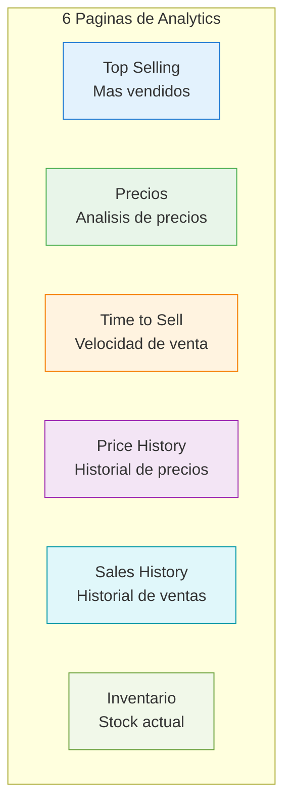
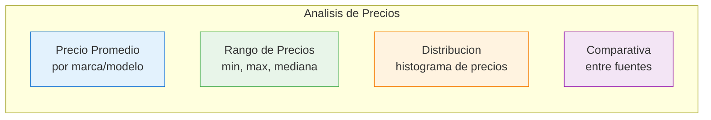
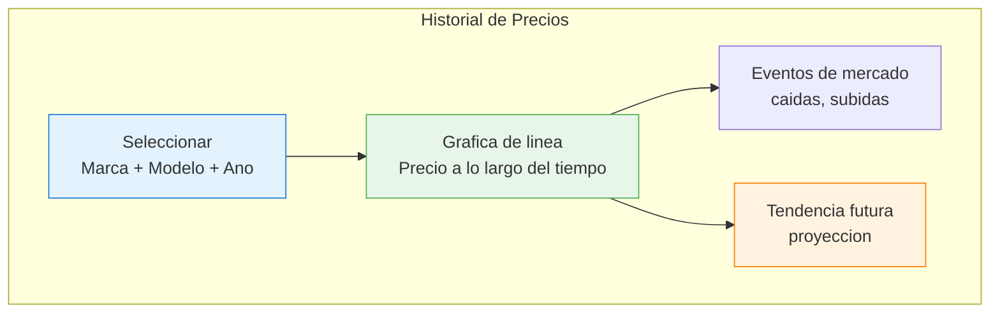
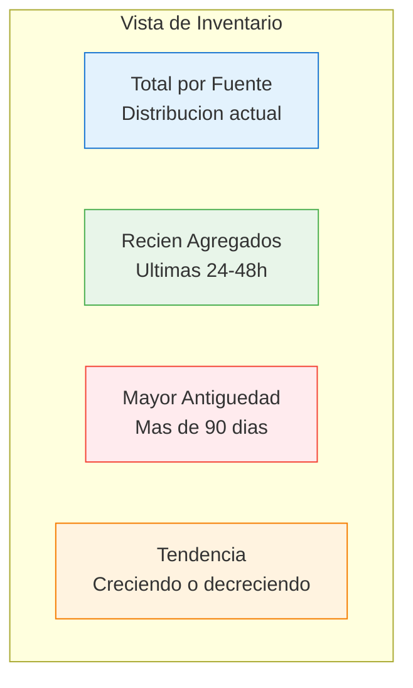

# Analytics

El modulo de analytics ofrece **6 paginas especializadas** de analisis del mercado automotriz, cada una con filtros avanzados y visualizaciones interactivas.

## Paginas de Analytics

## Filtros Comunes

Todas las paginas comparten un panel de filtros:

| Filtro | Descripcion | Opciones |
|--------|------------|---------|
| Fuente | Origen de los datos | 18 fuentes, seleccion multiple |
| Marca | Marca del vehiculo | Nissan, VW, Chevrolet, etc. |
| Modelo | Modelo especifico | Versa, Jetta, Aveo, etc. |
| Ano | Ano del modelo | 2015 - 2026 |
| Ubicacion | Estado o ciudad | 32 estados |
| Rango de precio | Precio min/max | Slider o input numerico |
| Periodo | Rango de fechas | 7d, 30d, 90d, 1y, custom |

## 1. Top Selling

Identifica los vehiculos con mayor rotacion en el mercado.

### Metricas

| Metrica | Descripcion |
|---------|------------|
| Marca/Modelo mas vendido | Combinacion con mayor numero de ventas |
| Unidades vendidas | Conteo de vehiculos que salieron del inventario |
| Tiempo promedio en inventario | Dias promedio antes de venderse |
| Precio promedio de venta | Precio al que se vendieron |

### Visualizaciones

- **Tabla ranking** de top 20 modelos mas vendidos
- **Grafica de barras** comparativa por marca
- **Heatmap** de ventas por marca y rango de precio
- **Tendencia** de ventas por semana/mes

## 2. Precios

Analisis detallado de precios del mercado.

### Visualizaciones

- **Box plot** de precios por marca (mediana, cuartiles, outliers)
- **Histograma** de distribucion de precios
- **Tabla comparativa** de precios entre fuentes para el mismo modelo
- **Scatter plot** precio vs ano del modelo

## 3. Time to Sell

Analiza la velocidad a la que se venden los vehiculos.

### Metricas

| Metrica | Descripcion |
|---------|------------|
| Dias promedio en inventario | Tiempo medio antes de venta |
| Mediana de tiempo | Tiempo mediano (menos afectado por outliers) |
| % vendidos en <7 dias | Proporcion de venta rapida |
| % vendidos en <30 dias | Proporcion de venta en primer mes |
| Vehiculos estancados | Mas de 90 dias sin venderse |

### Visualizaciones

- **Histograma** de distribucion de dias hasta la venta
- **Grafica de barras** por marca — tiempo promedio
- **Linea de tendencia** mensual del tiempo de venta
- **Tabla** de modelos con menor y mayor tiempo de venta

## 4. Price History

Seguimiento de la evolucion de precios en el tiempo.

### Funcionalidades

- Seleccionar vehiculo especifico (marca + modelo + ano)
- Ver precio promedio por semana/mes
- Comparar hasta 4 vehiculos en la misma grafica
- Identificar tendencias de depreciacion
- Ver variacion entre fuentes para el mismo vehiculo

## 5. Sales History

Historial completo de ventas detectadas.

### Metricas

| Metrica | Descripcion |
|---------|------------|
| Ventas por periodo | Conteo de ventas por dia/semana/mes |
| Monto total vendido | Suma de precios de vehiculos vendidos |
| Ticket promedio | Precio promedio de venta |
| Variacion vs periodo anterior | Cambio porcentual |

### Visualizaciones

- **Grafica de area** de ventas acumuladas por mes
- **Barras apiladas** de ventas por fuente
- **Tabla detallada** de cada venta detectada
- **Comparativo** mes vs mes anterior

## 6. Inventario

Estado actual del stock de vehiculos en todas las fuentes.

### Funcionalidades

- **Vista de tabla** con todos los vehiculos activos, paginada y con busqueda
- **Filtro por antiguedad** en inventario (recientes, >30d, >60d, >90d)
- **Detalle de vehiculo** con todas las fotos, especificaciones y historial de precio
- **Alertas** de vehiculos con precios inusuales (posibles errores de scraping)
- **Exportar** inventario filtrado a CSV/Excel

## Exportacion de Datos

Todas las paginas de analytics permiten exportar:

| Formato | Contenido |
|---------|-----------|
| CSV | Datos tabulares crudos |
| Excel | Tablas con formato y graficas embebidas |
| Imagen PNG | Captura de la grafica actual |

::: tip Filtros Persistentes
Los filtros seleccionados se mantienen al navegar entre paginas de analytics. Para limpiar todos los filtros, usa el boton "Limpiar Filtros".
:::
