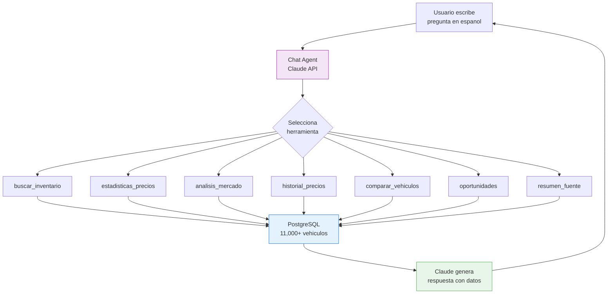
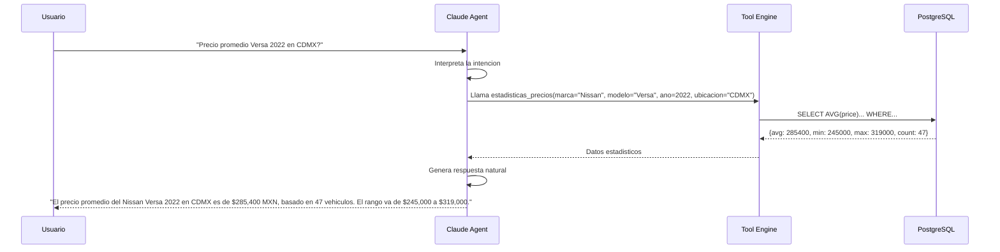

# Chat IA

El Chat IA permite hacer consultas en **lenguaje natural** sobre los datos del marketplace. Potenciado por **Claude API**, tiene acceso a 7 herramientas especializadas para buscar inventario, analizar precios, generar estadisticas y mas.

## Arquitectura del Chat



## 7 Herramientas Disponibles

El agente de chat tiene acceso a las siguientes herramientas que puede invocar automaticamente:

### 1. buscar_inventario

Busca vehiculos en la base de datos con filtros.

| Parametro | Tipo | Descripcion |
|-----------|------|------------|
| marca | string | Marca del vehiculo |
| modelo | string | Modelo especifico |
| ano_min / ano_max | number | Rango de anos |
| precio_min / precio_max | number | Rango de precios |
| fuente | string | Fuente de scraping |
| ubicacion | string | Estado o ciudad |
| limit | number | Maximo de resultados |

### 2. estadisticas_precios

Calcula estadisticas de precios para un segmento.

| Parametro | Tipo | Descripcion |
|-----------|------|------------|
| marca | string | Marca del vehiculo |
| modelo | string | Modelo (opcional) |
| ano | number | Ano del modelo (opcional) |
| agrupacion | string | Por marca, modelo, ano, fuente, ubicacion |

**Retorna**: promedio, mediana, minimo, maximo, desviacion estandar, conteo

### 3. analisis_mercado

Genera un analisis del mercado para un segmento.

| Parametro | Tipo | Descripcion |
|-----------|------|------------|
| segmento | string | Sedan, SUV, Pickup, etc. |
| marca | string | Marca (opcional) |
| periodo | string | 7d, 30d, 90d |

### 4. historial_precios

Muestra la evolucion de precios de un vehiculo especifico.

| Parametro | Tipo | Descripcion |
|-----------|------|------------|
| marca | string | Marca |
| modelo | string | Modelo |
| ano | number | Ano |
| periodo | string | Rango de tiempo |

### 5. comparar_vehiculos

Compara dos o mas vehiculos.

| Parametro | Tipo | Descripcion |
|-----------|------|------------|
| vehiculos | array | Lista de marca+modelo+ano a comparar |

### 6. oportunidades

Encuentra vehiculos subvaluados.

| Parametro | Tipo | Descripcion |
|-----------|------|------------|
| marca | string | Marca (opcional) |
| descuento_min | number | % minimo de descuento |
| precio_max | number | Presupuesto maximo |

### 7. resumen_fuente

Resume el inventario de una fuente especifica.

| Parametro | Tipo | Descripcion |
|-----------|------|------------|
| fuente | string | Nombre de la fuente (kavak, albacar, etc.) |

## Ejemplos de Consultas

### Consultas de Busqueda

```
"Muestra los Nissan Versa 2022 disponibles en Kavak"
"Que SUVs hay por menos de $300,000?"
"Busca Toyota Corolla 2020-2023 en CDMX"
```

### Consultas de Precios

```
"Cual es el precio promedio de una Honda CR-V 2021?"
"Compara precios del Jetta entre Kavak y Albacar"
"Que marca tiene los precios mas bajos para SUVs?"
```

### Consultas de Mercado

```
"Como esta el mercado de sedanes este mes?"
"Cuales son los autos que mas rapido se venden?"
"Que tendencia tienen los precios de Mazda 3?"
```

### Consultas de Oportunidades

```
"Hay alguna oportunidad en pickups por menos de $400,000?"
"Que vehiculo tiene el mayor descuento ahora?"
"Encuentra Volkswagen subvaluados"
```

## Flujo de una Consulta



## Interfaz del Chat

La interfaz de chat incluye:

- **Campo de texto** para escribir la consulta
- **Historial de conversacion** con formato de burbujas
- **Tablas y graficas** embebidas en las respuestas cuando aplica
- **Links a vehiculos** especificos mencionados en las respuestas
- **Sugerencias de consultas** para usuarios nuevos
- **Boton de exportar** para guardar la conversacion

## Limitaciones

| Limitacion | Detalle |
|-----------|---------|
| Solo datos del marketplace | No accede a datos externos |
| Datos tan frescos como el ultimo scraping | No es tiempo real del mercado |
| Consultas complejas | Puede requerir reformular la pregunta |
| Idioma | Optimizado para consultas en espanol |

::: tip Mejores Resultados
Para obtener respuestas mas precisas, incluye marca, modelo, ano y ubicacion en tu consulta. Mientras mas especifico, mejores datos recibiras.
:::
