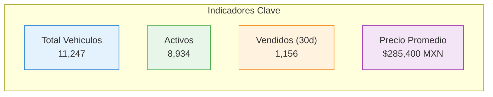
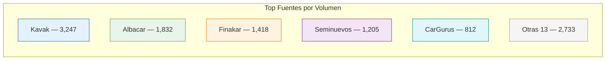
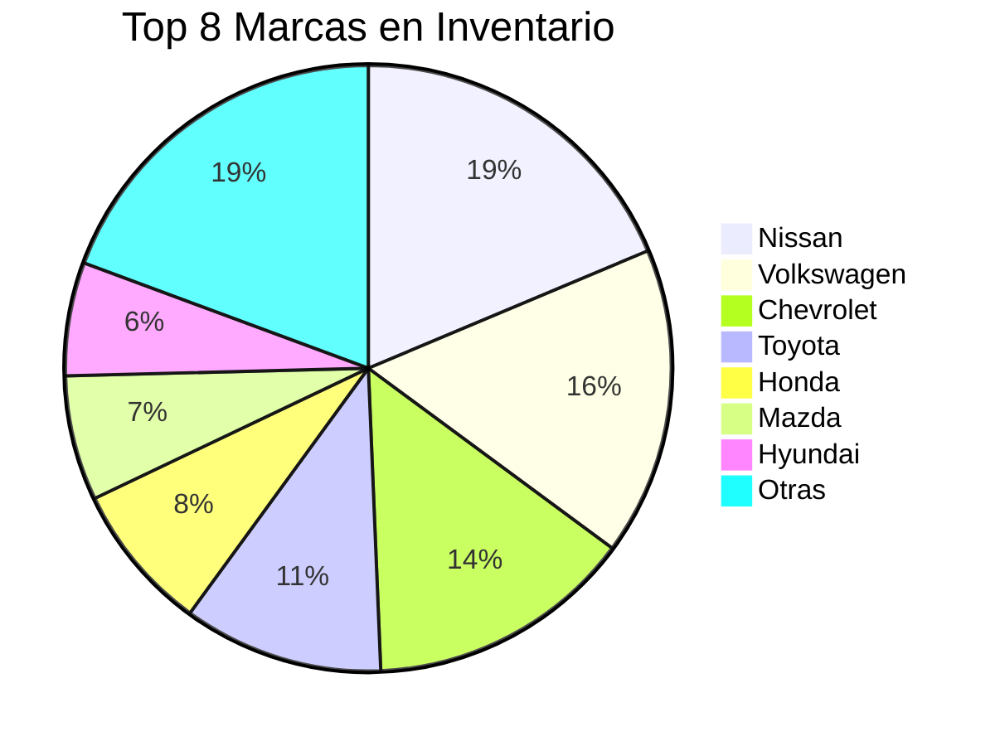

# Dashboard Principal

El dashboard principal del Marketplace presenta una vista consolidada de los **11,000+ vehiculos** con KPIs clave, distribucion por fuente y actividad reciente del sistema.

## KPIs Principales

| KPI | Descripcion | Actualizacion |
|-----|------------|---------------|
| **Total Vehiculos** | Vehiculos unicos en la base de datos | Despues de cada scraping |
| **Activos** | Vehiculos actualmente a la venta | Tiempo real |
| **Vendidos (30d)** | Vehiculos que salieron del inventario en los ultimos 30 dias | Diario |
| **Precio Promedio** | Precio promedio de vehiculos activos | Tiempo real |

## Distribucion por Fuente

Grafica de barras horizontales mostrando cuantos vehiculos aporta cada fuente:

### Metricas por Fuente

Cada fuente muestra en detalle:

| Metrica | Descripcion |
|---------|------------|
| Vehiculos activos | Cantidad actualmente publicada |
| Ultimo scraping | Fecha y hora del ultimo scraping exitoso |
| Vehiculos nuevos (24h) | Agregados en las ultimas 24 horas |
| Vehiculos removidos (24h) | Que desaparecieron del inventario |
| Precio promedio | Precio promedio de esa fuente |
| Tasa de scraping | Exito del ultimo scraping (%) |

## Distribucion por Marca

Grafica de pie o donut mostrando las marcas mas representadas:

## Actividad Reciente

Feed cronologico de eventos del sistema:

| Hora | Evento | Detalle |
|------|--------|---------|
| 14:32 | Scraping completado | Kavak — 3,247 vehiculos, 45 nuevos |
| 14:15 | Scraping completado | Albacar — 1,832 vehiculos, 12 nuevos |
| 13:50 | Reporte generado | "Analisis top selling Nissan Q1 2026" |
| 13:30 | Chat IA | Consulta: "Precio promedio Versa 2022 CDMX" |
| 12:00 | Scraping completado | Finakar — 1,418 vehiculos, 28 nuevos |

## Tendencias

### Grafica de Inventario (30 dias)

Linea de tiempo mostrando la evolucion del inventario total en los ultimos 30 dias:

- **Linea azul**: Vehiculos activos totales
- **Linea verde**: Nuevos agregados por dia
- **Linea roja**: Removidos (vendidos/deslistados) por dia

### Grafica de Precios (30 dias)

Evolucion del precio promedio general y por marca top:

- **Linea principal**: Precio promedio general
- **Lineas secundarias**: Top 5 marcas

## Filtros Globales

El dashboard permite aplicar filtros que afectan todas las secciones:

| Filtro | Opciones |
|--------|---------|
| Fuente | Seleccion multiple de las 18 fuentes |
| Marca | Todas las marcas disponibles |
| Rango de precio | Precio minimo y maximo |
| Ano | Rango de anos del modelo |
| Ubicacion | Estado o ciudad |
| Periodo | 7d, 30d, 90d, personalizado |

## Acciones Rapidas

Desde el dashboard el usuario puede:

- **Ir a Analytics** — Abrir cualquiera de las 6 paginas de analisis
- **Buscar vehiculo** — Busqueda rapida por marca, modelo o ID
- **Abrir Chat IA** — Hacer preguntas en lenguaje natural
- **Generar Reporte** — Crear un reporte rapido del estado actual
- **Ver Scraper Status** — Estado de los 18 scrapers
