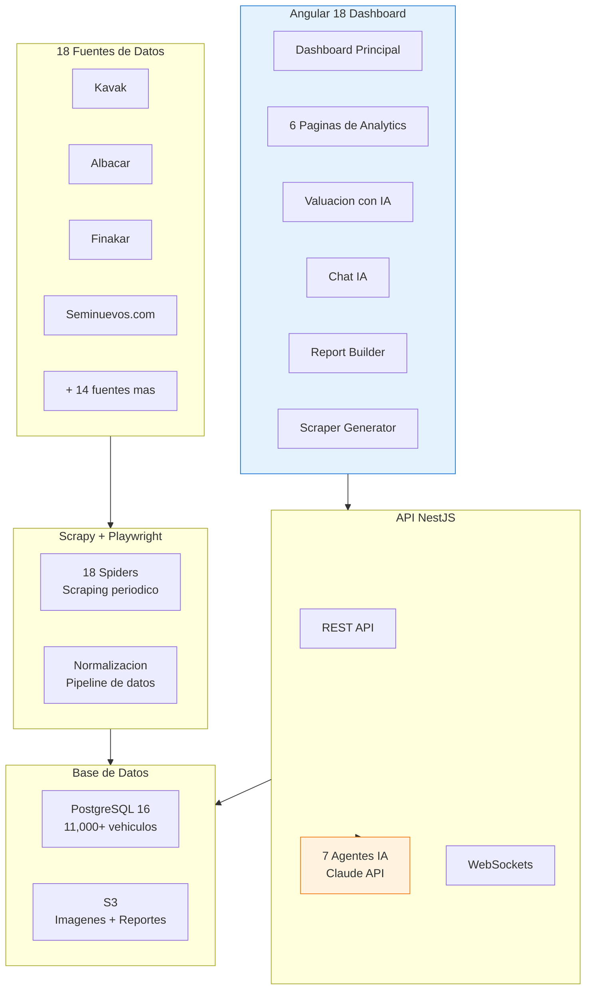
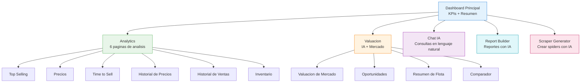
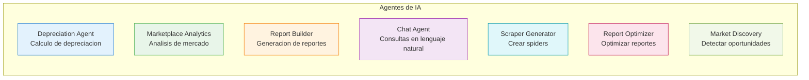

# Marketplace Dashboard

El **Marketplace Dashboard** es una plataforma de analytics automotriz construida en Angular 18 que consolida datos de **11,000+ vehiculos** de **18 fuentes** de scraping, con inteligencia artificial integrada para analisis, valuacion y generacion de reportes.

## Arquitectura del Marketplace

## Modulos del Dashboard

## Navegacion

| Seccion | Funcion | Enlace |
|---------|---------|--------|
| Dashboard Principal | KPIs y resumen general | [Dashboard](./dashboard) |
| Analytics | 6 paginas de analisis de mercado | [Analytics](./analytics) |
| Valuacion | Valuacion con IA y oportunidades | [Valuacion](./valuacion) |
| Chat IA | Consultas en lenguaje natural | [Chat IA](./chat-ai) |
| Report Builder | Generacion de reportes con IA | [Reportes](./reportes) |
| Scraper Generator | Crear nuevos spiders con IA | [Scraper Generator](./scraper-generator) |

## Fuentes de Datos

Los datos provienen de 18 fuentes de scraping que se ejecutan periodicamente:

| Fuente | Tipo | Frecuencia | Vehiculos Aprox. |
|--------|------|-----------|-----------------|
| Kavak | Marketplace | Diario | 3,200+ |
| Albacar | Financiera | Diario | 1,800+ |
| Finakar | Financiera | Diario | 1,400+ |
| Seminuevos.com | Clasificados | Diario | 1,200+ |
| CarGurus MX | Marketplace | Semanal | 800+ |
| AutoCosmos | Clasificados | Semanal | 600+ |
| + 12 fuentes | Varios | Variable | 2,000+ |

## 7 Agentes de IA

El marketplace integra 7 agentes de inteligencia artificial potenciados por Claude:

## Tecnologias

| Tecnologia | Uso |
|-----------|-----|
| Angular 18 | Frontend SPA |
| NestJS | API Backend |
| PostgreSQL 16 | Base de datos principal |
| Scrapy + Playwright | Web scraping |
| Claude API | 7 agentes de IA |
| Chart.js / ngx-charts | Graficas y visualizaciones |
| WebSockets | Actualizaciones en tiempo real |
| S3 | Almacenamiento de imagenes y reportes |
