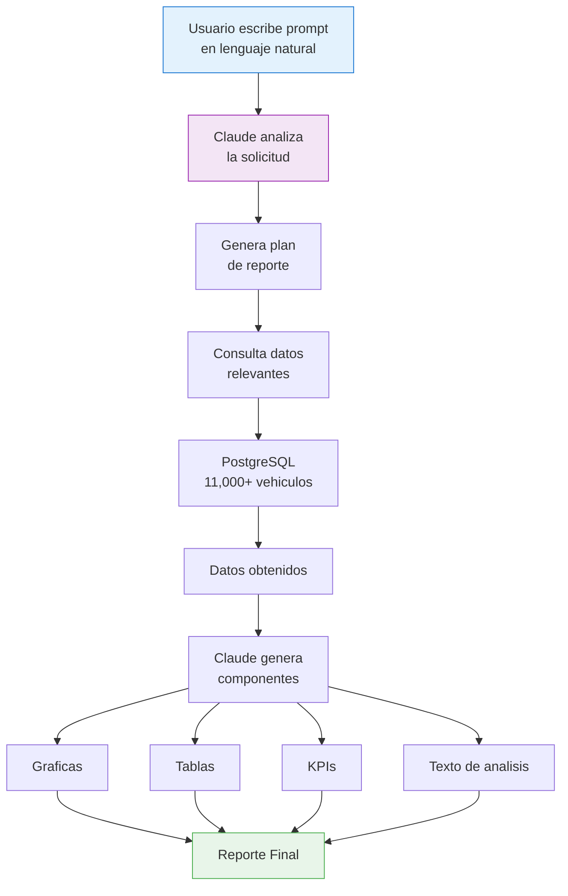
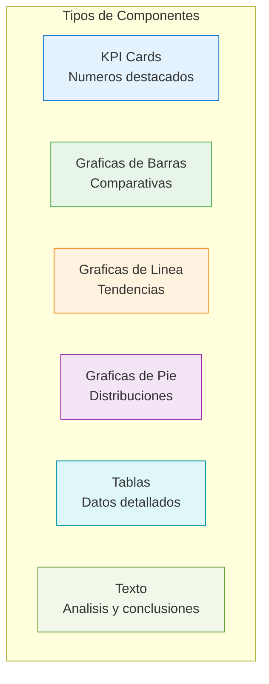

# Report Builder

El Report Builder permite generar reportes completos a partir de un **prompt en lenguaje natural**. Claude analiza la solicitud, consulta los datos y genera automaticamente graficas, tablas y KPIs.

## Flujo de Generacion



## Como Crear un Reporte

### Paso 1 — Escribir el Prompt

Describe en lenguaje natural que reporte necesitas. Ejemplos:

```
"Reporte de los 10 vehiculos mas vendidos del mes pasado por marca"

"Analisis de precios de SUVs en CDMX vs Guadalajara"

"Resumen del inventario de Kavak vs Albacar — comparar cantidad,
precios promedio y tiempo de venta"

"Reporte mensual de ventas con tendencias y prediccion para Q2 2026"
```

### Paso 2 — Claude Genera el Reporte

El sistema:

1. **Interpreta** la solicitud y define las metricas necesarias
2. **Consulta** la base de datos con las queries apropiadas
3. **Genera componentes** visuales automaticamente
4. **Redacta** texto de analisis y conclusiones

### Paso 3 — Revisar y Ajustar

El reporte generado es editable:

| Accion | Descripcion |
|--------|------------|
| Modificar titulo | Click en el titulo para editarlo |
| Reordenar secciones | Drag & drop de componentes |
| Ajustar graficas | Cambiar tipo de grafica (barras, linea, pie) |
| Editar texto | Modificar el analisis generado |
| Agregar seccion | Pedir a Claude una seccion adicional |
| Regenerar | Pedir a Claude que rehaga una seccion especifica |

## Componentes de un Reporte



### KPI Cards

Numeros grandes con contexto:

- Valor principal (ej: "$285,400 MXN")
- Etiqueta (ej: "Precio Promedio")
- Variacion (ej: "+3.2% vs mes anterior")
- Icono y color segun tendencia

### Graficas

El sistema selecciona automaticamente el tipo de grafica mas apropiado:

| Tipo | Uso |
|------|-----|
| Barras | Comparaciones entre categorias |
| Barras apiladas | Composicion por segmentos |
| Linea | Tendencias en el tiempo |
| Area | Volumen en el tiempo |
| Pie / Donut | Distribucion porcentual |
| Scatter | Correlacion entre variables |

### Tablas

Tablas con datos detallados, ordenables y filtrables dentro del reporte.

## Guardar y Compartir

### Guardar Reporte

- **Nombre**: Asignar nombre descriptivo
- **Categoria**: Clasificar (Ventas, Precios, Inventario, Custom)
- **Accesible desde**: "Mis Reportes" en el menu lateral

### Exportar

| Formato | Contenido |
|---------|-----------|
| CSV | Datos tabulares de todas las tablas |
| Excel (.xlsx) | Tablas con formato + graficas como imagenes |
| PDF | Reporte completo maquetado |
| Imagen PNG | Captura de una seccion o grafica especifica |

### Compartir

- **Link de solo lectura**: Generar URL para compartir sin edicion
- **Duplicar reporte**: Crear copia para otro usuario
- **Programar envio**: Enviar por correo en fecha/hora especifica

## Reportes Guardados

La seccion "Mis Reportes" muestra:

| Campo | Descripcion |
|-------|------------|
| Nombre | Nombre del reporte |
| Fecha creacion | Cuando fue generado |
| Categoria | Clasificacion |
| Ultima edicion | Fecha de ultima modificacion |
| Acciones | Abrir, duplicar, exportar, eliminar |

## Modificar con IA

Despues de generar un reporte, puedes pedir modificaciones en lenguaje natural:

```
"Agrega una seccion comparando con el trimestre anterior"

"Cambia la grafica de barras por una de linea"

"Agrega el desglose por estado para la tabla de precios"

"Resume las conclusiones en 3 puntos clave"
```

El Report Optimizer Agent mejora automaticamente la calidad del reporte sugiriendo:

- Graficas mas apropiadas para los datos
- KPIs faltantes relevantes
- Mejor organizacion de secciones
- Texto mas claro y conciso

::: tip Reutilizar Prompts
Los mejores prompts se pueden guardar como plantillas para generar reportes recurrentes con datos actualizados.
:::
