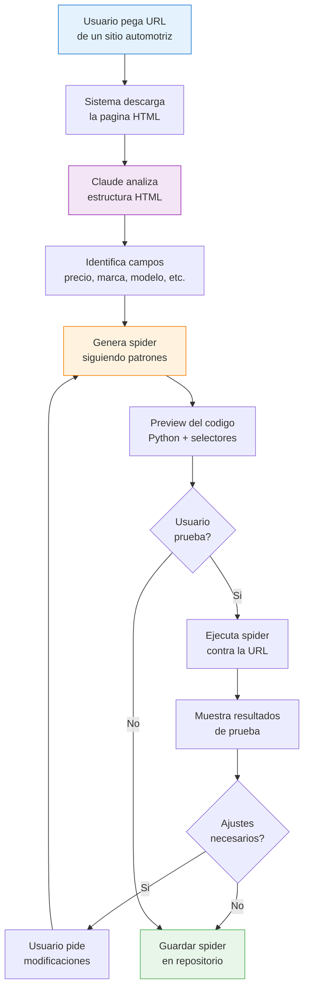
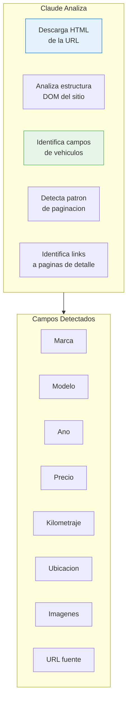
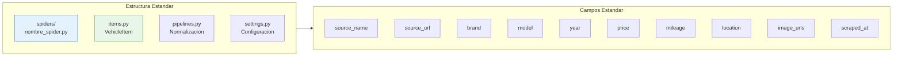
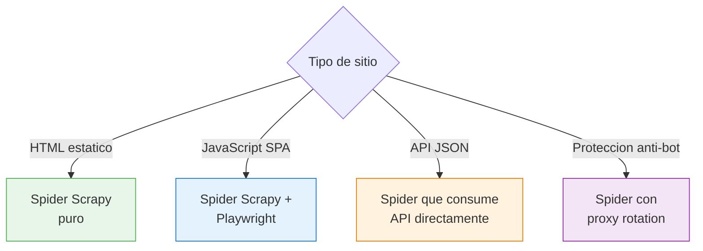

# Scraper Generator

El Scraper Generator permite crear nuevos **spiders de Scrapy** automaticamente usando inteligencia artificial. El usuario pega una URL, Claude analiza la estructura HTML y genera un spider completo que sigue los patrones de `mod_scrapper_nacional`.

## Flujo de Generacion



## Como Usar

### Paso 1 — Pegar la URL

Ingresa la URL de un sitio de venta de vehiculos. Puede ser:

- Pagina de listado (busqueda con multiples vehiculos)
- Pagina de detalle de un vehiculo individual
- Pagina de catalogo

Ejemplos validos:
```
https://www.ejemplo-autos.com/seminuevos
https://www.otrasource.mx/vehiculos?tipo=suv
https://marketplace.com/auto/nissan-versa-2022
```

### Paso 2 — Analisis con IA

Claude descarga y analiza el HTML de la pagina:



### Paso 3 — Codigo Generado

Claude genera un spider de Scrapy completo que sigue los patrones de `mod_scrapper_nacional`:

### Estructura del Spider Generado

| Componente | Descripcion |
|-----------|------------|
| Clase Spider | Hereda de `scrapy.Spider` con nombre y dominios permitidos |
| start_urls | URL inicial para el crawling |
| parse() | Metodo principal que extrae links de listado |
| parse_detail() | Extrae datos de la pagina de detalle |
| Selectores CSS/XPath | Selectores para cada campo del vehiculo |
| Items | Mapeo a la estructura de datos estandar |
| Paginacion | Logica para navegar por todas las paginas |
| Settings | User-Agent, delays, middlewares necesarios |

### Patrones de mod_scrapper_nacional

El spider generado sigue las convenciones del proyecto:



### Paso 4 — Preview y Prueba

La interfaz muestra:

- **Editor de codigo** con syntax highlighting del spider generado
- **Selectores identificados** con preview visual de que extraen
- **Boton "Probar"** que ejecuta el spider contra 5-10 registros
- **Tabla de resultados** mostrando los datos extraidos

### Paso 5 — Ajustes con IA

Si los resultados no son correctos, el usuario puede pedir ajustes:

```
"El precio esta incluyendo el signo de $ y comas, necesito solo el numero"

"No esta extrayendo el kilometraje, esta dentro de un span con clase .km-value"

"Necesita manejar Playwright porque la pagina carga con JavaScript"

"Agrega soporte para paginacion, el boton de siguiente pagina es .next-page"
```

Claude modifica el spider y regenera el codigo.

### Paso 6 — Guardar

Al confirmar que funciona correctamente:

| Opcion | Descripcion |
|--------|------------|
| Copiar codigo | Copiar al portapapeles |
| Descargar .py | Descargar el archivo del spider |
| Guardar en proyecto | Agregar directamente al repo de scrapers |

## Deteccion de Tecnologia

Claude detecta automaticamente la tecnologia del sitio:



| Tecnologia | Spider Generado |
|-----------|----------------|
| HTML estatico | Scrapy puro con selectores CSS/XPath |
| React/Angular/Vue | Scrapy + Playwright para renderizar JS |
| API REST | Spider que consume endpoints JSON directamente |
| Cloudflare/anti-bot | Spider con rotacion de proxies y headers |

## Limitaciones

| Limitacion | Detalle |
|-----------|---------|
| Sitios con CAPTCHA | Requiere configuracion manual adicional |
| Sitios con login | No soporta autenticacion automatica |
| Estructuras muy complejas | Puede requerir multiples iteraciones |
| Sitios con frames | Soporte limitado para iframes |

::: warning Uso Responsable
Verifica que el scraping del sitio objetivo cumple con sus terminos de servicio. Respeta los limites de rate y el archivo robots.txt.
:::

::: tip Iteracion Rapida
El proceso de prueba y ajuste es iterativo. Normalmente en 2-3 iteraciones el spider esta listo para produccion.
:::
