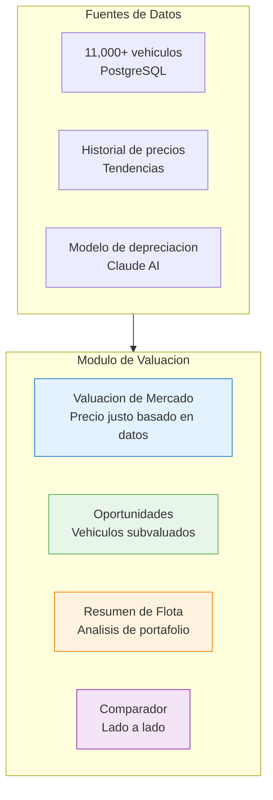
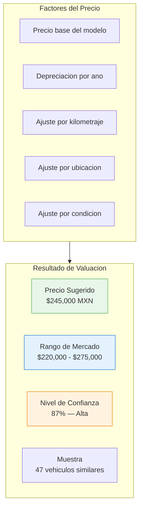
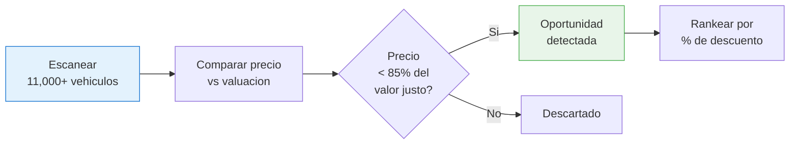
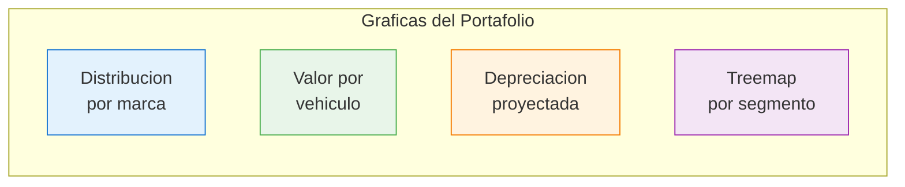

# Valuacion con IA

El modulo de valuacion utiliza el **Depreciation Agent** (Claude API) y datos historicos del marketplace para ofrecer valuaciones precisas, detectar oportunidades de compra y comparar vehiculos.

## Componentes de Valuacion

## Valuacion de Mercado

Ingresa los datos de un vehiculo y obtiene el precio justo de mercado:

### Datos de Entrada

| Campo | Requerido | Descripcion |
|-------|-----------|------------|
| Marca | Si | Marca del vehiculo |
| Modelo | Si | Modelo especifico |
| Ano | Si | Ano del modelo |
| Version | No | Version o trim (Base, Sport, etc.) |
| Kilometraje | No | Km recorridos |
| Estado | No | Estado de la republica |
| Color | No | Color exterior |

### Resultado de la Valuacion

El sistema muestra:

- **Precio sugerido**: Valor justo estimado
- **Rango de mercado**: Percentil 25 al percentil 75
- **Confianza**: Basada en cantidad de datos similares
- **Vehiculos comparables**: Lista de vehiculos similares actualmente a la venta
- **Curva de depreciacion**: Grafica de como pierde valor en el tiempo
- **Fuente de datos**: Cuantos vehiculos se usaron para la estimacion

## Oportunidades

Deteccion automatica de vehiculos con precio **por debajo del mercado**:

### Tabla de Oportunidades

| Campo | Descripcion |
|-------|------------|
| Vehiculo | Marca, modelo, ano, version |
| Precio publicado | Precio en la fuente original |
| Valor estimado | Valuacion del sistema |
| Descuento | % por debajo del valor estimado |
| Fuente | De donde viene el vehiculo |
| Dias en inventario | Tiempo publicado |
| Confianza | Que tan confiable es la valuacion |
| Link | Enlace a la publicacion original |

### Filtros de Oportunidades

- **Descuento minimo**: Solo mostrar con >10%, >15%, >20% de descuento
- **Rango de precio**: Presupuesto minimo y maximo
- **Marca/Modelo**: Filtrar por vehiculo especifico
- **Antiguedad maxima**: Ano minimo del modelo
- **Confianza minima**: Solo oportunidades con alta confianza

## Resumen de Flota

Herramienta para analizar un portafolio completo de vehiculos:

### Uso

1. **Subir lista** de vehiculos (Excel con VIN o marca/modelo/ano)
2. El sistema **valua cada vehiculo** automaticamente
3. Genera un **resumen del portafolio** con:

| Metrica | Descripcion |
|---------|------------|
| Valor total estimado | Suma de valuaciones individuales |
| Vehiculo mas valioso | Mayor valor en el portafolio |
| Vehiculo con mayor depreciacion | Que ha perdido mas valor |
| Distribucion por marca | Composicion del portafolio |
| Distribucion por rango de precio | Segmentacion por valor |
| Depreciacion proyectada | Cuanto perdera el portafolio en 6/12 meses |

### Visualizaciones de Flota

## Comparador

Herramienta para comparar hasta **4 vehiculos lado a lado**:

### Datos Comparados

| Aspecto | Descripcion |
|---------|------------|
| Precio publicado | Precio actual en la fuente |
| Valuacion | Estimacion del sistema |
| Diferencia | Si esta sobre o subvaluado |
| Depreciacion anual | % que pierde por ano |
| Tiempo en inventario | Dias publicado |
| Especificaciones | Motor, transmision, combustible |
| Historial de precio | Cambios de precio detectados |

### Como Comparar

1. **Buscar** el primer vehiculo por marca/modelo o seleccionar del inventario
2. **Agregar** hasta 3 vehiculos mas al comparador
3. Ver las **diferencias destacadas** automaticamente
4. **Exportar** la comparacion como imagen o PDF

::: tip Uso Recomendado
El comparador es ideal para evaluar ofertas de la misma marca/modelo en diferentes fuentes y detectar cual ofrece el mejor valor.
:::
