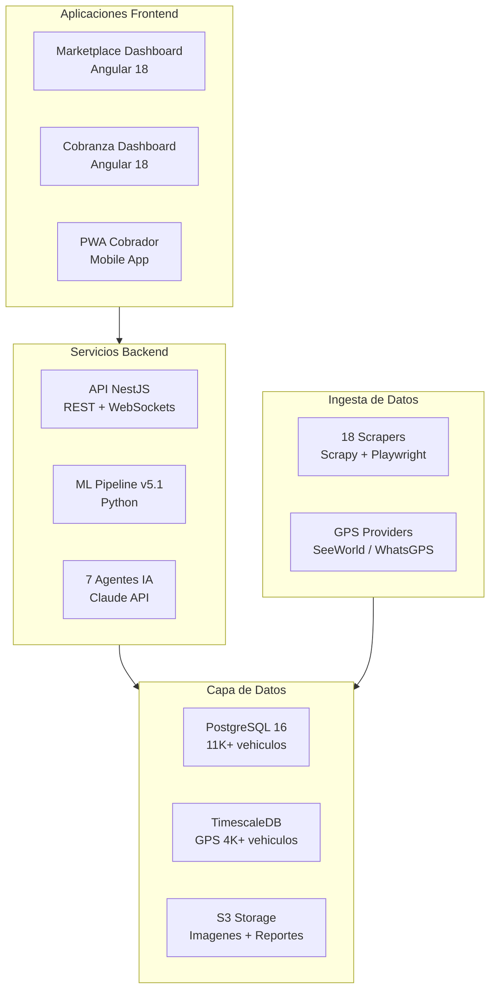

## Ecosistema AgentsMX

AgentsMX es una plataforma automotriz completa que integra **inteligencia artificial**, **machine learning** y **datos en tiempo real** para transformar la operacion de negocios automotrices en Mexico.

### Arquitectura General

### Numeros Clave

| Metrica | Valor |
|---------|-------|
| Repositorios | 17 |
| Vehiculos en base de datos | 11,000+ |
| Fuentes de scraping | 18 |
| Vehiculos con GPS | 4,000+ |
| Agentes de IA | 7 |
| Morosos gestionados | 794 |
| Cobradores en campo | 17 |

### Navegacion Rapida

- **Guia de Usuario** — Manuales paso a paso para operadores y supervisores
- **ML Pipeline** — Documentacion tecnica del pipeline de machine learning
- **AI Agents** — Referencia de los 7 agentes de inteligencia artificial
- **Infraestructura** — Arquitectura AWS y despliegue
- **GPS & Scrapers** — Sistemas de rastreo e ingesta de datos
