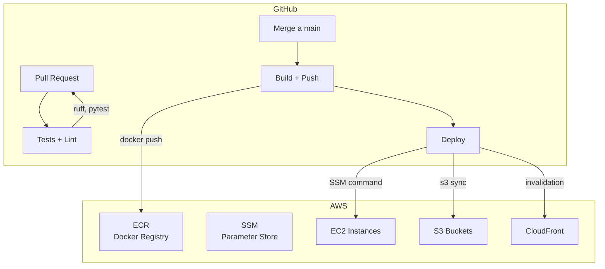
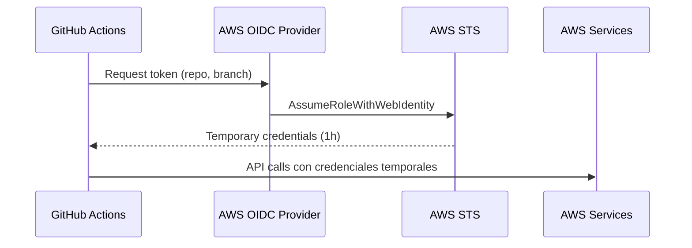
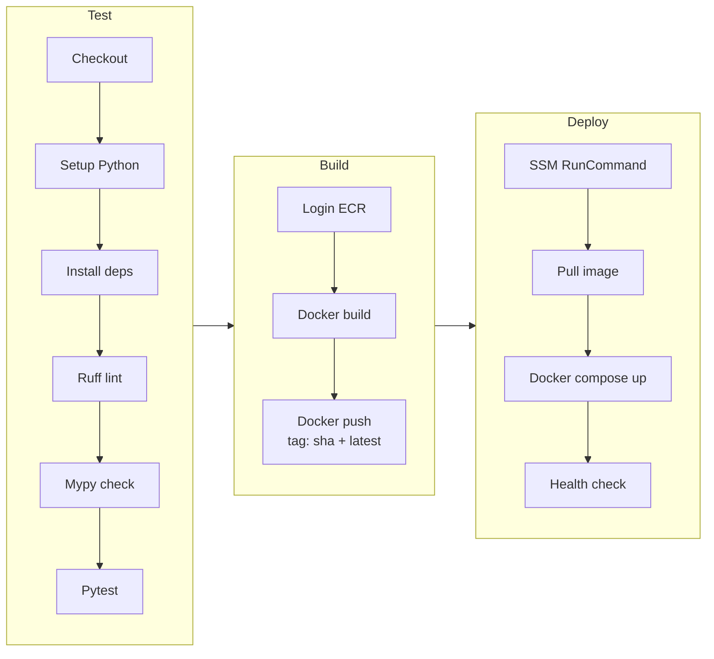
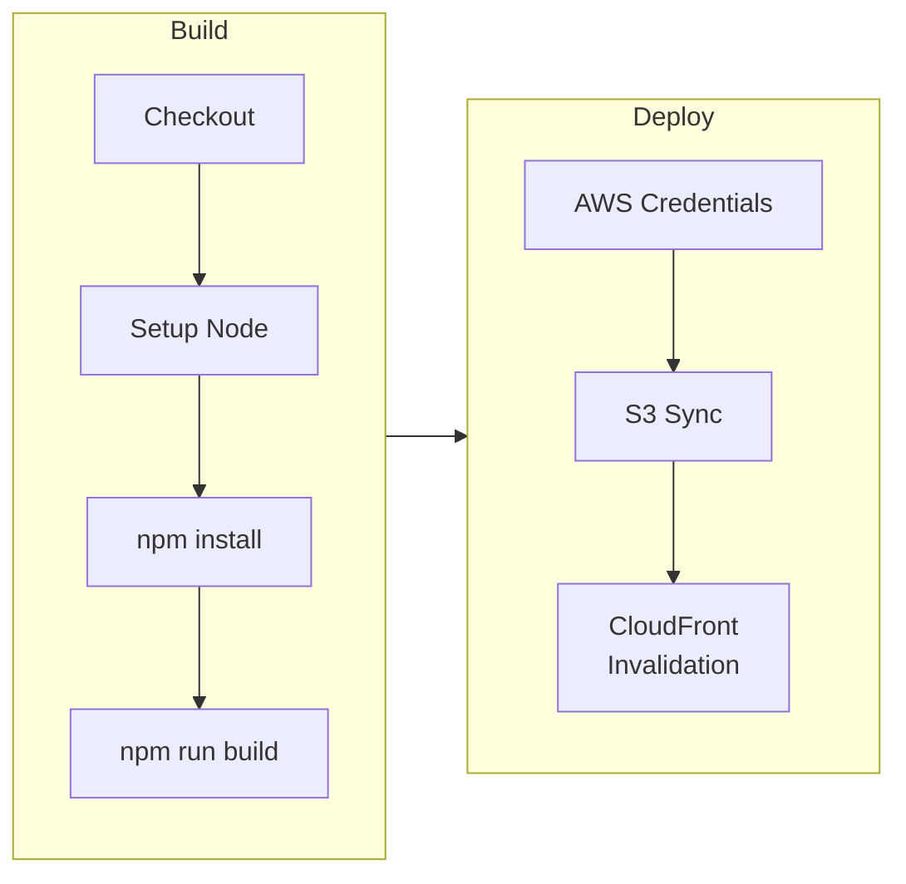

# CI/CD con GitHub Actions

Pipelines de integración y despliegue continuo usando GitHub Actions con autenticación OIDC hacia AWS.

## Diagrama General



## Autenticación OIDC

Sin credenciales permanentes. GitHub se autentica directamente con AWS usando OIDC.



### Configuración OIDC

```yaml
# En el workflow
permissions:
  id-token: write
  contents: read

- name: Configure AWS Credentials
  uses: aws-actions/configure-aws-credentials@v4
  with:
    role-to-assume: arn:aws:iam::ACCOUNT:role/github-actions-role
    aws-region: us-east-1
```

## Pipeline: Backend Services



### Workflow Completo

```yaml
# .github/workflows/deploy-backend.yml
name: Deploy Backend

on:
  push:
    branches: [main]
  pull_request:
    branches: [main]

permissions:
  id-token: write
  contents: read

jobs:
  test:
    runs-on: ubuntu-latest
    steps:
      - uses: actions/checkout@v4
      - uses: actions/setup-python@v5
        with:
          python-version: '3.11'
      - run: pip install -r requirements.txt -r requirements-dev.txt
      - run: ruff check .
      - run: mypy src/
      - run: pytest tests/ --cov=src --cov-report=xml

  build-and-deploy:
    needs: test
    if: github.ref == 'refs/heads/main'
    runs-on: ubuntu-latest
    steps:
      - uses: actions/checkout@v4

      - name: Configure AWS Credentials
        uses: aws-actions/configure-aws-credentials@v4
        with:
          role-to-assume: ${{ secrets.AWS_ROLE_ARN }}
          aws-region: us-east-1

      - name: Login to ECR
        uses: aws-actions/amazon-ecr-login@v2

      - name: Build and Push
        run: |
          IMAGE=${{ secrets.ECR_REGISTRY }}/${{ github.event.repository.name }}
          docker build -t $IMAGE:${{ github.sha }} -t $IMAGE:latest .
          docker push $IMAGE --all-tags

      - name: Deploy via SSM
        run: |
          aws ssm send-command \
            --targets Key=tag:Environment,Values=production \
            --document-name "AWS-RunShellScript" \
            --parameters commands=["cd /opt/app && ./deploy.sh ${{ github.sha }}"]
```

## Pipeline: Frontend (S3 + CloudFront)



### Workflow Frontend

```yaml
# .github/workflows/deploy-frontend.yml
name: Deploy Frontend

on:
  push:
    branches: [main]

jobs:
  deploy:
    runs-on: ubuntu-latest
    steps:
      - uses: actions/checkout@v4
      - uses: actions/setup-node@v4
        with:
          node-version: '20'

      - run: npm ci
      - run: npm run build

      - name: Configure AWS
        uses: aws-actions/configure-aws-credentials@v4
        with:
          role-to-assume: ${{ secrets.AWS_ROLE_ARN }}
          aws-region: us-east-1

      - name: Sync to S3
        run: aws s3 sync dist/ s3://${{ secrets.S3_BUCKET }} --delete

      - name: Invalidate CloudFront
        run: |
          aws cloudfront create-invalidation \
            --distribution-id ${{ secrets.CF_DISTRIBUTION_ID }} \
            --paths "/*"
```

## Pipeline: Documentación (VitePress)

```yaml
# .github/workflows/deploy-docs.yml
name: Deploy Docs

on:
  push:
    branches: [main]
    paths: ['docs/**']

jobs:
  deploy:
    runs-on: ubuntu-latest
    steps:
      - uses: actions/checkout@v4
      - uses: actions/setup-node@v4
        with:
          node-version: '20'

      - run: npm ci
      - run: npm run docs:build

      - name: Deploy to S3
        run: aws s3 sync docs/.vitepress/dist/ s3://agentsmx-docs --delete

      - name: Invalidate CloudFront
        run: |
          aws cloudfront create-invalidation \
            --distribution-id ${{ secrets.DOCS_CF_ID }} \
            --paths "/*"
```

## Resumen de Pipelines

| Repositorio | Trigger | Test | Build | Deploy |
|-------------|---------|------|-------|--------|
| Backend services | Push main | pytest + ruff | Docker → ECR | SSM → EC2 |
| Frontend Next.js | Push main | - | npm build | S3 + CF |
| Frontend Angular | Push main | - | ng build | S3 + CF |
| Documentación | Push main (docs/) | - | vitepress build | S3 + CF |
| Terraform | Push main (*.tf) | terraform plan | - | terraform apply |

## Secrets de GitHub

| Secret | Uso |
|--------|-----|
| `AWS_ROLE_ARN` | ARN del rol OIDC |
| `ECR_REGISTRY` | URL del registro ECR |
| `S3_BUCKET` | Bucket del frontend |
| `CF_DISTRIBUTION_ID` | CloudFront ID |
| `DOCS_CF_ID` | CloudFront docs |

## Tiempos de Pipeline

| Pipeline | Test | Build | Deploy | Total |
|----------|------|-------|--------|-------|
| Backend | ~2 min | ~3 min | ~1 min | ~6 min |
| Frontend | - | ~2 min | ~1 min | ~3 min |
| Docs | - | ~1 min | ~1 min | ~2 min |
