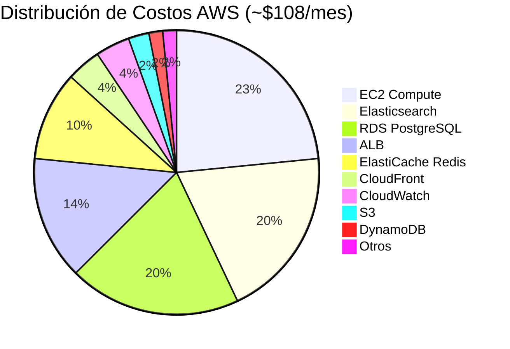
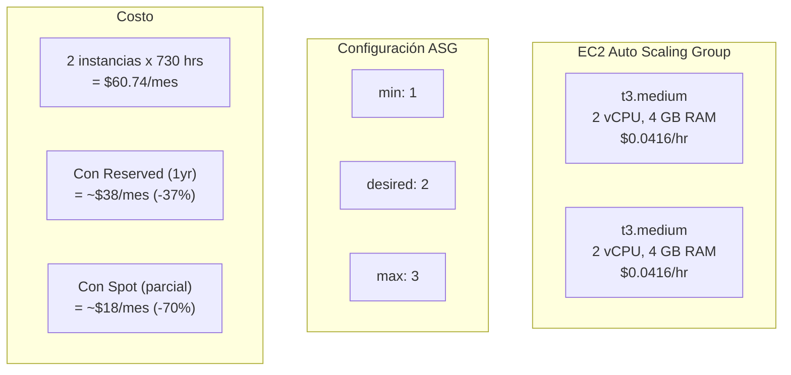
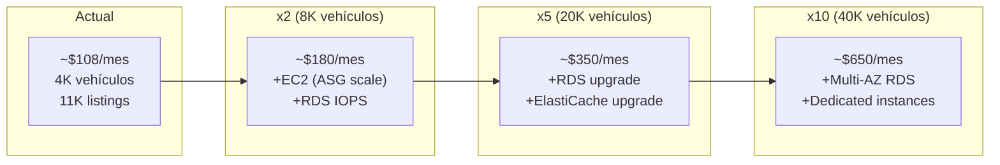
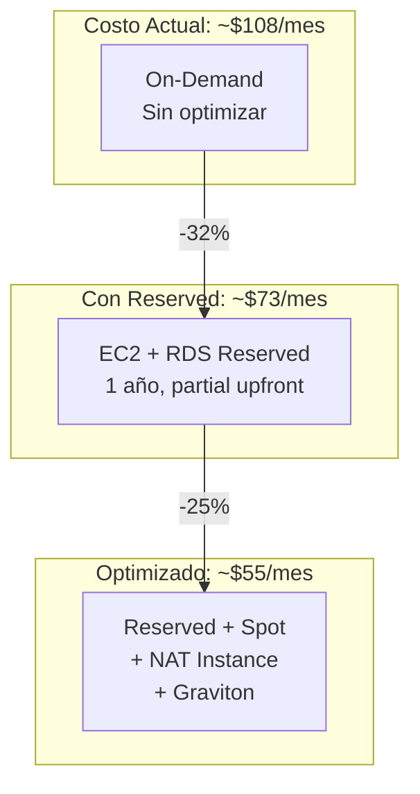
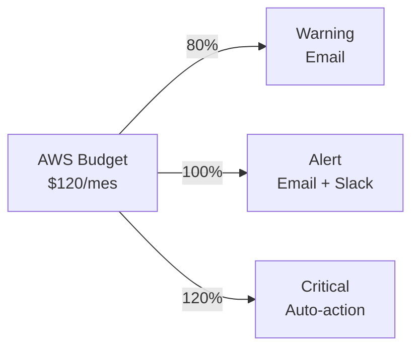

# Costos de Infraestructura

Desglose detallado del costo mensual de la infraestructura AWS del ecosistema AgentsMX: ~$108/mes.

## Resumen de Costos

## Desglose por Servicio

| Servicio | Tipo/Tamaño | Uso | Costo/mes |
|----------|-------------|-----|-----------|
| **EC2** | t3.medium x2 (ASG) | Servidores de aplicación | $30.37 |
| **Elasticsearch** | t3.small.elasticsearch | Búsqueda marketplace | $25.00 |
| **RDS** | db.t3.medium (Multi-AZ) | PostgreSQL principal | $25.23 |
| **ALB** | Application LB | Balanceo de carga | $18.40 |
| **ElastiCache** | cache.t3.micro | Redis cache | $12.96 |
| **CloudFront** | 50 GB/mes transfer | CDN para frontends | $5.00 |
| **CloudWatch** | Métricas + Logs | Monitoreo | $5.00 |
| **S3** | ~20 GB almacenamiento | Assets, backups, datos | $3.00 |
| **DynamoDB** | PAY_PER_REQUEST | Scrapper MTY | $2.00 |
| **Route 53** | 1 hosted zone + queries | DNS | $1.00 |
| **ECR** | ~5 GB imágenes | Docker registry | $0.50 |
| **SQS** | ~50K mensajes/mes | Colas de mensajes | $0.10 |
| **NAT Gateway** | Data processing | Acceso internet privado | $0.00* |
| | | **Total** | **~$108/mes** |

*NAT Gateway tiene un costo significativo (~$32/mes). Se evalúa usar NAT instance como alternativa.

## Detalle EC2

## Detalle RDS

| Propiedad | Valor |
|-----------|-------|
| Instancia | db.t3.medium |
| Motor | PostgreSQL 16 |
| Storage | 20 GB gp3 |
| Multi-AZ | No (desarrollo) |
| Backup | 7 días retención |
| Costo instancia | $25.23/mes |
| Costo storage | Incluido (20 GB free tier) |

## Proyección de Escalamiento

## Optimizaciones de Costo

### Implementadas

| Optimización | Ahorro | Descripción |
|-------------|--------|-------------|
| TimescaleDB compresión | ~$15/mes | 17:1 ratio reduce storage |
| t3 burstable | ~$20/mes | vs t3a o m5 |
| gp3 storage | ~$5/mes | vs gp2 |
| S3 Intelligent Tiering | ~$1/mes | Auto-optimiza storage class |

### Por Implementar

| Optimización | Ahorro Estimado | Complejidad |
|-------------|----------------|-------------|
| Reserved Instances (1yr) | ~$25/mes | Baja |
| Spot Instances (workers) | ~$15/mes | Media |
| NAT Instance vs Gateway | ~$30/mes | Media |
| RDS Reserved | ~$10/mes | Baja |
| Graviton instances | ~$8/mes | Baja |

## Comparativa Mensual

## Free Tier Aprovechado

| Servicio | Free Tier | Uso Actual | Ahorro |
|----------|-----------|------------|--------|
| S3 | 5 GB | ~5 GB | ~$0.12/mes |
| DynamoDB | 25 RCU/WCU | PAY_PER_REQUEST | ~$0 |
| CloudWatch | 10 métricas custom | ~8 | ~$3/mes |
| SQS | 1M requests | ~50K | ~$0 |
| Lambda | 1M invocaciones | No usado aún | - |

## Alertas de Costo

Configuración de AWS Budgets:

- **Warning**: $96/mes (80%) - Notificación por email
- **Alert**: $120/mes (100%) - Email + Slack
- **Critical**: $144/mes (120%) - Revisión inmediata
