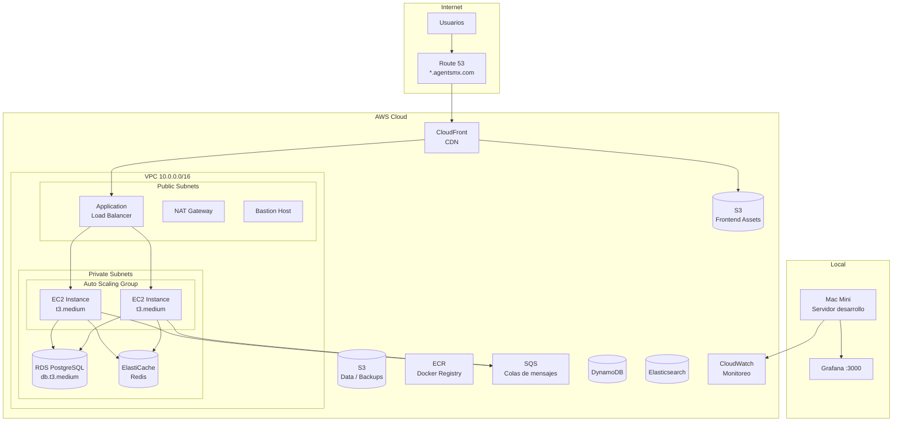
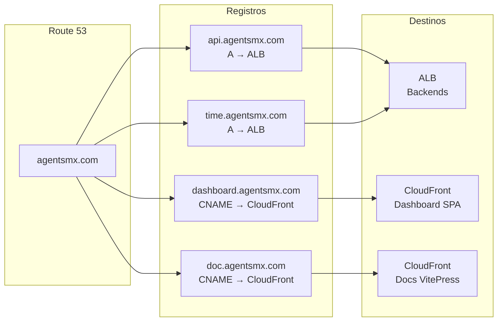

# Infraestructura

Panorama de la infraestructura AWS y local del ecosistema AgentsMX.

## Diagrama de Arquitectura AWS

## Componentes Principales

| Componente | Servicio AWS | Propósito | Costo/mes |
|-----------|-------------|-----------|-----------|
| VPC | VPC | Red privada | $0 |
| Load Balancer | ALB | Distribución de tráfico | ~$18 |
| Compute | EC2 (ASG) | Servidores de aplicación | ~$30 |
| Base de datos | RDS PostgreSQL | Base de datos principal | ~$25 |
| Cache | ElastiCache Redis | Cache y sesiones | ~$13 |
| CDN | CloudFront | Distribución de contenido | ~$5 |
| Almacenamiento | S3 | Assets, backups, datos | ~$3 |
| DNS | Route 53 | Dominios y resolución | ~$1 |
| Contenedores | ECR | Registro Docker | ~$1 |
| Colas | SQS | Mensajería asíncrona | ~$0.50 |
| Monitoreo | CloudWatch | Logs y métricas | ~$5 |
| Búsqueda | Elasticsearch | Full-text search | ~$25 |
| NoSQL | DynamoDB | Scrapper MTY | ~$2 |
| **Total** | | | **~$108/mes** |

## Dominios y DNS

## Entornos

| Entorno | Infraestructura | Propósito |
|---------|----------------|-----------|
| Desarrollo | Mac Mini local | Desarrollo y pruebas |
| Staging | AWS (reducido) | Pre-producción |
| Producción | AWS (completo) | Usuarios finales |

## Siguiente Lectura

- [Terraform](/infraestructura/terraform) - Infrastructure as Code
- [Red](/infraestructura/red) - VPC, subnets, seguridad
- [CI/CD](/infraestructura/cicd) - GitHub Actions pipelines
- [Monitoreo](/infraestructura/monitoreo) - Grafana y CloudWatch
- [Costos](/infraestructura/costos) - Desglose detallado
