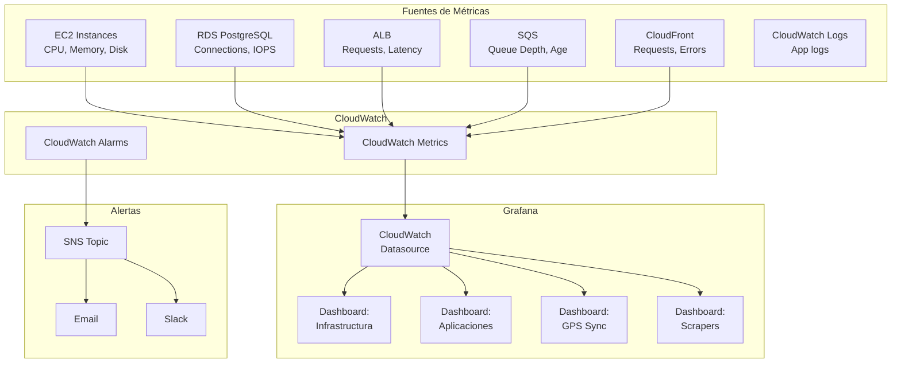
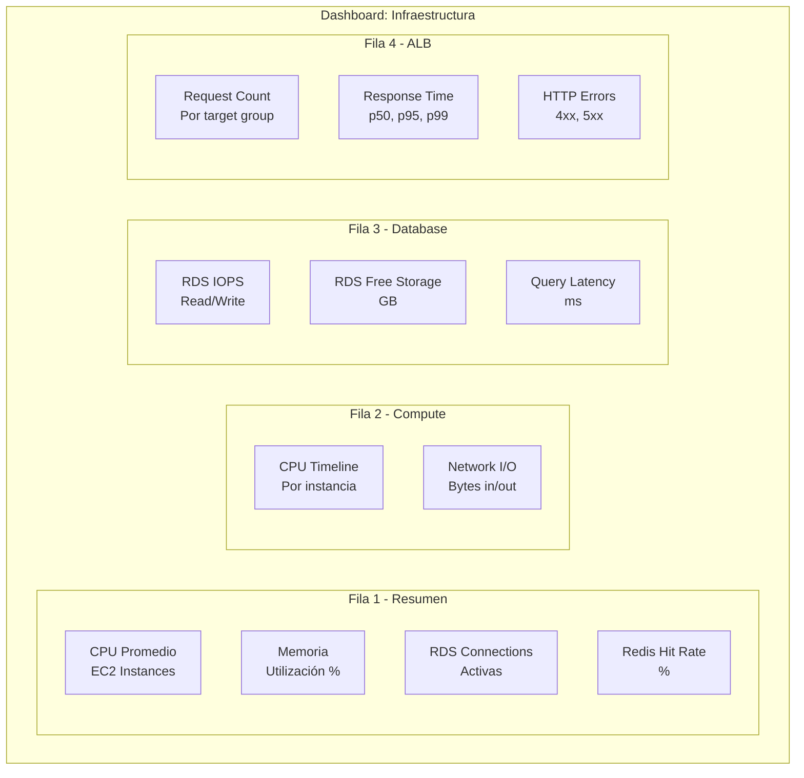
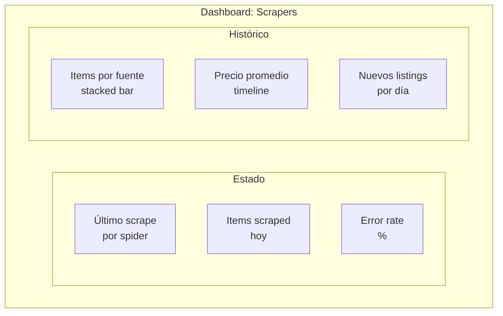

# Monitoreo con Grafana

`proj-infra-grafana` - Grafana 11.5 con CloudWatch como datasource principal para monitoreo del ecosistema AgentsMX.

## Arquitectura de Monitoreo



## Setup Docker

```yaml
# docker-compose.yml
version: '3.8'
services:
  grafana:
    image: grafana/grafana:11.5.0
    container_name: grafana
    ports:
      - "3000:3000"
    volumes:
      - grafana-data:/var/lib/grafana
      - ./provisioning:/etc/grafana/provisioning
      - ./dashboards:/var/lib/grafana/dashboards
    environment:
      - GF_SECURITY_ADMIN_PASSWORD=${GRAFANA_ADMIN_PASSWORD}
      - GF_USERS_ALLOW_SIGN_UP=false
      - GF_SERVER_ROOT_URL=http://localhost:3000
      - GF_AUTH_ANONYMOUS_ENABLED=false
    restart: unless-stopped

volumes:
  grafana-data:
```

## Configuración del Datasource

```yaml
# provisioning/datasources/cloudwatch.yml
apiVersion: 1
datasources:
  - name: CloudWatch
    type: cloudwatch
    access: proxy
    jsonData:
      authType: keys
      defaultRegion: us-east-1
    secureJsonData:
      accessKey: ${AWS_ACCESS_KEY_ID}
      secretKey: ${AWS_SECRET_ACCESS_KEY}
```

## Dashboards

### 1. Dashboard de Infraestructura



### 2. Dashboard de Aplicaciones

| Panel | Métrica | Query CloudWatch |
|-------|---------|-----------------|
| Requests/min | ALB RequestCount | Sum, Period: 60s |
| Latencia p95 | ALB TargetResponseTime | p95, Period: 60s |
| Error Rate | ALB HTTPCode_Target_5XX | Sum / RequestCount |
| Active Connections | RDS DatabaseConnections | Average |
| SQS Queue Depth | ApproximateNumberOfMessages | Sum |
| SQS Message Age | ApproximateAgeOfOldestMessage | Max |

### 3. Dashboard GPS Sync

```mermaid
graph TB
    subgraph "Dashboard: GPS Sync"
        subgraph Métricas Clave
            M1[Vehículos Activos\n~4,000]
            M2[Registros/min\nComprimidos]
            M3[Ratio Compresión\n17:1]
            M4[Ciclo Duration\n~8 seg]
        end

        subgraph Gráficas
            G1[Posiciones guardadas\nvs descartadas\n(timeline)]
            G2[Latencia por\nproveedor GPS]
            G3[Estados de\nvehículos\n(pie chart)]
        end
    end
```

### 4. Dashboard Scrapers



## Alertas Configuradas

| Alerta | Condición | Severidad | Acción |
|--------|-----------|-----------|--------|
| CPU Alta | EC2 CPU > 80% por 5 min | Warning | Email |
| CPU Crítica | EC2 CPU > 95% por 3 min | Critical | Email + Slack |
| RDS Storage | Free storage < 5 GB | Warning | Email |
| RDS Connections | Connections > 80% max | Warning | Email |
| ALB 5xx | 5xx > 10/min por 5 min | Critical | Email + Slack |
| SQS Message Age | Age > 1 hora | Warning | Email |
| SQS DLQ | DLQ messages > 0 | Warning | Email |
| GPS Sync | Sin registros > 5 min | Critical | Email + Slack |

## CloudWatch Alarms

```mermaid
graph LR
    METRIC[CloudWatch Metric] --> ALARM{Threshold\nBreached?}
    ALARM -->|Sí| SNS[SNS Topic]
    ALARM -->|No| OK[OK State]
    SNS --> EMAIL[admin@agentsmx.com]
    SNS --> SLACK[#alerts channel]
    SNS --> AUTO[Auto Scaling\nScale Out]
```

## Retención de Datos

| Tipo de dato | Retención | Costo |
|-------------|-----------|-------|
| CloudWatch Metrics (1 min) | 15 días | Incluido |
| CloudWatch Metrics (5 min) | 63 días | Incluido |
| CloudWatch Metrics (1 hora) | 455 días | Incluido |
| CloudWatch Logs | 30 días | ~$0.50/GB |
| Grafana Dashboards | Indefinida | Local |

## Acceso

| URL | Propósito |
|-----|-----------|
| `http://localhost:3000` | Grafana local |
| `http://mac-mini:3000` | Grafana desde red local |

Credenciales por defecto: `admin` / `{GRAFANA_ADMIN_PASSWORD}`
