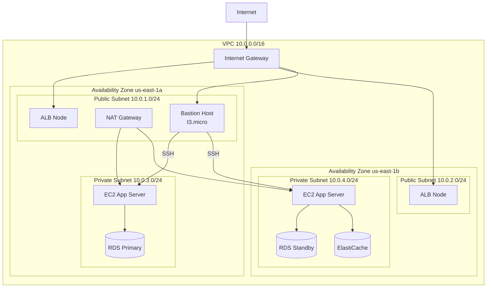
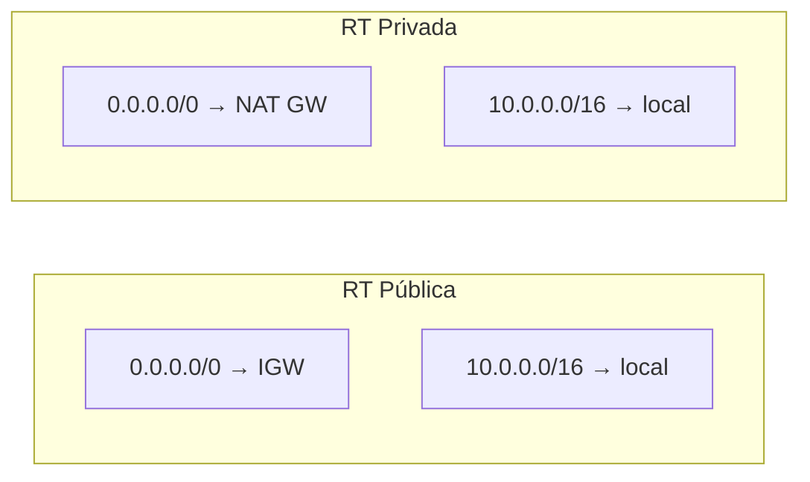
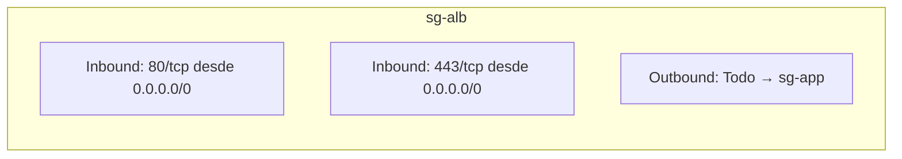
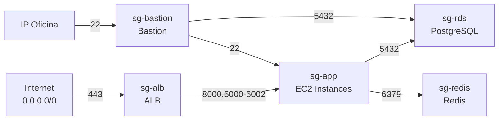
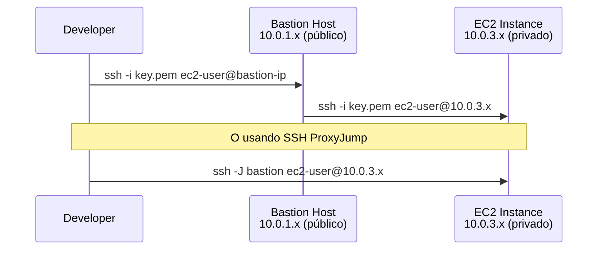
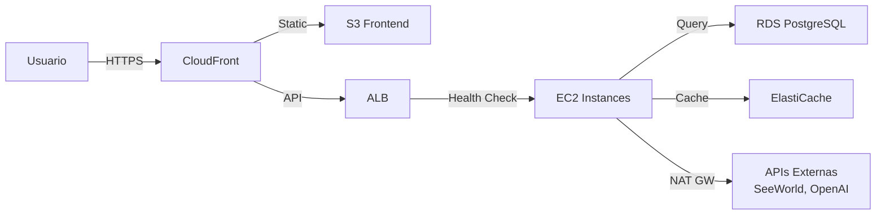

# Red y Seguridad

Configuración de VPC, subnets, seguridad y acceso SSH del ecosistema AgentsMX en AWS.

## Arquitectura de Red



## Tabla de Subnets

| Subnet | CIDR | AZ | Tipo | Uso |
|--------|------|-----|------|-----|
| public-1 | 10.0.1.0/24 | us-east-1a | Pública | ALB, NAT, Bastion |
| public-2 | 10.0.2.0/24 | us-east-1b | Pública | ALB |
| private-1 | 10.0.3.0/24 | us-east-1a | Privada | EC2, RDS Primary |
| private-2 | 10.0.4.0/24 | us-east-1b | Privada | EC2, RDS Standby, Redis |

## Route Tables



## Security Groups

### SG: ALB



| Dirección | Puerto | Protocolo | Origen | Descripción |
|-----------|--------|-----------|--------|-------------|
| Inbound | 80 | TCP | 0.0.0.0/0 | HTTP (redirect a HTTPS) |
| Inbound | 443 | TCP | 0.0.0.0/0 | HTTPS |
| Outbound | 8000 | TCP | sg-app | FastAPI |
| Outbound | 5002 | TCP | sg-app | GPS API |

### SG: Aplicación

| Dirección | Puerto | Protocolo | Origen | Descripción |
|-----------|--------|-----------|--------|-------------|
| Inbound | 8000 | TCP | sg-alb | FastAPI |
| Inbound | 5000-5002 | TCP | sg-alb | Flask services |
| Inbound | 5050 | TCP | sg-alb | Marketplace API |
| Inbound | 22 | TCP | sg-bastion | SSH desde bastion |
| Outbound | 5432 | TCP | sg-rds | PostgreSQL |
| Outbound | 6379 | TCP | sg-redis | Redis |
| Outbound | 443 | TCP | 0.0.0.0/0 | HTTPS saliente |

### SG: Base de Datos

| Dirección | Puerto | Protocolo | Origen | Descripción |
|-----------|--------|-----------|--------|-------------|
| Inbound | 5432 | TCP | sg-app | PostgreSQL |
| Inbound | 5432 | TCP | sg-bastion | Acceso admin |

### SG: Redis

| Dirección | Puerto | Protocolo | Origen | Descripción |
|-----------|--------|-----------|--------|-------------|
| Inbound | 6379 | TCP | sg-app | Redis |

### SG: Bastion

| Dirección | Puerto | Protocolo | Origen | Descripción |
|-----------|--------|-----------|--------|-------------|
| Inbound | 22 | TCP | IP oficina | SSH |
| Outbound | 22 | TCP | sg-app | SSH a instancias |
| Outbound | 5432 | TCP | sg-rds | Admin DB |

## Diagrama de Security Groups



## Acceso SSH via Bastion



### Configuración SSH (~/.ssh/config)

```
Host bastion-agentsmx
    HostName <bastion-public-ip>
    User ec2-user
    IdentityFile ~/.ssh/agentsmx-key.pem

Host app-server-*
    User ec2-user
    IdentityFile ~/.ssh/agentsmx-key.pem
    ProxyJump bastion-agentsmx

Host app-server-1
    HostName 10.0.3.10

Host app-server-2
    HostName 10.0.4.10
```

## NACLs (Network ACLs)

| Regla | Tipo | Puerto | CIDR | Acción |
|-------|------|--------|------|--------|
| 100 | Inbound | 443 | 0.0.0.0/0 | Allow |
| 110 | Inbound | 80 | 0.0.0.0/0 | Allow |
| 120 | Inbound | 22 | IP oficina/32 | Allow |
| 130 | Inbound | 1024-65535 | 0.0.0.0/0 | Allow |
| * | Inbound | Todo | 0.0.0.0/0 | Deny |
| 100 | Outbound | Todo | 0.0.0.0/0 | Allow |

## Flujo de Tráfico


