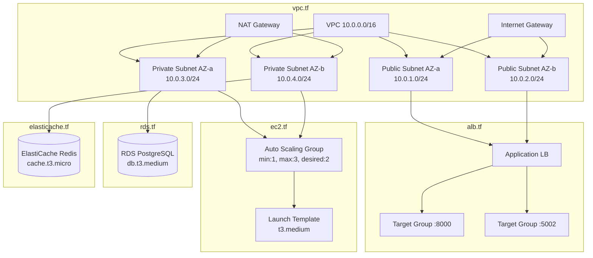
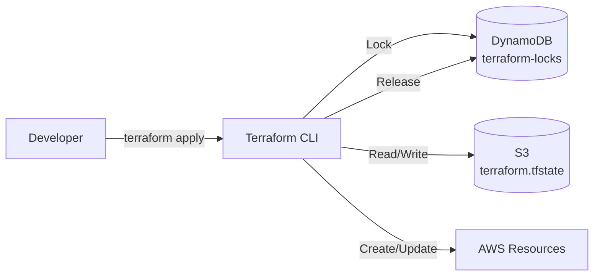

# Terraform

`proj-infra-terraform` - Infraestructura como código para todos los recursos AWS del ecosistema AgentsMX.

## Archivos Terraform

| Archivo | Recursos | Descripción |
|---------|----------|-------------|
| `main.tf` | Provider, backend | Configuración principal |
| `vpc.tf` | VPC, subnets, NAT, IGW | Red base |
| `alb.tf` | ALB, target groups, listeners | Balanceador de carga |
| `ec2.tf` | Launch template, ASG | Instancias compute |
| `rds.tf` | RDS PostgreSQL, subnet group | Base de datos |
| `elasticache.tf` | Redis cluster, subnet group | Cache |
| `s3.tf` | Buckets, policies | Almacenamiento |
| `cloudfront.tf` | Distribuciones, OAI | CDN |
| `route53.tf` | Zona, registros DNS | DNS |
| `ecr.tf` | Repositorios Docker | Container registry |
| `sqs.tf` | Colas, DLQ | Mensajería |
| `iam.tf` | Roles, policies, OIDC | Seguridad |

## Diagrama de Recursos



## Archivo: main.tf

```hcl
terraform {
  required_version = ">= 1.6.0"

  required_providers {
    aws = {
      source  = "hashicorp/aws"
      version = "~> 5.30"
    }
  }

  backend "s3" {
    bucket         = "agentsmx-terraform-state"
    key            = "production/terraform.tfstate"
    region         = "us-east-1"
    dynamodb_table = "terraform-locks"
    encrypt        = true
  }
}

provider "aws" {
  region = var.aws_region

  default_tags {
    tags = {
      Project     = "AgentsMX"
      Environment = var.environment
      ManagedBy   = "Terraform"
    }
  }
}
```

## Archivo: vpc.tf

```hcl
resource "aws_vpc" "main" {
  cidr_block           = "10.0.0.0/16"
  enable_dns_hostnames = true
  enable_dns_support   = true

  tags = { Name = "agentsmx-vpc" }
}

resource "aws_subnet" "public" {
  count             = 2
  vpc_id            = aws_vpc.main.id
  cidr_block        = "10.0.${count.index + 1}.0/24"
  availability_zone = data.aws_availability_zones.available.names[count.index]
  map_public_ip_on_launch = true

  tags = { Name = "agentsmx-public-${count.index + 1}" }
}

resource "aws_subnet" "private" {
  count             = 2
  vpc_id            = aws_vpc.main.id
  cidr_block        = "10.0.${count.index + 3}.0/24"
  availability_zone = data.aws_availability_zones.available.names[count.index]

  tags = { Name = "agentsmx-private-${count.index + 1}" }
}
```

## Archivo: sqs.tf

```hcl
resource "aws_sqs_queue" "marketplace_events" {
  name                       = "marketplace-events"
  delay_seconds              = 0
  max_message_size           = 262144
  message_retention_seconds  = 86400
  receive_wait_time_seconds  = 20
  visibility_timeout_seconds = 120

  redrive_policy = jsonencode({
    deadLetterTargetArn = aws_sqs_queue.marketplace_dlq.arn
    maxReceiveCount     = 3
  })
}

resource "aws_sqs_queue" "marketplace_dlq" {
  name                      = "marketplace-events-dlq"
  message_retention_seconds = 604800  # 7 días
}

resource "aws_sqs_queue" "diagnostic_scans" {
  name                       = "diagnostic-scans"
  visibility_timeout_seconds = 300
  receive_wait_time_seconds  = 20

  redrive_policy = jsonencode({
    deadLetterTargetArn = aws_sqs_queue.diagnostic_dlq.arn
    maxReceiveCount     = 3
  })
}
```

## Comandos de Despliegue

```bash
# Inicializar Terraform
terraform init

# Ver plan de cambios
terraform plan -out=plan.tfplan

# Aplicar cambios
terraform apply plan.tfplan

# Ver estado actual
terraform state list

# Importar recurso existente
terraform import aws_s3_bucket.data agentsmx-data

# Destruir recurso específico
terraform destroy -target=aws_sqs_queue.marketplace_events
```

## Variables

```hcl
# variables.tf
variable "aws_region" {
  default = "us-east-1"
}

variable "environment" {
  default = "production"
}

variable "db_instance_class" {
  default = "db.t3.medium"
}

variable "ec2_instance_type" {
  default = "t3.medium"
}

variable "asg_min_size" {
  default = 1
}

variable "asg_max_size" {
  default = 3
}

variable "asg_desired_size" {
  default = 2
}
```

## Outputs

```hcl
# outputs.tf
output "alb_dns_name" {
  value = aws_lb.main.dns_name
}

output "rds_endpoint" {
  value = aws_db_instance.main.endpoint
}

output "redis_endpoint" {
  value = aws_elasticache_cluster.main.cache_nodes[0].address
}

output "cloudfront_domain" {
  value = aws_cloudfront_distribution.frontend.domain_name
}

output "ecr_repository_urls" {
  value = { for k, v in aws_ecr_repository.services : k => v.repository_url }
}
```

## State Management


