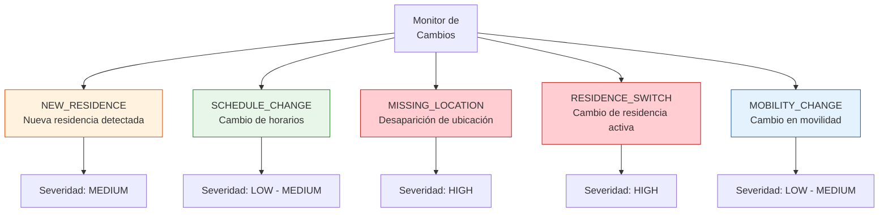
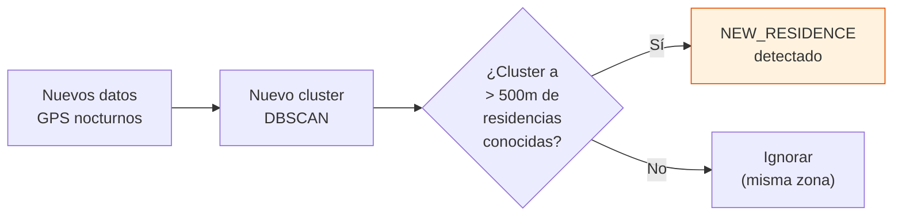
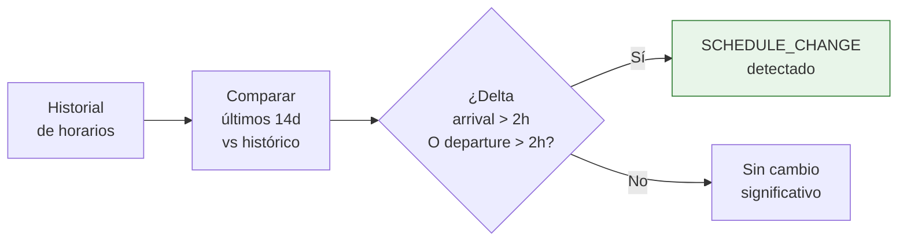
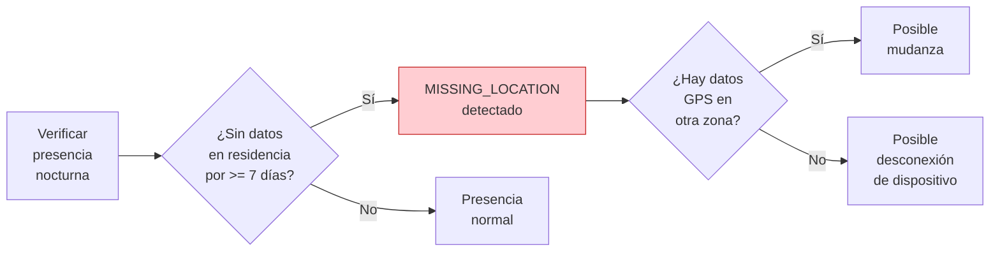
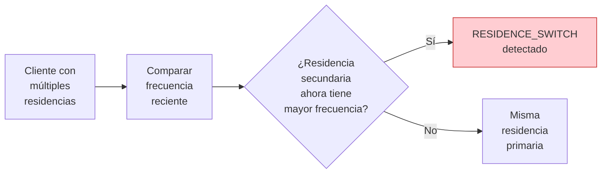
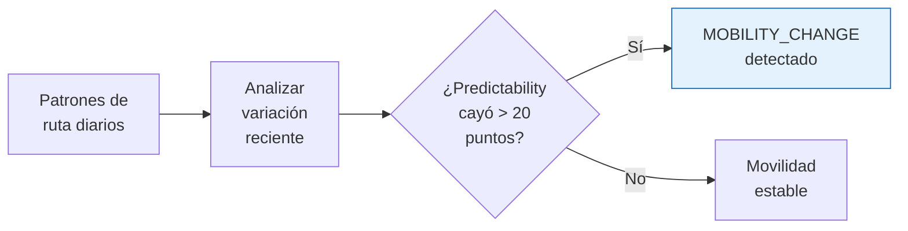
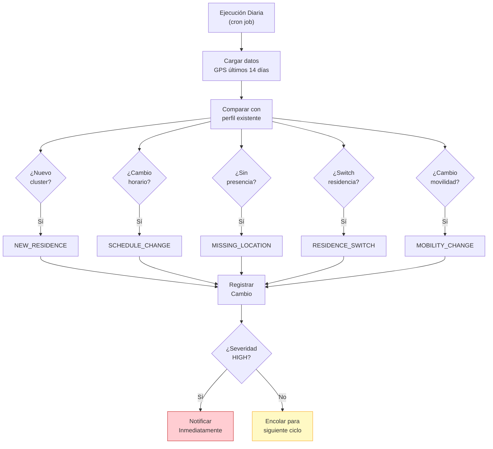

# Detección de Cambios de Comportamiento

## Objetivo

Monitorear cambios significativos en el comportamiento de los morosos para actualizar dinámicamente las estrategias de cobranza. El sistema detecta **5 tipos de cambios** con **3 niveles de severidad**.

## Tipos de Cambio



## Niveles de Severidad

| Nivel | Color | Acción Requerida |
|---|---|---|
| **HIGH** | Rojo | Recalcular ruta inmediatamente. Notificar al cobrador. |
| **MEDIUM** | Naranja | Actualizar ventanas de tiempo en el siguiente ciclo. |
| **LOW** | Amarillo | Registrar para análisis. Sin acción inmediata. |

## Detalle de Cada Tipo de Cambio

### 1. NEW_RESIDENCE — Nueva Residencia Detectada



| Criterio | Valor |
|---|---|
| Distancia mínima de residencias existentes | > 500 metros |
| Noches en nuevo cluster | >= 3 en últimos 14 días |
| Confidence mínimo del nuevo cluster | >= 0.35 |
| Severidad | **MEDIUM** |

**Acciones:**
- Agregar nueva residencia al perfil del cliente (si < 3 residencias)
- Recalcular confidence scores de todas las residencias
- Actualizar ventanas de tiempo si la nueva residencia tiene mayor confidence

### 2. SCHEDULE_CHANGE — Cambio de Horarios



| Criterio | Valor |
|---|---|
| Periodo de comparación | Últimos 14 días vs promedio histórico (90 días) |
| Umbral de cambio en llegada | > 2 horas de diferencia en media circular |
| Umbral de cambio en salida | > 2 horas de diferencia en media circular |
| Mínimo de datos recientes | >= 5 noches en últimos 14 días |
| Severidad (cambio < 3h) | **LOW** |
| Severidad (cambio >= 3h) | **MEDIUM** |

**Acciones:**
- Recalcular ventana de tiempo con datos recientes priorizados
- Ajustar slot temporal (MAÑANA/TARDE/NOCHE) si aplica
- Actualizar predictability score

### 3. MISSING_LOCATION — Desaparición de Ubicación



| Criterio | Valor |
|---|---|
| Ausencia mínima en residencia conocida | >= 7 días consecutivos |
| Verificación de GPS activo | Si hay señales en otra ubicación |
| Severidad | **HIGH** |

**Acciones:**
- Marcar cliente como "ubicación incierta"
- Verificar si hay datos GPS en otras zonas (posible mudanza)
- Escalar a supervisor si > 14 días sin presencia
- Considerar reasignar a canal telefónico

### 4. RESIDENCE_SWITCH — Cambio de Residencia Activa



| Criterio | Valor |
|---|---|
| Periodo de evaluación | Últimos 21 días |
| Condición | Residencia secundaria con > 60% de noches recientes |
| Confidence de nueva primaria | >= 0.35 |
| Severidad | **HIGH** |

**Acciones:**
- Intercambiar residencia primaria y secundaria
- Recalcular todas las ventanas de tiempo
- Actualizar ruta del cobrador asignado
- Notificar cambio al cobrador

### 5. MOBILITY_CHANGE — Cambio en Patrón de Movilidad



| Criterio | Valor |
|---|---|
| Periodo de evaluación | Últimos 14 días vs promedio 90 días |
| Umbral de caída en predictability | > 20 puntos |
| Umbral de aumento en varianza | > 2× la varianza histórica |
| Severidad (caída 20-35 puntos) | **LOW** |
| Severidad (caída > 35 puntos) | **MEDIUM** |

**Acciones:**
- Recalcular predictability score con datos recientes
- Ampliar ventana de tiempo como precaución
- Registrar para análisis de tendencia

## Flujo General de Detección



## Estructura del Evento de Cambio

```json
{
  "change_id": "CHG-20260327-001",
  "client_id": "MOR-1234",
  "change_type": "RESIDENCE_SWITCH",
  "severity": "HIGH",
  "detected_at": "2026-03-27T06:00:00Z",
  "details": {
    "old_residence": {
      "lat": 25.6714,
      "lon": -100.3097,
      "confidence": 0.72
    },
    "new_residence": {
      "lat": 25.7201,
      "lon": -100.3512,
      "confidence": 0.58
    },
    "distance_km": 6.2,
    "recent_nights_at_new": 12,
    "recent_nights_at_old": 2
  },
  "actions_taken": [
    "primary_residence_updated",
    "time_windows_recalculated",
    "collector_notified"
  ]
}
```

## Configuración de Detección de Cambios

```python
CHANGE_DETECTION_CONFIG = {
    # Periodos
    "recent_period_days": 14,
    "historical_period_days": 90,
    "evaluation_period_days": 21,

    # NEW_RESIDENCE
    "new_residence_min_distance_m": 500,
    "new_residence_min_nights": 3,
    "new_residence_min_confidence": 0.35,

    # SCHEDULE_CHANGE
    "schedule_change_threshold_hours": 2,
    "schedule_change_min_recent_nights": 5,

    # MISSING_LOCATION
    "missing_location_days": 7,
    "missing_location_escalation_days": 14,

    # RESIDENCE_SWITCH
    "switch_frequency_threshold": 0.60,
    "switch_min_confidence": 0.35,

    # MOBILITY_CHANGE
    "mobility_predictability_drop": 20,
    "mobility_variance_multiplier": 2.0,

    # Ejecución
    "cron_schedule": "0 6 * * *",  # Diario a las 06:00
    "notification_channels": ["webhook", "email"],
}
```

## Tabla Resumen

| Tipo de Cambio | Severidad | Condición Principal | Acción Principal |
|---|---|---|---|
| `NEW_RESIDENCE` | MEDIUM | Nuevo cluster a > 500m, >= 3 noches | Agregar residencia, recalcular |
| `SCHEDULE_CHANGE` | LOW/MEDIUM | Delta horario > 2h | Actualizar ventanas |
| `MISSING_LOCATION` | HIGH | Sin presencia >= 7 días | Marcar incierto, escalar |
| `RESIDENCE_SWITCH` | HIGH | Secundaria > 60% noches recientes | Intercambiar, notificar cobrador |
| `MOBILITY_CHANGE` | LOW/MEDIUM | Predictability cae > 20 puntos | Ampliar ventana, monitorear |
