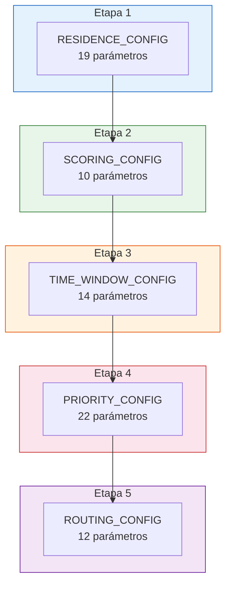

# Referencia Completa de Configuración

## Descripción

Este documento centraliza **todos los parámetros de configuración** del ML Pipeline v5.1. Cada tabla incluye el nombre del parámetro, su valor, tipo de dato y descripción.

## RESIDENCE_CONFIG — Detección de Residencia (Etapa 1)

### Filtros Temporales

| Parámetro | Valor | Tipo | Descripción |
|---|---|---|---|
| `night_start_hour` | 22 | int | Hora de inicio del periodo nocturno |
| `night_end_hour` | 6 | int | Hora de fin del periodo nocturno |
| `min_stay_duration_hours` | 2 | int | Duración mínima de parada para considerar como residencia |
| `min_nights_per_week` | 3 | int | Noches mínimas de presencia por semana |

### Tolerancias Espaciales

| Parámetro | Valor | Tipo | Descripción |
|---|---|---|---|
| `spatial_tolerance_meters` | 100 | int | Tolerancia espacial para merge de puntos |
| `stop_merge_radius_meters` | 150 | int | Radio para fusionar paradas ACC Off |

### Umbrales de Confianza

| Parámetro | Valor | Tipo | Descripción |
|---|---|---|---|
| `primary_threshold` | 0.6 | float | Umbral primario de confidence score |
| `secondary_threshold` | 0.3 | float | Umbral secundario de confidence score |
| `high_confidence` | 0.65 | float | Límite inferior para confianza alta |
| `medium_confidence` | 0.35 | float | Límite inferior para confianza media |

### DBSCAN Primario

| Parámetro | Valor | Tipo | Descripción |
|---|---|---|---|
| `dbscan_eps_meters` | 200 | int | Radio epsilon en metros |
| `dbscan_min_samples` | 5 | int | Mínimo de puntos para un cluster |
| `dbscan_metric` | haversine | str | Métrica de distancia |
| `dbscan_algorithm` | ball_tree | str | Algoritmo de búsqueda |

### HDBSCAN Fallback

| Parámetro | Valor | Tipo | Descripción |
|---|---|---|---|
| `hdbscan_min_cluster_size` | 5 | int | Tamaño mínimo de cluster |
| `hdbscan_min_samples` | 3 | int | Puntos mínimos de core |
| `cluster_selection_epsilon` | 0.00002 | float | ~127m en radianes |
| `cluster_selection_method` | eom | str | Excess of Mass |
| `hdbscan_metric` | haversine | str | Métrica de distancia |

### Confidence Score — Pesos

| Factor | Peso | Descripción |
|---|---|---|
| `frequency_score` | 0.35 | Frecuencia con decaimiento temporal |
| `duration_score` | 0.25 | Duración promedio normalizada a 8h |
| `time_consistency` | 0.20 | Consistencia horaria (std circular) |
| `cluster_cohesion` | 0.15 | Compactación del cluster |
| `weekend_score` | 0.05 | Presencia en fines de semana |

### Otros

| Parámetro | Valor | Tipo | Descripción |
|---|---|---|---|
| `max_residences_per_client` | 3 | int | Máximo de residencias detectables por cliente |
| `temporal_decay_half_life_days` | 120 | int | Vida media del decaimiento temporal |
| `weiszfeld_max_iterations` | 100 | int | Iteraciones máximas del algoritmo de Weiszfeld |
| `weiszfeld_tolerance` | 1e-6 | float | Tolerancia de convergencia |

## SCORING_CONFIG — Predictibilidad (Etapa 2)

### Pesos de Componentes

| Componente | Peso | Descripción |
|---|---|---|
| `location_variance` | 0.25 | Dispersión espacial de posiciones nocturnas |
| `schedule_consistency` | 0.30 | Regularidad de horarios de llegada/salida |
| `route_repetition` | 0.25 | Repetición de patrones de movimiento |
| `presence_stability` | 0.20 | Consistencia de presencia en residencia |

### Umbrales de Riesgo

| Nivel | Umbral | Descripción |
|---|---|---|
| `low_risk` | >= 70 | Fácil de encontrar |
| `medium_risk` | 40 – 69 | Requiere ventana flexible |
| `high_risk` | < 40 | Difícil de localizar |

### Parámetros

| Parámetro | Valor | Tipo | Descripción |
|---|---|---|---|
| `max_location_tolerance_m` | 500 | int | Tolerancia máxima para varianza de ubicación |
| `max_schedule_std_hours` | 3 | float | Máxima std dev de horario antes de score=0 |
| `max_route_patterns` | 10 | int | Máximo patrones únicos antes de score=0 |
| `analysis_period_days` | 90 | int | Periodo de análisis en días |
| `min_nights_for_score` | 7 | int | Mínimo de noches para calcular score |
| `geohash_resolution` | 6 | int | Resolución de geohash (~1.2km) |

## TIME_WINDOW_CONFIG — Ventanas de Tiempo (Etapa 3)

### LightGBM

| Parámetro | Valor | Tipo | Descripción |
|---|---|---|---|
| `n_estimators` | 200 | int | Número de árboles |
| `max_depth` | 6 | int | Profundidad máxima |
| `learning_rate` | 0.1 | float | Tasa de aprendizaje |
| `num_leaves` | 31 | int | Hojas por árbol |
| `min_child_samples` | 20 | int | Muestras mínimas por hoja |
| `objective` | multiclass | str | Tipo de objetivo |
| `num_class` | 3 | int | MAÑANA, TARDE, NOCHE |
| `metric` | multi_logloss | str | Métrica de evaluación |
| `boosting_type` | gbdt | str | Tipo de boosting |
| `random_state` | 42 | int | Semilla aleatoria |

### KDE

| Parámetro | Valor | Tipo | Descripción |
|---|---|---|---|
| `kde_bandwidth` | 0.3 | float | Ancho de banda del kernel |
| `kde_resolution_minutes` | 5 | int | Resolución temporal |
| `peak_prominence` | 0.05 | float | Prominencia mínima de picos |

### Rangos de Clasificación de Slots

| Slot | Salida (horas) | Llegada (horas) | Visita Óptima |
|---|---|---|---|
| MAÑANA | 05 – 12 | 06 – 11 | Antes de 07:30 |
| TARDE | 12 – 17 | 11 – 17 | 15:00 – 18:00 |
| NOCHE | 17 – 23 | 17 – 23 | Después de 20:00 |
| Ignorado | 00 – 05 | 00 – 06 | Impracticable |

### Ventanas Heurísticas (No-GPS)

| Estrategia | Ventana AM | Ventana PM |
|---|---|---|
| `standard` | 07:00 – 09:00 | 17:00 – 19:00 |
| `extended` | 06:30 – 10:00 | 16:00 – 20:00 |
| `morning` | 06:00 – 08:00 | — |
| `afternoon` | — | 16:00 – 19:00 |

## PRIORITY_CONFIG — Prioridad de Cobranza (Etapa 4)

### Pesos de Componentes (Reglas)

| Componente | Peso | Descripción |
|---|---|---|
| `amount_score` | 0.25 | Monto adeudado (log scale) |
| `days_overdue_score` | 0.20 | Días de atraso |
| `predictability` | 0.20 | Score de predictibilidad |
| `recovery_prob` | 0.20 | Probabilidad de recuperación |
| `recency_score` | 0.15 | Recencia del último contacto |

### Pesos del Score Final Compuesto

| Componente | Peso | Descripción |
|---|---|---|
| `xgb_proba` | 0.40 | Probabilidad XGBoost |
| `amount_norm` | 0.30 | Monto normalizado |
| `urgency` | 0.20 | Urgencia (bucket × days) |
| `interaction` | 0.10 | Interacción predictability × recovery |

### XGBoost

| Parámetro | Valor | Tipo | Descripción |
|---|---|---|---|
| `n_estimators` | 300 | int | Número de árboles |
| `max_depth` | 5 | int | Profundidad máxima |
| `learning_rate` | 0.05 | float | Tasa de aprendizaje |
| `subsample` | 0.8 | float | Fracción de muestras por árbol |
| `colsample_bytree` | 0.8 | float | Fracción de features por árbol |
| `min_child_weight` | 5 | int | Peso mínimo por hoja |
| `gamma` | 0.1 | float | Regularización de podado |
| `reg_alpha` | 0.1 | float | Regularización L1 |
| `reg_lambda` | 1.0 | float | Regularización L2 |
| `objective` | binary:logistic | str | Función objetivo |
| `eval_metric` | auc | str | Métrica de evaluación |
| `random_state` | 42 | int | Semilla aleatoria |
| `n_jobs` | -1 | int | Todos los cores |

### Multiplicadores de Bucket

| Bucket | Días | Multiplicador |
|---|---|---|
| B1 | 1 – 30 | 0.1 |
| B2 | 31 – 60 | 0.2 |
| B3 | 61 – 90 | 0.3 |
| B4 | 91 – 120 | 0.4 |
| B5 | 121 – 150 | 0.5 |
| B6 | 151 – 180 | 0.6 |
| B7 | 181 – 240 | 0.7 |
| B8 | 241 – 300 | 0.8 |
| B9 | 301 – 360 | 0.9 |
| B10 | 361+ | 1.0 |

### Umbrales de Prioridad

| Nivel | Umbral |
|---|---|
| Crítica | >= 70 |
| Alta | >= 55 |
| Media | >= 40 |
| Baja | < 40 |

### Recovery Probability

| Parámetro | Valor |
|---|---|
| `base` | 70 |
| `amount_log_base` | 200,000 |

## ROUTING_CONFIG — Optimización de Rutas (Etapa 5)

### Flota y Jornada

| Parámetro | Valor | Tipo | Descripción |
|---|---|---|---|
| `num_collectors` | 13 | int | Cobradores disponibles |
| `max_visits_per_collector` | 20 | int | Visitas máximas por día |
| `work_start_hour` | 8 | int | Inicio de jornada |
| `work_end_hour` | 18 | int | Fin de jornada |
| `visit_duration_minutes` | 20 | int | Minutos por visita |
| `window_padding_minutes` | 30 | int | Padding de ventana temporal |

### Depósito y Distancias

| Parámetro | Valor | Tipo | Descripción |
|---|---|---|---|
| `depot_lat` | 25.668 | float | Latitud del depósito |
| `depot_lon` | -100.283 | float | Longitud del depósito |
| `street_factor` | 1.3 | float | Factor haversine → distancia real |
| `avg_speed_kmh` | 25 | float | Velocidad promedio urbana |

### Clustering Geográfico

| Parámetro | Valor | Tipo | Descripción |
|---|---|---|---|
| `macro_dbscan_eps_km` | 50 | int | Radio DBSCAN macro-regiones |
| `macro_dbscan_min_samples` | 3 | int | Mínimo puntos macro-cluster |

### Solver OR-Tools

| Parámetro | Valor | Tipo | Descripción |
|---|---|---|---|
| `solver_time_limit_seconds` | 30 | int | Tiempo máximo de solver |
| `first_solution_strategy` | PATH_CHEAPEST_ARC | str | Estrategia de solución inicial |
| `local_search_metaheuristic` | GUIDED_LOCAL_SEARCH | str | Metaheurística de mejora |
| `greedy_threshold_clients` | 500 | int | Umbral para activar fallback greedy |

## Dependencias y Versiones

| Biblioteca | Versión | Licencia | Uso |
|---|---|---|---|
| `scikit-learn` | 1.4 | BSD-3 | DBSCAN, K-Means, preprocesamiento |
| `hdbscan` | 0.8.39 | BSD-3 | Clustering jerárquico fallback |
| `xgboost` | 2.0.3 | Apache-2.0 | Modelo de prioridad |
| `lightgbm` | 4.3 | MIT | Predicción de ventanas |
| `ortools` | 9.8 | Apache-2.0 | VRPTW solver |
| `numpy` | >= 1.26 | BSD-3 | Operaciones numéricas |
| `pandas` | >= 2.1 | BSD-3 | Manipulación de datos |
| `scipy` | >= 1.12 | BSD-3 | KDE, estadísticas |
| `geopy` | >= 2.4 | MIT | Cálculos geodésicos |

## Diagrama de Configuración por Etapa

