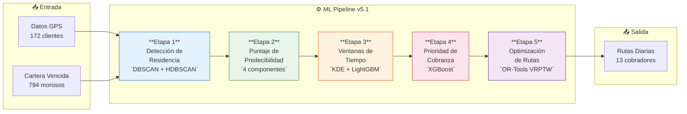
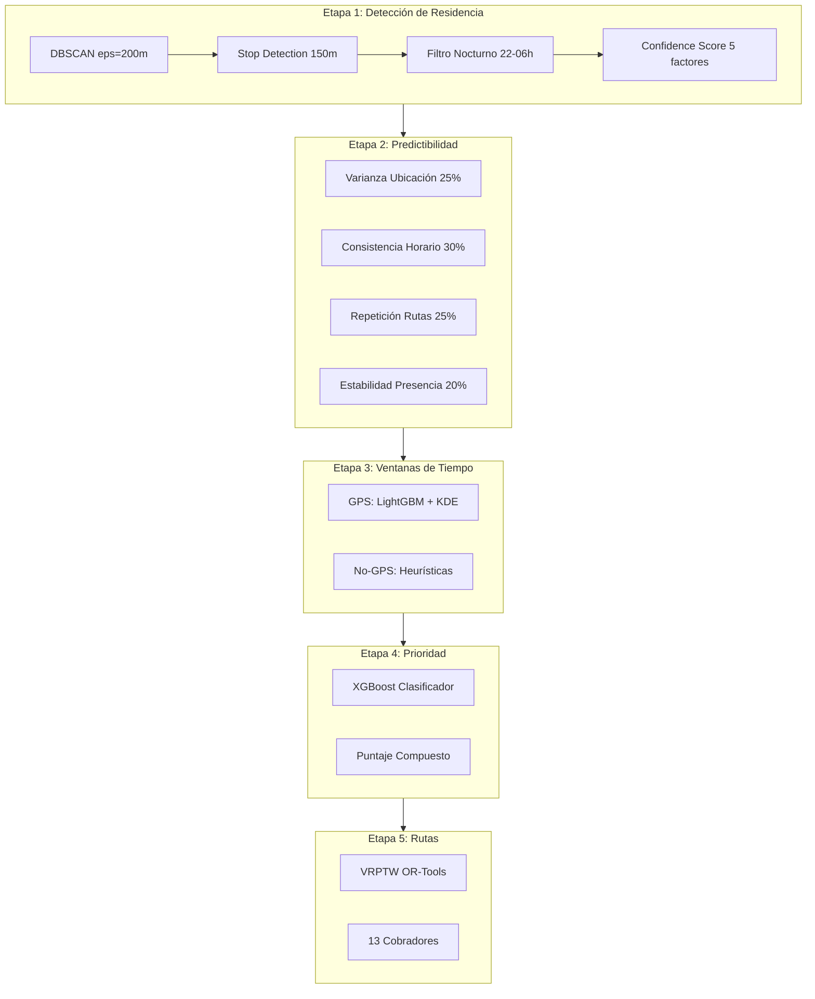
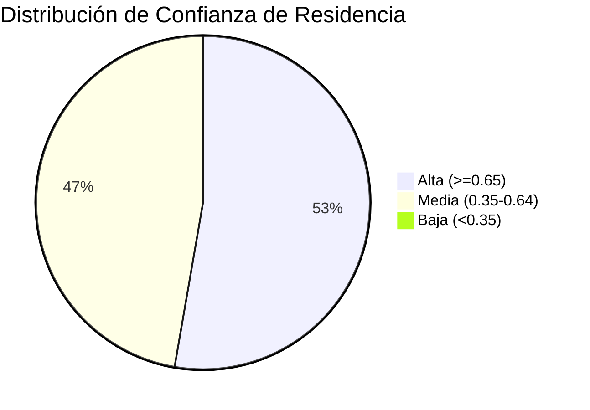
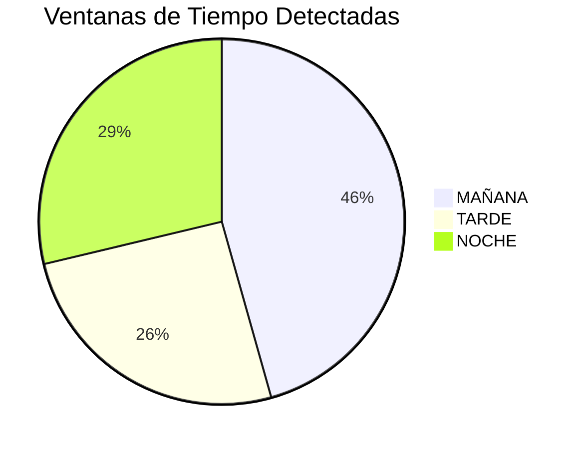

# ML Pipeline v5.1 — Optimización Inteligente de Rutas de Cobranza

## Descripción General

El **ML Pipeline v5.1** es un sistema de 5 etapas que transforma datos GPS crudos y registros de cartera vencida en rutas diarias optimizadas para 13 cobradores de campo. Procesa **794 morosos** (172 con datos GPS, 622 sin GPS) y genera itinerarios con ventanas de tiempo personalizadas.

## Arquitectura del Pipeline

## Flujo Detallado por Etapa

## Dependencias y Versiones

| Biblioteca | Versión | Uso Principal |
|---|---|---|
| `scikit-learn` | 1.4 | DBSCAN, K-Means, preprocesamiento |
| `hdbscan` | 0.8.39 | Clustering jerárquico (fallback) |
| `xgboost` | 2.0.3 | Modelo de prioridad de cobranza |
| `lightgbm` | 4.3 | Predicción de ventanas de tiempo |
| `ortools` | 9.8 | Optimización VRPTW de rutas |
| `numpy` | 1.26+ | Operaciones numéricas |
| `pandas` | 2.1+ | Manipulación de datos |
| `scipy` | 1.12+ | KDE, estadísticas, Weiszfeld |

## Datos de Entrada

| Concepto | Valor |
|---|---|
| Total morosos en cartera | **794** |
| Morosos con datos GPS | **172** (21.7%) |
| Morosos sin datos GPS | **622** (78.3%) |
| Cobradores disponibles | **13** |
| Municipios cubiertos | **36** (NL, Coahuila, Tamaulipas) |

## Datos de Salida

| Concepto | Valor |
|---|---|
| Residencias detectadas | **165 / 172** (96%) |
| Confianza alta | **87** (52.7%) |
| Confianza media | **78** (47.3%) |
| Confianza baja | **0** (0%) |
| Ventanas MAÑANA | **162** |
| Ventanas TARDE | **91** |
| Ventanas NOCHE | **102** |
| Rutas diarias generadas | **13** (1 por cobrador) |
| Máx. visitas por cobrador | **20** por jornada |
| Jornada laboral | **08:00 – 18:00** |

## Métricas Clave de Rendimiento

## Navegación del Pipeline

| Etapa | Documento | Descripción |
|---|---|---|
| 1 | [Detección de Residencia](./residencia) | DBSCAN, HDBSCAN, Confidence Score |
| 2 | [Predictibilidad](./predictibilidad) | Puntaje de 4 componentes |
| 3 | [Ventanas de Tiempo](./ventanas) | KDE + LightGBM |
| 4 | [Prioridad de Cobranza](./prioridad) | XGBoost + reglas compuestas |
| 5 | [Optimización de Rutas](./rutas) | OR-Tools VRPTW |
| Ref | [Configuración Completa](./configuracion) | Todos los parámetros |
| Ref | [Detección de Cambios](./cambios) | Cambios de comportamiento |
