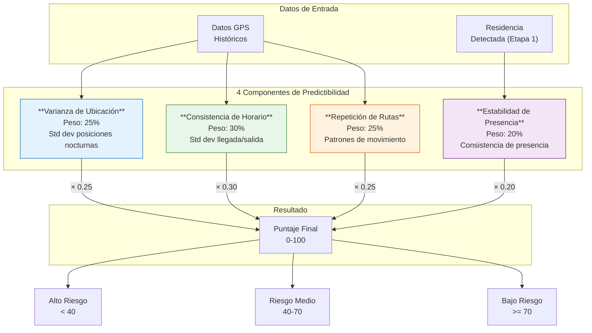
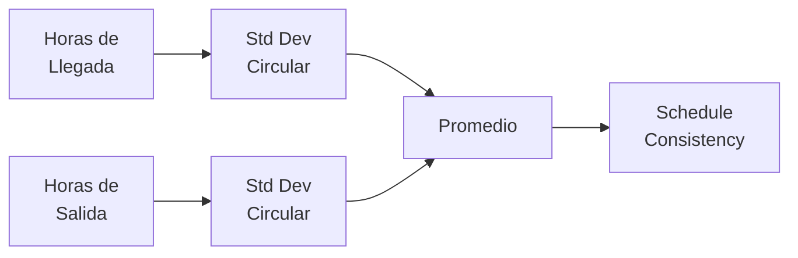
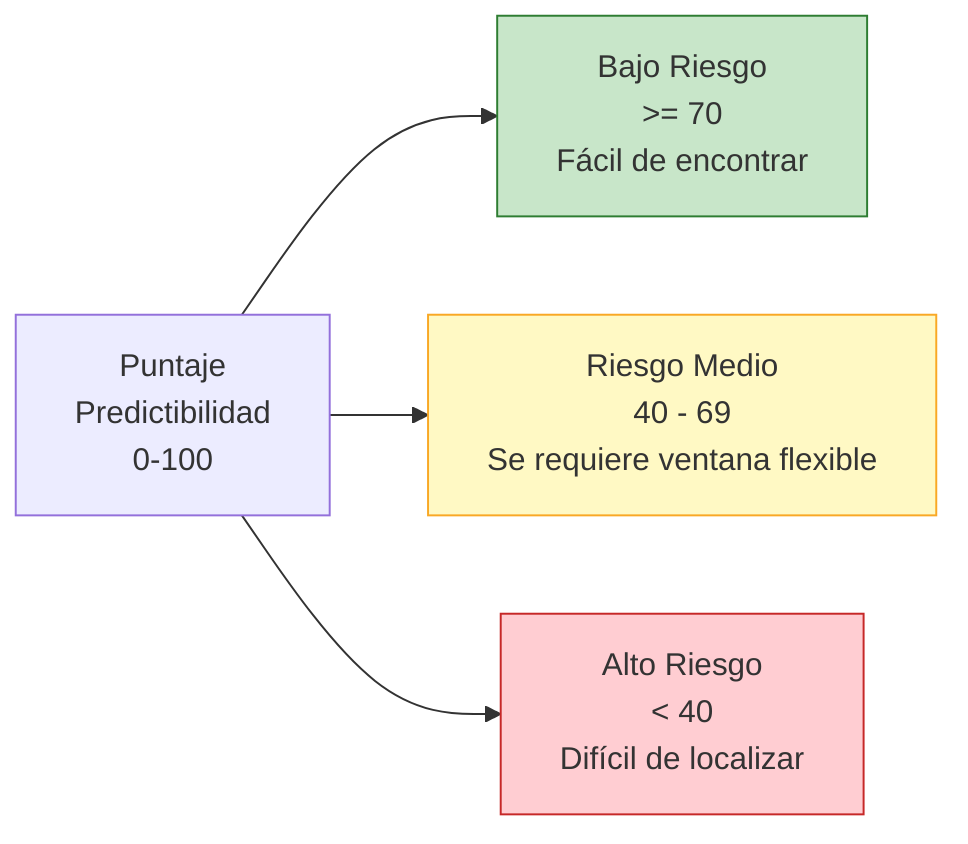
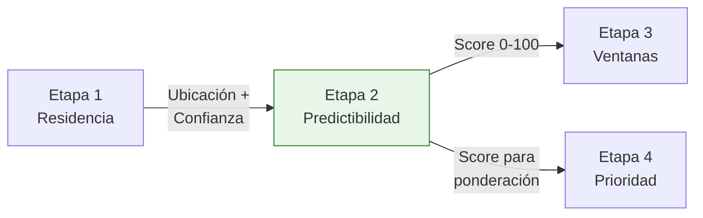

# Etapa 2: Puntaje de Predictibilidad

## Objetivo

Calcular un puntaje de **predictibilidad (0-100)** para cada moroso que indica qué tan predecible es su comportamiento de presencia en el hogar. Un puntaje alto significa que el cobrador puede encontrar al cliente con alta probabilidad en un horario específico.

## Diagrama de Componentes



## Fórmula General

```
predictability = location_variance   × 0.25
               + schedule_consistency × 0.30
               + route_repetition     × 0.25
               + presence_stability   × 0.20
```

## Componente 1: Varianza de Ubicación (25%)

Mide la dispersión espacial de las posiciones nocturnas del cliente. Menor dispersión significa mayor predictibilidad.

### Fórmula

```
location_variance = max(0, 100 - (std_dev_meters / max_tolerance) × 100)
```

| Parámetro | Valor |
|---|---|
| `max_tolerance` | 500 metros |
| Métrica | Desviación estándar de posiciones nocturnas (haversine) |

### Tabla de Referencia

| Std Dev (m) | Score | Interpretación |
|---|---|---|
| 0 - 50m | 90 - 100 | Siempre en el mismo punto |
| 50 - 100m | 80 - 90 | Muy consistente |
| 100 - 200m | 60 - 80 | Consistente |
| 200 - 350m | 30 - 60 | Variable |
| 350 - 500m+ | 0 - 30 | Muy variable |

## Componente 2: Consistencia de Horario (30%)

Mide la regularidad de los horarios de llegada y salida del hogar.

### Fórmula

```
arrival_consistency = max(0, 100 - (std_arrival_hours / 3) × 100)
departure_consistency = max(0, 100 - (std_departure_hours / 3) × 100)
schedule_consistency = (arrival_consistency + departure_consistency) / 2
```

Se usa **desviación estándar circular** para manejar la transición medianoche (23:00 → 01:00).

| Std Horario | Score | Interpretación |
|---|---|---|
| < 0.5h | 83 - 100 | Horario muy fijo |
| 0.5 - 1.0h | 67 - 83 | Horario regular |
| 1.0 - 2.0h | 33 - 67 | Horario variable |
| 2.0 - 3.0h+ | 0 - 33 | Sin patrón claro |



## Componente 3: Repetición de Rutas (25%)

Evalúa si el cliente sigue patrones de movimiento repetitivos (mismas rutas diarias).

### Fórmula

```
unique_patterns = clusters de trayectorias diarias (DBSCAN en secuencias)
route_repetition = max(0, 100 - (unique_patterns / max_patterns) × 100)
```

| Parámetro | Valor |
|---|---|
| `max_patterns` | 10 patrones únicos |
| Método clustering | DBSCAN sobre secuencias de celdas geohash |
| Resolución geohash | Nivel 6 (~1.2 km) |

| Patrones Únicos | Score | Interpretación |
|---|---|---|
| 1 - 2 | 80 - 100 | Ruta muy fija |
| 3 - 4 | 60 - 80 | Pocas variantes |
| 5 - 7 | 30 - 60 | Moderadamente variable |
| 8 - 10+ | 0 - 30 | Sin patrón de ruta |

## Componente 4: Estabilidad de Presencia (20%)

Mide la consistencia de presencia en el hogar detectado (de la Etapa 1).

### Fórmula

```
nights_present = noches con presencia confirmada en residencia
total_nights = noches totales en el periodo de análisis
presence_stability = (nights_present / total_nights) × 100
```

| Ratio Presencia | Score | Interpretación |
|---|---|---|
| >= 90% | 90 - 100 | Casi siempre en casa |
| 70 - 90% | 70 - 90 | Frecuentemente en casa |
| 50 - 70% | 50 - 70 | Presencia intermitente |
| 30 - 50% | 30 - 50 | Ausencias frecuentes |
| < 30% | 0 - 30 | Raramente en casa |

## Niveles de Riesgo



| Nivel | Rango | Estrategia de Cobranza |
|---|---|---|
| **Bajo riesgo** | >= 70 | Visita programada con ventana estrecha |
| **Riesgo medio** | 40 – 69 | Visita con ventana amplia, posible segundo intento |
| **Alto riesgo** | < 40 | Múltiples intentos, horarios variados, considerar otros canales |

## Configuración: SCORING_CONFIG

```python
SCORING_CONFIG = {
    "weights": {
        "location_variance": 0.25,
        "schedule_consistency": 0.30,
        "route_repetition": 0.25,
        "presence_stability": 0.20,
    },
    "thresholds": {
        "low_risk": 70,      # >= 70: bajo riesgo
        "medium_risk": 40,   # 40-69: riesgo medio
        # < 40: alto riesgo
    },
    "parameters": {
        "max_location_tolerance_m": 500,
        "max_schedule_std_hours": 3,
        "max_route_patterns": 10,
        "analysis_period_days": 90,
        "min_nights_for_score": 7,
        "geohash_resolution": 6,
    },
}
```

## Interacción con Otras Etapas



- **Recibe de Etapa 1**: Ubicación de residencia y confianza para calcular estabilidad de presencia
- **Alimenta a Etapa 3**: Score de predictibilidad influye en la amplitud de ventanas de tiempo
- **Alimenta a Etapa 4**: Componente del 20% en el cálculo de prioridad de cobranza

## Manejo de Datos Insuficientes

| Condición | Acción |
|---|---|
| < 7 noches de datos | Score fijado en 30 (riesgo medio-alto) |
| Sin residencia detectada | Score fijado en 20 (alto riesgo) |
| GPS intermitente (> 50% gaps) | Penalización de -15 puntos al score |
| Solo datos de fin de semana | Extrapolación con penalización de -10 puntos |
