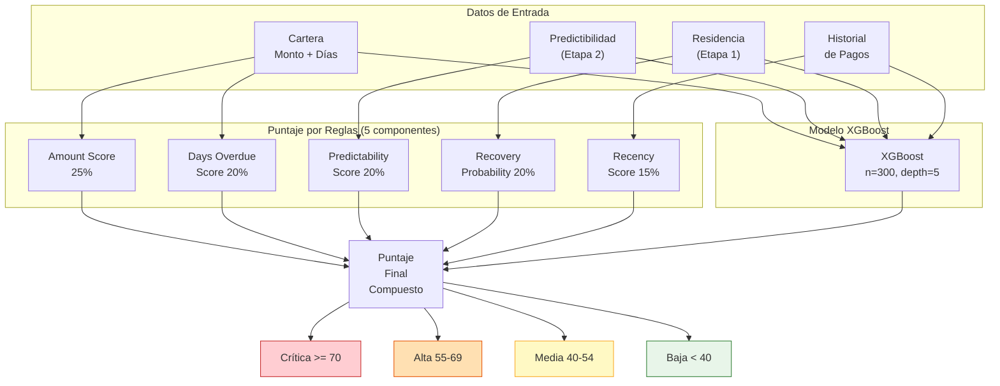
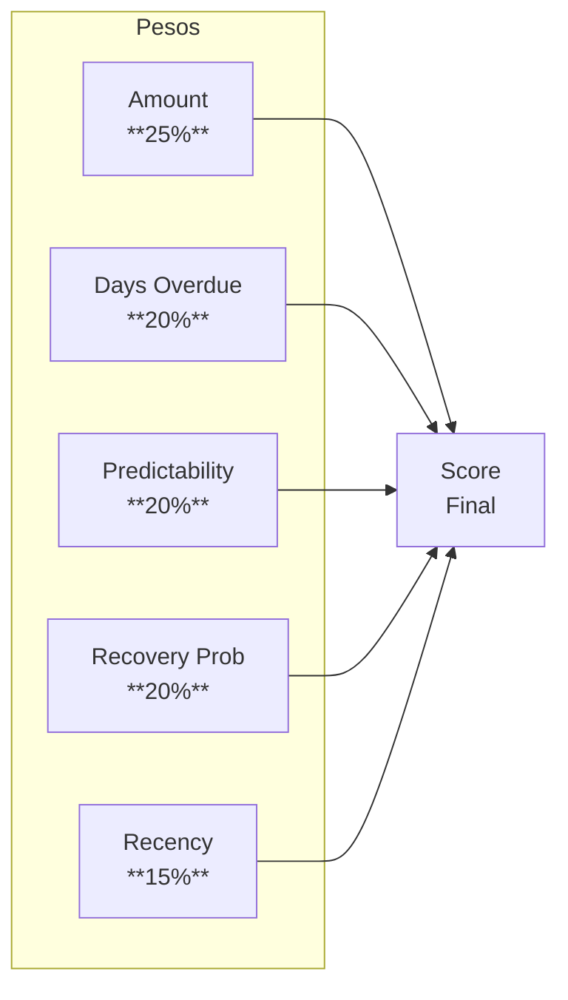
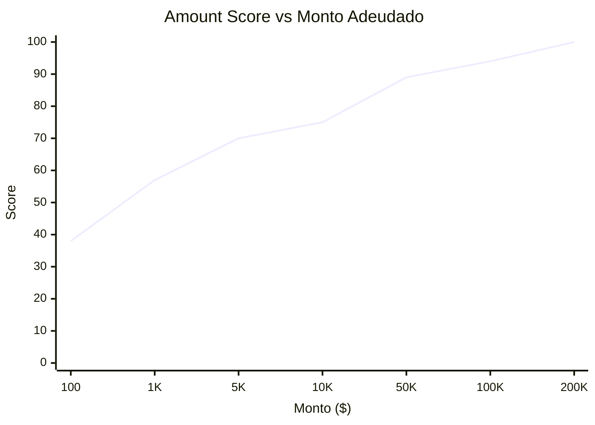
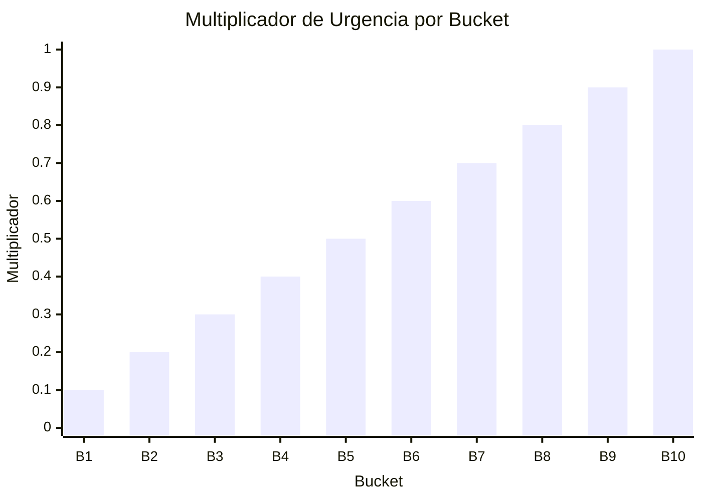
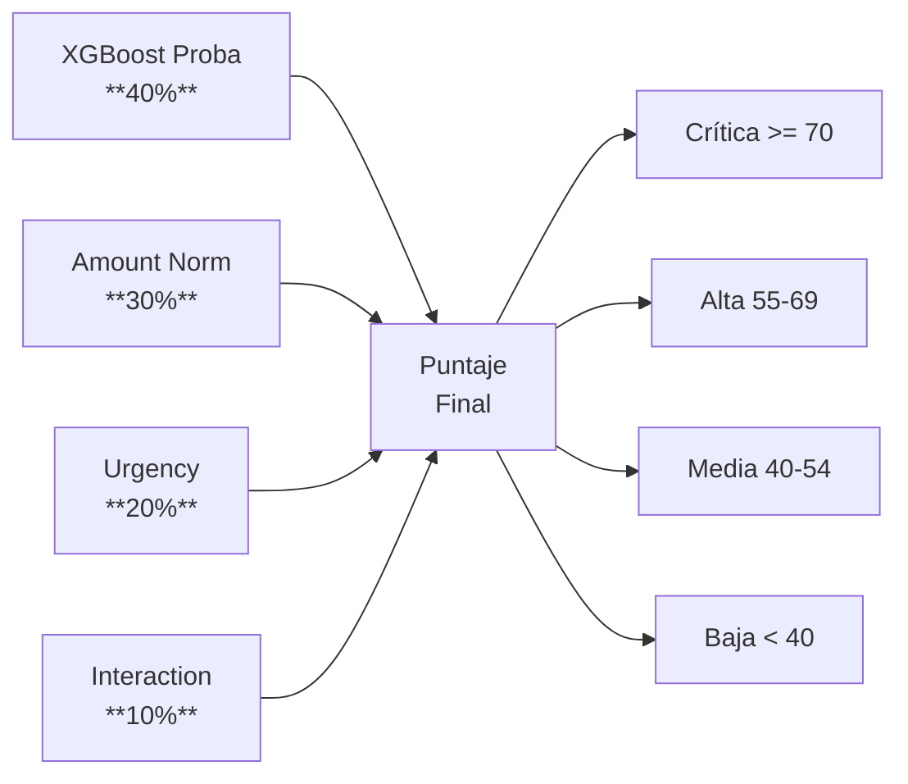

# Etapa 4: Prioridad de Cobranza

## Objetivo

Calcular un **puntaje de prioridad compuesto** para cada moroso que determina el orden de visita. Combina un modelo **XGBoost** con reglas de negocio ponderadas para maximizar la recuperación esperada.

## Arquitectura de la Etapa



## Puntaje por Reglas — 5 Componentes

### Fórmula General

```
rule_score = amount_score      × 0.25
           + days_overdue_score × 0.20
           + predictability     × 0.20
           + recovery_prob      × 0.20
           + recency_score      × 0.15
```



### Componente 1: Amount Score (25%)

Transforma el monto adeudado a una escala 0-100 usando escala logarítmica.

```
amount_score = min(log10(max(monto, 1)) / log10(200000) × 100, 100)
```

| Monto Adeudado | log10(monto) | Score | Interpretación |
|---|---|---|---|
| $100 | 2.00 | 38 | Bajo |
| $1,000 | 3.00 | 57 | Medio |
| $5,000 | 3.70 | 70 | Alto |
| $10,000 | 4.00 | 75 | Alto |
| $50,000 | 4.70 | 89 | Muy alto |
| $100,000 | 5.00 | 94 | Crítico |
| $200,000+ | 5.30 | 100 | Máximo |



### Componente 2: Days Overdue Score (20%)

Puntaje basado en rangos de días de atraso.

| Rango de Días | Score | Descripción |
|---|---|---|
| 0 – 30 | 30 – 50 | Atraso inicial |
| 31 – 60 | 50 – 70 | Atraso temprano |
| 61 – 90 | 70 – 85 | Atraso avanzado |
| 91+ | 85 – 100 | Atraso severo |

```python
def days_overdue_score(days):
    if days <= 30:
        return 30 + (days / 30) * 20       # 30-50
    elif days <= 60:
        return 50 + ((days - 30) / 30) * 20  # 50-70
    elif days <= 90:
        return 70 + ((days - 60) / 30) * 15  # 70-85
    else:
        return min(85 + ((days - 90) / 90) * 15, 100)  # 85-100
```

### Componente 3: Predictability Score (20%)

Directamente del puntaje de la Etapa 2, normalizado a 0-100.

```
predictability_component = predictability_score  # ya en 0-100
```

### Componente 4: Recovery Probability (20%)

Probabilidad estimada de recuperación basada en múltiples factores.

```
recovery_prob = base(70) + penalties + bonuses
```

#### Penalizaciones

| Condición | Penalización |
|---|---|
| Días > 90 | -15 |
| Días > 180 | -25 |
| Días > 360 | -35 |
| Sin contacto previo | -10 |
| Historial de promesas incumplidas | -10 |

#### Bonificaciones

| Condición | Bonificación |
|---|---|
| Predictibilidad >= 70 | +10 |
| Residencia alta confianza | +10 |
| Recency score >= 70 | +5 |
| Pago parcial previo | +10 |
| Contacto reciente exitoso | +5 |

```python
def recovery_probability(cliente):
    base = 70

    # Penalizaciones por antigüedad
    if cliente.dias_atraso > 360:
        base -= 35
    elif cliente.dias_atraso > 180:
        base -= 25
    elif cliente.dias_atraso > 90:
        base -= 15

    # Penalizaciones adicionales
    if not cliente.contacto_previo:
        base -= 10
    if cliente.promesas_incumplidas > 0:
        base -= 10

    # Bonificaciones
    if cliente.predictability >= 70:
        base += 10
    if cliente.residence_confidence >= 0.65:
        base += 10
    if cliente.recency_score >= 70:
        base += 5
    if cliente.pago_parcial:
        base += 10
    if cliente.contacto_reciente_exitoso:
        base += 5

    return max(0, min(100, base))
```

### Componente 5: Recency Score (15%)

Qué tan reciente fue el último contacto o pago del cliente.

```
recency_score = max(0, 100 - (dias_desde_ultimo_contacto / 180) × 100)
```

| Días desde Contacto | Score |
|---|---|
| 0 - 7 | 96 - 100 |
| 8 - 30 | 83 - 96 |
| 31 - 90 | 50 - 83 |
| 91 - 180 | 0 - 50 |
| 180+ | 0 |

## Multiplicador de Urgencia por Bucket

Cada bucket B1-B10 tiene un multiplicador basado en la antigüedad de la deuda.

| Bucket | Rango de Días | Multiplicador |
|---|---|---|
| **B1** | 1 – 30 | 0.1 |
| **B2** | 31 – 60 | 0.2 |
| **B3** | 61 – 90 | 0.3 |
| **B4** | 91 – 120 | 0.4 |
| **B5** | 121 – 150 | 0.5 |
| **B6** | 151 – 180 | 0.6 |
| **B7** | 181 – 240 | 0.7 |
| **B8** | 241 – 300 | 0.8 |
| **B9** | 301 – 360 | 0.9 |
| **B10** | 361+ | 1.0 |



## Modelo XGBoost

### Configuración del Modelo

```python
XGBOOST_CONFIG = {
    "n_estimators": 300,
    "max_depth": 5,
    "learning_rate": 0.05,
    "subsample": 0.8,
    "colsample_bytree": 0.8,
    "min_child_weight": 5,
    "gamma": 0.1,
    "reg_alpha": 0.1,
    "reg_lambda": 1.0,
    "objective": "binary:logistic",
    "eval_metric": "auc",
    "random_state": 42,
    "n_jobs": -1,
}
```

### Features del Modelo

| Feature | Descripción |
|---|---|
| `monto_log` | log10(monto adeudado) |
| `dias_atraso` | Días de atraso |
| `bucket` | Bucket B1-B10 (categórico) |
| `predictability_score` | Score de Etapa 2 |
| `residence_confidence` | Confianza de residencia Etapa 1 |
| `n_pagos_previos` | Número de pagos parciales |
| `dias_ultimo_pago` | Días desde último pago |
| `dias_ultimo_contacto` | Días desde último contacto |
| `n_intentos_contacto` | Intentos de contacto previos |
| `monto_pagado_ratio` | Proporción pagada del total |
| `municipio_encoded` | Municipio (target encoded) |
| `zona_tipo_encoded` | Tipo de zona (one-hot) |

## Puntaje Final Compuesto

```
final_score = xgb_proba × 40 + amount_norm × 30 + urgency × 20 + interaction × 10
```

Donde:
- `xgb_proba` = probabilidad del modelo XGBoost (0-100)
- `amount_norm` = amount_score normalizado (0-100)
- `urgency` = multiplicador de bucket × days_overdue_score
- `interaction` = predictability × recovery_prob / 100



## Niveles de Prioridad

| Nivel | Rango | Color | Acción |
|---|---|---|---|
| **Crítica** | >= 70 | Rojo | Visita prioritaria, primer slot del día |
| **Alta** | 55 – 69 | Naranja | Visita programada en la jornada |
| **Media** | 40 – 54 | Amarillo | Visita si hay capacidad |
| **Baja** | < 40 | Verde | Posponer o canal alternativo |

## ROI Esperado

Para cada moroso se calcula el ROI esperado de la visita:

```
expected_ROI = monto × (recovery_prob / 100) × (final_score / 100)
```

### Ejemplos de Cálculo

| Monto | Recovery Prob | Final Score | ROI Esperado |
|---|---|---|---|
| $50,000 | 75% | 80 | $30,000 |
| $10,000 | 60% | 65 | $3,900 |
| $100,000 | 40% | 70 | $28,000 |
| $5,000 | 85% | 55 | $2,338 |
| $1,000 | 50% | 40 | $200 |

## Configuración Completa

```python
PRIORITY_CONFIG = {
    "weights": {
        "amount_score": 0.25,
        "days_overdue_score": 0.20,
        "predictability": 0.20,
        "recovery_prob": 0.20,
        "recency_score": 0.15,
    },
    "final_weights": {
        "xgb_proba": 0.40,
        "amount_norm": 0.30,
        "urgency": 0.20,
        "interaction": 0.10,
    },
    "thresholds": {
        "critical": 70,
        "high": 55,
        "medium": 40,
    },
    "bucket_multipliers": {
        "B1": 0.1, "B2": 0.2, "B3": 0.3, "B4": 0.4, "B5": 0.5,
        "B6": 0.6, "B7": 0.7, "B8": 0.8, "B9": 0.9, "B10": 1.0,
    },
    "recovery_base": 70,
    "amount_log_base": 200000,
}
```
