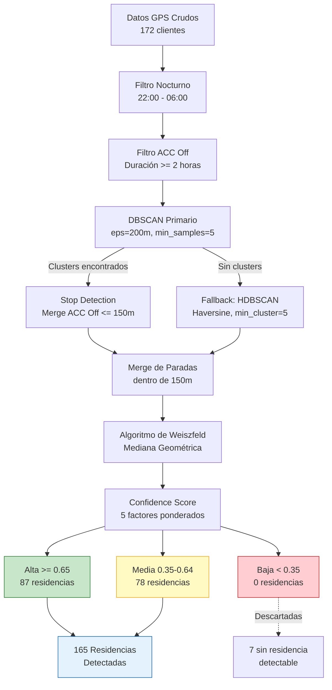
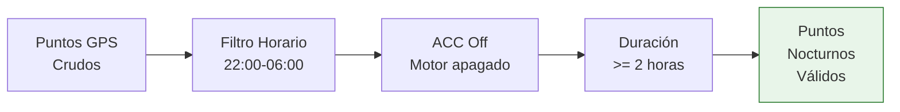
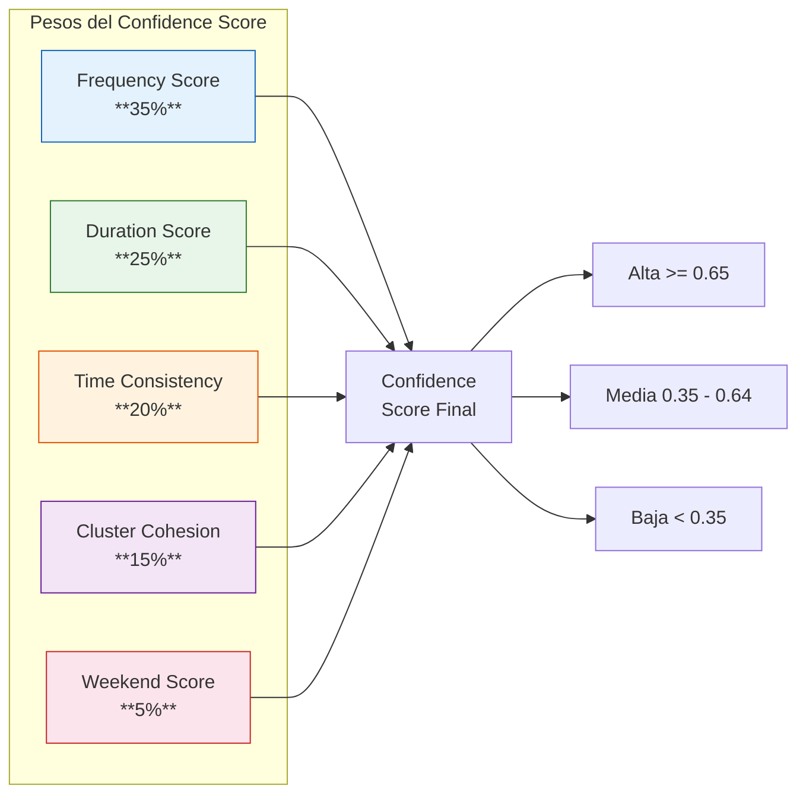
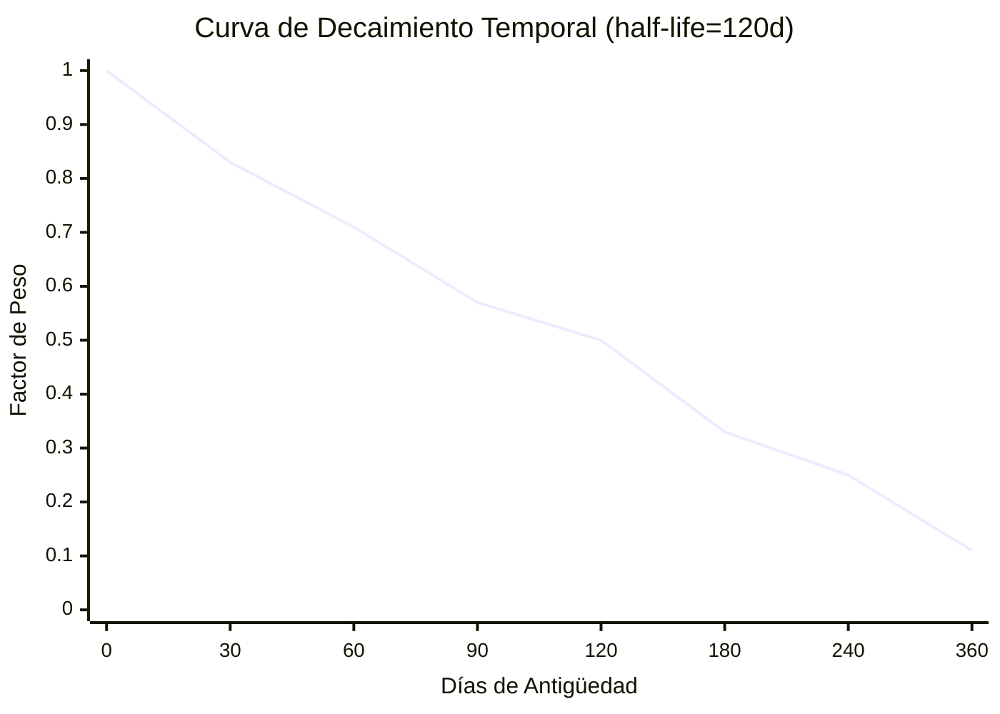
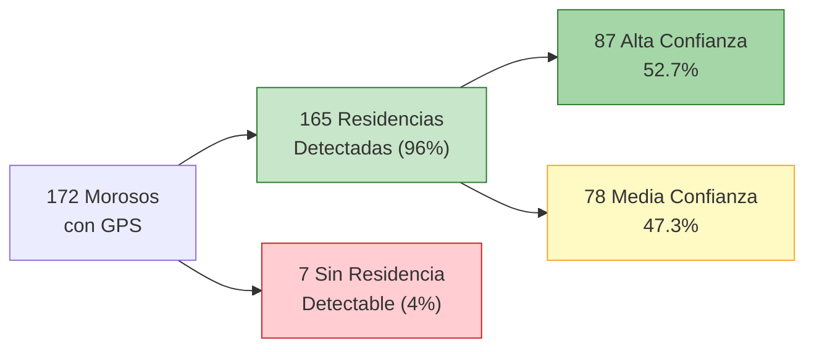

# Etapa 1: Detección de Residencia

## Objetivo

Identificar la ubicación de residencia de cada moroso a partir de datos GPS vehiculares. De **172 morosos con GPS**, se detectaron **165 residencias** (96% de éxito), con **87 de alta confianza** y **78 de media confianza**.

## Diagrama de Flujo del Proceso



## Algoritmo Primario: DBSCAN

El algoritmo principal utiliza **DBSCAN** (Density-Based Spatial Clustering of Applications with Noise) con distancia haversine para agrupar puntos GPS nocturnos.

### Parámetros DBSCAN

| Parámetro | Valor | Justificación |
|---|---|---|
| `eps` | 200 metros | Radio máximo de un vecindario residencial típico |
| `min_samples` | 5 | Mínimo de puntos para formar un cluster válido |
| `metric` | haversine | Distancia geodésica sobre la superficie terrestre |
| `algorithm` | ball_tree | Eficiente para métricas haversine |

### Proceso de Filtrado Previo



**Criterios de filtrado:**

1. **Horario nocturno**: Solo puntos entre las 22:00 y las 06:00
2. **ACC Off**: El motor debe estar apagado (señal de estacionamiento)
3. **Duración mínima**: La parada debe durar al menos 2 horas continuas
4. **Noches mínimas**: Al menos 3 noches por semana con presencia

## Stop Detection (Complementario)

Fusiona puntos con ACC Off dentro de un radio de **150 metros** para consolidar paradas fragmentadas por ruido GPS.

```python
# Pseudocódigo de Stop Detection
for punto in puntos_acc_off:
    parada_cercana = buscar_parada(punto, radio=150)
    if parada_cercana:
        parada_cercana.agregar(punto)
        parada_cercana.actualizar_centroide()
    else:
        crear_nueva_parada(punto)
```

| Parámetro | Valor |
|---|---|
| Radio de merge | 150 metros |
| Duración mínima de parada | 2 horas |
| Máximo gap entre puntos | 30 minutos |

## Algoritmo Fallback: HDBSCAN

Cuando DBSCAN no encuentra clusters válidos, se activa **HDBSCAN** (Hierarchical DBSCAN) como respaldo.

| Parámetro | Valor | Descripción |
|---|---|---|
| `min_cluster_size` | 5 | Tamaño mínimo de cluster |
| `min_samples` | 3 | Puntos mínimos de core |
| `cluster_selection_epsilon` | 0.00002 (~127m) | Epsilon para selección de clusters |
| `metric` | haversine | Distancia geodésica |
| `cluster_selection_method` | eom | Excess of Mass |

### Conversión de Epsilon

```
cluster_selection_epsilon = 0.00002 radianes
≈ 0.00002 × 6,371,000 m = 127.42 metros
```

## Configuración Completa: RESIDENCE_CONFIG

```python
RESIDENCE_CONFIG = {
    # Filtros temporales
    "night_start_hour": 22,
    "night_end_hour": 6,
    "min_stay_duration_hours": 2,
    "min_nights_per_week": 3,

    # Tolerancias espaciales
    "spatial_tolerance_meters": 100,

    # Umbrales de confianza
    "primary_threshold": 0.6,
    "secondary_threshold": 0.3,

    # DBSCAN primario
    "dbscan_eps_meters": 200,
    "dbscan_min_samples": 5,

    # HDBSCAN fallback
    "hdbscan_min_cluster_size": 5,
    "hdbscan_min_samples": 3,
    "cluster_selection_epsilon": 0.00002,  # ~127m en radianes

    # Límites
    "max_residences_per_client": 3,

    # Decaimiento temporal
    "temporal_decay_half_life_days": 120,
}
```

## Confidence Score — Fórmula de 5 Factores

El puntaje de confianza combina 5 factores ponderados para evaluar la certeza de cada residencia detectada:

```
confidence = frequency_score × 0.35
           + duration_score  × 0.25
           + time_consistency × 0.20
           + cluster_cohesion × 0.15
           + weekend_score    × 0.05
```



### Factor 1: Frequency Score (35%)

Frecuencia de presencia en el cluster con **decaimiento temporal**.

```
frequency_score = decay_cluster / decay_total
```

Donde:
- `decay_cluster` = suma de pesos con decaimiento de las noches en el cluster
- `decay_total` = suma de pesos con decaimiento de todas las noches registradas

### Factor 2: Duration Score (25%)

Promedio de horas detenido en la residencia, normalizado a 8 horas.

```
duration_score = min(avg_hours_stopped / 8, 1.0)
```

| Horas promedio | Score |
|---|---|
| 2h | 0.25 |
| 4h | 0.50 |
| 6h | 0.75 |
| 8h+ | 1.00 |

### Factor 3: Time Consistency (20%)

Consistencia del horario de llegada usando **media circular** (para manejar la transición 23h-1h).

```
time_consistency = 1 - min(std_circular(hora_llegada) / 3, 1.0)
```

Donde `std_circular` usa la desviación estándar circular de las horas de llegada.

| Std Circular (horas) | Score |
|---|---|
| 0.5h | 0.83 |
| 1.0h | 0.67 |
| 2.0h | 0.33 |
| 3.0h+ | 0.00 |

### Factor 4: Cluster Cohesion (15%)

Qué tan compacto es el cluster de puntos GPS.

```
cluster_cohesion = max(1 - avg_dist_meters / 300, 0)
```

| Distancia media (m) | Score |
|---|---|
| 50m | 0.83 |
| 100m | 0.67 |
| 200m | 0.33 |
| 300m+ | 0.00 |

### Factor 5: Weekend Score (5%)

Presencia en fines de semana (sábado y domingo).

```
weekend_score = weekends_con_presencia / total_weekends_periodo
```

## Decaimiento Temporal (Temporal Decay)

Los datos más recientes tienen mayor relevancia. Se aplica una función de decaimiento exponencial con **vida media de 120 días**.

### Fórmula

```
decay(days_old) = exp(-days_old × ln(2) / 120)
```

### Tabla de Decaimiento

| Antigüedad | Factor de Decaimiento | Interpretación |
|---|---|---|
| 0 días | **1.00** | Dato actual, peso completo |
| 7 días | **0.96** | Casi peso completo |
| 30 días | **0.83** | Relevancia alta |
| 60 días | **0.71** | Relevancia buena |
| 90 días | **0.57** | Relevancia media |
| 120 días | **0.50** | Vida media — mitad de peso |
| 180 días | **0.33** | Relevancia baja |
| 240 días | **0.25** | Peso bajo |
| 360 días | **0.11** | Casi irrelevante |



## Algoritmo de Weiszfeld — Mediana Geométrica

Para calcular el centroide de cada cluster se utiliza el **Algoritmo de Weiszfeld** en lugar del promedio aritmético. La mediana geométrica es robusta contra **outliers GPS de hasta ±300 metros**.

### Proceso Iterativo

```python
# Pseudocódigo del Algoritmo de Weiszfeld
def weiszfeld(puntos, max_iter=100, tol=1e-6):
    # Inicializar con el centroide promedio
    mediana = promedio(puntos)

    for i in range(max_iter):
        pesos = [1 / distancia(mediana, p) for p in puntos]
        nueva_mediana = sum(p * w for p, w in zip(puntos, pesos)) / sum(pesos)

        if distancia(mediana, nueva_mediana) < tol:
            break
        mediana = nueva_mediana

    return mediana
```

### Ventajas sobre Promedio Aritmético

| Método | Sensibilidad a Outliers | Error típico |
|---|---|---|
| Promedio aritmético | Alta — un punto a 1km desplaza el centro | ±150m |
| Mediana geométrica (Weiszfeld) | Baja — resistente a outliers | ±50m |

## Niveles de Confianza

| Nivel | Rango | Cantidad | Porcentaje | Acción |
|---|---|---|---|---|
| **Alta** | >= 0.65 | 87 | 52.7% | Usar directamente para rutas |
| **Media** | 0.35 – 0.64 | 78 | 47.3% | Usar con ventana ampliada |
| **Baja** | < 0.35 | 0 | 0% | Descartar o validar manualmente |

## Resultados Actuales



## Limitaciones Conocidas

| Limitación | Impacto | Mitigación |
|---|---|---|
| GPS solo vehicular | No detecta si el cliente se mueve a pie | Validación con datos de cartera |
| Zonas sin cobertura GPS | Gaps en datos nocturnos | HDBSCAN como fallback |
| Residencias múltiples | Confusión entre casa y casa de familiares | Máximo 3 residencias por cliente |
| Estacionamiento público | Falsos positivos en centros comerciales | Filtro de duración >= 2h + nocturno |
