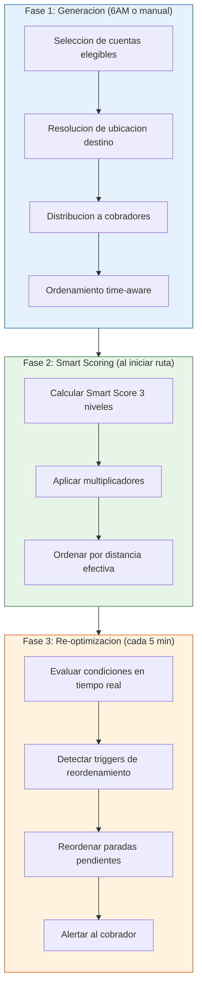
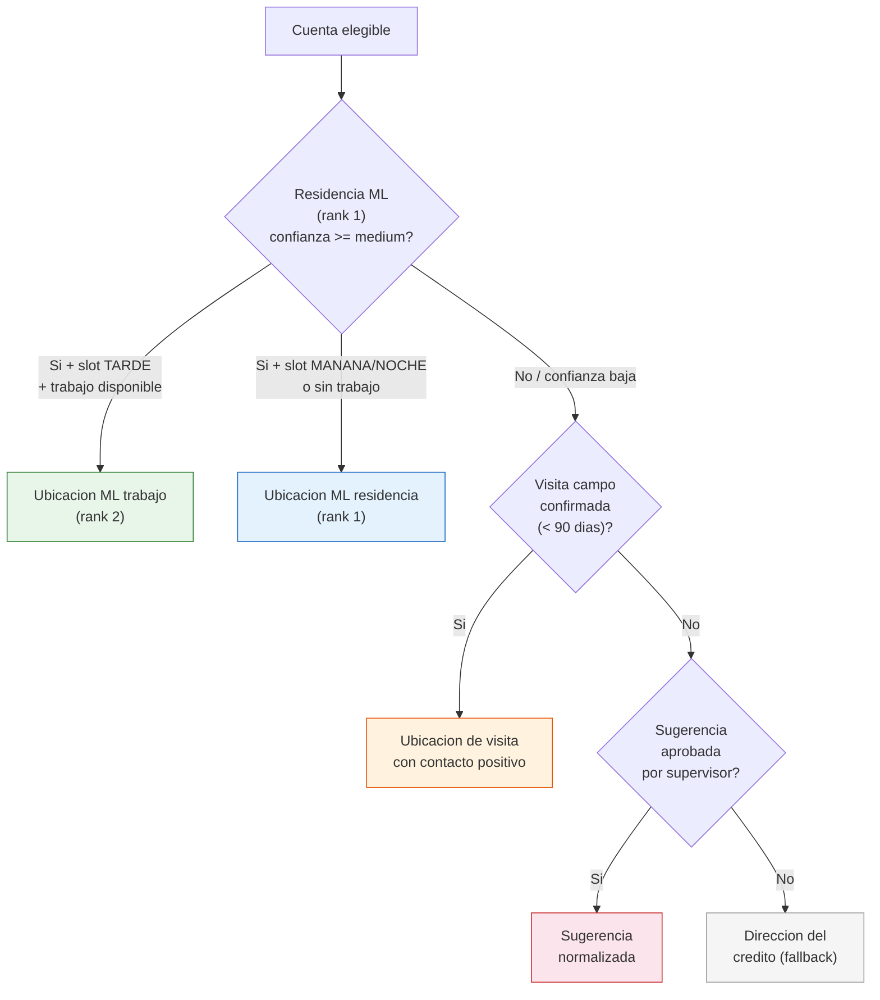
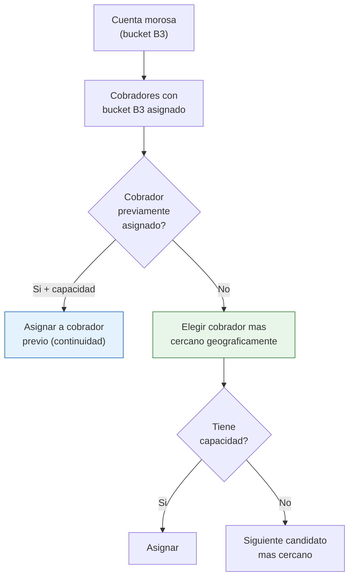
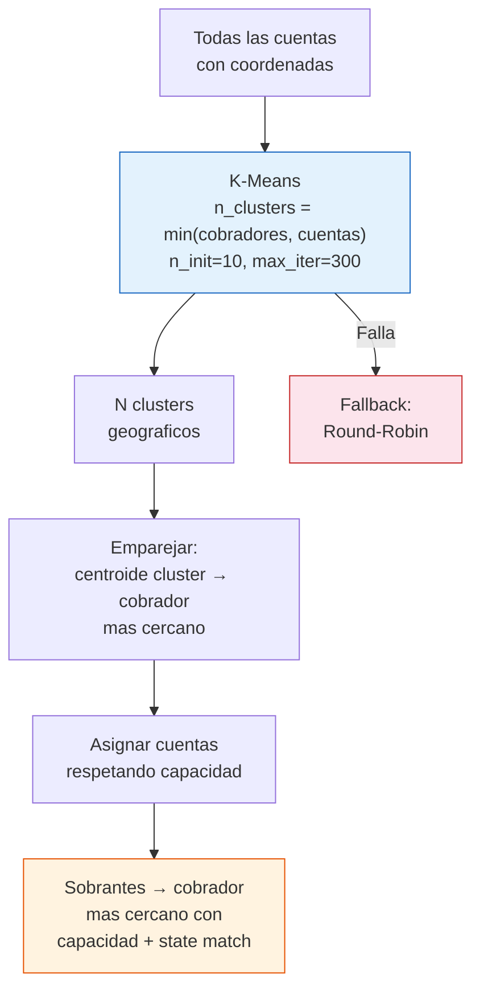
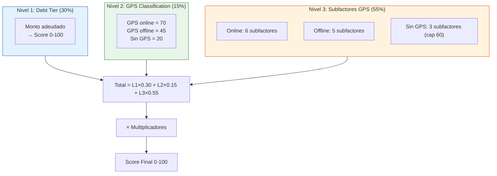
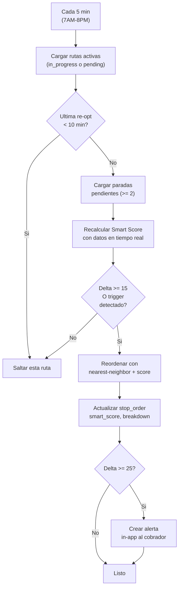

# Generacion de Rutas Diarias — Referencia Completa

## Objetivo

Este documento describe con precision exhaustiva **todas las reglas, ponderaciones, algoritmos y consideraciones** que el sistema utiliza para calcular las rutas diarias de cobranza. Sirve como referencia tecnica definitiva para entender como se decide: a quien visitar, en que orden, hacia donde enviar al cobrador, y cuando reordenar la ruta en tiempo real.

---

## 1. Arquitectura General del Ruteo

El sistema de rutas opera en **3 fases secuenciales**:



### Modos de Generacion

| Modo | Trigger | Punto de inicio | Descripcion |
|------|---------|-----------------|-------------|
| `bucket` | Auto 6AM | Casa del cobrador (GPS-detected home) | Distribucion por reglas de bucket B1-B10 |
| `ai_optimized` | Auto 6AM | Casa del cobrador (GPS-detected home) | K-Means clustering geografico + zonas exclusivas |
| `manual` | Supervisor | Posicion GPS actual del cobrador | Asignacion selectiva por el supervisor |

> **Regla critica**: Si un cobrador ya tiene una ruta `manual` hoy, NO se le generan rutas automaticas (`bucket` ni `ai_optimized`).

---

## 2. Fase 1: Seleccion de Cuentas Elegibles

### 2.1 Filtros de Elegibilidad

Una cuenta morosa debe cumplir **todos** estos criterios para ser incluida:

| Filtro | Condicion | Razon |
|--------|-----------|-------|
| Cuenta activa | `is_active = true` | Solo cuentas vigentes |
| Coordenadas disponibles | `route_lat IS NOT NULL AND route_lng IS NOT NULL` | Necesario para ruteo geografico |
| Bucket asignado | `bucket_code IS NOT NULL` | Clasificacion requerida |
| No ruteada hoy (mismo modo) | No tiene paradas no-pendientes en el mismo `generation_mode` | Evita duplicados |
| Sin promesa activa | `promise_status != 'active'` O promesa vence en ≤1 dia | Respetar promesas, excepto las que estan por vencer |
| Frecuencia de bucket (solo modo bucket) | `dias_desde_ultima_visita >= frecuencia_visita` | Respetar frecuencia por bucket |

### 2.2 Reglas de Frecuencia por Bucket

Cada bucket define con que frecuencia se puede visitar a un moroso:

| Bucket | Dias de atraso | Frecuencia (dias) | Estrategia | Visitas max antes de escalar |
|--------|---------------|-------------------|------------|------------------------------|
| **B1** | 1-30 | Cada **7** dias | `soft_contact` | 3 |
| **B2** | 31-60 | Cada **5** dias | `moderate_pressure` | 4 |
| **B3** | 61-90 | Cada **3** dias | `intensive_contact` | 5 |
| **B4** | 91-120 | Cada **2** dias | `aggressive_recovery` | 6 |
| **B5** | 121-150 | Cada **2** dias | `vehicle_focused` | 6 |
| **B6** | 151-180 | Cada **1** dia | `vehicle_focused` | 6 |
| **B7** | 181-210 | Cada **1** dia | `vehicle_focused` | 6 |
| **B8** | 211-270 | Cada **1** dia | `last_resort` | 6 |
| **B9** | 271-360 | **Solo oportunista** | `opportunistic_only` | 6 |
| **B10** | 360+ | **Solo oportunista** | `opportunistic_only` | 6 |

> **B9 y B10 (oportunistas)**: Solo se incluyen si el vehiculo tiene GPS **online**. Sin GPS online → no se visitan de forma programada.

### 2.3 Ponderaciones de Prioridad por Bucket

Cada bucket define pesos diferentes para los 4 factores de priorizacion:

| Bucket | `weight_debt` | `weight_days_overdue` | `weight_gps_proximity` | `weight_window_prob` |
|--------|:---:|:---:|:---:|:---:|
| **B1** | 0.30 | 0.10 | 0.40 | 0.20 |
| **B2** | 0.35 | 0.15 | 0.35 | 0.15 |
| **B3** | 0.30 | 0.20 | 0.30 | 0.20 |
| **B4** | 0.25 | 0.15 | 0.40 | 0.20 |
| **B5** | 0.20 | 0.10 | 0.50 | 0.20 |
| **B6** | 0.15 | 0.10 | 0.55 | 0.20 |
| **B7** | 0.15 | 0.10 | 0.55 | 0.20 |
| **B8** | 0.10 | 0.10 | 0.60 | 0.20 |
| **B9** | 0.10 | 0.05 | 0.70 | 0.15 |
| **B10** | 0.10 | 0.05 | 0.70 | 0.15 |

**Patron observable**: A medida que el bucket avanza (mayor morosidad), el peso de `gps_proximity` aumenta de 0.40 a 0.70, mientras que `debt` disminuye de 0.35 a 0.10. Esto refleja que en buckets avanzados la localizacion del vehiculo es mas importante que el monto adeudado.

### 2.4 Reglas de Promesas de Pago por Bucket

| Bucket | Permite promesa | Dias max | Monto minimo (% deuda) |
|--------|:---:|:---:|:---:|
| **B1** | Si | 15 | 30% |
| **B2** | Si | 10 | 50% |
| **B3** | Si | 7 | 50% |
| **B4** | Si | 5 | 70% |
| **B5** | Si | 3 | 100% |
| **B6** | Si | 3 | 100% |
| **B7** | Si | 3 | 100% |
| **B8** | Si | 3 | 100% |
| **B9** | Si | 3 | 0.01% (simbolico) |
| **B10** | Si | 3 | 0.01% (simbolico) |

### 2.5 Visitas Oportunistas por Bucket

A partir de B5, el sistema puede generar visitas oportunistas cuando el cobrador pasa cerca:

| Bucket | Oportunista | Radio (km) | Requiere GPS | Recuperacion vehicular |
|--------|:---:|:---:|:---:|:---:|
| B1-B3 | No | — | No | No |
| **B4** | No | — | Si | Si |
| **B5** | Si | 2.0 km | Si | Si |
| **B6** | Si | 3.0 km | Si | Si |
| **B7** | Si | 4.0 km | Si | Si |
| **B8** | Si | 5.0 km | Si | Si |
| **B9** | Si | 5.0 km | Si | Si |
| **B10** | Si | 7.0 km | Si | Si |

### 2.6 Ordenamiento Inicial de Cuentas Elegibles

Antes de distribuir a cobradores, las cuentas se ordenan por prioridad descendente:

```
sort_key = (
    is_urgent AND is_expired × 10,000      ← Maxima prioridad
    is_expired × 5,000                      ← Promesa vencida
    is_urgent × 3,000                       ← Flaggeado urgente
    bucket_recovery_weight                  ← B1=100...B10=1,000
    has_gps_online × 500                    ← GPS conectado = bonus
    last_visit_failed × 200                 ← Reintento de visita fallida
    min(amount_owed, 100,000)               ← Monto (capped a 100K)
)
```

#### Pesos de Recuperacion por Bucket

| Bucket | Peso |
|--------|:---:|
| B1 | 100 |
| B2 | 200 |
| B3 | 300 |
| B4 | 400 |
| B5 | 600 |
| B6 | 700 |
| B7 | 800 |
| B8 | 900 |
| B9 | 950 |
| B10 | 1,000 |

#### Valores de Urgencia (sort keys)

| Condicion | Valor |
|-----------|:---:|
| `urgent_and_expired` | 10,000 |
| `expired_promise` | 5,000 |
| `urgent_flag` | 3,000 |
| `gps_online_bonus` | 500 |
| `failed_visit_retry` | 200 |

> Todos estos valores son **configurables** desde la tabla `cob_route_strategy_config` en BD, con cache de 5 minutos y fallback a defaults.

---

## 3. Fase 1: Resolucion de Ubicacion Destino

Para cada cuenta elegible, el sistema determina **a donde enviar al cobrador** usando una jerarquia de 4 fuentes de ubicacion:

### 3.1 Jerarquia de Fuentes de Ubicacion



| Prioridad | Fuente | Etiqueta (`routing_source`) | Condiciones |
|:---:|--------|---------------------------|-------------|
| 1a | ML residencia | `ml_residence` | `confidence_level` = high o medium |
| 1b | ML trabajo | `ml_work` | Slot predicho = TARDE + `confidence_level` high/medium |
| 2 | Visita de campo | `field_confirmed` | Visita con GPS del cobrador + resultado de contacto positivo (< 90 dias) |
| 3 | Sugerencia aprobada | `field_suggestion` | Supervisor aprobo la direccion sugerida |
| 4 | Direccion del credito | `credit_address` | Fallback por defecto |

### 3.2 Ruteo Dinamico por Hora del Dia (Time-Aware)

El sistema predice a que hora llegara el cobrador y elige la ubicacion optima:

| Slot predicho | Hora estimada | Destino preferido | Logica |
|---------------|:---:|------------------|--------|
| `manana` | 05:00-11:59 | **Casa** (rank 1) | El moroso esta en casa antes de salir |
| `tarde` | 12:00-16:59 | **Trabajo** (rank 2) si disponible | El moroso esta fuera de casa |
| `noche` | 17:00-22:59 | **Casa** (rank 1) | El moroso regreso a casa |

### 3.3 Fuentes de Ubicacion en Tiempo Real (3 fuentes evaluadas por parada)

Al ordenar la ruta, cada parada se evalua contra **3 fuentes** y se elige la mejor:

| Fuente | Score | Condicion |
|--------|:---:|-----------|
| **GPS en vivo** | 1.0 (siempre gana) | Vehiculo online, ultima lectura < 10 minutos |
| **Bloque de frecuencia** | `probability × 0.8 × data_factor` | Patron historico para el bloque de 2 horas, probabilidad >= 30% |
| **Direccion del credito** | 0.2 (baseline) | Siempre disponible como fallback |

**Bloques de frecuencia**: El dia se divide en bloques de 2 horas:

```
00-02, 02-04, 04-06, 06-08, 08-10, 10-12,
12-14, 14-16, 16-18, 18-20, 20-22, 22-00
```

El `data_factor` del bloque de frecuencia es: `min(visit_days / 7.0, 1.0)` — penaliza datos con menos de 7 dias de observacion.

### 3.4 Resultados de Visita que Confirman Ubicacion

Solo estas visitas anteriores cuentan como "campo confirmado":

- `promesa_pago`
- `promesa_auto_garantia`
- `promesa_auto_definitiva`
- `carta_visita`
- `cita_despacho`

Otros resultados como `not_found`, `refused`, `closed` NO confirman la ubicacion.

---

## 4. Fase 1: Distribucion a Cobradores

### 4.1 Modo Bucket: Distribucion por Reglas

El modo `bucket` respeta la asignacion de buckets a cobradores:



**Reglas de distribucion bucket:**

1. **Compatibilidad de bucket**: La cuenta solo puede ir a cobradores que tengan asignado ese bucket
2. **Filtro geografico**: Solo cobradores cuyo `allowed_states` incluya la ubicacion de la cuenta
3. **Preferencia de continuidad**: Si la cuenta fue previamente asignada a un cobrador y este tiene capacidad → asignar al mismo
4. **Desempate geografico**: Entre candidatos disponibles, elegir el mas cercano

**Calculo de distancia al cobrador** (3 fallbacks):

| Fuente | Prioridad | Descripcion |
|--------|:---:|-------------|
| GPS del cobrador | 1 | Posicion detectada (casa o tiempo real) |
| Centroide de asignaciones | 2 | Promedio de coordenadas de cuentas ya asignadas |
| Posicion estatica | 3 | `start_lat/lng` del cobrador o default Monterrey (25.67, -100.31) |

### 4.2 Modo AI: K-Means Clustering Geografico

El modo `ai_optimized` crea zonas geograficas exclusivas por cobrador:



**Parametros K-Means:**
- `n_clusters` = `min(num_cobradores, num_cuentas)`
- `n_init` = 10 (ejecuciones con diferentes centroides)
- `max_iter` = 300
- `random_state` = 42 (reproducibilidad)

**Emparejamiento cluster-cobrador:**
1. Calcular distancia de cada centroide a cada cobrador
2. Ordenar pares (cluster, cobrador) por distancia ascendente
3. Asignar 1:1 greedy (cada cluster a un solo cobrador, cada cobrador a un solo cluster)

**Ordenamiento interno de cada cluster**: Por `recovery_sort_key` descendente (misma logica de la seccion 2.6).

### 4.3 Capacidad Dinamica por Cobrador

La capacidad diaria se calcula dinamicamente basada en el historial de visitas:

```
capacidad = working_minutes / (avg_visit_duration + travel_between)
```

| Parametro | Valor default | Configurable |
|-----------|:---:|:---:|
| `working_minutes` | 600 (10 horas) | Si |
| `visit_duration` | 25 min | Si |
| `travel_between` | 12 min | Si |
| `min_stops` | 8 | Si |
| `max_stops` | 20 | Si |
| `history_days` | 30 | No |
| Minimo de visitas para historial | 5 | No |

**Con valores default**: 600 / (25 + 12) = 16.2 → **16 paradas/cobrador**

**Rango posible**: 8 (minimo forzado) a 20 (maximo forzado)

Si un cobrador tiene menos de 5 visitas en los ultimos 30 dias, se usa el default de 25 min/visita.

### 4.4 Filtro Geografico por Estado

Cada cobrador puede tener un `allowed_states` que restringe su zona. El sistema usa bounding boxes predefinidos:

| Zona | lat_min | lat_max | lng_min | lng_max |
|------|:---:|:---:|:---:|:---:|
| Nuevo Leon | 23.15 | 27.83 | -101.20 | -98.42 |
| Coahuila | 24.50 | 29.90 | -104.00 | -99.80 |
| Tamaulipas | 22.20 | 27.70 | -100.40 | -97.10 |
| ZM Monterrey | 25.42 | 25.88 | -100.56 | -100.05 |

---

## 5. Fase 1: Ordenamiento Time-Aware

Una vez asignadas las cuentas a cada cobrador, se ordena la secuencia de visitas simulando el dia del cobrador:

### 5.1 Algoritmo de Ordenamiento

```
1. Iniciar en posicion del cobrador (casa o GPS actual)
2. Estimar hora de llegada = hora_inicio (min 8AM)
3. Para cada parada restante:
   a. Calcular hora estimada de llegada
   b. Evaluar 3 fuentes de ubicacion para esa hora
   c. Elegir la cuenta mas cercana a posicion actual
   d. Agregar a la ruta
   e. Actualizar posicion y hora:
      nueva_hora = hora_actual + (distancia/25 km/h × 60) + 25 min
4. Repetir hasta agotar cuentas o llegar a 22:00
5. Cuentas restantes (post-22:00) se agregan al final con ubicacion del credito
```

### 5.2 Ventanas de Tiempo en Paradas

Cada parada recibe una ventana de tiempo de estas fuentes (en orden de prioridad):

1. **ML detected**: `window_start` y `window_end` de `detected_locations` rank 1
2. **Bloque de frecuencia**: Si no hay ML, usar el bloque de 2 horas (ej. "16-18" → 16:00-18:00)
3. **Sin ventana**: La parada no tiene restriccion temporal

---

## 6. Fase 2: Smart Score (Scoring Multi-Nivel)

El Smart Score es un sistema de **3 niveles** que calcula un puntaje de 0-100 para cada parada, determinando su prioridad en tiempo real.

### 6.1 Estructura de 3 Niveles



### 6.2 Nivel 1: Debt Tier Score (Peso: 30%)

| Monto adeudado | Score |
|:---:|:---:|
| < $5,000 | 25 |
| $5,000 - $9,999 | 40 |
| $10,000 - $19,999 | 55 |
| $20,000 - $39,999 | 70 |
| $40,000 - $99,999 | 85 |
| >= $100,000 | 100 |

### 6.3 Nivel 2: GPS Classification Score (Peso: 15%)

| Estado GPS | Score |
|-----------|:---:|
| GPS online (conectado) | 70 |
| GPS offline (tiene pero desconectado) | 45 |
| Sin GPS | 20 |

### 6.4 Nivel 3: Subfactores GPS-Aware (Peso: 55%)

#### Caso GPS Online (6 subfactores)

| Subfactor | Peso | Descripcion |
|-----------|:---:|-------------|
| `time_window` | 0.20 | Dentro de ventana de tiempo ML |
| `vehicle_position` | 0.20 | Vehiculo cerca de casa detectada |
| `future_prediction` | 0.15 | Prediccion de posicion futura |
| `home_confidence` | 0.10 | Confianza en direccion ML (rank 1) |
| `collector_affinity` | 0.05 | Cobrador asignado previamente |
| `work_confidence` | 0.05 | Confianza en direccion trabajo (rank 2) |
| **Total** | **0.75** | |

#### Caso GPS Offline (5 subfactores)

| Subfactor | Peso | Descripcion |
|-----------|:---:|-------------|
| `time_window` | 0.25 | Ventana de tiempo ML (mayor peso sin posicion real) |
| `future_prediction` | 0.20 | Prediccion historica |
| `home_confidence` | 0.15 | Confianza en direccion ML |
| `collector_affinity` | 0.10 | Continuidad del cobrador |
| `work_confidence` | 0.10 | Confianza en trabajo |
| **Total** | **0.80** | |

**Penalizaciones por desconexion GPS offline:**

| Dias sin GPS | Multiplicador |
|:---:|:---:|
| 1-7 dias | 1.00 (sin penalizacion) |
| 8-30 dias | × 0.90 (-10%) |
| > 30 dias | × 0.75 (-25%) |

#### Caso Sin GPS (3 subfactores, cap maximo 60)

| Subfactor | Peso |
|-----------|:---:|
| `home_confidence` | 0.40 |
| `collector_affinity` | 0.30 |
| `time_window` | 0.30 |

> El score de nivel 3 para cuentas sin GPS **nunca supera 60 puntos**.

### 6.5 Calculo de Cada Subfactor (0-100)

#### Vehicle Presence Score

| Condicion | Score |
|-----------|:---:|
| Vehiculo online + dentro de 300m de casa | **100** |
| Vehiculo online + dentro de 1 km de casa | **60** |
| Vehiculo online + lejos de casa | **30** |
| Vehiculo online + sin casa ML detectada | **30** |
| Vehiculo offline | **0** |
| Sin datos GPS | **0** |

#### Time Window Score

| Condicion | Score |
|-----------|:---:|
| Dentro de ventana de tiempo | `max(70, 100 × probabilidad_ventana)` |
| Falta ≤ 1 hora para ventana | **70** |
| Fuera de ventana | **20** |
| Sin datos de ventana | **40** (neutral) |

#### Promise Urgency Score

| Condicion | Score |
|-----------|:---:|
| Urgente + promesa expirada | **100** |
| Promesa expirada (sin flag urgente) | **90** |
| Urgente + sin promesa | **100** |
| Promesa activa + urgente | **80** |
| Promesa activa + vence en ≤ 3 dias | **80** |
| Promesa activa (cumpliendo) | **0** (no visitar) |
| Sin promesa | **50** (neutral) |

#### Contactability Score

| Condicion | Score |
|-----------|:---:|
| Nunca visitado | **50** (neutral) |
| Visitado N veces | `(visitas_exitosas / visitas_totales) × 100` |

#### Amount Score (Debt Tier)

Usa la misma tabla de Nivel 1 (seccion 6.2).

#### Predicted Position Score

| Condicion | Score |
|-----------|:---:|
| Sin prediccion | **40** (neutral) |
| GPS online + vehiculo cerca de casa + slot MANANA/NOCHE | `min(100, probabilidad × 100 + 20)` |
| GPS online | `min(100, probabilidad × 100)` |
| GPS offline + datos ML < 30 dias | `min(80, probabilidad × 100)` |
| GPS offline + datos ML 30-90 dias | `min(80, probabilidad × 100 × 0.8)` |
| GPS offline + datos ML > 90 dias | `min(80, probabilidad × 100 × 0.5)` |

#### Collector Affinity Score

| Condicion | Score |
|-----------|:---:|
| No asignado a este cobrador | **0** |
| Asignado + visita exitosa previa | **100** |
| Asignado sin historial positivo | **80** |

#### Home Confidence Score (ML rank 1)

| Condicion | Score |
|-----------|:---:|
| Sin ubicacion ML | **0** |
| Confianza >= 0.65 (high) | **100** |
| Confianza 0.35-0.64 (medium) | **65** |
| Confianza < 0.35 (low) | **30** |

#### Work Confidence Score (ML rank 2)

| Condicion | Score |
|-----------|:---:|
| Sin ubicacion ML trabajo | **0** |
| Confianza >= 0.65 | **80** |
| Confianza 0.35-0.64 | **50** |
| Confianza < 0.35 | **25** |

### 6.6 Multiplicadores de Negocio

Despues del score compuesto, se aplican multiplicadores acumulativos:

| Condicion | Multiplicador | Efecto |
|-----------|:---:|--------|
| Cuenta asignada al cobrador actual | × 1.15 | +15% continuidad |
| Bucket B4 o superior (B4-B10) | × 1.10 | +10% urgencia vehicular |
| Urgente + promesa expirada | × 1.25 | +25% maxima prioridad |

> Los multiplicadores se aplican en cascada. Un caso con los 3: `score × 1.15 × 1.10 × 1.25 = score × 1.58`

> El score final siempre se clampea a [0, 100].

---

## 7. Fase 2: Ordenamiento por Smart Score

Una vez calculado el Smart Score de cada parada, se ordena la ruta usando un algoritmo de **nearest-neighbor ponderado por score**.

### 7.1 Formula de Distancia Efectiva

```
distancia_efectiva = distancia_km × (1 + (100 - smart_score) / 100)
```

**Interpretacion**: Una parada con score 100 tiene distancia efectiva = distancia real (× 1.0). Una parada con score 0 tiene distancia efectiva = distancia real × 2.0 (el doble).

**Bonus de ventana de tiempo**: Si el cobrador esta actualmente dentro de la ventana de tiempo de una parada:

```
distancia_efectiva × 0.7  (30% de descuento)
```

### 7.2 Ponderaciones Legacy del Smart Score (6 dimensiones)

Estas ponderaciones se usan para recalcular el total con la proximidad real despues del ordenamiento:

| Dimension | Peso |
|-----------|:---:|
| `vehicle_presence` | 0.25 |
| `time_window` | 0.20 |
| `promise_urgency` | 0.15 |
| `contactability` | 0.15 |
| `amount` | 0.15 |
| `proximity` | 0.10 |
| **Total** | **1.00** |

> Restriccion: Los 6 pesos **deben sumar exactamente 1.0** (tolerancia ±0.01).

### 7.3 Proximity Score (calculado post-ordenamiento)

El score de proximidad se calcula usando la distancia real al siguiente punto:

| Distancia (km) | Score base |
|:---:|:---:|
| ≤ 0.5 | 100 |
| ≤ 1.0 | 90 |
| ≤ 2.0 | 75 |
| ≤ 5.0 | 50 |
| ≤ 10.0 | 25 |
| ≤ 20.0 | 10 |
| > 20.0 | 0 |

**Bonus por frescura del GPS:**

| Antiguedad del GPS | Bonus |
|:---:|:---:|
| ≤ 1 hora | +15 |
| ≤ 6 horas | +10 |
| ≤ 24 horas | +5 |
| ≤ 72 horas | +2 |
| > 72 horas | +0 |

Score de proximidad maximo: 100 (con bonus incluido).

---

## 8. Fase 3: Re-optimizacion en Tiempo Real

El **Smart Route Optimizer** se ejecuta cada 5 minutos durante horario laboral y re-ordena paradas pendientes.

### 8.1 Parametros del Optimizador

| Parametro | Valor |
|-----------|:---:|
| Frecuencia de ejecucion | Cada 5 minutos |
| Horario de operacion | 7:00 AM - 8:00 PM (Monterrey) |
| Debounce entre re-optimizaciones | 10 minutos por ruta |
| Umbral de score delta para reordenar | 15.0 puntos |
| Umbral de delta para alertar al cobrador | 25.0 puntos |
| Minimo de paradas pendientes para evaluar | 2 |

### 8.2 Triggers de Re-ordenamiento

El optimizador reordena una ruta si detecta **cualquiera** de estas condiciones:

| Trigger | Condicion exacta | Razon |
|---------|-----------------|-------|
| `vehicle_arrived` | `vehicle_presence > 50` Y score previo < 30 | Vehiculo acaba de llegar a casa → oportunidad |
| `promise_expired` | `promise_urgency >= 80` Y score previo < 50 | Promesa vencio → subir prioridad |
| `window_closing` | Ventana de primera parada cierra en < 30 min | Urgencia temporal |
| `score_delta` | `max(abs(score_nuevo - score_previo)) >= 15.0` | Cambio significativo general |

### 8.3 Flujo de Re-optimizacion



### 8.4 Mensajes de Alerta al Cobrador

| Trigger | Mensaje | Prioridad |
|---------|---------|:---------:|
| `vehicle_arrived` | "Un vehiculo acaba de llegar a casa. Tu ruta fue reordenada para aprovecharlo." | medium |
| `promise_expired` | "Una promesa de pago vencio. Se priorizo esa visita en tu ruta." | low |
| `window_closing` | "Una ventana horaria esta por cerrarse. Se reordeno tu ruta." | low |
| `score_delta` | "Las condiciones cambiaron. Tu ruta fue optimizada con datos actualizados." | low |

---

## 9. Score Oportunista (Visitas No Programadas)

Para buckets B5-B10, el sistema calcula un score oportunista cuando el cobrador pasa cerca de un moroso:

### 9.1 Formula Compuesta

```
score = proximity × 0.40 + vehicle_at_home × 0.35 + window_prob × 0.25
```

### 9.2 Multiplicadores Oportunistas

| Condicion | Multiplicador |
|-----------|:---:|
| Deuda alta | × 1.15 |
| Recuperacion vehicular activa | × 1.25 |
| Ambos | × 1.4375 (1.15 × 1.25) |

Score oportunista maximo: 100 (clamped).

---

## 10. Optimizacion VRPTW (OR-Tools)

Para generacion masiva de rutas, el sistema puede usar el solver VRPTW de OR-Tools:

### 10.1 Parametros del Solver

| Parametro | Valor |
|-----------|:---:|
| Cobradores (vehiculos) | 13 |
| Max visitas por cobrador | 20 |
| Jornada laboral | 08:00 - 18:00 (600 min) |
| Duracion por visita | 20 minutos |
| Padding de ventana | 30 minutos |
| Deposito (origen) | (25.668, -100.283) — Monterrey |
| Velocidad urbana | 25 km/h |
| Factor calle (Haversine × N) | 1.3 |
| Solver time limit | 30 segundos |
| First solution strategy | `PATH_CHEAPEST_ARC` |
| Metaheuristica | `GUIDED_LOCAL_SEARCH` |
| Umbral fallback (greedy) | > 500 clientes |

### 10.2 Calculo de Tiempo de Traslado

```
tiempo_minutos = (haversine_km × 1.3 / 25) × 60
```

| Distancia real | Tiempo |
|:---:|:---:|
| 5 km | 12 min |
| 10 km | 24 min |
| 15 km | 36 min |
| 25 km | 60 min |

### 10.3 Clustering Previo al Solver

Antes del VRPTW, los clientes se agrupan en 2 niveles:

1. **Macro-regiones (DBSCAN)**: `eps=50 km`, `min_samples=3`, `metric=haversine` — separa ciudades (ej. Monterrey vs Saltillo vs Reynosa)
2. **Sub-clusters (K-Means)**: Dentro de cada macro-region: `n_clusters = ceil(clientes / 15)`

---

## 11. Configuracion Completa (Strategy Config)

Toda la configuracion es **modificable en base de datos** (tabla `cob_route_strategy_config`, nombre "default") con cache de 5 minutos.

### 11.1 Estructura JSON de Configuracion

```json
{
  "prioritization": {
    "weights": {
      "debt_tier_weight": {"value": 0.30},
      "gps_class_weight": {"value": 0.15},
      "subfactors_weight": {"value": 0.55}
    },
    "params": {
      "tier_5k": {"value": 25.0},
      "tier_10k": {"value": 40.0},
      "tier_20k": {"value": 55.0},
      "tier_40k": {"value": 70.0},
      "tier_100k": {"value": 85.0},
      "tier_max": {"value": 100.0}
    }
  },
  "smart_scoring": {
    "weights": {
      "time_window": {"value": 0.20},
      "vehicle_position": {"value": 0.20},
      "collector_affinity": {"value": 0.05},
      "future_prediction": {"value": 0.15},
      "home_confidence": {"value": 0.10},
      "work_confidence": {"value": 0.05}
    }
  },
  "smart_scoring_offline": {
    "weights": {
      "time_window": {"value": 0.25},
      "collector_affinity": {"value": 0.10},
      "future_prediction": {"value": 0.20},
      "home_confidence": {"value": 0.15},
      "work_confidence": {"value": 0.10}
    }
  },
  "multipliers": {
    "params": {
      "assigned_collector": {"value": 1.15},
      "bucket_b4_plus": {"value": 1.10},
      "urgent_expired": {"value": 1.25},
      "offline_penalty_7d": {"value": 0.90},
      "offline_penalty_30d": {"value": 0.75}
    }
  },
  "urgency_rules": {
    "rules": {
      "urgent_and_expired": {"value": 10000},
      "expired_promise": {"value": 5000},
      "urgent_flag": {"value": 3000},
      "gps_online_bonus": {"value": 500},
      "failed_visit_retry": {"value": 200}
    }
  },
  "bucket_weights": {
    "weights": {
      "B1": {"value": 100},
      "B2": {"value": 200},
      "B3": {"value": 300},
      "B4": {"value": 400},
      "B5": {"value": 600},
      "B6": {"value": 700},
      "B7": {"value": 800},
      "B8": {"value": 900},
      "B9": {"value": 950},
      "B10": {"value": 1000}
    }
  },
  "capacity": {
    "params": {
      "working_minutes": {"value": 600},
      "visit_duration": {"value": 25},
      "travel_between": {"value": 12},
      "min_stops": {"value": 8},
      "max_stops": {"value": 20}
    }
  }
}
```

### 11.2 Tabla Resumen de Todos los Parametros

| Seccion | Parametro | Default | Tipo |
|---------|-----------|:---:|------|
| **Priorizacion L1-L2-L3** | `debt_tier_weight` | 0.30 | float |
| | `gps_class_weight` | 0.15 | float |
| | `subfactors_weight` | 0.55 | float |
| **Debt Tiers** | `tier_5k` | 25.0 | float |
| | `tier_10k` | 40.0 | float |
| | `tier_20k` | 55.0 | float |
| | `tier_40k` | 70.0 | float |
| | `tier_100k` | 85.0 | float |
| | `tier_max` | 100.0 | float |
| **Online Weights** | `time_window` | 0.20 | float |
| | `vehicle_position` | 0.20 | float |
| | `collector_affinity` | 0.05 | float |
| | `future_prediction` | 0.15 | float |
| | `home_confidence` | 0.10 | float |
| | `work_confidence` | 0.05 | float |
| **Offline Weights** | `time_window` | 0.25 | float |
| | `collector_affinity` | 0.10 | float |
| | `future_prediction` | 0.20 | float |
| | `home_confidence` | 0.15 | float |
| | `work_confidence` | 0.10 | float |
| **Multiplicadores** | `assigned_collector` | 1.15 | float |
| | `bucket_b4_plus` | 1.10 | float |
| | `urgent_expired` | 1.25 | float |
| | `offline_penalty_7d` | 0.90 | float |
| | `offline_penalty_30d` | 0.75 | float |
| **Urgencia** | `urgent_and_expired` | 10,000 | int |
| | `expired_promise` | 5,000 | int |
| | `urgent_flag` | 3,000 | int |
| | `gps_online_bonus` | 500 | int |
| | `failed_visit_retry` | 200 | int |
| **Bucket Weights** | B1-B10 | 100-1,000 | int |
| **Capacidad** | `working_minutes` | 600 | int |
| | `visit_duration` | 25 | int |
| | `travel_between` | 12 | int |
| | `min_stops` | 8 | int |
| | `max_stops` | 20 | int |

---

## 12. Consideraciones y Reglas de Negocio

### 12.1 Reglas de Proteccion

| Regla | Descripcion |
|-------|-------------|
| **Rutas manuales son intocables** | Si el supervisor creo una ruta manual, la generacion automatica no la toca ni reasigna al cobrador |
| **Paradas completadas se preservan** | Solo se regeneran paradas con status `pending`; las completadas/en-progreso nunca se eliminan |
| **Promesas activas se respetan** | Cuentas con promesa activa (que no vence mañana) se excluyen del ruteo |
| **Promesas a punto de vencer se incluyen** | Si la promesa vence en ≤ 1 dia, la cuenta SI se incluye |
| **Doble modo paralelo** | Una misma cuenta puede aparecer en ruta `bucket` Y `ai_optimized` simultaneamente; solo se marca "asignada" en el modo activo |

### 12.2 Comportamiento Incremental

La generacion de rutas es **incremental**, no destructiva:

1. Solo se eliminan paradas `pending` en rutas `pending` del mismo modo
2. Las rutas activas (en progreso) reciben nuevas paradas para capacidad restante
3. Los totales de ruta se actualizan despues de cada generacion

### 12.3 Posicion Inicial del Cobrador

| Escenario | Fuente de posicion | Fallback |
|-----------|-------------------|----------|
| Auto (6AM) | GPS-detected home (pattern_home_location con highest confidence) | Ultima posicion de inicio de ruta conocida |
| Manual (supervisor) | Posicion GPS actual (collector_positions) | Ultima posicion de inicio |
| Sin datos | — | Default Monterrey: (25.67, -100.31) |

### 12.4 Zona Horaria

Todas las operaciones de ruteo usan **America/Monterrey** (UTC-6 / CST). Los timestamps en BD son UTC y se convierten al momento de evaluar ventanas y horarios.

### 12.5 Activacion por Defecto

Cuando se generan ambos modos:
- Las rutas `ai_optimized` se **activan** automaticamente (`is_active = true`)
- Las rutas `bucket` se **desactivan** (`is_active = false`)
- Las rutas `manual` no se tocan

---

## 13. Ejemplo Numerico Completo

### Datos del caso

- **Cuenta**: B4, $35,000 adeudados, promesa expirada + urgente, 3 visitas (2 exitosas)
- **GPS**: Online, vehiculo a 200m de casa ML (confianza high = 0.72)
- **Ventana ML**: MANANA 07:30-08:30 (probabilidad 0.76)
- **Hora actual**: 07:45 (dentro de ventana)
- **Cobrador**: Asignado previamente, con visita exitosa

### Calculo paso a paso

**Nivel 1 — Debt Tier**: $35,000 → tier $20K-$40K → **70.0**

**Nivel 2 — GPS Class**: Online → **70.0**

**Nivel 3 — Online Subfactors**:
- `time_window` = max(70, 100 × 0.76) = **76.0** × 0.20 = 15.2
- `vehicle_position` = 200m < 300m → **100.0** × 0.20 = 20.0
- `future_prediction` = slot MANANA + vehiculo en casa → min(100, 76 + 20) = **96.0** × 0.15 = 14.4
- `home_confidence` = 0.72 >= 0.65 → **100.0** × 0.10 = 10.0
- `collector_affinity` = asignado + visita exitosa → **100.0** × 0.05 = 5.0
- `work_confidence` = N/A → **0.0** × 0.05 = 0.0
- **Level 3 total** = 15.2 + 20.0 + 14.4 + 10.0 + 5.0 + 0.0 = **64.6**

**Composite**: 70.0 × 0.30 + 70.0 × 0.15 + 64.6 × 0.55 = 21.0 + 10.5 + 35.5 = **67.0**

**Multiplicadores**:
- Assigned collector: 67.0 × 1.15 = 77.1
- Bucket B4+: 77.1 × 1.10 = 84.8
- Urgent + expired: 84.8 × 1.25 = **100.0** (capped)

**Score final: 100.0**

---

## 14. Diagrama de Flujo Completo

```mermaid
flowchart TB
    subgraph INPUT["Datos de Entrada"]
        ACCTS["794 morosos\n(datos_cobranza IS NOT NULL)"]
        GPS["172 con GPS\n(4,000+ vehiculos)"]
        ML["ML Pipeline v5.1\n(residencias, ventanas, predicciones)"]
        COLLECTORS["13 cobradores\n(con GPS y buckets)"]
    end

    subgraph FILTER["Filtrado"]
        F1["Activa + coordenadas + bucket"]
        F2["No ruteada hoy (mismo modo)"]
        F3["Sin promesa activa (o vence manana)"]
        F4["Frecuencia de bucket cumplida"]
        F5["Dentro de allowed_states"]
    end

    subgraph LOCATE["Ubicacion"]
        L1["ML residencia/trabajo"]
        L2["Visita confirmada"]
        L3["Sugerencia aprobada"]
        L4["Direccion credito"]
    end

    subgraph DISTRIBUTE["Distribucion"]
        D1["Bucket: reglas + proximidad"]
        D2["AI: K-Means clusters"]
    end

    subgraph ORDER["Ordenamiento"]
        O1["Time-aware: GPS live > freq block > credito"]
        O2["Smart Score: 3 niveles + multiplicadores"]
        O3["Nearest-neighbor ponderado"]
    end

    subgraph REALTIME["Tiempo Real (cada 5 min)"]
        R1["Recalcular scores"]
        R2["Detectar triggers"]
        R3["Reordenar si delta >= 15"]
        R4["Alertar si delta >= 25"]
    end

    INPUT --> FILTER --> LOCATE --> DISTRIBUTE --> ORDER --> REALTIME
```



---

## 15. Archivos Fuente Relacionados

| Archivo | Proposito |
|---------|-----------|
| `app/tasks/generate_daily_routes.py` | Generacion principal de rutas diarias |
| `app/tasks/smart_route_optimizer.py` | Re-optimizacion en tiempo real cada 5 min |
| `app/domain/services/smart_route_scorer.py` | Calculo Smart Score 3 niveles + subfactores |
| `app/domain/value_objects/smart_score.py` | Definicion de pesos y value objects |
| `app/domain/services/bucket_rule_engine.py` | Reglas B1-B10 (frecuencia, pesos, promesas) |
| `app/domain/services/proximity_calculator.py` | Haversine, proximity score, score oportunista |
| `app/services/strategy_config_loader.py` | Carga de configuracion desde BD con cache 5 min |
| `app/services/geographic_clustering.py` | K-Means + DBSCAN clustering |
| `app/ml/routing/vrptw_optimizer.py` | Solver OR-Tools VRPTW |
| `app/config.py` | Defaults estaticos (ROUTING_CONFIG, SCORING_CONFIG) |
