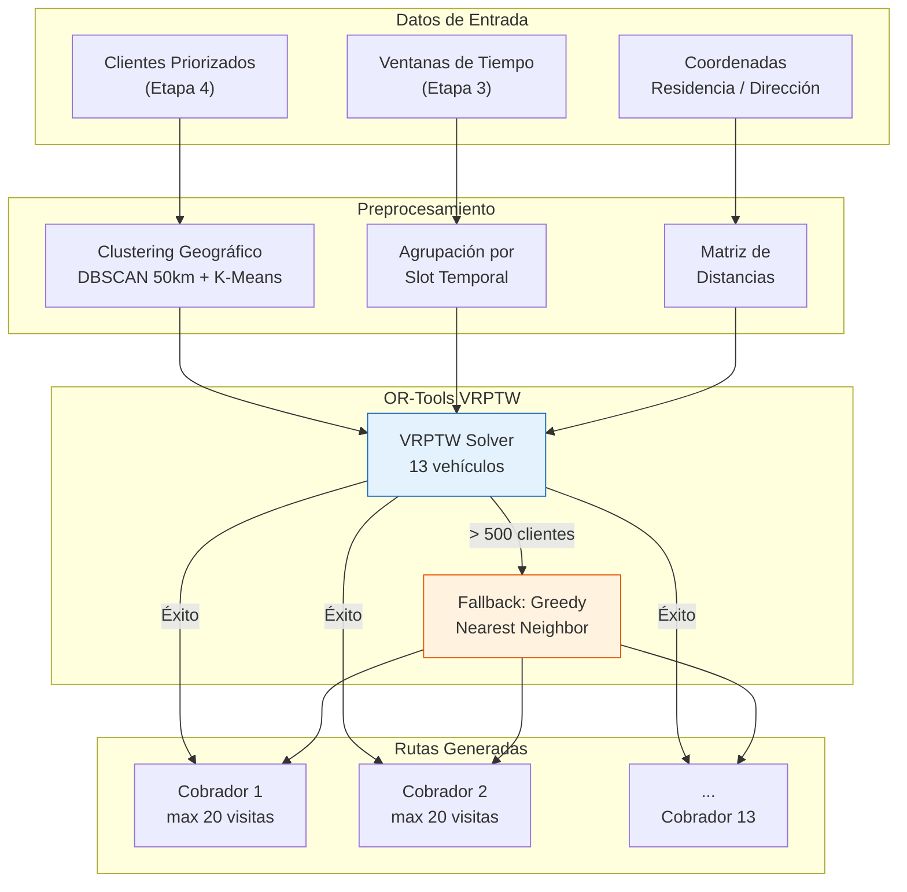
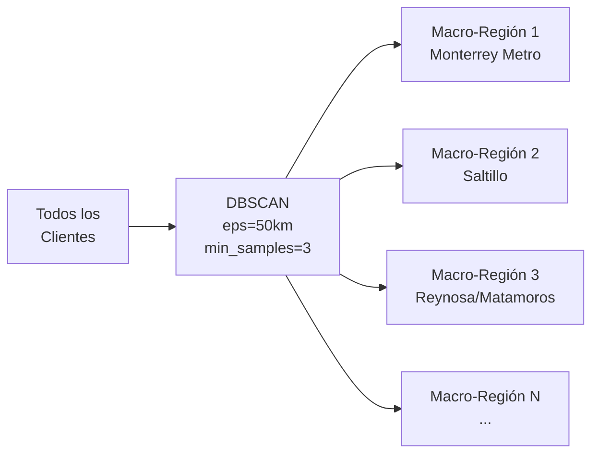
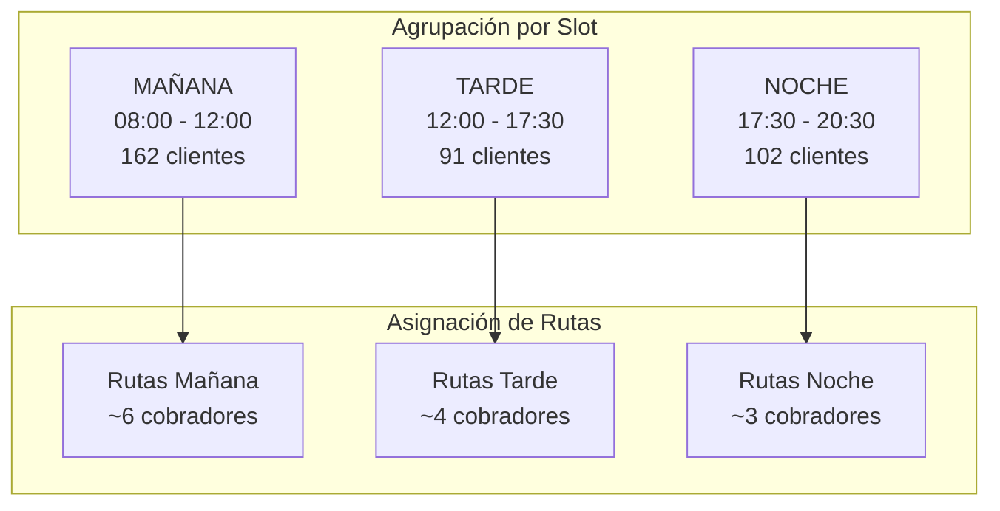
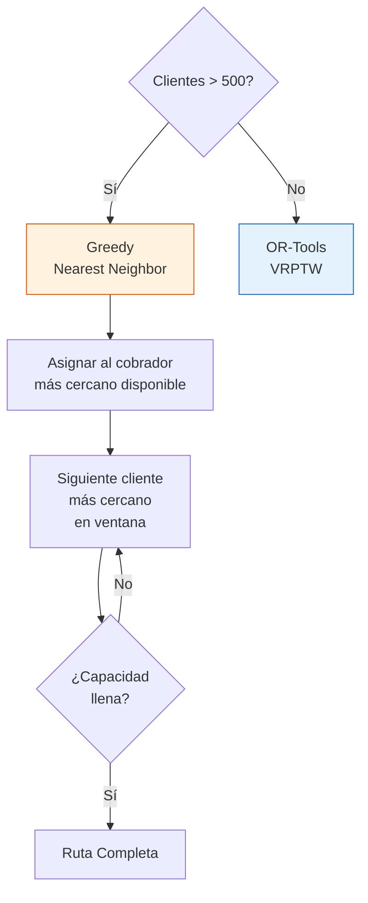
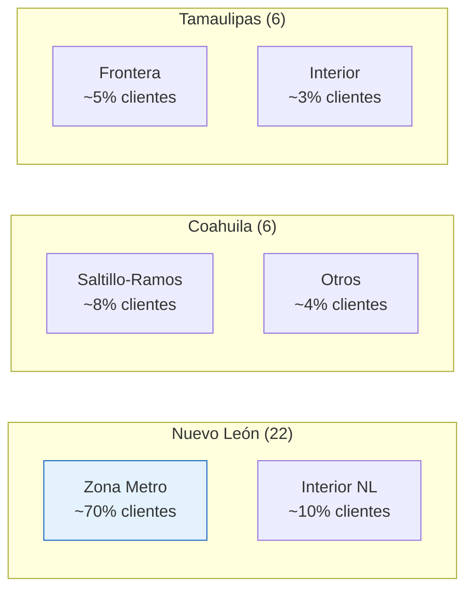

# Etapa 5: Optimización de Rutas (OR-Tools VRPTW)

## Objetivo

Generar rutas diarias optimizadas para **13 cobradores** utilizando el solver **VRPTW** (Vehicle Routing Problem with Time Windows) de OR-Tools. Cada ruta respeta ventanas de tiempo, capacidad máxima de visitas y restricciones geográficas.

## Arquitectura de la Etapa



## Parámetros del VRPTW

| Parámetro | Valor | Descripción |
|---|---|---|
| Número de cobradores | **13** | Vehículos disponibles |
| Máx. visitas por cobrador | **20** | Capacidad por jornada |
| Jornada laboral | **08:00 – 18:00** | 10 horas de operación |
| Duración por visita | **20 minutos** | Tiempo en cada domicilio |
| Padding de ventana | **30 minutos** | Margen antes/después del slot |
| Depósito (origen) | **(25.668, -100.283)** | Monterrey, NL |
| Velocidad urbana | **25 km/h** | Promedio en zona metropolitana |
| Factor de distancia | **× 1.3** | Haversine × 1.3 (calles vs línea recta) |

## Cálculo de Distancias

### Fórmula de Haversine Ajustada

```
d_real = haversine(lat1, lon1, lat2, lon2) × 1.3
```

El factor **1.3** compensa la diferencia entre la distancia en línea recta (haversine) y la distancia real por calles urbanas.

```python
def haversine(lat1, lon1, lat2, lon2):
    R = 6371  # Radio de la Tierra en km
    dlat = radians(lat2 - lat1)
    dlon = radians(lon2 - lon1)
    a = sin(dlat/2)**2 + cos(radians(lat1)) * cos(radians(lat2)) * sin(dlon/2)**2
    c = 2 * asin(sqrt(a))
    return R * c

def distancia_real(lat1, lon1, lat2, lon2):
    return haversine(lat1, lon1, lat2, lon2) * 1.3
```

### Cálculo de Tiempo de Traslado

```
tiempo_traslado_minutos = (distancia_real_km / 25) × 60
```

| Distancia Real | Tiempo de Traslado |
|---|---|
| 5 km | 12 min |
| 10 km | 24 min |
| 15 km | 36 min |
| 25 km | 60 min |

## Clustering Geográfico

### Paso 1: Macro-regiones con DBSCAN



| Parámetro DBSCAN | Valor |
|---|---|
| `eps` | 50 km |
| `min_samples` | 3 |
| `metric` | haversine |

### Paso 2: Sub-clusters con K-Means

Dentro de cada macro-región, se aplica **K-Means** para dividir en grupos asignables a cobradores.

```python
n_clusters = min(n_clientes_region // 15, cobradores_disponibles)
kmeans = KMeans(n_clusters=n_clusters, random_state=42)
```

## Integración de Ventanas de Tiempo

Los clientes se agrupan por slot temporal antes de la optimización de rutas.



### Conversión de Slots a Ventanas VRPTW

| Slot Original | Ventana VRPTW (con padding) | Rango Minutos (desde 08:00) |
|---|---|---|
| **MAÑANA** (antes 07:30) | 08:00 – 12:30 | 0 – 270 |
| **TARDE** (15:00-18:00) | 11:30 – 18:00 | 210 – 600 |
| **NOCHE** (después 20:00) | 17:30 – 20:30* | 570 – 750* |

*Nota: Las visitas nocturnas se programan al final de la jornada, respetando el límite de 18:00 cuando es posible.

## Fallback: Greedy Nearest Neighbor

Si el número de clientes excede **500**, se activa el algoritmo greedy como fallback por rendimiento.



```python
def greedy_nearest_neighbor(clientes, cobradores, depot):
    rutas = {c: [] for c in cobradores}
    pendientes = list(clientes)

    for cobrador in cobradores:
        posicion_actual = depot
        tiempo_actual = 480  # 08:00 en minutos

        while len(rutas[cobrador]) < 20 and pendientes:
            mejor = None
            mejor_dist = float('inf')

            for cliente in pendientes:
                if not en_ventana(cliente, tiempo_actual):
                    continue
                dist = distancia_real(posicion_actual, cliente.ubicacion)
                if dist < mejor_dist:
                    mejor = cliente
                    mejor_dist = dist

            if mejor is None:
                break

            rutas[cobrador].append(mejor)
            pendientes.remove(mejor)
            tiempo_actual += (mejor_dist / 25) * 60 + 20  # traslado + visita
            posicion_actual = mejor.ubicacion

    return rutas
```

## Cobertura Geográfica

### 36 Municipios Cubiertos

| Estado | Municipios |
|---|---|
| **Nuevo León** | Monterrey, San Nicolás, Guadalupe, Apodaca, Escobedo, Santa Catarina, San Pedro, García, Juárez, Cadereyta, Santiago, Allende, Montemorelos, Linares, Cerralvo, Sabinas Hidalgo, Dr. Arroyo, Galeana, Ciénega de Flores, Zuazua, Pesquería, Salinas Victoria |
| **Coahuila** | Saltillo, Ramos Arizpe, Arteaga, Monclova, Piedras Negras, Torreón |
| **Tamaulipas** | Reynosa, Matamoros, Nuevo Laredo, Ciudad Victoria, Tampico, Altamira |



## Formato de Salida

Cada ruta generada contiene la siguiente información por parada:

```json
{
  "cobrador_id": "COB-003",
  "fecha": "2026-03-27",
  "total_visitas": 18,
  "hora_inicio": "08:00",
  "hora_fin": "17:45",
  "km_totales": 42.5,
  "paradas": [
    {
      "orden": 1,
      "cliente_id": "MOR-1234",
      "nombre": "Juan Pérez",
      "direccion": "Av. Lincoln 1500, Monterrey",
      "lat": 25.6714,
      "lon": -100.3097,
      "hora_llegada": "08:15",
      "hora_salida": "08:35",
      "ventana": "MAÑANA",
      "monto_adeudado": 15000,
      "prioridad": "alta",
      "priority_score": 68
    }
  ]
}
```

## Configuración Completa: ROUTING_CONFIG

```python
ROUTING_CONFIG = {
    # Flota
    "num_collectors": 13,
    "max_visits_per_collector": 20,

    # Jornada
    "work_start_hour": 8,
    "work_end_hour": 18,
    "visit_duration_minutes": 20,
    "window_padding_minutes": 30,

    # Depósito
    "depot_lat": 25.668,
    "depot_lon": -100.283,

    # Distancias
    "street_factor": 1.3,
    "avg_speed_kmh": 25,

    # Clustering
    "macro_dbscan_eps_km": 50,
    "macro_dbscan_min_samples": 3,

    # Solver
    "solver_time_limit_seconds": 30,
    "first_solution_strategy": "PATH_CHEAPEST_ARC",
    "local_search_metaheuristic": "GUIDED_LOCAL_SEARCH",

    # Fallback
    "greedy_threshold_clients": 500,
}
```
