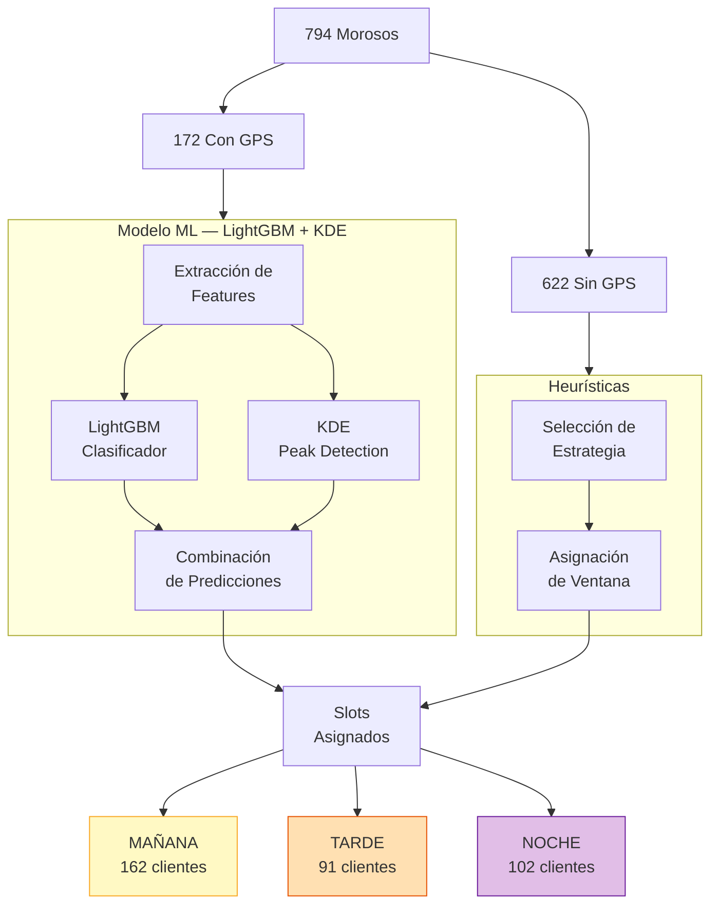
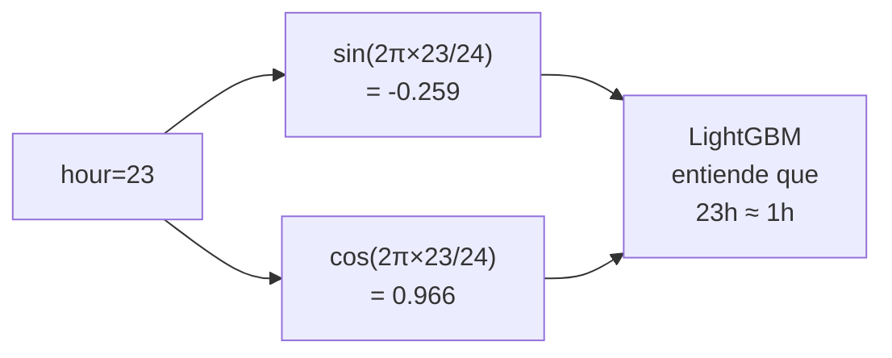
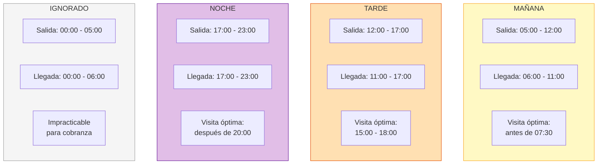
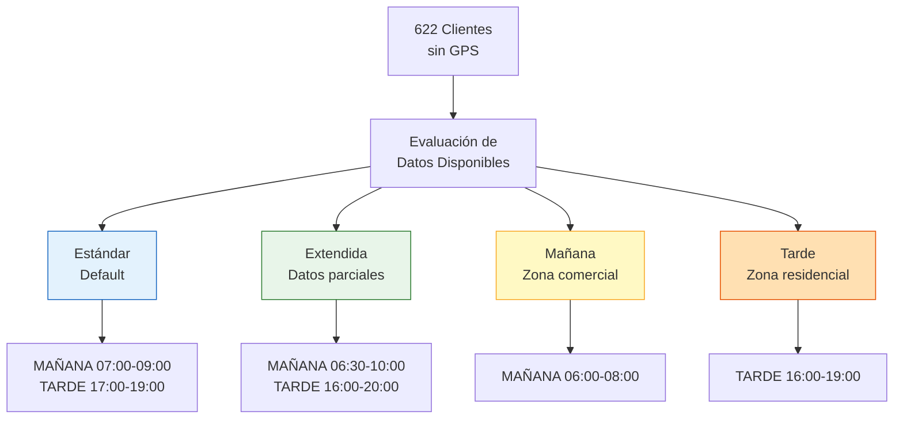
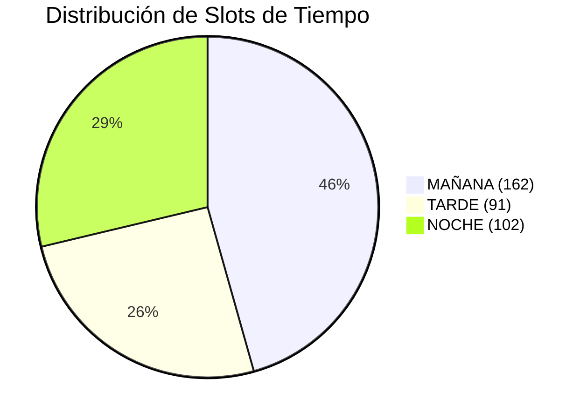

# Etapa 3: Predicción de Ventanas de Tiempo

## Objetivo

Predecir las ventanas de tiempo óptimas para visitar a cada moroso. Se utilizan dos enfoques distintos:
- **Clientes con GPS (172)**: Modelo LightGBM + Kernel Density Estimation (KDE)
- **Clientes sin GPS (622)**: Ventanas heurísticas basadas en estrategias predefinidas

## Arquitectura de la Etapa



## Clientes con GPS: LightGBM + KDE

### Configuración del Modelo LightGBM

```python
LIGHTGBM_CONFIG = {
    "n_estimators": 200,
    "max_depth": 6,
    "learning_rate": 0.1,
    "num_leaves": 31,
    "min_child_samples": 20,
    "objective": "multiclass",
    "num_class": 3,  # MAÑANA, TARDE, NOCHE
    "metric": "multi_logloss",
    "boosting_type": "gbdt",
    "verbose": -1,
    "random_state": 42,
}
```

### Features de Entrada

| Feature | Tipo | Descripción |
|---|---|---|
| `hour` | int | Hora del evento (0-23) |
| `minute_of_day` | int | Minuto del día (0-1439) |
| `day_of_week` | int | Día de la semana (0=Lunes, 6=Domingo) |
| `is_weekend` | bool | Si es sábado o domingo |
| `hour_sin` | float | sin(2π × hour / 24) — codificación cíclica |
| `hour_cos` | float | cos(2π × hour / 24) — codificación cíclica |
| `dow_sin` | float | sin(2π × day_of_week / 7) |
| `dow_cos` | float | cos(2π × day_of_week / 7) |
| `week_of_month` | int | Semana del mes (1-5) |
| `is_quincena` | bool | Si es día 1, 15, 16, 30 o 31 |
| `avg_stay_hours` | float | Promedio de horas de estancia |
| `arrival_hour_mean` | float | Media circular de hora de llegada |
| `departure_hour_mean` | float | Media circular de hora de salida |
| `predictability_score` | float | Score de Etapa 2 (0-100) |

### Codificación Cíclica

```
hour_sin = sin(2π × hour / 24)
hour_cos = cos(2π × hour / 24)
dow_sin  = sin(2π × day_of_week / 7)
dow_cos  = cos(2π × day_of_week / 7)
```



### Kernel Density Estimation (KDE)

Se aplica KDE sobre las distribuciones de **hora de llegada** y **hora de salida** para detectar los picos de actividad.

```python
# KDE para detección de picos
from scipy.stats import gaussian_kde

kde_arrival = gaussian_kde(arrival_hours, bw_method=0.3)
kde_departure = gaussian_kde(departure_hours, bw_method=0.3)

# Evaluar en rango de horas
hours = np.linspace(0, 24, 288)  # cada 5 min
arrival_density = kde_arrival(hours)
departure_density = kde_departure(hours)

# Detectar picos
arrival_peaks = find_peaks(arrival_density, prominence=0.05)
departure_peaks = find_peaks(departure_density, prominence=0.05)
```

## Reglas de Clasificación de Slots



### Tabla de Clasificación Detallada

| Slot | Evento Salida | Evento Llegada | Hora de Visita Óptima | Horario Ignorado |
|---|---|---|---|---|
| **MAÑANA** | 05:00 – 12:00 | 06:00 – 11:00 | Antes de 07:30 | — |
| **TARDE** | 12:00 – 17:00 | 11:00 – 17:00 | 15:00 – 18:00 | — |
| **NOCHE** | 17:00 – 23:00 | 17:00 – 23:00 | Después de 20:00 | — |
| **Ignorado** | 00:00 – 05:00 | 00:00 – 06:00 | — | Impracticable |

### Lógica de Asignación

```python
def clasificar_slot(departure_peak, arrival_peak):
    # Prioridad: salida sobre llegada
    if 5 <= departure_peak < 12:
        return "MAÑANA"
    elif 12 <= departure_peak < 17:
        return "TARDE"
    elif 17 <= departure_peak < 23:
        return "NOCHE"

    # Fallback por llegada
    if 6 <= arrival_peak < 11:
        return "MAÑANA"
    elif 11 <= arrival_peak < 17:
        return "TARDE"
    elif 17 <= arrival_peak < 23:
        return "NOCHE"

    # Si ambos caen en horario ignorado
    return "MAÑANA"  # default
```

## Clientes sin GPS: Ventanas Heurísticas

Para los **622 clientes sin datos GPS**, se asignan ventanas de tiempo basadas en estrategias heurísticas.

### Estrategias Disponibles



| Estrategia | Condición | Ventana(s) | Descripción |
|---|---|---|---|
| **standard** | Default (sin info adicional) | 07:00-09:00, 17:00-19:00 | Doble ventana AM/PM |
| **extended** | Datos parciales disponibles | 06:30-10:00, 16:00-20:00 | Ventanas ampliadas |
| **morning** | Zona comercial / industrial | 06:00-08:00 | Solo ventana matutina |
| **afternoon** | Zona residencial confirmada | 16:00-19:00 | Solo ventana vespertina |

### Criterios de Selección de Estrategia

```python
def seleccionar_estrategia(cliente):
    if cliente.zona_tipo == "comercial":
        return "morning"
    elif cliente.zona_tipo == "residencial" and cliente.colonia_validada:
        return "afternoon"
    elif cliente.tiene_datos_parciales:
        return "extended"
    else:
        return "standard"
```

## Resultados Actuales

| Slot | Clientes GPS | Clientes No-GPS | Total | Porcentaje |
|---|---|---|---|---|
| **MAÑANA** | 62 | 100 | 162 | 45.6% |
| **TARDE** | 31 | 60 | 91 | 25.6% |
| **NOCHE** | 72 | 30 | 102 | 28.7% |
| **Total** | 165 | 190 | 355 | 100% |

::: info Nota
Los 7 clientes GPS sin residencia detectada y los 432 clientes no-GPS con estrategia estándar (doble ventana) se cuentan en ambos slots MAÑANA y TARDE.
:::



## Parámetros de Configuración

```python
TIME_WINDOW_CONFIG = {
    # LightGBM
    "lgbm_n_estimators": 200,
    "lgbm_max_depth": 6,
    "lgbm_learning_rate": 0.1,

    # KDE
    "kde_bandwidth": 0.3,
    "kde_resolution_minutes": 5,
    "peak_prominence": 0.05,

    # Clasificación de slots
    "manana_salida_range": (5, 12),
    "manana_llegada_range": (6, 11),
    "tarde_salida_range": (12, 17),
    "tarde_llegada_range": (11, 17),
    "noche_salida_range": (17, 23),
    "noche_llegada_range": (17, 23),
    "ignored_salida_range": (0, 5),
    "ignored_llegada_range": (0, 6),

    # Ventanas heurísticas
    "standard_am": ("07:00", "09:00"),
    "standard_pm": ("17:00", "19:00"),
    "extended_am": ("06:30", "10:00"),
    "extended_pm": ("16:00", "20:00"),
    "morning_only": ("06:00", "08:00"),
    "afternoon_only": ("16:00", "19:00"),
}
```
