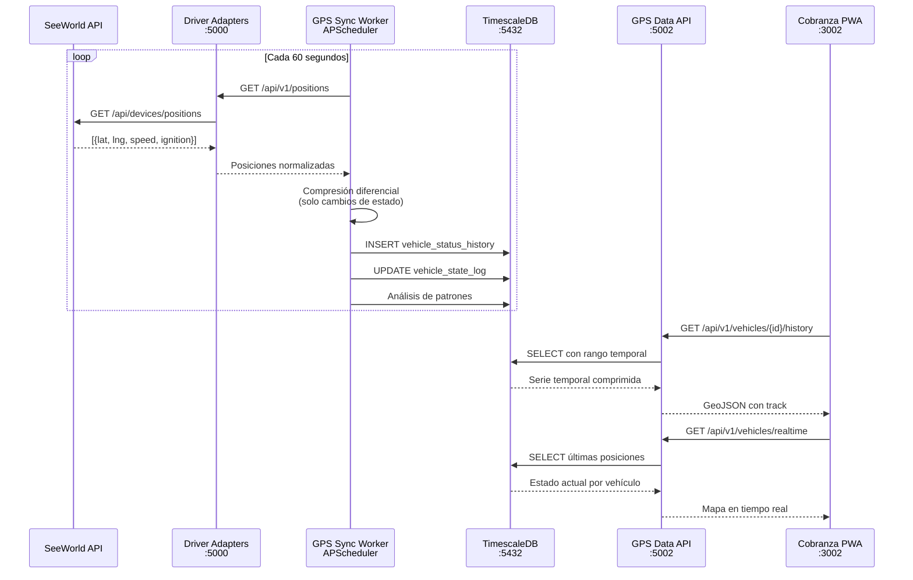
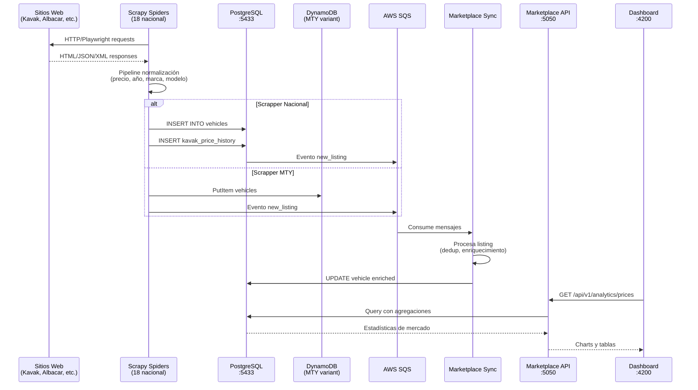
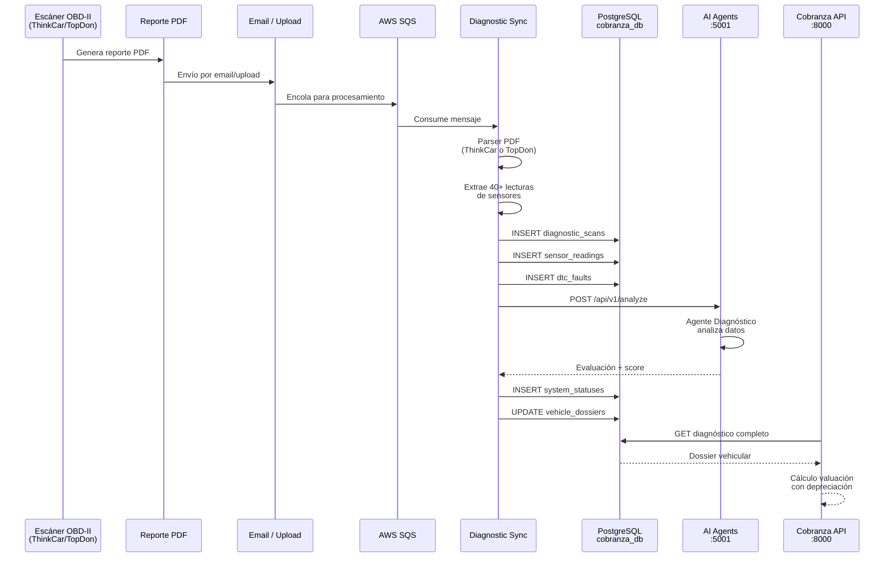
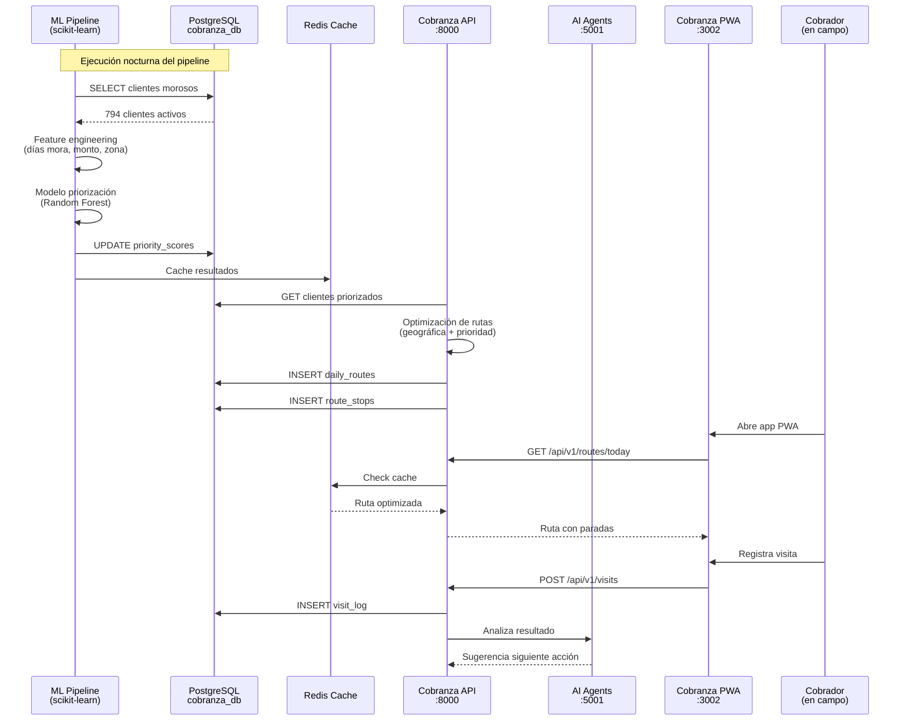
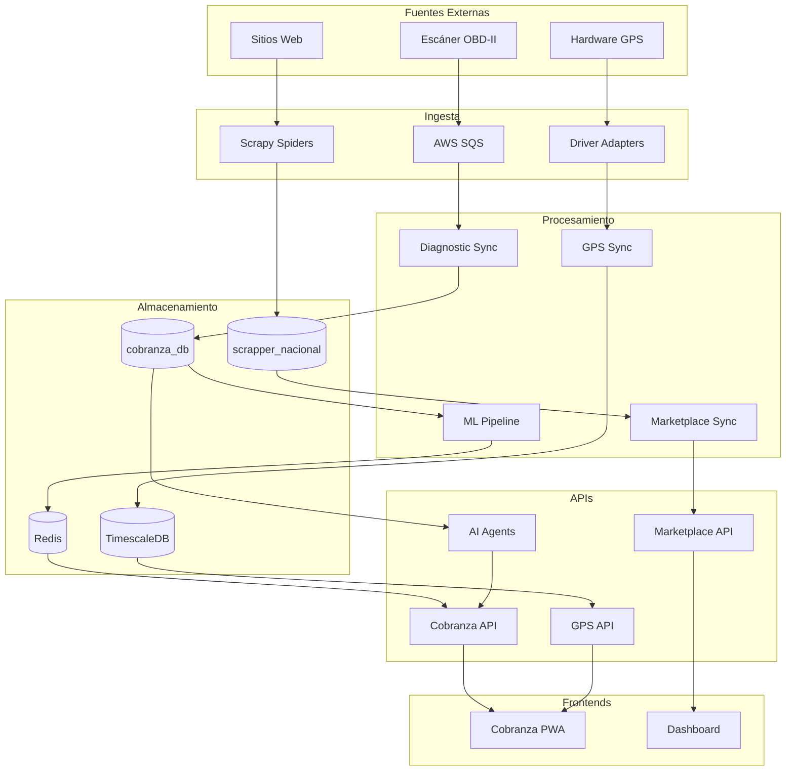

# Flujo de Datos

Diagramas detallados de cómo fluyen los datos a través de los distintos subsistemas del ecosistema AgentsMX.

## 1. Flujo GPS

Desde la captura de señales GPS hasta la visualización en el mapa de cobranza.

## 2. Flujo de Scraping

Desde la extracción web hasta el dashboard de analytics.

## 3. Flujo de Diagnósticos

Desde el escáner OBD-II hasta los reportes de valuación.

## 4. Flujo de Cobranza

Desde el pipeline ML hasta las rutas diarias del cobrador.

## Diagrama de Flujo Consolidado

## Volúmenes de Datos

| Flujo | Volumen | Frecuencia | Retención |
|-------|---------|------------|-----------|
| GPS Posiciones | ~4,000 vehículos | Cada 60 segundos | 1 año (hypertable) |
| Scraping Nacional | ~11,000 vehículos | Diario | Indefinida |
| Diagnósticos | ~50/semana | Por demanda | Indefinida |
| ML Pipeline | 794 clientes | Diario (nocturno) | Último score |
| Rutas diarias | ~30 rutas/día | Diario 6:00 AM | 90 días |
