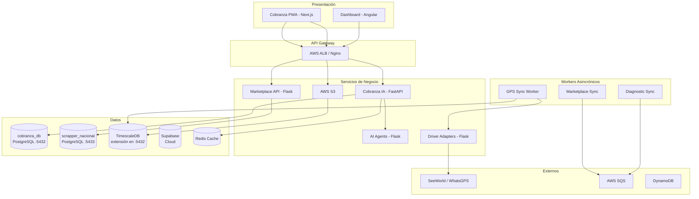

# Arquitectura del Ecosistema

Panorama completo del ecosistema AgentsMX: 17 repositorios interconectados que forman la plataforma de gestión vehicular, cobranza inteligente y marketplace automotriz.

## Diagrama General del Ecosistema

```mermaid
C4Context
    title Ecosistema AgentsMX - Vista de Contexto

    Person(cobrador, "Cobrador", "Agente de cobranza en campo")
    Person(admin, "Administrador", "Gestión de operaciones")
    Person(analyst, "Analista", "Análisis de datos y marketplace")

    System_Boundary(frontends, "Frontends") {
        System(cobranza_fe, "Cobranza PWA", "Next.js :3002")
        System(dashboard_fe, "Dashboard Analytics", "Angular :4200")
    }

    System_Boundary(backends, "Backends") {
        System(cob_ia, "Cobranza IA API", "FastAPI :8000")
        System(ai_agents, "AI Agents", "Flask :5001")
        System(driver_adapters, "Driver Adapters", "Flask :5000")
        System(gps_api, "GPS Data API", "Flask :5002")
        System(marketplace_api, "Marketplace API", "Flask :5050")
    }

    System_Boundary(workers, "Workers Async") {
        System(gps_sync, "GPS Sync Worker", "Python/APScheduler")
        System(marketplace_sync, "Marketplace Sync", "SQS Consumer")
        System(diagnostic_sync, "Diagnostic Sync", "SQS Consumer")
    }

    System_Boundary(scrapers, "Scrapers") {
        System(scrapper_nal, "Scrapper Nacional", "Scrapy - 18 spiders")
        System(scrapper_mty, "Scrapper MTY", "Scrapy - 17 spiders")
    }

    System_Boundary(infra, "Infraestructura") {
        System(terraform, "Terraform IaC", "AWS Resources")
        System(mac_mini, "Mac Mini Config", "Servidor local")
        System(grafana, "Grafana Monitoring", "Dashboards")
    }

    System_Ext(seeworld, "SeeWorld API", "Proveedor GPS")
    System_Ext(aws, "AWS Services", "SQS, S3, DynamoDB")

    cobrador --> cobranza_fe
    admin --> cobranza_fe
    analyst --> dashboard_fe

    cobranza_fe --> cob_ia
    cobranza_fe --> gps_api
    dashboard_fe --> marketplace_api

    cob_ia --> ai_agents
    driver_adapters --> seeworld
    gps_sync --> driver_adapters
    gps_sync --> gps_api

    scrapper_nal --> marketplace_sync
    scrapper_mty --> aws
    diagnostic_sync --> aws
```

## Dominios y Servicios

| Dominio | Servicio | Puerto | Descripción |
|---------|----------|--------|-------------|
| `api.agentsmx.com` | Cobranza IA API | 8000 | API principal de cobranza e IA |
| `time.agentsmx.com` | GPS Data API | 5002 | Datos GPS y TimescaleDB |
| `dashboard.agentsmx.com` | Dashboard Frontend | 4200 | Analytics y marketplace |
| `doc.agentsmx.com` | VitePress Docs | 5173 | Esta documentación |

## Diagrama de Capas



## Comunicación entre Servicios

Los servicios se comunican mediante tres mecanismos principales:

1. **HTTP REST**: Comunicación síncrona entre frontends y backends
2. **SQS (Eventos)**: Comunicación asíncrona para workers y procesamiento de datos
3. **Base de datos compartida**: Algunos servicios comparten acceso a PostgreSQL

## Tecnologías Principales

| Categoría | Tecnología | Uso |
|-----------|-----------|-----|
| Backend | Python 3.11+ | Todos los servicios |
| Frontend | Next.js 14 / Angular 17 | PWA y Dashboard |
| Base de datos | PostgreSQL 16 + TimescaleDB | Almacenamiento principal |
| Cache | Redis 7 | Sesiones, resultados ML |
| Cola | AWS SQS | Eventos asincrónicos |
| Scraping | Scrapy 2.11 + Playwright | Extracción de datos |
| ML/IA | scikit-learn, OpenAI, Claude | Modelos predictivos |
| IaC | Terraform | Infraestructura AWS |
| Monitoreo | Grafana 11.5 | Dashboards operativos |
| CI/CD | GitHub Actions | Despliegue automatizado |

## Siguiente Lectura

- [Repositorios](/tecnico/arquitectura/repositorios) - Detalle de los 17 repos
- [Flujo de Datos](/tecnico/arquitectura/flujo-datos) - Diagramas de flujo completos
- [Patrones](/tecnico/arquitectura/patrones) - Patrones arquitectónicos utilizados
