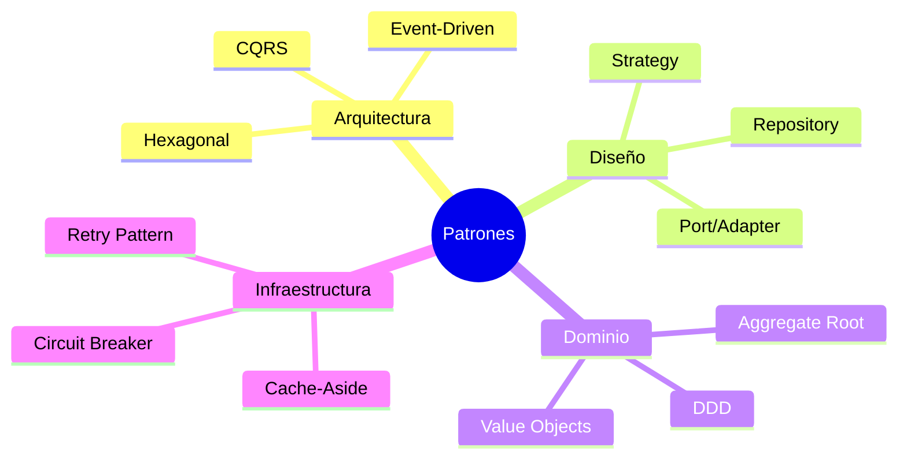
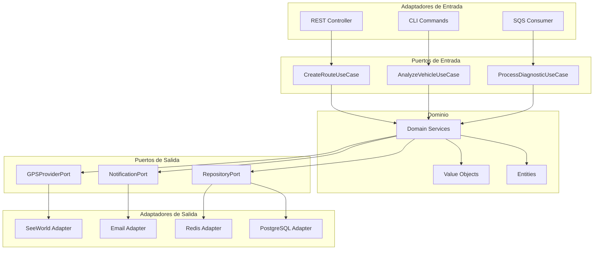
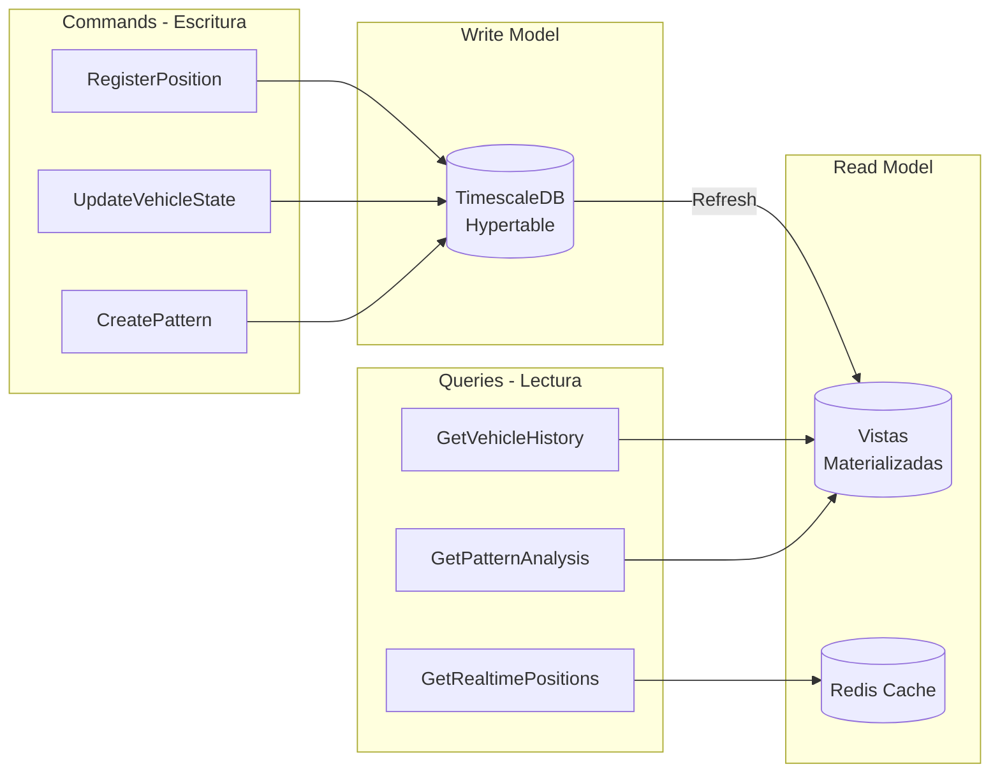
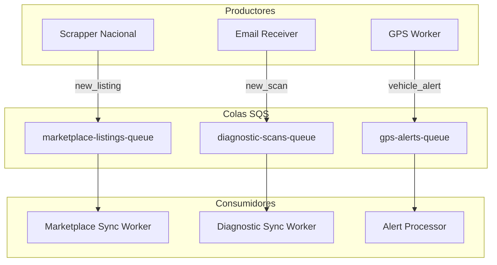
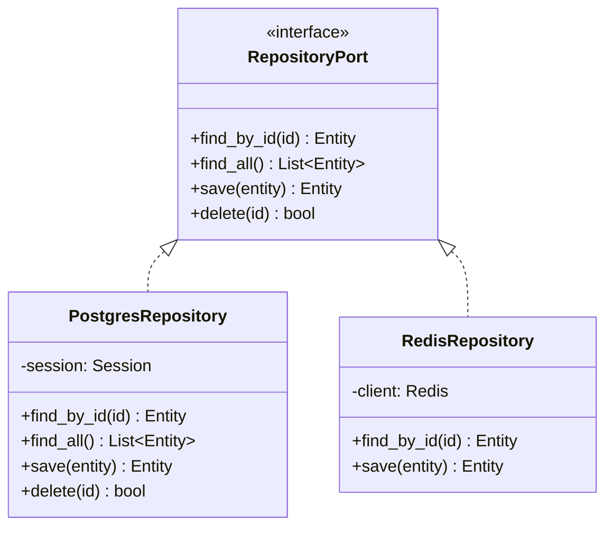
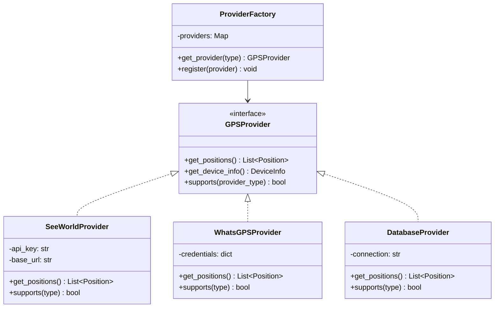
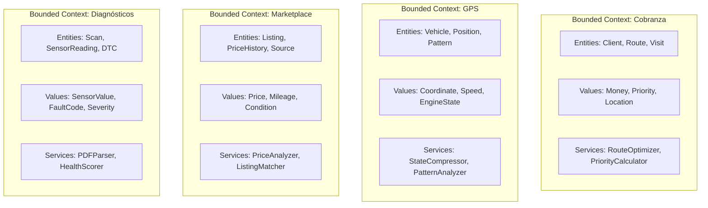

# Patrones Arquitectónicos

Patrones de diseño y arquitectura aplicados en el ecosistema AgentsMX.

## Resumen de Patrones



## 1. Arquitectura Hexagonal (Ports & Adapters)

Patrón principal usado en `proj-back-ai-agents` y `proj-back-cob-ia`.



### Ejemplo: Puerto de Repositorio

```python
# domain/ports/vehicle_repository.py
from abc import ABC, abstractmethod
from domain.entities.vehicle import Vehicle

class VehicleRepositoryPort(ABC):
    @abstractmethod
    def find_by_id(self, vehicle_id: str) -> Vehicle | None:
        ...

    @abstractmethod
    def find_active(self) -> list[Vehicle]:
        ...

    @abstractmethod
    def save(self, vehicle: Vehicle) -> Vehicle:
        ...
```

### Ejemplo: Adaptador de Salida

```python
# infrastructure/adapters/postgres_vehicle_repository.py
from domain.ports.vehicle_repository import VehicleRepositoryPort
from domain.entities.vehicle import Vehicle

class PostgresVehicleRepository(VehicleRepositoryPort):
    def __init__(self, session):
        self._session = session

    def find_by_id(self, vehicle_id: str) -> Vehicle | None:
        row = self._session.execute(
            "SELECT * FROM vehicles WHERE id = %s", (vehicle_id,)
        ).fetchone()
        return Vehicle.from_row(row) if row else None

    def save(self, vehicle: Vehicle) -> Vehicle:
        self._session.execute(
            "INSERT INTO vehicles (...) VALUES (...)",
            vehicle.to_dict()
        )
        return vehicle
```

## 2. CQRS (Command Query Responsibility Segregation)

Separación de lecturas y escrituras en el GPS Data API.



## 3. Event-Driven Architecture (SQS)

Comunicación asíncrona entre subsistemas mediante eventos en AWS SQS.



### Ejemplo: Publicar Evento

```python
# infrastructure/messaging/sqs_publisher.py
import boto3
import json

class SQSPublisher:
    def __init__(self, queue_url: str):
        self._client = boto3.client("sqs")
        self._queue_url = queue_url

    def publish(self, event_type: str, payload: dict):
        self._client.send_message(
            QueueUrl=self._queue_url,
            MessageBody=json.dumps({
                "event_type": event_type,
                "payload": payload,
                "timestamp": datetime.utcnow().isoformat()
            }),
            MessageAttributes={
                "EventType": {
                    "StringValue": event_type,
                    "DataType": "String"
                }
            }
        )
```

## 4. Repository Pattern

Abstracción de acceso a datos usada consistentemente en todos los servicios.



## 5. Strategy Pattern (Driver Adapters)

Selección dinámica de proveedor GPS según el tipo de dispositivo.



## 6. Domain-Driven Design

Organización del código por contextos delimitados (Bounded Contexts).



## Resumen de Aplicación por Servicio

| Servicio | Hexagonal | CQRS | Events | Repository | Strategy | DDD |
|----------|-----------|------|--------|------------|----------|-----|
| Cobranza IA | Si | Parcial | Si | Si | No | Si |
| AI Agents | Si | No | Si | Si | Si | Si |
| Driver Adapters | Si | No | No | Si | Si | No |
| GPS API | Parcial | Si | Si | Si | No | Parcial |
| Marketplace API | Parcial | No | Si | Si | No | Parcial |
